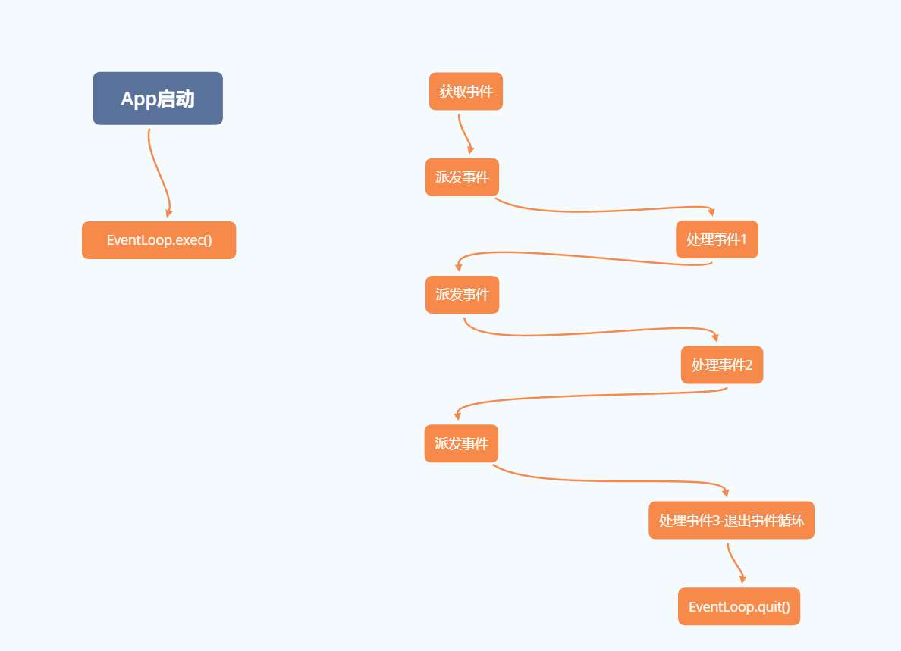

# 事件循环

# 事件循环

## 概念

```cpp
#include <stdio.h>
#include <string.h>
int main(int argc, char* argv[])
{
    char input[1024];   //假设输入长度不超过1024
    const char quitStr[] = "quit";
    bool quit = false;

    while (false == quit) {
        // 输入
        scanf_s("%s", input, sizeof input);

        // 处理
        printf("user input: %s\n", input);

        // 退出判断
        if (0 == memcmp(input, quitStr, sizeof quitStr)) {
            quit = true;
        }
    }
    return 0;
}
```

**事件循环 `Event Loop`:** 应用程式实现与用户最简单的交互模式就是写一个 `while` 循环：读取用户输入，处理用户输入，并提供跳出循环的能力。对这种简易模式进行抽象，将输入、处理、退出都当作是一种「事件」，而应用程序所作的就是使用 `while` 循环处理这些事件，这种模式就是「事件循环」。存储事件的容器被称之为「事件队列 `Event Queue`」，处理事件则被称之为「事件分发 `Event Dispatch`」。


## 操作系统

在 `Windows` 与 `Linux` 的界面交互中，均采用了「事件循环」的机制。

- **Windows**

```cpp
MSG msg = { 0 };
    bool done = false;
    bool result = false;
    while (!done)
    {
        if (PeekMessage(&msg, 0, 0, 0, PM_REMOVE))
        {
            TranslateMessage(&msg);
            DispatchMessage(&msg);
        }
        if (msg.message == WM_QUIT)
        {
            done = true;
        }
    }
```

- **Linux**

```cpp
Atom wmDeleteMessage = XInternAtom(mDisplay, "WM_DELETE_WINDOW", False);
XSetWMProtocols(display, window, &wmDeleteMessage, 1);

XEvent event;
bool running = true;

while (running)
{
    XNextEvent(display, &event);

    switch (event.type)
    {
        case Expose:
            printf("Expose\n");
            break;

        case ClientMessage:
            if (event.xclient.data.l[0] == wmDeleteMessage)
                running = false;
            break;

        default:
            break;
    }
}
```

# Qt 事件循环

## 机制




`Qt` 的事件循环其实就是对各个操作的系统的事件循环接口进行了二次封装，实现接口的统一。

>[!note]
> 事件循环机制中的事件获取、事件派发都是运行在一个线程中的。


## 主事件循环

```cpp
#include <QGuiApplication>
#include <QQmlApplicationEngine>
#include <QQmlContext>

int main(int argc, char *argv[])
{
    QGuiApplication app(argc, argv);
    ....
    return app.exec();
}
```

Qt 的 `Application` 相关类，主要目的就是启动一个 `QEventLoop` ，该事件循环称之为「主事件循环 `Main Event Loop`」。

```cpp
static bool sendEvent(QObject *receiver, QEvent *event);
static void postEvent(QObject *receiver, QEvent *event, int priority = Qt::NormalEventPriority);
static void sendPostedEvents(QObject *receiver = nullptr, int event_type = 0);
```
- `sendEvent` 发送的事件会被立即执行，即「同步」
- `postEvent` 发送的事件会被放入事件队列，即「异步」
- `sendPostedEvents` 将「异步」变成「同步」


## 事件分发


```cpp
#include <QWidget>
class Test : public QWidget
{
    Q_OBJECT
    ...
protected:

    // 事件分发接口
    virtual void keyPressEvent(QKeyEvent *event);
    virtual void keyReleaseEvent(QKeyEvent *event);
    virtual void focusInEvent(QFocusEvent *event);
    virtual void focusOutEvent(QFocusEvent *event);
    virtual void enterEvent(QEvent *event);
    virtual void leaveEvent(QEvent *event);

    // 事件过滤，在事件分发之前执行
    // true: 事件被过滤，不会再分发
    // false: 会分发事件到上述的具体接口
    bool eventFilter(QObject *obj, QEvent *event) override;
};

bool Test::eventFilter(QObject *obj, QEvent *event)
{
    if (event->type() == QEvent::KeyPress) {
        QKeyEvent *keyEvent = static_cast<QKeyEvent *>(event);
        qDebug("Ate key press %d", keyEvent->key());
        return true;
    } else {
        // standard event processing
        return QObject::eventFilter(obj, event);
    }
}

```

# 预防阻塞

> [!note]
> 在一般的流程中，事件循环机制和任务处理都运行在一个线程中，如果一个任务处理特别耗时，就会导致界面卡顿，因为`UI`相关事件（例如 `paintEvent` 事件）的处理被阻塞了。

## processEvents

```cpp
void Task(){
    something1();

    // 在耗时任务的适当位置添加，处理一下堆积的事件
    QCoreApplication::processEvents();

    something2();
}
```

## QEventLoop

```cpp

void Task(){
    somethings();
}

void Run(){
    // 创建一个子的事件循环
    QEventLoop loop;

    QFutureWatcher<void> watcher;

    // 触发 loop 执行结束
    connect(&watcher, &QFutureWatcher<void>::finished, &loop, &QEventLoop::quit);

    watcher.setFuture(QtConcurrent::run(Task));

    // 启动事件循环，会阻塞当前函数的运行，事件循环机制由 loop 接手运行，主事件循环中断，等待 loop 退出。
    loop.exec();
}
```

事件循环是可以嵌套的，子层的事件循环执行 `exec()` 的时候，父层事件循环就处于中断状态；当子层事件循环跳出`exec()`后，父层事件循环才能继续循环下去。子层事件循环具有父层事件循环的几乎所有功能，会继续处理事件。只有子事件循环完全退出时，父事件循环才会继续处理事件。


