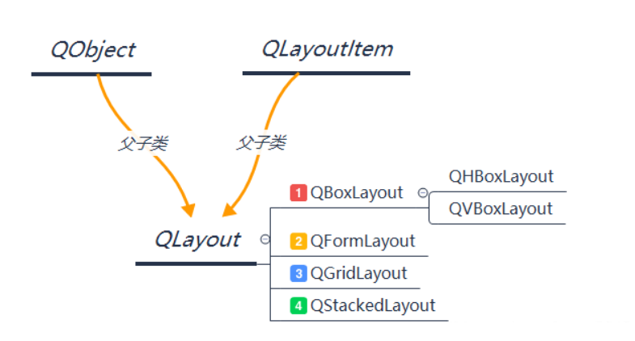

# 布局

- [Qt学习之控件尺寸调整策略](https://blog.csdn.net/kongcheng253/article/details/128769765)

# 介绍

在 `Qt` 中，`QWidget` 可以使用 `QLayout` 类来管理子 `QWidget` 的布局，它会完成以下工作
- 控制子 QWidget 的位置
- 调整子 QWidget 的默认大小
- 窗口的最小尺寸
- 重新调整大小
- 当 QWidget 发生变化时，自动更新布局

 

常用的布局器有
- `QHBoxLayout` : 水平布局
- `QVBoxLayout` : 垂直布局
- `QGridLayout` : 网格布局
- `QFormLayout` : 表单布局

> [!tip]
> - **`QWidget` 的父对象只能是 `QWidget`**
>   - widget 使用 `QWidget::setLayout()` 接口设置一个 Layout 后，Layout 会自动调用子 widget 的 `QWidget::setParent()`，将 widget 设置为 layout 管理的子 widget 的父对象；
>   - 添加到 layout 中的子 widget 在 `new` 的时候不需要设置父对象，layout 会自动调整
> - layout 可以使用 `QLayout::addLayout()` 进行嵌套，且添加的子 Layout 将变成 Layout 的子对象

# 布局策略

## 工作机制

当一个 `QWidget` 加入到 Layout 中，Layout 会完成以下操作
1. 基于 `QWidget::sizePolicy()` 与 `QWidget::sizeHit()` ，widget 会获得一定的初始化空间
2. 基于拉伸因子 `stretch factor`，按照比例调整 widget 的空间
3. 每个控件被分配的最小空间由 `minimum size` 或 `minimum size hint` 确定，若都没设定，则根据拉伸因子进行计算
4. 每个控件被分配的最大空间由 `maximum size` 确定，若没设定，则根据拉伸因子进行计算


## 拉伸因子

控件和水平布局器、垂直布局器、网格布局器都可以设置伸展因子 `stretch factor`。窗口拉伸时，布局器会根据每个控件或子布局器的水平和垂直方向的伸展因子，分配新增的空闲空间。例外的是如果控件设置了 sizePolicy 属性里的策略为 QSizePolicy::Fixed 固定高度或固定宽度，那就不拉伸控件，只拉伸控件之间的间隙。

- 控件设置拉伸因子
  
    ```cpp
    //获取旧的尺寸策略作为底板，修改需要变动的伸展因子
    QSizePolicy sp = ui->pushButton1->sizePolicy();

    sp.setHorizontalStretch(2); //水平伸展因子
    sp.setVerticalStretch(0);   //垂直伸展因子

    //把新策略设置给按钮1
    ui->pushButton1->setSizePolicy(sp);
    ```
- 布局器设置拉伸因子 
    
    布局器的拉伸因子并不是是由接口类 `QLayout` 实现，而是各个子类自定义

    ```cpp
    class QBoxLayout{
    public:
        int stretch(int index);
        void setStretch(int index, int stretch)
        bool setStretchFactor(QWidget * widget, int stretch)
        bool setStretchFactor(QLayout * layout, int stretch)
    };
    ```

>[!note]
> 布局器的拉伸因子优先于控件的

## 伸展策略

伸展策略就是 `QSizePolicy::​Policy` 枚举值，而 `QSizePolicy::​Policy` 则是根据基础策略 `QSizePolicy::​PolicyFlag` 实现

- `QSizePolicy::​PolicyFlag`

| 枚举标志位              | 数值 | 描述                                                           |
| ----------------------- | ---- | -------------------------------------------------------------- |
| QSizePolicy::GrowFlag   | 1    | 可增长标志，如果有必要的话，可以在建议尺寸之外继续增长。       |
| QSizePolicy::ExpandFlag | 2    | 尽量扩展标志，能占多大空间就占多大。                           |
| QSizePolicy::ShrinkFlag | 4    | 可收缩标志，如果有必要的话，可以在缩小到建议尺寸之后继续缩小。 |
| QSizePolicy::IgnoreFlag | 8    | 忽略建议尺寸，这个增长方式最野蛮，能占多大空间就占多大空间     |

- `QSizePolicy::​Policy`


| 枚举常量                      | 数值                                 | 拉伸特点 | 描述                                                                                                                                                      |
| ----------------------------- | ------------------------------------ | -------- | --------------------------------------------------------------------------------------------------------------------------------------------------------- |
| QSizePolicy::Fixed            | 0                                    | 固定     | 以建议尺寸固定住，对于水平方向是固定宽度，垂直方向是固定高度。                                                                                            |
| QSizePolicy::Minimum          | GrowFlag                             | 被动拉大 | 以建议尺寸为最小尺寸，如果有多余的空间就拉伸，没有多余的空间就保持建议尺寸。被动扩张。                                                                    |
| QSizePolicy::Maximum          | ShrinkFlag                           | 被动缩小 | 以建议尺寸为最大尺寸，窗口缩小时，如果其他控件需要，该控件可以尽量缩小为其他控件腾出空间。                                                                |
| QSizePolicy::Preferred        | GrowFlag && ShrinkFlag               | 被动伸缩 | 以建议尺寸为最佳尺寸，能屈能伸，窗口缩小时可以为其他控件腾出空间，窗口变大时，也可以占据其他控件不需要的空闲空间。基类 QWidget 默认是这种策略。被动扩张。 |
| QSizePolicy::Expanding        | GrowFlag && ShrinkFlag && ExpandFlag | 主动扩张 | 建议尺寸仅仅是明智的建议，但控件基本不采用。这个模式也是能屈能伸，但它倾向于主动扩张，它会尽可能占据新增的区域。                                          |
| QSizePolicy::MinimumExpanding | GrowFlag && ExpandFlag               | 主动扩张 | 以建议尺寸作为最小尺寸，主动扩张，尽可能占据新增的区域。                                                                                                  |
| QSizePolicy::Ignored          | ShrinkFlag && GrowFlag && IgnoreFlag | 野蛮扩张 | 忽略建议尺寸，虽然能屈能伸，但是它会尽最大可能占据空间。                                                                                                  |

七个策略常量大致分两类
- 第一类: 固定、单向缩小、单向拉大的，相同布局情景中，占据的尺寸大小排序为：
    ```text
     QSizePolicy::Maximum ≤ QSizePolicy::Fixed ≤ QSizePolicy::Minimum ≤ QSizePolicy::MinimumExpanding 
    ```
- 第二类: 能屈能伸的，如果在相同布局情景中，占据尺寸大小排序为
    ```text
     QSizePolicy::Preferred ≤ QSizePolicy::Expanding ≤ QSizePolicy::Ignored
    ```

# 自定义布局

## Widget

通过改写 `QWidget` 来影响 `QLayout`

```cpp
class QWidget{
public:
    // 最优尺寸建议
    virtual const QSize sizeHint();

    // 最小尺寸建议
    virtual const QSize minimumSizeHint();

    // 指定布局策略
    void setSizePolicy(QSizePolicy::Policy hor, QSizePolicy::Policy ver);

    // 高度依据宽度变化，得先设置 QSizePolicy::setHeightForWidth(bool);
    virtual int heightForWidth(int) const;

    // 当 size hint、minimum size hint、size policy 更改时，自动调用
    // 会触发布局器重新计算
    void updateGeometry();

    // 自定义计算布局，且需要调用每个子控件的 QWidget::setGeometry()
    virtual void resizeEvent(QResizeEvent * event);

    // 当布局重新计算时，会发出 QEvent::LayoutRequest 事件
    virtual bool event(QEvent * event);
};
```

## Layout

```cpp
class QCustomLayout : public QLayout{
public:
    QCustomLayout(QWidget * parent) : QLayout(parent){}
    ~QCustomLayout(){
        // QLayoutItem 必须在释放 QLayout 前手动删除
        QLayoutItem * item;
        while(item = takeAt(0)){
            delete item;
        }
    }

    // 布局参数
    int margin() const;
    int spacing() const;

    // 布局元素
    virtual void addItem(QLayoutItem *);
    virtual QLayoutItem *itemAt(int index) const;
    virtual QLayoutItem *takeAt(int index);
    virtual int count() const;

    // 控制 QLayoutItem 如何放置到 rect 上
    // - 计算 m_list 内 QLayoutItem 的 geometry 
    // - 通过 m_list 内 QLayoutItem 的 setGeometry 更新 geometry
    // - rect 需要先自行扣掉 margin() 的大小，才是真正能使用的空间
    // - 使用 spacing() 计算  m_list 内 QLayoutItem 的相对位置
    virtual void setGeometry(const QRect& rect) Q_DECL_OVERRIDE;

    // 布局的建议尺寸
    // - 通过 m_list 内 QLayoutItem 的 sizeHint 进行计算
    // - 通过 m_list 内 QLayoutItem 的 minimumSize 进行计算
    virtual QSize sizeHint() const;
    virtual QSize minimumSize() const;
private:
    QList<QLayoutItem*>  m_list; // 管理布局元素的容器
};
```


