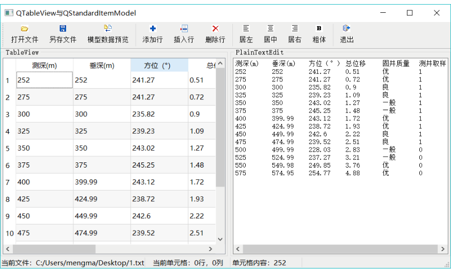
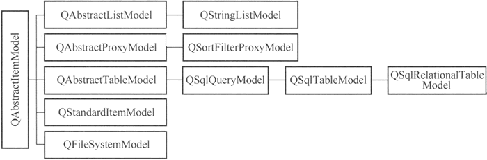
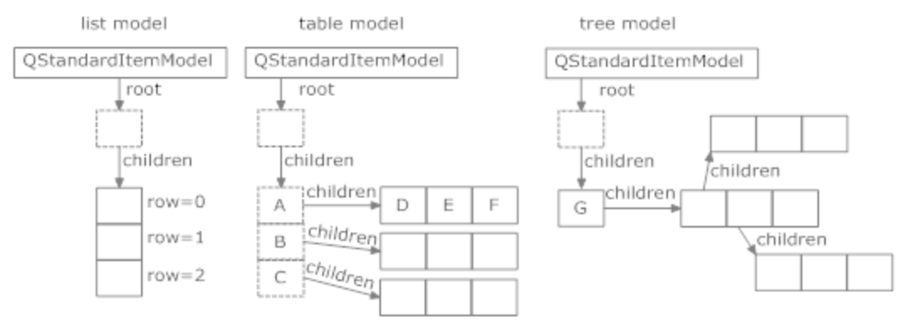
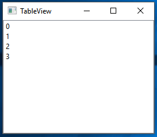
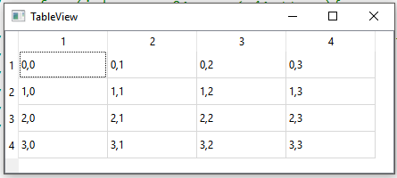
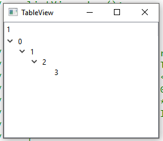
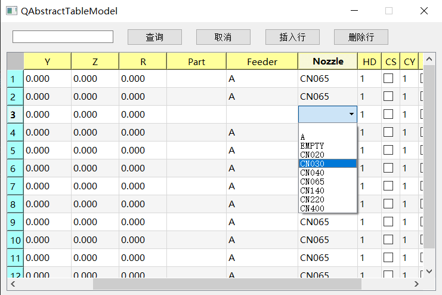
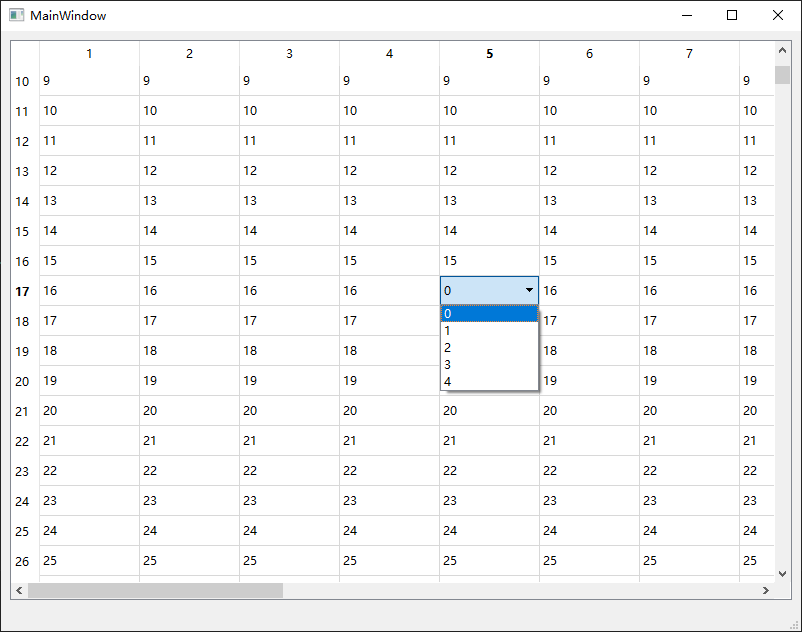
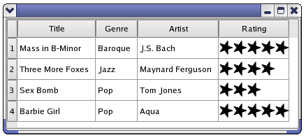
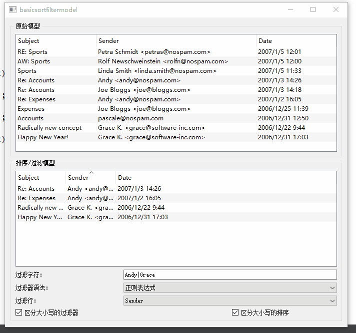

# Model-View

# 介绍

## Model-View 框架

在 `Qt` 中提供了一套 `Model/View` 框架，可以为 `QListView、QTableView、QTreeView` 等视图定义提供数据的 `Model` ，即可快速实现表格、树状图等显示功能。





## QAbstractItemModel




| Model                   | View                               | 使用         |
| ----------------------- | ---------------------------------- | ------------ |
| `QStandardItemModel`    | `QListView、QTableView、QTreeView` | 直接可用     |
| `QFileSystemModel`      | `QListView、QTableView、QTreeView` | 直接可用     |
| `QAbstractListModel`    | `QListView`                        | 继承，自定义 |
| `QAbstractTableModel`   | `QTableView`                       | 继承，自定义 |
| `QAbstractItemModel`    | `QTreeView`                        | 继承，自定义 |
| `QSortFilterProxyModel` | `QListView、QTableView、QTreeView` | 直接可用     |


在 `Model/View` 框架下，所有的 `Model` 均是 `QAbstractItemModel` 的子类：
- `QStandardItemModel` : 通过 `QStandardItem` 提供数据，然后通过各类 view 进行展示 
- `QFileSystemModel` : 提供文件系统
- `QAbstractXXXXModel` : 只是定义了各种类型 model 的接口，需要继承自定义，才能供 view 展示

# QStandardItemModel

## QStandardItem

与 `QAbstractXXXXModel` 不同，`QStandardItemModel` 本身就具有保存数据的能力，每个数据项被表示为类`QStandardItem` 的对象。`QStandardItem` 中的数据是以「角色，数据」形式进行存储

```cpp
class QStandardItem{
public:
    ....
    // 读取
    virtual QVariant data(int role = Qt::UserRole + 1) const;
    // 添加 「角色，数据」
    virtual void setData(const QVariant &value, int role = Qt::UserRole + 1);
    ....
};
```

对于一些常用的 `role`， `QStandardItem` 直接内置

```cpp

class QStandardItem{
public:
    // Qt::DisplayRole ：界面展示
    inline QString text() const {
        return qvariant_cast<QString>(data(Qt::DisplayRole));
    }
    inline void setText(const QString &text);

    // Qt::DecorationRole
    inline QIcon icon() const {
        return qvariant_cast<QIcon>(data(Qt::DecorationRole));
    }
    inline void setIcon(const QIcon &icon);

    // Qt::SizeHintRole
    inline QSize sizeHint() const {
        return qvariant_cast<QSize>(data(Qt::SizeHintRole));
    }
    inline void setSizeHint(const QSize &sizeHint);

    // Qt::FontRole
    inline QFont font() const {
        return qvariant_cast<QFont>(data(Qt::FontRole));
    }
    inline void setFont(const QFont &font);

    // Qt::BackgroundRole
    inline QBrush background() const {
        return qvariant_cast<QBrush>(data(Qt::BackgroundRole));
    }
    inline void setBackground(const QBrush &brush);
    ...
};
```

在 `QStandardItem` 的内部，存在一个 `QVector<QStandardItem*>` 容器，就便能使得通过 QStandardItem 能构造出复杂的数据结构。



图中的「矩形框」为一个 `QStandardItem`，其箭头指向的便是 `QVector<QStandardItem*>`，其中「虚线框」节点不在 View 中展示，只是用于组织数据结构。

>[!tip]
> 由于 `QStandardItem` 是通过类似「链表 + 数组」的形式将所有数据关联起来，且界面展示的角色为 `Qt::DisplayRole` 数据类型为 `QString`。
> - 某些操作可能存在性能问题，例如对表格进行大批量的数学计算
> - 数据量太大时，内存占用也巨大（表格中所有数据都是 `QString` 类型）
> - 数据都需要转换为 `QString` ，才能被 view 展示


## QListView 

```cpp
    QStandardItemModel listModel;
    // 获取 model 的根节点
    QStandardItem *rootItem = listModel.invisibleRootItem();    //    行1

    // 在根节点下添加子节点
    for (int row = 0; row < 4; ++row){
        QStandardItem *item = new QStandardItem(QString("%1").arg(row) );    //    行2
        rootItem->appendRow( item );    //行3
    }

    // 将 model 放入 ListView
    QListView listView;
    listView.setModel ( & listModel );
```



## QTableView

```cpp
    QStandardItemModel tableModel(4, 4);

    // 插入表格
    for (int row = 0; row < 4; ++row){
        for (int column = 0; column < 4; ++column) {
            // 使用 Qt::DisplayRole 进行数据展示
            QStandardItem *item = new QStandardItem(QString("%0,%1").arg(row).arg(column));
            tableModel.setItem(row, column, item);
       }
    }

    QTableView tableView;
    tableView.setModel( & tableModel );
```



## QTreeView

```cpp
    QStandardItemModel treeModel;

    QStandardItem *parentItem = treeModel.invisibleRootItem();
    for (int i = 0; i < 4; ++i) {
        QStandardItem *item = new QStandardItem(QString("%0").arg(i));

        // QStandardItem 依次添加子节点
        parentItem->appendRow(item);
        parentItem = item;
    }

    QTreeView treeView;
    treeView.setModel( & treeModel );
```



# QAbstractXXXXModel

`QAbstractXXXXModel` 相关 Model 接口不提供数据结构，需要用户根据自己的需要自定义实现，灵活性高。由于相关接口的实现大致相同，这里以`QAbstractListModel` 为例。

- **头文件**

```cpp
/* checkbox 选择区域 */
class DataCheckBoxSession: public QAbstractListModel{
    Q_OBJECT
public:

    // 自定义结构体
    struct ITEM{
        QString strName;
        bool bState; 
    };

    enum ROLES{
        ROLE_NAME= Qt::UserRole + 1,
        ROLE_STATE
    };

public:
    DataCheckBoxSession(QObject* parent=nullptr);

    /* 获取数据行数接口 */
    Q_INVOKABLE virtual int rowCount(const QModelIndex &parent = QModelIndex()) const override;
    /* 获取数据接口 */
    Q_INVOKABLE virtual QVariant data(const QModelIndex &index, int role = Qt::DisplayRole) const override;
    /* 修改数据接口 */
    Q_INVOKABLE virtual bool setData(const QModelIndex &index, const QVariant &value, int role = Qt::EditRole) override;

    /* 配置单元格属性 */
    Q_INVOKABLE virtual Qt::ItemFlags flags(const QModelIndex &index) const;
protected:
    /* 注册字段名接口 */
    virtual QHash<int,QByteArray> roleNames() const override;

private:
    QList<ITEM> m_lstData; // 数据
};
```

- **源文件**


```cpp
int DataCheckBoxSession::rowCount(const QModelIndex &parent) const
{
    return m_lstData.size();
}

QVariant DataCheckBoxSession::data(const QModelIndex &index, int role) const
{
    // 不在范围
    auto nRow = index.row();
    if(nRow < 0 || nRow >= m_lstData.size() ) return QVariant();

    // 读取数据
    const auto & stData = m_lstData[nRow];
    switch (role)
    {
    case ROLES::ROLE_NAME : return stData.strName;
    case ROLES::ROLE_STATE : return stData.bState;
    default:
        break;
    }

    return QVariant();
}

bool DataCheckBoxSession::setData(const QModelIndex &index, const QVariant &value, int role)
{
    if(index.isValid() == false ) return false;

    int nRow = index.row();
    switch (role)
    {
    case ROLES::ROLE_NAME :{
        auto str =  value.toString();

        // 防止循环绑定
        if(m_lstData[nRow].strName == str) return false;

        m_lstData[nRow].strName = str;
        break;
    }
    case ROLES::ROLE_STATE :{
        bool bNew = value.toBool();
        if(m_lstData[nRow].bState == bNew) return false;
        m_lstData[nRow].bState = bNew;
        break;
    }
    default:
        return false;
        break;
    }
    return true;
}

QHash<int, QByteArray> DataCheckBoxSession::roleNames() const
{
    return QHash<int, QByteArray>{ 
                {ROLE_NAME, "name"},        // qml 里访问字段的名字
                {ROLE_STATE,"isChecked"}    
             };
}

Qt::ItemFlags DataCheckBoxSession::flags(const QModelIndex &index) const {
    if(!index.isValid()){
        return Qt::NoItemFlags;
    }

    /* 单元格可以进行哪些操作 */
    Qt::ItemFlags flags;
    flags = QAbstractItemModel::flags(index);
    flags |= Qt::ItemIsEnabled | Qt::ItemIsSelectable | Qt::ItemIsUserCheckable|Qt::ItemIsEditable;// 选项框设置为可选中

    return flags;
}
```

使用 `QAbstractListModel` 的接口维护数据比较繁琐，可以自定义对数据的增、删、改、查

```cpp
protected:
    /* 插入 */
    void beginInsertRows(const QModelIndex &parent, int first, int last);
    void endInsertRows();

    void beginInsertColumns(const QModelIndex &parent, int first, int last);
    void endInsertColumns();

    /* 删除 */
    void beginRemoveRows(const QModelIndex &parent, int first, int last);
    void endRemoveRows();

    void beginRemoveColumns(const QModelIndex &parent, int first, int last);
    void endRemoveColumns();

    /* 移动 */
    bool beginMoveRows(const QModelIndex &sourceParent, int sourceFirst, int sourceLast, const QModelIndex &destinationParent, int destinationRow);
    void endMoveRows();

    bool beginMoveColumns(const QModelIndex &sourceParent, int sourceFirst, int sourceLast, const QModelIndex &destinationParent, int destinationColumn);
    void endMoveColumns();

Q_SIGNALS:
    /* 数据被修改 */
    void dataChanged(const QModelIndex &topLeft, const QModelIndex &bottomRight, const QVector<int> &roles = QVector<int>());
    void headerDataChanged(Qt::Orientation orientation, int first, int last);
    void layoutChanged(const QList<QPersistentModelIndex> &parents = QList<QPersistentModelIndex>(), QAbstractItemModel::LayoutChangeHint hint = QAbstractItemModel::NoLayoutChangeHint);
    void layoutAboutToBeChanged(const QList<QPersistentModelIndex> &parents = QList<QPersistentModelIndex>(), QAbstractItemModel::LayoutChangeHint hint = QAbstractItemModel::NoLayoutChangeHint);

    void rowsAboutToBeInserted(const QModelIndex &parent, int first, int last, QPrivateSignal);
    void rowsInserted(const QModelIndex &parent, int first, int last, QPrivateSignal);

    void rowsAboutToBeRemoved(const QModelIndex &parent, int first, int last, QPrivateSignal);
    void rowsRemoved(const QModelIndex &parent, int first, int last, QPrivateSignal);

    void columnsAboutToBeInserted(const QModelIndex &parent, int first, int last, QPrivateSignal);
    void columnsInserted(const QModelIndex &parent, int first, int last, QPrivateSignal);

    void columnsAboutToBeRemoved(const QModelIndex &parent, int first, int last, QPrivateSignal);
    void columnsRemoved(const QModelIndex &parent, int first, int last, QPrivateSignal);

    void modelAboutToBeReset(QPrivateSignal);
    void modelReset(QPrivateSignal);

    void rowsAboutToBeMoved( const QModelIndex &sourceParent, int sourceStart, int sourceEnd, const QModelIndex &destinationParent, int destinationRow, QPrivateSignal);
    void rowsMoved( const QModelIndex &parent, int start, int end, const QModelIndex &destination, int row, QPrivateSignal);

    void columnsAboutToBeMoved( const QModelIndex &sourceParent, int sourceStart, int sourceEnd, const QModelIndex &destinationParent, int destinationColumn, QPrivateSignal);
    void columnsMoved( const QModelIndex &parent, int start, int end, const QModelIndex &destination, int column, QPrivateSignal);

```

在操作数据时，调用上述接口，通知 `QAbstractListModel` 哪些数据发生了变动。

```cpp

/* 插入数据 */
bool DataCheckBoxSession::append(const ITEM & other){
    // 获取行号
    auto nRow = rowCount();

    // 通知需要在 nRow 位置插入数据
    beginInsertRows(QModelIndex(), nRow, nRow);
    m_lstData.append(other);
    // 完成数据插入
    endInsertRows();

    return true;
}

/* 修改数据 */
bool DataCheckBoxSession::update(int nRow,const ITEM & other){
    if(m_lstData[nRow] == other) return true;
    m_lstData[nRow] = other;
    // 通知 nRow 位置的数据被修改
    emit dataChanged(index(nRow), index(nRow));

    return true;
}
```


# QAbstractItemDelegate

## MVD

在默认的 `Model/View` 框架中，可以很方便实现在一个 `QLabel` 上展示 Model 中的数据内容，或者通过 `QLineEdit` 编辑 Model 中的数据。但是想要在 View 中展示更复杂的交互内容，例如 `Button` 、`Slider`、`Combo Box` 等，就需要使用 `QAbstractItemDelegate` 对每 view 中的每一项进行自定义。



为便于使用，Qt 提供了两个 `QAbstractItemDelegate` 的实现：
- `QStyledItemDelegate` : **推荐方案**，能使用当前样式
- `QItemDelegate` : 基本与 `QStyledItemDelegate` 没有区别，不使用当前样式


## 自定义编辑框

通过自定义 `Editor` 可以为单元格编辑添加自定义的 「编辑框」，例如通过下拉框来设置当前单元格的值。由于实现的是「编辑框」因此需要保证：
- 自定义 Model 需重载的 `flags()` 启用 `Qt::ItemIsEditable` 权限
- View 需要启用编辑能力， `setEditTriggers(QTableVIew::DoubleClicked)`



根据上述设置，`Delegate` 的工作流程为：
1. 双击 View 单元格，激活编辑流程
2. View 调用 Delegate 的 `createEditor` 创建 `editor` 控件
3. View 调用 Delegate 的 `setEditorData` 从 Model 中读取数据，修改 editor
4. 用户与 `editor` 交互，确认修改结果
5. View 调用 Delegate 的 `setModelData` 根据 editor 更新 Model
6. View 退出 editor 并删除 editor 控件，单元格展示 Model 中的 `Qt::DisplayRole` 内容

**自定义**

```cpp
class WidgetDelegate : public QStyledItemDelegate {
public:

    virtual QWidget *createEditor(QWidget *parent, const QStyleOptionViewItem &option, const QModelIndex &index) const override;
    virtual void setEditorData(QWidget *editor, const QModelIndex &index) const override;
    virtual void updateEditorGeometry(QWidget *editor, const QStyleOptionViewItem &option, const QModelIndex &index) const override;
    virtual void setModelData(QWidget *editor, QAbstractItemModel *model, const QModelIndex &index) const override;

    // for non-widget editors
    virtual bool editorEvent(QEvent *event,
                             QAbstractItemModel *model,
                             const QStyleOptionViewItem &option,
                             const QModelIndex &index);
};

// 创建 editor
QWidget *WidgetDelegate::createEditor(QWidget *parent, const QStyleOptionViewItem &option, const QModelIndex &index) const {
    // 通过 index 可以直接获取数据
    QVariant item = index.data();

	// 创建自己需要的控件进行返回
	QComboBox *editor = new QComboBox(parent);
    editor->addItems(m_comboBoxList);
	return editor;
}

// 根据 model 中的数据修改 editor
void WidgetDelegate::setEditorData(QWidget *editor, const QModelIndex &index) const {
    // 通过 index 可以直接获取数据
    QVariant item = index.data();
}

// 根据 editor 设置，修改 model
void WidgetDelegate::setModelData(QWidget *editor, QAbstractItemModel *model, const QModelIndex &index) const {
	QComboBox *comboBox = static_cast<QComboBox *>(editor);	// 类型转换
	// 模型（单元格）显示的数据
	model->setData(index, comboBox->currentText());
}

// 设置控件的属性，例如将其设置为矩形、圆形等
void WidgetDelegate::updateEditorGeometry(QWidget *editor, const QStyleOptionViewItem &option, const QModelIndex &index) const {
	// 将编辑器设置为矩形属性
	editor->setGeometry(option.rect);
}


```

**使用：**

```cpp
class QAbstractItemView{

public:
    QAbstractItemDelegate *itemDelegate(const QModelIndex &index) const;

    // 对所有单元格指定 delegate
    void setItemDelegate(QAbstractItemDelegate *delegate);
    QAbstractItemDelegate *itemDelegate() const;

    // 对 row 行指定 delegate
    void setItemDelegateForRow(int row, QAbstractItemDelegate *delegate);
    QAbstractItemDelegate *itemDelegateForRow(int row) const;

    // 对 column 列指定 delegate
    void setItemDelegateForColumn(int column, QAbstractItemDelegate *delegate);
    QAbstractItemDelegate *itemDelegateForColumn(int column) const;
};
```

>[!note]
> - 避免使用 `QStyledItemDelegate` 存储特定单元格的数据，因为 View 直接使用用户创建的实例，不会额外创建。
> - 避免使用 `editor` 存放数据，因为当用户退出编辑时，View 会主动释放 `editor`


## 单元格绘制

根据 Model 内容重新绘制单元格，并没有交互功能，例如读取 Model 中的电影评分，然会在 View 的单元格中绘制星星



```cpp

class PaintDelegate : public QStyledItemDelegate {
public:
    virtual void paint(QPainter *painter,
                       const QStyleOptionViewItem &option,
                       const QModelIndex &index) const;

    virtual QSize sizeHint(const QStyleOptionViewItem &option,
                           const QModelIndex &index) const;
};

```

`QStyleOptionViewItem` 描述了在一个 View 控件中绘制对象的所有参数，包含了 `QStyle` 函数需要的所有信息。利用 `QStyle` 也可以像 `QPainter` 一样绘制图形。

```cpp
void QStyledItemDelegate::paint(QPainter *painter,
        const QStyleOptionViewItem &option, const QModelIndex &index) const
{
    Q_ASSERT(index.isValid());
 
    QStyleOptionViewItem opt = option;
    initStyleOption(&opt, index);
 
    const QWidget *widget = QStyledItemDelegatePrivate::widget(option);
    QStyle *style = widget ? widget->style() : QApplication::style();

    // 通过 QStyle 形式绘制图形，还能绘制其他图形
    style->drawControl(QStyle::CE_ItemViewItem, &opt, painter, widget);
}
 
void QStyledItemDelegate::initStyleOption(QStyleOptionViewItem *option,
                                         const QModelIndex &index) const
{
    //字体
    QVariant value = index.data(Qt::FontRole);
    if (value.isValid() && !value.isNull()) {
        option->font = qvariant_cast<QFont>(value).resolve(option->font);
        option->fontMetrics = QFontMetrics(option->font);
    }
    //对齐方式
    //value = index.data(Qt::TextAlignmentRole);
    //if (value.isValid() && !value.isNull())
    //    option->displayAlignment = Qt::Alignment(value.toInt());
    //也可以直接全部指定为居中对齐
    option->displayAlignment = Qt::AlignCenter;
    //前景色
    value = index.data(Qt::ForegroundRole);
    if (value.canConvert<QBrush>())
        option->palette.setBrush(QPalette::Text, qvariant_cast<QBrush>(value));
    option->index = index;
    //value = index.data(Qt::CheckStateRole); 未使用，暂略
    //value = index.data(Qt::DecorationRole); 未使用，暂略
    //文本
    //value = index.data(Qt::DisplayRole);
    //if (value.isValid() && !value.isNull()) {
    option->features |= QStyleOptionViewItem::HasDisplay;
    option->text = getDisplayText(index); //displayText(value, option->locale);
    //}
    //背景色
    option->backgroundBrush = qvariant_cast<QBrush>(index.data(Qt::BackgroundRole));
    // disable style animations for checkboxes etc. within itemviews (QTBUG-30146)
    option->styleObject = nullptr;
}

QSize MyStyledDelegate::sizeHint(const QStyleOptionViewItem &option, const QModelIndex &index) const
{
    // 缩放
    return QStyledItemDelegate::sizeHint(option,index);
}
```

## 复杂界面

上面两种方案都只能适用于特定的图表展示场景，如果想要像 `QML` 一样，在 `QWidget` 中使用 `Model/View` 实现复杂的交互界面，则还需要添加一些特殊设置。

### 实时更新结果

编辑框处理流程只有当用户退出 view 的单元格时，才会更新 Model 数据。如果需要实时更新 Model ，可以使用 `emit commitData()` 信号主动刷新结果

```cpp
class TableDelegate : public QStyledItemDelegate{
    Q_OBJECT
public:

    ...
    QWidget *createEditor(QWidget *parent,
                          const QStyleOptionViewItem &option,
                          const QModelIndex &index) const override{
        auto combox = new QComboBox(parent);
        for (size_t i = 0; i < index.column() + 1; i++)
        {
            combox->addItem(QString::number(i));       
        }

        // 绑定信号
        connect(combox, &QComboBox::currentTextChanged,this, &TableDelegate::onDataChanged);
        return combox;
    }
    void setModelData(QWidget *editor,
                      QAbstractItemModel *model,
                      const QModelIndex &index) const override;

    ...

private slots:
    void onDataChanged(){
        QWidget* editor = qobject_cast<QWidget*>(sender());
        
        // NOTE - 发送 commitData 信号，便能主动触发 setModelData
        emit commitData(editor);

        // NOTE - 需要马上退出编辑模式，还需调用 closeEditor
        emit closeEditor(editor);
    }
};
```

### 单元格控件

编辑框只有用户双击才会展示，单元格绘制虽然能一直展示但没有交互功能。若要在单元格中一直展示复杂控件，则需要调用 view 的 `openPersistentEditor` ，让单元格一直处于编辑状态，不再需要用户触发，也不需要写相关的配置代码。


```cpp
class TableDelegate : public QStyledItemDelegate{
    Q_OBJECT
public:

    ...
    QWidget *createEditor(QWidget *parent,
                          const QStyleOptionViewItem &option,
                          const QModelIndex &index) const override{
        auto editor = new QFrame(parent);
        auto layout = editor->layout();
        auto btn = new QPushButton(editor);
        layout->addWidget(btn);

        connect(btn, &QPushButton::clicked, [](){
            // 按钮操作
        });
        return editor;
    }
    ...
};

int main(){

    ...
    auto view =  new QTableView();
    auto model = new TableModle();

    view->setModel(model);
    view->setItemDelegateForColumn(4, new TableDelegate());

    // NOTE - 强制展示 editor 内容
    view->openPersistentEditor(model->(0,4));
    ...
}

```

### 控件动态删除

设置了 view 的 `openPersistentEditor`，虽然可以使单元格一直处于编辑状态，但 view 失去了动态删除 `editor` 的，因此需要检测单元格不可见时，将 editor 删除。

```cpp
    auto scrollBar = tableView->verticalScrollBar();
    connect(scrollBar , &QScrollBar::valueChanged, tableView,[tableView, model](int value){
        if(value > 0){
            // 单元格不可见时，关闭编辑模式，view 会删除 editor
            tableView->closePersistentEditor(model->index(0,4));
        }else{
            // 单元格可见时，打开编辑模式，view 创建 editor
            tableView->openPersistentEditor(model->index(0,4));
        }
    });
```

# QSortFilterProxyModel

```cpp
    QTreeView *treeView = new QTreeView;
    MyItemModel *sourceModel = new MyItemModel(this);
    QSortFilterProxyModel *proxyModel = new QSortFilterProxyModel(this);

    proxyModel->setSourceModel(sourceModel);
    treeView->setModel(proxyModel);
```


`QSortFilterProxyModel` 不数据存储，而是数据型 Model 的一个代理类，可用于对被代理的 Model 中的数据进行排序、过滤。该 Model 无需对底层数据进行任何转换，也不会额外拷贝数据。



> [!note]
> 当数据量过大，达到百万量级时，通过 `QSortFilterProxyModel` 实现数据筛选与排序存在性能问题，需要额外优化。

# drag/drop

## 概念

- `drag` ：拖拽组件移动
- `drop` : 将组件放置到目标位置

## model


```cpp
class QAbstractTableModel{
public:
    /* 需要启用单元格的 Qt::ItemIsDropEnabled | Qt::ItemIsDragEnabled 权限 */
    Q_INVOKABLE virtual Qt::ItemFlags flags(const QModelIndex &index) const;

    /* 操作控制 */
    virtual Qt::DropActions supportedDropActions() const;

    // supportedDragActions 会直接使用 supportedDropActions 返回值
    // virtual Qt::DropActions supportedDragActions() const;

    /* 数据类型控制
        mimeType 表示一类数据类型的统称，例如 png、jpg、ico 等格式都是图片，那么就可以使用 `image/*` 这个 mimeType 类型进行统称。
        - `text/*` : 文本类
            - `text/plain`: 纯文本
            - `text/html` : html 格式文本
        - `image/*` : 图片类
    */
    virtual QStringList mimeTypes() const{
        QStringList mimes = QAbstractTableModel::mimeTypes();

        // 自定义一个数据类型
        mimes << "text/rows" ;
        return mimes;
    }

    /* drag 时会携带的数据 */
    virtual QMimeData *mimeData(const QModelIndexList &indexes) const{
        auto data = QAbstractTableModel::mimeData(indexes);
        if(data == nullptr) return data;

        QString strRows;
        for (auto & index : indexes)
        {
            strRows +=  QString::number(index.row()) + ",";
        }
        if(strRows.endsWith(",")){
            strRows.chop(1);
        }

        // drag 时携带的数据
        data->setData("text/rows", strRows.toLocal8Bit());

        return data;
    }

    /* 控制是否可以 drop 
        - parent : item 被放置位置的父节点
        - row, column: 
            - < 0 : item 是 parent 的第一个节点
            - >= 0: item 被放置在 row, column 位置前面
    */
    virtual bool canDropMimeData(const QMimeData *data, Qt::DropAction action, int row, int column, const QModelIndex &parent) const{
        // 简单控制，不放置其他子节点下面
        return (row < 0 || column < 0)? false : true;
    }

    /* 根据 drop 结果，更新 model 数据
        - parent : item 被放置位置的父节点
        - row, column: 
            - < 0 : item 是 parent 的第一个节点
            - >= 0: item 被放置在 row, column 位置前面
     */
    virtual bool dropMimeData(const QMimeData *data, Qt::DropAction action, int row, int column, const QModelIndex &parent);

};
```

## view

```cpp
class QAbstractItemView{

public:

    /* drag 与 drop 相关设置 */
    void setDropIndicatorShown(bool enable);
    bool showDropIndicator() const;

    void setDragEnabled(bool enable);
    bool dragEnabled() const;

    void setDragDropOverwriteMode(bool overwrite);
    bool dragDropOverwriteMode() const;

    enum DragDropMode {
        NoDragDrop,
        DragOnly,
        DropOnly,
        DragDrop,
        InternalMove
    };
    Q_ENUM(DragDropMode)

    void setDragDropMode(DragDropMode behavior);
    DragDropMode dragDropMode() const;

    void setDefaultDropAction(Qt::DropAction dropAction);
    Qt::DropAction defaultDropAction() const;

protected:
    /* NOTE - 若有特殊需求可单独定制 drag 与 drop 行为，否则使用默认实现即可 */
    virtual void startDrag(Qt::DropActions supportedActions);
    void dragEnterEvent(QDragEnterEvent *event) Q_DECL_OVERRIDE;
    void dragMoveEvent(QDragMoveEvent *event) Q_DECL_OVERRIDE;
    void dragLeaveEvent(QDragLeaveEvent *event) Q_DECL_OVERRIDE;
    void dropEvent(QDropEvent *event) Q_DECL_OVERRIDE;
};

void init(QAbstractItemView * view){
    /* 设置 drop 与 drag */
    view->setDragEnabled(true);
    view->setDefaultDropAction(Qt::MoveAction);
    view->setDragDropMode(QAbstractItemView::InternalMove);

    /* 控制单元格如何被选中 */
    view->setSelectionBehavior(QAbstractItemView::SelectRows);
    view->setSelectionMode(QAbstractItemView::SingleSelection);
}

```