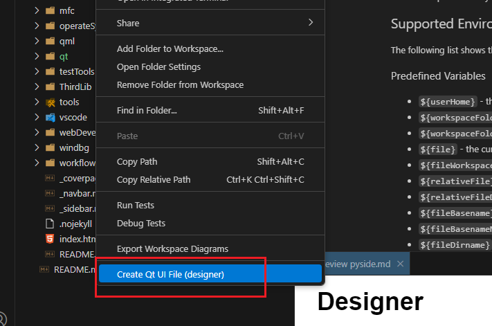

# PySide

# 介绍

`PySide` 是一个 Python 的图形化界面（GUI）库，由 C++ 版的 Qt 开发而来，在用法上基本与 C++ 版没有特别大的差异。
- `PySide2` 为 Qt5 版本
- `PySide6` 为 Qt6 版本

`PyQt5/6` 同样也是一个python绑定的跨平台图形化界面 Qt 库，二者区别为
- PySide 由 Qt 官方维护
- PyQt 不允许商用，PySide 免费

`PySide` 与 `PyQt` 在编码上基本相似，简单工程项目只需替换包名即可完成项目切换。

# 安装

Python 版本要求
- PySide2， 要求 Python版本 <= 3.10
- Pyside6， 要求 Python版本 >= 3.8 

```term
triangle@LEARN:~$ pip install pyside6
```

> [!tip]
> PySide6 自带所有的开发工具以及动态库，安装即可使用，不用安装 Qt。

# 基本工程

```python
from  PySide6.QtWidgets import QMainWindow,QApplication
from PySide6.QtCore import *

class MainWindow(QMainWindow):
    def __init__(self,parent=None):
        super().__init__(parent)

if __name__ == '__main__':
    app = QApplication()

    widget = MainWindow()
    widget.resize(QSize(1024,1024))
    widget.show()

    app.exec()
```

# Designer

1. 在 vsocde 中安装 `Qt for Python` 插件
2. 在文件夹目录 `右键` -> `Create Qt UI File` 创建 `demo.ui` 文件

    

3. 编辑 `.ui` 文件后，插件会自动生成 `demo_ui.py`
4. 代码中集成使用

    ```python
    from  PySide6.QtWidgets import QApplication,QWidget
    from PySide6.QtCore import *

    # 导入 'dmeo_ui.py'
    import demo_ui

    class DemoWidget(QWidget):
        def __init__(self,parent=None):
            super().__init__(parent)
            
            # 加载 .ui 中的界面
            self.ui = demo_ui.Ui_Form()
            self.ui.setupUi(self)
            
    if __name__ == '__main__':
        app = QApplication()

        widget = DemoWidget()
        widget.show()

        app.exec() 
    ```

# qrc


1. 创建 `resource.qrc` 文件

    ```xml
    <RCC>
        <qresource prefix="/icon">
            <file>icon/ic_last_step.svg</file>
            <file>icon/ic_next_step.svg</file>
            <file>icon/ic_start.svg</file>
        </qresource>
    </RCC>
    ```
2. 插件会自动编译生成 `resource_rc.py` 文件

3. 代码中使用

    ```python
    import resource_rc
    from PySide6.QtGui import QImage

    img = QImage(':/icon/ic_last_step.svg')
    ```

# 信号/槽

```python
import sys
from PySide6 import QtCore
 
 
# 槽定义，且重载实现了两个
@QtCore.Slot(int)
@QtCore.Slot(str)
def say_something(stuff):
    print(stuff)
 
 
class Communicate(QtCore.QObject):
    # 定义信号
    speak = QtCore.Signal((int,), (str,))
 
 
someone = Communicate()

# 通过 'connect'  进行槽连接
someone.speak.connect(say_something)
someone.speak[str].connect(say_something)

# 触发信号 
someone.speak.emit(10)
someone.speak[str].emit("Hello everybody!")
```

