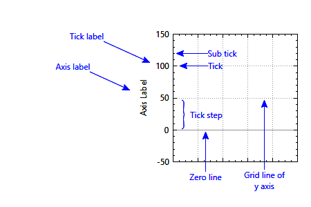
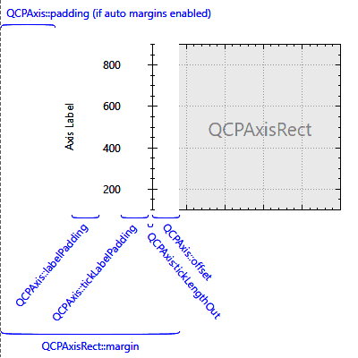
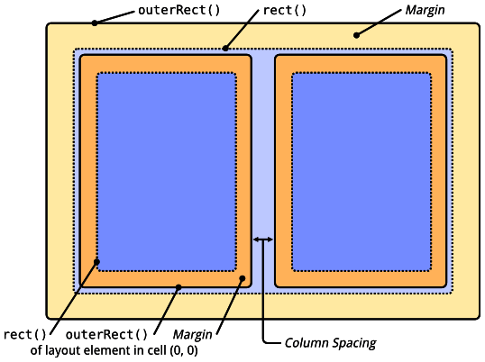
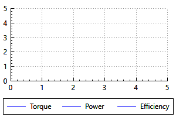
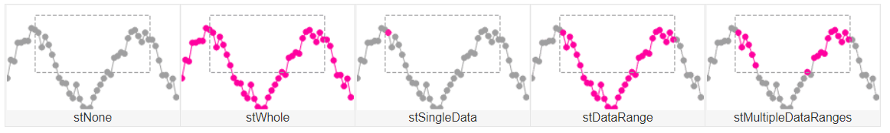

# QCustomPlot

- [QCustomPlot](https://www.qcustomplot.com/)
- [Document](https://www.qcustomplot.com/documentation/index.html)

# 介绍

QCustomPlot 是一个小型的 Qt 画图标类，简单易用，只需要在项目中加入头文件 `qcustomplot.h` 和 `qcustomplot.cpp` 文件，然后使一个`widget` 提升为 `QCustomPlot` 类即可使用。

 QCustomPlot 可以导出为各种格式，如矢量化 PDF 文件和光栅化图像，如 PNG、JPG 和 BMP。QCustomPlot 是在应用程序内显示实时数据以及为其他媒体生成高质量绘图的解决方案。

>[!note]
> `QCustomPlot` 是 `QChartView` 很好的替代品，性能更好。当 QCustomPlot 设置笔宽为 `1`，可撑起几百万点的展示，而  **QCharView 性能细碎，一两个点便存在界面刷新卡顿问题。**


# 基本规则

```cpp
void fcn(){
    // QCustomPlot 继承自 QWidget
    auto customPlot = new QCustomPlot();

    // 创建画布，所有图形都绘制到画布上
    customPlot -> addGraph();    
    auto graph = customPlot->graph(0);
    
    // 数据点
    QVector<double> x(101),y(101);
    for(int i=0;i<101;i++){
        x[i]=i/50.0-1;//设置x的范围为-1~1
        y[i]=x[i]*x[i];
    }
    graph->setData(x,y);

    //设置坐标轴标签
    customPlot->xAxis->setLabel("x");
    customPlot->yAxis->setLabel("y");

    //设置坐标轴范围，以便我们可以看到全部数据
    customPlot->xAxis->setRange(-1,1);
    customPlot->yAxis->setRange(0,1);

    // 刻度 QCPAxisTicker
    auto ticker = customPlot->xAxis->ticker();

    // 刷新界面
    customPlot->replot();    
}
```

# 概念

## [Plottable](https://www.qcustomplot.com/documentation/classQCPAbstractPlottable.html)

```cpp
    QCPGraph* graph = customPlot->graph(0);

    // 线条
    graph->setLineStyle(QCPGRaph::LineStyle);

    // 画笔
    graph->setPen(const QPen &);

    // 点样式
    graph->setScatterStyle(const QCPScatterStyle &);

    // 填充色
    graph->setBrush(const QBrush &);

    // 图名
    graph->setName("test");

    // 添加数据
    graph->setData(double key, double val);
```


 `QCPGraph` 被称之为 `Plottable`，在 QCustomPlot 中还实现了其他图表类：
- `QCPGraph` : 用于点、线、填充的方式展示一系列的数据
- `QCPCurve` : 用于展示参数曲线
- `QCPBars` : 柱状图
- `QCPStatisticalBox` : 箱体图
- `QCPColorMap` : 颜色梯度图
- `QCPFinancial` : 可视化股价
- `QCPErrorBars` : 附加在另一个Plottable上用于显示数据点的误差情况

在 QtCustomPlot 中数据使用 `key、value` 而非 `x、y` 来表示数据坐标。因此，`QCPGraph` 需要数据的 `key` 唯一，而 `QCPCurve` 则允许多个相同 `key` 的存在。在 `QCPCurve` 中区分多个 `key` 的方式是引入了第三个维度 `t`，即 `t、x、y` 描述一个数据点。

```cpp
    auto customPlot = new QCustomPlot();

    // 除了 QCPGraph 都需要手动 new
    QCPBars *myBars = new QCPBars(customPlot->xAxis, customPlot->yAxis);
    myBars->setName("Bars Series 1");

    QVector<double> keyData;
    QVector<double> valueData;
    keyData << 1 << 2 << 3;
    valueData << 2 << 4 << 8;
    myBars->setData(keyData, valueData);

    customPlot->rescaleAxes();
    customPlot->replot();    
```

## [Legend](https://www.qcustomplot.com/documentation/classQCPLegend.html)

通过 `Legend` 可以展示 `Plottable` 的名字和图表，方便区分各个图表。

```cpp
    auto cp = new QCustomPlot();
    cp->legend->setVisible(true);

    //用MainWindow字体,减小字体大小
    QFont legendFont = font();
    legendFont.setPointSize(9);
    cp->legend->setFont(legendFont);
    cp->legend->setBrush(QBrush(QColor(255,255,255,230)));    
```

## [Axis](https://www.qcustomplot.com/documentation/classQCPAxis.html)





```cpp
    auto cp = new QCustomPlot();
    auto xaxis = cp->xAxis; // 底轴
    auto yaxis = cp->yAxis; // 左轴
    auto xaxis2 = cp->xAxis2; // 顶轴
    auto yaxis2 = cp->yAxis2; // 右轴

    xaxis->setLabel("label");
    xaxis->setRange(0, 2.7);
    xaxis->setTickLength(0, 5);
    xaxis->setSubTickLength(0, 3);

    // 网格
    auto xgrid = xaxis->grid();

    // 刻度
    auto ticker = xaxis->ticker();

```

## [AxisRect](https://www.qcustomplot.com/documentation/classQCPAxisRect.html)

`AxisRect` 是以 `Axis` 为边界，构成的一个矩形。`QCustomPlot` 默认会持有一个 AxisRect，可通过 `QCustomPlot::axisRect()` 访问。**通过 AxisRect 便能实现图表的平移（本质是移动坐标轴显示范围）。**




## [Item](https://www.qcustomplot.com/documentation/classQCPAbstractItem.html)

在 `QCustomPlot` 中，区别于 `Plottable` 与 `Axis` ，还增加了一类补充图形展示元素 `Item`，例如 [给坐标轴添加一个动态标签](https://www.qcustomplot.com/index.php/tutorials/specialcases/axistags)。

## [Layout](https://www.qcustomplot.com/documentation/thelayoutsystem.html)

在 QCustomPlot 内部构建了一套图层系统 (`Layout System`)，用于[Layout Element](https://www.qcustomplot.com/documentation/classQCPLayoutElement.html)的「**定位和缩放**」，例如 `AxisRect`、`Legend`、`Color Scale` 等。



图层元素包含两个矩形对象：
- `rect()` : 内部矩形，根据 `margin` 与 `outer rect` 值自动计算
- `outerRect()` : 外部矩形，用于「定位与缩放」图层元素

对于 `AxisRect` 而言，四个轴会放置在内部矩形的四个边上；图表则绘制在内部矩形的内部；轴刻度与标签则绘制在 `margin` 区域。此外图层元素还能添加子布局元素，因此，就需要布局元素具有管理这些子元素的能力。`QCPLayout` 则提供了该能力: 添加、删除、管理子元素。

```cpp
    // prepare some graphs:
    customPlot->legend->setVisible(true);
    customPlot->addGraph()->setName("Torque");
    customPlot->addGraph()->setName("Power");
    customPlot->addGraph()->setName("Efficiency");

    // 最顶层的布局
    auto layout = customPlot->plotLayout();

    // now we move the legend from the inset layout of the axis rect into the main grid layout.
    // We create a sub layout so we can generate a small gap between the plot layout cell border
    // and the legend border:
    QCPLayoutGrid *subLayout = new QCPLayoutGrid;
    customPlot->plotLayout()->addElement(1, 0, subLayout);
    subLayout->setMargins(QMargins(5, 0, 5, 5));
    subLayout->addElement(0, 0, customPlot->legend);

    // change the fill order of the legend, so it's filled left to right in columns:
    customPlot->legend->setFillOrder(QCPLegend::foColumnsFirst);

    // set legend's row stretch factor very small so it ends up with minimum height:
    customPlot->plotLayout()->setRowStretchFactor(1, 0.001);
```




# 交互

## 类型

QCustomPlot 提供了多种内置的用户交互方法，这些方法可以分类归纳如下：
- **范围调整**: 调整图表展示范围
- **元素选择**：对图表中的「布局元素」进行选择
- **数据选择**：控制与数据点的交互
- **信号** 

```cpp
    auto customPlot = new QCustomPlot();

    // 设置交互能力
    customPlot->setInteractions(QCP::iRangeDrag | QCP::iRangeZoom | QCP::iSelectPlottables);
```

## 范围调整

```cpp
    auto cp = new QCustomPlot();

    // 启用范围拖拽功能
    cp->setInteraction(QCP::iRangeDrag, true);
    // 启用缩放功能
    cp->setInteraction(QCP::iRangeZoom, true);

    // QCPAxisRect 坐标轴交互
    QCPAxisRect* ar = cp->axisRect();

    ar->setRangeDrag(Qt::Horizontal); // 控制调整方向
    ar->setRangeDragAxes(); // 范围
```

## 元素选择

```cpp
    auto cp = new QCustomPlot();

    // 交互权限
    cp->setInteraction(QCP::iSelectPlottables, true);
    cp->setInteraction(QCP::IMultiSelect, true);

    // 多选控制器，默认是 ctrl
    cp->setMultiSelectModifier(Qt::KeyboardModifier);

    // 选择图表
    cp->graph(0)->setSelected(false);
    // 坐标轴由多个元素组成，因此需要分开进行选择
    cp->xAxis->setSelectableParts(QCPAxis::spNone);

    // 被选中的内容
    cp->selected...();

    // 被选中的行为
    cp->xAxis->setSelected...();
```

## 数据选择

- [Data Selection Mechanism](https://www.qcustomplot.com/documentation/dataselection.html)


```cpp
    auto cp = new QCustomPlot();

    // 启动选择交互
    cp->setInteraction(QCP::iSelectPlottables, true);
    cp->setInteraction(QCP::IMultiSelect, true);

    // 多选控制器，默认是 ctrl
    cp->setMultiSelectModifier(Qt::KeyboardModifier);

    // 可以框选数据，且鼠标拖拽对于布局元素将无效
    cp->setSelectionRectMode(QCP::srmSelect);

    auto graph = cp->graph(0);

    // 指定数据选择方式
    graph->setSelectable(QCP::SelectionType::stDataRange);
```


```cpp
    auto cp = new QCustomPlot();
    auto graph = cp->graph(0);

    // 不管是程序选择还是用户选择，都会触发 selectionChanged 信号
    connect(graph, QOverload<const QCPDataSelection &>::of(&QCPGraph::selectionChanged), [=](const QCPDataSelection & selection){
        
    });

    connect(graph, QOverload<bool>::of(&QCPGraph::selectionChanged), [=](bool bSelected){
        if(bSelected == false) return;

        // 被选中的 plot
        QList<QCPAbstractPlottable*> plots = cp->selectedPlottables();

        // QCPDataSelection 类似一个数据的索引
        QCPDataSelection selection = plots[0]->selection();
        QList<QCPDataRange> ranges = selection.dataRanges();

        // 获取 [0, size()) 区间内的所有 range
        QCPDataRange> range = selection.dataRange(index);

        // 数据真正被存放的地方
        QSharedPointer<QCPGraphDataContainer> data = graph->data();

        // 数据点
        const QCPGraphData * point = data->at(ranges[0].begin());
        point->key;
        point->value;
    });

    // 根据像素点获取 plot 中临近的数据点
    QVariant details;
  if (graph->selectTest(QPoint(123, 456), false, &details)) // QPoint could be e.g. event->pos() of a mouse event
  {
    QCPDataSelection dataPoints = details.value<QCPDataSelection>();
    if (dataPoints.dataPointCount() > 0)
        graph->data()->at(dataPoints.dataRange().begin());
  }
```

## 信号


```cpp
    // 不过用户还是程序，都会触发
    void selectionChanged(bool selected);

    // 用户触发
    void selectionChangedByUser();

    // 基本信号
    void mouseDoubleClick(QMouseEvent *event);
    void mousePress(QMouseEvent *event);
    void mouseMove(QMouseEvent *event);
    void mouseRelease(QMouseEvent *event);
    void mouseWheel(QWheelEvent *event);

    // 高级信号
    void plottableClick(QCPAbstractPlottable *plottable, int dataIndex, QMouseEvent *event);
    void plottableDoubleClick(QCPAbstractPlottable *plottable, int dataIndex, QMouseEvent *event);
    void itemClick(QCPAbstractItem *item, QMouseEvent *event);
    void itemDoubleClick(QCPAbstractItem *item, QMouseEvent *event);
    void axisClick(QCPAxis *axis, QCPAxis::SelectablePart part, QMouseEvent *event);
    void axisDoubleClick(QCPAxis *axis, QCPAxis::SelectablePart part, QMouseEvent *event);
    void legendClick(QCPLegend *legend, QCPAbstractLegendItem *item, QMouseEvent *event);
    void legendDoubleClick(QCPLegend *legend,  QCPAbstractLegendItem *item, QMouseEvent *event);

```