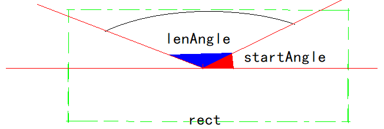

# QPainter

- [QPainter详解](https://blog.csdn.net/kenfan1647/article/details/116266875)

# 介绍

`QPainter`、`QPaintDevice`、`QPaintEngine` 一同构建了 `QWidget` 的基本绘制系统。
- `QPainter`: 执行绘图操作，如绘制线、圆、矩形
- `QPaintDevice` : 一个抽象出来的绘图设备，子类有 `QWidget`、`Qimage`，使用 QPainter 可以在上面绘图
- `QPaintEngine` : QPainter 可以使用这个接口来绘制不同类型的设备
- `QPen` : 画笔，用来绘制图形的轮廓线，以及定义轮廓线的颜色、样式和属性
- `QBrush` : 画刷，用来填充封闭图形，以及定义填充的颜色、样式和属性


# API

## QPaintDevice

```cpp
class myPaint : public QWidget{

public:
    void paintEvent(QPaintEvent * event){

        // QPainter(QPaintDevice *device) 
        // 创建 QPainter 指定一个绘图设备
        QPainter p(this);

        // 通过构造器指定外，还可以使用 begin 与 end 进行控制
        // 构造器指定其实就是简化了 begin 与 end 操作，类似 std::lock_guard
        QPainter p;
        p.begin(p); 
        p.drawLine(...);
        p.end(p);
    }
};
```

>[!note]
> - 在调用 `begin(device)` 时，所有绘画工具设置（setPen()、setBrush()等）都将重置为默认值
> - 调用 `begin(device)` 必须保证 `device` 有效且不为空，否则返回 `false`
> - 一个 `QPaintDevice` 同一时间只能由一个 `QPainter` 进行绘制


## boundingRect


```cpp
class myPaint : public QWidget{

public:
    void paintEvent(QPaintEvent * event){

        QPainter p(this);

        // 会根据 rect 计算出一个适合放置 test test 文本的边界矩形 needRect
        QRect rect = QRect(20,20,100,50);
        QRect needRect = p.boundingRect(rect, Qt::AlignHCenter | Qt::TextWordWrap, "test test");
    }
};
```

## 绘制设置

```cpp
    QPainter painter(this);

    // 抗锯齿
    painter.setRenderHint(QPainter::Antialiasing, true);
    painter.setRenderHint(QPainter::TextAntialiasing, true);

    // 设置画笔
    painter.setPen(QPen(Qt::red,5));

    // 设置字体
    QFont font = this->font();
    font.setPointSize(30);

    // 关闭文字的抗锯齿
    font.setStyleHint(font.styleHint(),QFont::NoAntialias);
    painter.setFont(font);

    // brush 所在点
    painter.brushOrigin();
```

## 形状绘制

### Rect

```cpp
    QPainter painter(this);
    QRect rect = QRect(20,20,100,50);
    painter.drawRect(rect);

    // 带圆角的矩形
    painter.drawRoundedRect(QRect(0,0,1000,1000).adjusted(5,5,-5,-5),30,30);
```

### Line

```cpp
    QPainter painter(this);
    painter.drawLine(start, end);
```

### Ellipse

```cpp
    QPainter painter(this);
    painter.drawEllipse(1,1,5,5);
```

### Arc

```cpp
    QPainter painter(this);
    painter.setRenderHint(QPainter::Antialiasing,true);
    painter.setPen(QPen(Qt::red,5));
    QRectF rectangle(10.0, 20.0, 80.0, 60.0);
    int startAngle = 30 * 16;
    int spanAngle = 120 * 16;
    painter.drawArc(rectangle, startAngle, spanAngle);
    painter.setPen(QPen(Qt::blue,3,Qt::DotLine));
    painter.drawRect(rectangle);
```



### Polygon

```cpp
    QPainter painter(this);
    painter.setRenderHint(QPainter::Antialiasing,true);
    painter.setPen(QPen(Qt::red,3));
 
    static const QPointF points[4] = { QPointF(10.0, 80.0),
                                       QPointF(20.0, 10.0),
                                       QPointF(80.0, 30.0),
                                       QPointF(90.0, 70.0)};
    painter.drawConvexPolygon(points, 4);

    QPolygonF polygon;
    polygon.append(QPointF(10.0, 80.0));
    polygon.append(QPointF(20.0, 10.0));
    polygon.append(QPointF(80.0, 60.0));
    painter.drawConvexPolygon(polygon);
```

### Image

```cpp
    // 将给定图像 source 矩形部分绘制到绘制设备中的 target 矩形中。
    // 如果图像和矩形尺寸不相同，则将图像缩放以适合矩形。
    QPainter painter(this);
    QImage img(":/D:/eee.jpg");
    QRectF target;
    QRectF source;
    painter.drawImage(target,img, source);
```

### Pixmap

```cpp
    // 绘制到设备的 target 矩形中，会缩放原始图
    void drawPixmap(const QRectF &target, const QPixmap &pixmap, const QRectF &source);

    // 在设备的 point 点开始绘制，不会缩放原始图
    void drawPixmap(const QPointF &point, const QPixmap &pixmap, const QRectF &source);
```

### Point

```cpp
    QPainter painter(this);
    painter.setRenderHint(QPainter::Antialiasing);
    painter.setPen(QPen(Qt::red,5));
 
    static const QPointF points[4] = {
        QPointF(10.0, 80.0),
        QPointF(20.0, 10.0),
        QPointF(80.0, 30.0),
        QPointF(90.0, 70.0)
    };
    painter.drawPoints(points, 4);
```

### Text

```cpp
    auto rect = event->rect();
    QPainter painter(this);
    painter.setPen(QPen(Qt::red,5));
    painter.drawText(rect, Qt::AlignCenter, "黄河之水天上来\n奔流到海不复回");
```

## 裁剪

### 裁剪矩形

```cpp
void Widget::paintEvent(QPaintEvent *event)
{
    auto rect = event->rect();
    QPainter painter(this);
    painter.setRenderHint(QPainter::Antialiasing,true);
    painter.setPen(QPen(Qt::red,5));
    painter.setClipRect(rect.adjusted(20,20,-20,-20));
    painter.drawLine(rect.topLeft(),rect.bottomRight());
}
```

### 裁剪路径


```cpp
void Widget::paintEvent(QPaintEvent *event)
{
    auto rect = event->rect();
    QPainter painter(this);
    painter.setRenderHint(QPainter::Antialiasing,true);
    painter.setBrush(Qt::cyan);
    QPainterPath path;
    path.addRoundRect(rect.adjusted(20,20,-20,-20),60,60);
    painter.setClipPath(path);
    painter.drawRect(rect);
}
```

## 状态存储


```cpp
    void restore();
    void save();
```