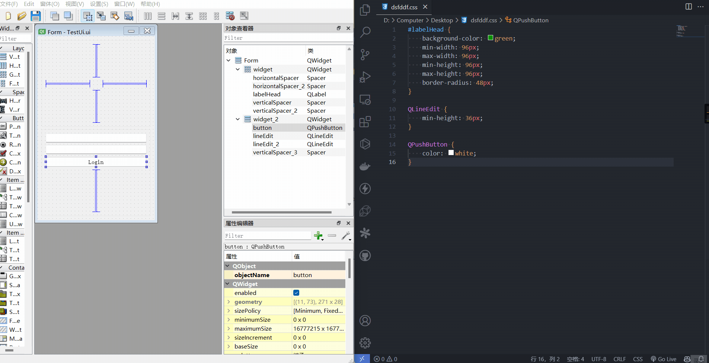

# QSS

# 筛选器

> [!note] 
> 宽泛的设置优先级低于更加针对具体的设置，文件上面的设置优先级低于文件下面的设置

- 通配选择器: 所有控件都适用

```css
*{
}
```

- 类型选择器：匹配指定类型及其子类

```css
className{

}
```

- 类选择器：匹配指定类型的实例，但是并不匹配其子类

```css
.className{

}
```

- 属性选择器：可以通过设定属性 `flat` 的值，来激活选择器

```css
QPushButton[flat = "false"]{
}
```

- ID 选择器：选择指定实列

```css
QPushButton#myButton1, #myButton2
{
}
```

- 后代选择器：会选择 `QDialog` 容器中的所有 `QPushButton`，包含儿子、孙子等。

```css
QDialog QPushButton
{
}
```

- 子选择器：会选择 `QDialog` 容器中的所有 `QPushButton`，只有儿子

```css
QDialog > QPushButton
{
}
```

# 使用

```cpp

// 加载 qss 文件
QString load(const QString & strPath){
    QFile file(strPath);
    if(file.open(QFile::ReadOnly) == false) return QString();
    return QLatin1String(file.readAll());
}

class Test : public QWidget{
    Q_OBJECT
public:
    Test(QWidget * parent) : QWidget(parent), ui(new Ui::Test)
    {
        // 加载 qss
        setStyleSheet(load(":/style/window.qss"));

        // 属性选择器,设置值
        ui->btn->setProperty("flat","false");

        // 强制刷新结果
        ui->btn->style()->unpolish(ui->btn);
        ui->btn->style()->polish(ui->btn);
    } 
private:
    Ui::Test * ui;
};
```

# 实时预览

- [QSSEditor vscode](https://marketplace.visualstudio.com/items?itemName=Irony.qsseditor)
- [QSSEditor qtdesigner](https://github.com/PyQt5/QSSEditor)

