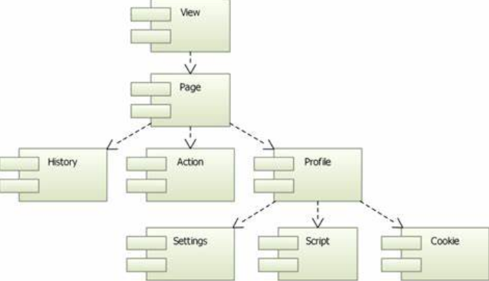

# WebEngine


# 介绍

`WebEngine` 是 Qt 框架中的一个组件，它基于 `Chromium` 内核，用于在 Qt 应用程序中嵌入网页内容和实现各种 Web 应用功能。开发者可以通过 WebEngine 在本地桌面应用程序中集成网页浏览功能，支持 HTML5、CSS3、JavaScript 等现代 Web 技术。



`QWebEngineView` 是 WebEngine 模块的 `QWidget` 实现。在该视图(view)里, 通过 `QWebEnginePage` 实现网页加载，利用 `QEngineHistory` 存储导航历史。 QWebEnginePage 都归属于 `QWebEngineProfile`，且能访问 QWebEngineProfile 包含的 `QWebEngineScript`、`QWebEngineSettings`、`cookies` 等公共资源。此外，通过 `QWebChannel` 能实现主程序与 web 之间的通讯。


# WebEngineView


```cpp
#include <QApplication>
#include <QWebEngineView>

int main(int argc, char *argv[])
{
    /* 必须设置，否则会闪退 */
    QCoreApplication::setAttribute(Qt::AA_UseOpenGLES);
    QCoreApplication::setAttribute(Qt::AA_EnableHighDpiScaling);
    QCoreApplication::setAttribute(Qt::AA_ShareOpenGLContexts );

    QApplication app(argc, argv);

    QWebEngineView view;
    // 在线网页
    view.setUrl(QUrl("http://www.qt.io"));
    // 本地网页，必须使用绝对路径，加载的静态网页工作目录与 index.html 同一层级
    view.setUrl(QUrl("file:///e:/webview/index.html"));
    view.resize(1024, 750);
    view.show();

    return app.exec();
}
```