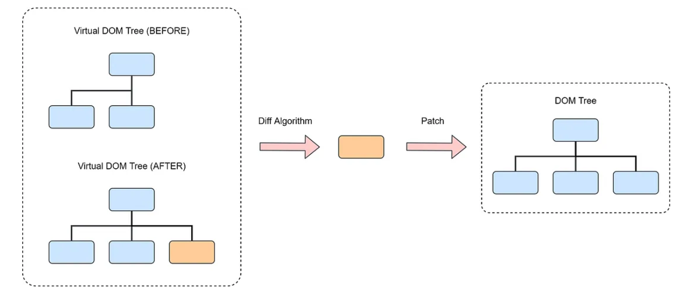

# 简介

# React

[React](https://reactjs.org/) 是一个用于构建用户界面的 `JavaScript/TypeScript` 库。它由 `Facebook` 开发并维护，广泛应用于前端开发中
- **定位**: 是一个库，而非框架
- **核心思想**：基于状态驱动试图更新，即 `UI = fcn(state, props)`

# 项目

- **项目创建**：基于 `Vite` 的项目可实现快速热重载

    ```term
    triangle@learn$ npm create vite@latest
    ```
- **项目结构**

    ```
    .
    ├── node_modules                    依赖
    ├── public                          静态资源  
    │   ├── favicon.svg
    │   └── icons.svg
    ├── src                             源代码
    │   ├── App.css
    │   ├── App.tsx                     根组件
    │   ├── assets
    │   ├── index.css                   程序样式文件
    │   └── main.tsx                    程序入口文件
    ├── index.html                      界面入口文件
    ├── package-lock.json
    ├── package.json                    项目依赖管理，项目命令等
    ├── eslint.config.js                代码格式规范化配置
    ├── tsconfig.json                   TypeScript 配置文件
    ├── tsconfig.app.json               应用程序的 TypeScript 配置文件
    ├── tsconfig.node.json              Node.js 的 TypeScript 配置文件
    ├── vite.config.ts                  vite 构建配置文件
    └── README.md
    ```
- **命令**

    ```term
    triangle@learn$ npm run dev     // 启动开发服务，代码修改后自动刷新
    triangle@learn$ npm run build   // 构建生产环境代码
    ```

# JSX/TSX

扩展代码文件 `.jsx/.tsx`
- `JSX, JavaScript XML`：一种在 `JavaScript` 中编写类似 `HTML` 语法的扩展语法。`React` 使用 `JSX` 来描述 `UI` 结构。
- `TSX, TypeScript XML`：即 `TypeScript` 版的 `JSX`

下列代码是使用 `JSX` 描述一个简单的 `h1` 元素

```jsx
const element = <h1 className="greeting">Hello, world!</h1>
```

在经过编译后，`JSX` 会被转换为 `React.createElement()` 函数调用

```js
const element = React.createElement(
  'h1',
  { className: 'greeting' },
  'Hello, world!'
)
```

# 实现原理

## 渲染流程



`React` 的渲染流程主要包括以下几个步骤：
1. 根据 `JSX/TSX` 代码生成虚拟 `DOM`
2. 将虚拟 `DOM` 转换为 `fiber` 链表结构
3. 通过 `diff` 算法比较新旧 `fiber` 结构，找到变化节点
4. 通过调度器 `Scheduler` 实现任务切片，分段实现虚拟 `DOM` 到真实 `DOM` 的转换
5. 得到最终的 `DOM` 后，提交 `DOM` 给浏览器渲染


## 虚拟 DOM

**虚拟`DOM,Virtual DOM`**: 是一个 `JavaScript` 对象，它是真实 `DOM` 的轻量级副本，即 `React.createElement()` 返回的 `React.ReactNode` 对象

```javascript
// 嵌套的虚拟DOM树
const complexVNode = {
    type: 'div',
    props: {
        className: 'app',
        children: [
            {
                type: 'header',
                props: {
                    children: {
                        type: 'h1',
                        props: {
                        children: '标题'
                        }
                    }
                }
            },
            {
                type: 'main',
                props: {
                    children: [
                        {
                            type: 'p',
                            props: {
                                children: '段落1'
                            }
                        },
                        {
                            type: 'p',
                            props: {
                                children: '段落2'
                            }
                        }
                    ]
                }
            }
        ]
    }
};
```

## Fiber

虚拟 `DOM` 是按照树结构组织的，但不利于新旧 `DOM` 的比较，对此，`React` 先将虚拟 `DOM` 转换为 `fiber` 链表结构，再通过 `diff` 算法实现差异查找。
- `fiber` 链表上一个节点就调度器中的一个子任务


## requestIdleCallback

浏览器界面渲染按照 `60fps` 的帧率进行实时渲染，每一帧执行的执行流程
1. 处理事件的回调`click...`事件
2. 处理计时器的回调
3. 开始帧
4. 执行`requestAnimationFrame` 动画的回调
5. 计算机页面布局计算 合并到主线程
6. 绘制
7. 如果此时还有空闲时间，执行`requestIdleCallback`

`React` 的 `Scheduler` 就是为了实现类似 `requestIdleCallback` 的能力，将界面元素的生成任务拆分为多个子任务，然后放到多帧中执行，从而避免复杂渲染任务阻塞主线程。`React` 真正的 `Scheduler` 的实现方案有以下两套
- `MessageChannel` 
- `setTimeout` 


## 库实现

- `react.js`
    ```js
    /* 
    ==============================
    * 虚拟 DOM 节点构建器
    ==============================

    */
    const React = {
        createElement(type, props = {}, ...children) {
            return {
                type,
                props: {
                    ...props,
                    children: children.map(child =>
                        typeof child === 'object'
                            ? child
                            : React.createTextElement(child)
                    ),
                },
            };
        },

        createTextElement(text) {
            return {
                type: 'TEXT_ELEMENT',
                props: {
                    nodeValue: text,
                    children: [],
                },
            };
        },
    };


    /* 
    ==============================
    * diff, Fiber 架构
    ==============================
    */
    let nextUnitOfWork = null; // 下一个工作单元
    let currentRoot = null; // 当前 Fiber 树的根
    let wipRoot = null; // 正在工作的 Fiber 树
    let deletions = null; // 存储需要删除的 Fiber

    // 渲染入口
    // - element: 虚拟 DOM 节点
    // - container: 容器 DOM 节点
    function render(element, container) {
        //wipRoot 表示“正在进行的工作根”，它是 Fiber 架构中渲染任务的起点
        wipRoot = {
            dom: container, //渲染目标的 DOM 容器
            props: {
                children: [element], //要渲染的元素（例如 React 元素）
            },
            alternate: currentRoot,
            //alternate 是 React Fiber 树中的一个关键概念，用于双缓冲机制（双缓冲 Fiber Tree）。currentRoot 是之前已经渲染过的 Fiber 树的根，wipRoot 是新一轮更新的根 Fiber 节点。
            //它们通过 alternate 属性相互关联
            //旧的fiber树
        };
        nextUnitOfWork = wipRoot;
        //nextUnitOfWork 是下一个要执行的工作单元（即 Fiber 节点）。在这里，将其设置为 wipRoot，表示渲染工作从根节点开始
        deletions = [];
        //专门用于存放在更新过程中需要删除的节点。在 Fiber 更新机制中，如果某些节点不再需要，就会将它们放入 deletions，
        //最后在 commitRoot 阶段将它们从 DOM 中删除
    }

    // 创建 Fiber 节点
    function createFiber(element, parent) {
        return {
            type: element.type,
            props: element.props,
            parent,
            dom: null, // 关联的 DOM 节点
            child: null, // 子节点
            sibling: null, // 兄弟节点
            alternate: null, // 对应的前一次 Fiber 节点
            effectTag: null, // 'PLACEMENT', 'UPDATE', 'DELETION'
        };
    }

    // Diff 算法: 将子节点与之前的 Fiber 树进行比较
    function reconcileChildren(wipFiber, elements) {
        let index = 0;//
        let oldFiber = wipFiber.alternate && wipFiber.alternate.child; // 旧的 Fiber 树
        let prevSibling = null;

        while (index < elements.length || oldFiber != null) {
            const element = elements[index];
            let newFiber = null;

            // 比较旧 Fiber 和新元素
            const sameType = oldFiber && element && element.type === oldFiber.type

            //如果是同类型的节点，复用
            if (sameType) {
                newFiber = {
                    type: oldFiber.type,
                    props: element.props,
                    dom: oldFiber.dom,
                    parent: wipFiber,
                    alternate: oldFiber,
                    effectTag: 'UPDATE',
                };

            }

            //如果新节点存在，但类型不同，新增fiber节点
            if (element && !sameType) {
                newFiber = createFiber(element, wipFiber);
                newFiber.effectTag = 'PLACEMENT';
            }

            //如果旧节点存在，但新节点不存在，删除旧节点
            if (oldFiber && !sameType) {
                oldFiber.effectTag = 'DELETION';
                deletions.push(oldFiber);
            }

            //移动旧fiber指针到下一个兄弟节点
            if (oldFiber) {
                oldFiber = oldFiber.sibling;
            }

            // 将新fiber节点插入到DOM树中
            if (index === 0) {
                //将第一个子节点设置为父节点的子节点
                wipFiber.child = newFiber;
            } else if (element) {
                //将后续子节点作为前一个兄弟节点的兄弟
                prevSibling.sibling = newFiber;
            }

            //更新兄弟节点
            prevSibling = newFiber;
            index++;
        }
    }

    // 创建 DOM 节点
    function createDom(fiber) {
        const dom =
            fiber.type === 'TEXT_ELEMENT'
                ? document.createTextNode('')
                : document.createElement(fiber.type);

        updateDom(dom, {}, fiber.props);
        return dom;
    }

    // 更新 DOM 节点属性
    function updateDom(dom, prevProps, nextProps) {
        // 移除旧属性
        Object.keys(prevProps)
            .filter(name => name !== 'children')
            .forEach(name => {
                dom[name] = '';
            });

        // 添加新属性
        Object.keys(nextProps)
            .filter(name => name !== 'children')
            .filter(name => prevProps[name] !== nextProps[name])
            .forEach(name => {
                dom[name] = nextProps[name];
            });
    }

    // 执行一个子任务, fiber 链表上一个节点就一个子任务
    function performUnitOfWork(fiber) {
        // 如果没有 DOM 节点，为当前 Fiber 创建 DOM 节点
        if (!fiber.dom) {
            fiber.dom = createDom(fiber);
        }
        //确保每个 Fiber 节点都在内存中有一个对应的 DOM 节点准备好，以便后续在提交阶段更新到实际的 DOM 树中

        // 创建子节点的 Fiber
        // const vdom = React.createElement('div', { id: 1 }, React.createElement('span', null, '小满zs'));
        // 子节点在children中
        const elements = fiber.props.children;
        reconcileChildren(fiber, elements);

        // 遍历 fiber 链表
        // 返回下一个工作单元（child, sibling, or parent）
        if (fiber.child) {
            return fiber.child;
        }

        let nextFiber = fiber;
        while (nextFiber) {
            if (nextFiber.sibling) {
                return nextFiber.sibling;
            }
            nextFiber = nextFiber.parent;
        }
        return null;
    }


    // 将 Fiber 生成的 DOM 更新到实际的 DOM 树中
    function commitWork(fiber) {
        if (!fiber) {
            return;
        }

        const domParent = fiber.parent.dom;

        if (fiber.effectTag === 'PLACEMENT' && fiber.dom != null) {
            domParent.appendChild(fiber.dom);
        } else if (fiber.effectTag === 'UPDATE' && fiber.dom != null) {
            updateDom(fiber.dom, fiber.alternate.props, fiber.props);
        } else if (fiber.effectTag === 'DELETION') {
            domParent.removeChild(fiber.dom);
        }

        commitWork(fiber.child);
        commitWork(fiber.sibling);
    }


    function commitRoot() {
        deletions.forEach(commitWork); // 删除需要删除的 Fiber 节点
        commitWork(wipRoot.child);
        currentRoot = wipRoot;
        wipRoot = null;
    }

    /* 
    ==================================
    * 基于 requestIdleCallback 实现的简易调度器，递归实现，从而会在浏览器中一直运行
    ==================================
    */
    function workLoop(deadline) {
        //deadline 表示浏览器空闲时间
        let shouldYield = false;
        //是一个标志，用来指示是否需要让出控制权给浏览器。如果时间快用完了，则设为 true，以便及时暂停任务，避免阻塞主线程

        while (nextUnitOfWork && !shouldYield) {
            nextUnitOfWork = performUnitOfWork(nextUnitOfWork);
            //performUnitOfWork 是一个函数，它处理当前的工作单元，并返回下一个要执行的工作单元。每次循环会更新 nextUnitOfWork 为下一个工作单元
            shouldYield = deadline.timeRemaining() < 1;
            //使用 deadline.timeRemaining() 来检查剩余的空闲时间。如果时间少于 1 毫秒，就设置 shouldYield 为 true，表示没有空闲时间了，就让出控制权
        }

        if (!nextUnitOfWork && wipRoot) {
            //当没有下一个工作单元时（nextUnitOfWork 为 null），并且有一个待提交的“工作根”（wipRoot），就会调用 commitRoot() 将最终的结果应用到 DOM 中
            commitRoot();
        }

        //使用 requestIdleCallback 来安排下一个空闲时间段继续执行 workLoop，让任务在浏览器空闲时继续进行
        requestIdleCallback(workLoop);
    }

    // requestIdleCallback 会跟随浏览器空闲时间执行，不会阻塞主线程
    requestIdleCallback(workLoop);
    ```

- `index.html`

    ```html
    <!DOCTYPE html>
    <html lang="en">
    <head>
        <meta charset="UTF-8">
        <meta name="viewport" content="width=device-width, initial-scale=1.0">
        <title>Document</title>
    </head>
    <body>
        <!-- DOM 容器根节点 -->
        <div id="root"></div>
        <!-- 加载 react.js  -->
        <script src="./react.js"></script>
        <!-- 测试代码 -->
        <script type="text/javascript">
            render(React.createElement('div', { id: 1 }, React.createElement('span', null, 'hello 11')), document.getElementById('root'));
            render(React.createElement('div', { id: 1 }, React.createElement('span', null, 'hello 22')), document.getElementById('root'));
            render(React.createElement('div', { id: 1 }, React.createElement('span', null, 'hello 10')), document.getElementById('root'));
        </script>
    </body>
    </html>
    ```
