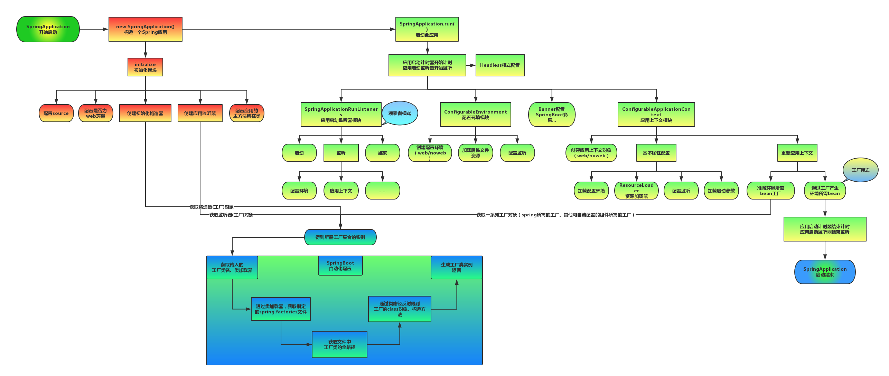
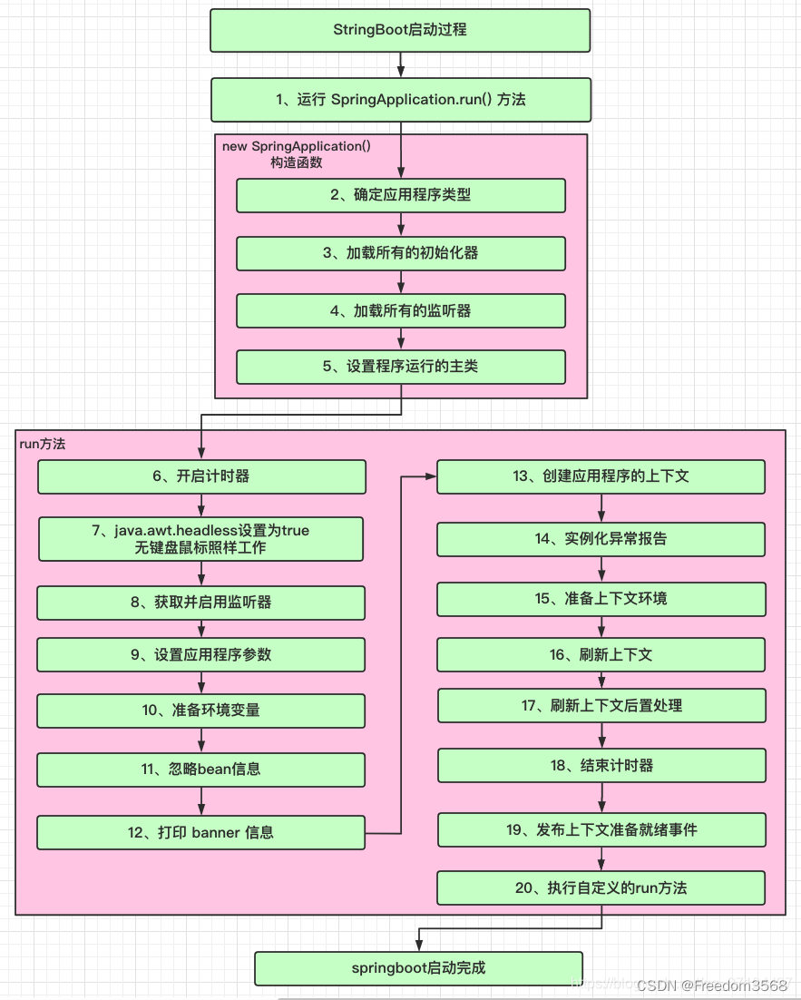

# Spring 应用

# spring 启动





# 监听器

## java 监听机制

`Java` 的监听机制主要角色

- **事件`Event`**：继承 `java.util.EventObject`，表示发生了某种事件
- **事件源 `Source`**：任意 `Object` 对象，发布事件
- **监听器`Listener`**：实现 `java.util.EventListener` 接口，用于处理事件

## Spring Boot 监听器

`Spring Boot` 对 `Java` 的监听机制进行包装，然后提供了三类监听器给开发者使用。


|  监听器   | 时机    | 注册  | 作用|
| --- | --- | --- | --- |
|  `ApllicationContextInitializer`   |  应用开始启动前 | 配置 `spring.factories` 中的 `ApllicationContextInitializer`  | 检测运行环境  |
|  `SpringApplicationRunListener`   |  应用生命周期监听   |  配置 `spring.factories` 中的 `SpringApplicationRunListener`   | 应用生命周期  |
|   `ApplicationRunner/CommandLineRunner`   |   应用启动完成之后、应用开始处理请求之前  |   `@Component` 注解 |  用于应用初始化操作，例如缓存预热 |


# 监控

通过安装 `spring-boot-starter-actuator` 包，便能开启 `Spring Boot` 应用监控。在 `application` 中可配置监控信息

```ini
# 开启详细的健康检查信息
management.endpoint.health.show-details=always 

# 暴露所有的监控信息
management.endpoints.web.exposure.include=*
```

通过 `GET` 请求 `http://hostname:port/actuator` 便能得到访问具体监控信息的 `url` 列表

```json
{
  "_links": {
    "self": {
      "href": "http://127.0.0.1:8084/actuator",
      "templated": false
    },
    "beans": {
      "href": "http://127.0.0.1:8084/actuator/beans",
      "templated": false
    },
    "conditions": {
      "href": "http://127.0.0.1:8084/actuator/conditions",
      "templated": false
    },
    "env": {
      "href": "http://127.0.0.1:8084/actuator/env",
      "templated": false
    },
    "info": {
      "href": "http://127.0.0.1:8084/actuator/info",
      "templated": false
    },
    "loggers": {
      "href": "http://127.0.0.1:8084/actuator/loggers",
      "templated": false
    },
    "loggers-name": {
      "href": "http://127.0.0.1:8084/actuator/loggers/{name}",
      "templated": true
    },
    "threaddump": {
      "href": "http://127.0.0.1:8084/actuator/threaddump",
      "templated": false
    },
    "sbom": {
      "href": "http://127.0.0.1:8084/actuator/sbom",
      "templated": false
    },
    "sbom-id": {
      "href": "http://127.0.0.1:8084/actuator/sbom/{id}",
      "templated": true
    },
    "scheduledtasks": {
      "href": "http://127.0.0.1:8084/actuator/scheduledtasks",
      "templated": false
    },
    "mappings": {
      "href": "http://127.0.0.1:8084/actuator/mappings",
      "templated": false
    },
    "health": {
      "href": "http://127.0.0.1:8084/actuator/health",
      "templated": false
    },
    "health-path": {
      "href": "http://127.0.0.1:8084/actuator/health/{*path}",
      "templated": true
    },
    "metrics": {
      "href": "http://127.0.0.1:8084/actuator/metrics",
      "templated": false
    },
    "metrics-requiredMetricName": {
      "href": "http://127.0.0.1:8084/actuator/metrics/{requiredMetricName}",
      "templated": true
    }
  }
}
```

通过 `Spring Boot Admin` 工具，可以实现监控信息可视化