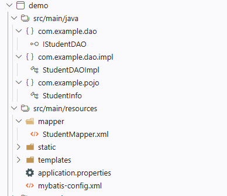

# Mybatis

# 简介

[Mybatis](https://mybatis.org) 是一款优秀的`ORM (Object Relation Mapping)`框架，也称之为`Mybatis3`，便于 `SQL` 与实体类之间建立映射关系
- `Object`: `Java` 实体对象
- `Relation`: 关系型数据库
- `Mapping`: 映射

但 `Mybatis` 属于「半自动 `ORM`」需要手动编写 SQL，还有一些配置工作。其主要简化的工作在于：
1. 统一数据库连接，不用关心底层实现，且封装了调用操作
2. 自动实现数据表与实体类之间的映射关系（如字段名、主键等）

# 开发环境

1. 使用 `Spring Initializr` 创建项目，**一定要选择 `< 4.0.10` 的版本**
2. 添加依赖
  - `spring web`
  - `MyBatis Framework`
  - `Sqlit JDBC Driver` : 也可以换其他数据，如 `PostgreSQL`、`MySQL` 等。
3. `pom.xml` 配置说明

```xml
	<dependencies>
        <!-- spring 框架 --> 
		<dependency>
			<groupId>org.springframework.boot</groupId>
			<artifactId>spring-boot-starter-webmvc</artifactId>
		</dependency>

        <!-- spring 集成的 mybatis 依赖，会自动导入 mybatis 包 -->
		<dependency>
			<groupId>org.mybatis.spring.boot</groupId>
			<artifactId>mybatis-spring-boot-starter</artifactId>
			<version>4.0.1</version>
		</dependency>

        <!--  数据库底层驱动 -->
		<dependency>
			<groupId>org.xerial</groupId>
			<artifactId>sqlite-jdbc</artifactId>
			<scope>runtime</scope>
		</dependency>

        <!-- 测试框架相关 --> 
		<dependency>
			<groupId>org.springframework.boot</groupId>
			<artifactId>spring-boot-starter-webmvc-test</artifactId>
			<scope>test</scope>
		</dependency>
		<dependency>
			<groupId>org.mybatis.spring.boot</groupId>
			<artifactId>mybatis-spring-boot-starter-test</artifactId>
			<version>4.0.1</version>
			<scope>test</scope>
		</dependency>

	</dependencies>

	<build>
		<plugins>
			<plugin>
				<groupId>org.springframework.boot</groupId>
				<artifactId>spring-boot-maven-plugin</artifactId>
			</plugin>
		</plugins>
	</build>
```

# 使用




1. 提前准备好数据库 `database/test.db`

    ```sql
    CREATE TABLE student (id INTEGER PRIMARY KEY AUTOINCREMENT,
                            username TEXT NOT NULL, 
                            age INTEGER);

    INSERT INTO student (username, age) VALUES ('sam', 18);
    INSERT INTO student (username, age) VALUES ('zelda', 16);
    INSERT INTO student (username, age) VALUES ('link', 16);
    ```

2. 在 `src\main\resources` 下创建 `mybatis-config.xml` 配置文件

    ```xml
    <?xml version="1.0" encoding="UTF-8" ?>
    <!DOCTYPE configuration
    PUBLIC "-//mybatis.org//DTD Config 3.0//EN"
    "http://mybatis.org/dtd/mybatis-3-config.dtd">
    <configuration>
        <environments default="development">
            <environment id="development">
                <!-- JDBC 为原生的数据库连接方式 -->
                <transactionManager type="JDBC"/>
                <!-- 数据库配置, UNPOOLED 表示不要连接池，POOLED 连接池 -->
                <dataSource type="UNPOOLED">
                    <!-- 数据库驱动 -->
                    <property name="driver" value="org.sqlite.JDBC"/>
                    <!-- 数据库文件将生成在项目根目录 -->
                    <property name="url" value="jdbc:sqlite:database/test.db"/>
                    <!-- 
                        sqlite 数据库默认没有密码，所以不需要配置。 
                        <property name="username" value="${username}"/>
                        <property name="password" value="${password}"/> 
                    -->
                </dataSource>

            </environment>
        </environments>
        
        <mappers>
            <!-- mapper 配置 -->
        </mappers>
    </configuration>
    ``` 

3. 在 `src\main\java` 下实现 `pojo` 实体类(不依赖框架、只有属性和 `getter/setter` 的纯粹 `Java` 类)

    ```java
    package com.example.pojo;

    /* 
        pojo: 数据库字段的映射实体类，用于映射具体数据
        - 属性名、属性类型与数据库表一致，方便映射
        - 属性类型要使用 `Wrapper Class` 类型，能自动处理 `null`
        - 需要有默认构造和带参构造
    */
    package com.example.pojo;

    public class StudentInfo {
        private String username;
        private Integer age;
        private Integer id;

        public Integer getId() {
            return id;
        }

        public void setId(Integer id) {
            this.id = id;
        }

        public StudentInfo() {
            // 默认构造方法，没有参数，使用默认值
            this.username = "";
            this.age = 0;
            this.id = 0;
        }

        public StudentInfo(String username, Integer age, Integer id) {
            this.username = username;
            this.age = age;
            this.id = id;
        }

        public void print() {
            System.out.println("name: " + this.username);
            System.out.println("age: " + this.age);
            System.out.println("id: " + this.id);
        }

        public String getUsername() {
            return username;
        }

        public void setUsername(String name) {
            this.username = name;
        }

        public Integer getAge() {
            return age;
        }

        public void setAge(Integer age) {
            this.age = age;
        }
    }

    ```

4. 在 `src\main\java` 下创建 `DAO (Data Access Object)` 接口，用于定义数据库操作方法

    ```java
    package com.example.dao;

    import java.util.List;

    import com.example.pojo.StudentInfo;

    public interface IStudentDAO {

        /**
        * 学生信息数据访问接口
        */
        public List<StudentInfo> findAll() throws Exception;
    }

    ```

5. 在 `src\main\resources` 下创建 `mapper` 文件夹，并在其中创建 `StudentMapper.xml` 映射文件

    ```xml
    <?xml version="1.0" encoding="UTF-8"?>
    <!DOCTYPE mapper PUBLIC "-//mybatis.org//DTD Mapper 3.0//EN" "https://mybatis.org/dtd/mybatis-3-mapper.dtd">
    <mapper namespace="com.example.dao.IStudentDAO">
    <select id="findAll" resultType="com.example.pojo.StudentInfo">
            SELECT * FROM student
    </select> 
    </mapper>
    ```

    然后修改 `mybatis-config.xml` 文件，添加 `mapper` 路径

    ```xml
        <mappers>
            <mapper resource="mapper/StudentMapper.xml"/>
        </mappers>
    ```

6. 在 `src\main\java` 下实现 `DAO` 接口

    ```java
    package com.example.dao.impl;

    import java.io.IOException;
    import java.io.InputStream;
    import java.util.List;

    import org.apache.ibatis.io.Resources;
    import org.apache.ibatis.session.SqlSession;
    import org.apache.ibatis.session.SqlSessionFactory;
    import org.apache.ibatis.session.SqlSessionFactoryBuilder;

    import com.example.dao.IStudentDAO;
    import com.example.pojo.StudentInfo;

    public class StudentDAOImpl implements IStudentDAO {
        @Override
        public List<StudentInfo> findAll() throws IOException {
            // 加载 mybatis 配置文件，创建 sqlsessionfactory 实例
            InputStream is = Resources.getResourceAsStream("mybatis-config.xml");
            SqlSessionFactoryBuilder builder = new SqlSessionFactoryBuilder();
            SqlSessionFactory factory = builder.build(is);
            SqlSession sqlSession = factory.openSession(); 

            // 调用 mapper 中的 findAll 方法，返回结果集
            List<StudentInfo> list = sqlSession.selectList("findAll"); // Line 21
            sqlSession.close();
            return list; 
        }
    }
    ```

7. 在 `src\test\java` 下编写测试类

    ```java
    package com.example.dao;

    import java.io.IOException;
    import java.util.List;

    import org.junit.jupiter.api.Test;

    import com.example.dao.impl.StudentDAOImpl;
    import com.example.pojo.StudentInfo;

    public class testStudentDAO {
        
    @Test 
        void testAll() throws IOException {
            StudentDAOImpl student = new StudentDAOImpl(); 
            List<StudentInfo> students = student.findAll();	
            for (StudentInfo studentInfo : students) {
                System.out.println("========");
                studentInfo.print();
            }
        }
    }
    ```