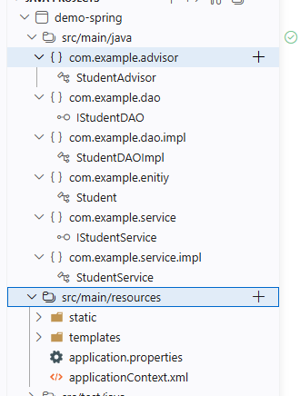

# spring

# 概念

[spring](https://spring.io/) 是一个开源的 Java 平台，用于构建企业级应用程序。它提供了许多模块和框架，以简化开发过程并提高应用程序的可维护性和可扩展性。
- **控制反转`IOC, Inversion of Control`** : 依赖注入`DI`机制的实现。通过将`java`对象的创建和管理交给`IOC`容器来完成，从而减少代码之间的耦合度
  - **`IOC` 容器** : 负责创建、管理和配置`Bean`对象，且能维护对象之间的依赖关系
  - **`Bean`** : `java` 类对象的抽象概念，通过 `IOC` 容器管理
  - **依赖注入`DI, Dependency Injection`** : 是一种设计模式，容器会检查 Bean 依赖了哪些其他 Bean，并将其注入进去（就是给其属性`new`依赖的对象）
- **面向切面编程`AOP, Aspect Oriented Programming`** : 装饰器模式的实现。能 `hook` 对象的方法，在方法执行前后插入自定义逻辑，如日志、事务管理等
  - **装饰器模式**：调用 `fcn()` 时，自动完成 `pre_fcn()` -> `fcn()` -> `post_fcn()` 的调用,通过 `pre_fcn()`, `post_fcn()` 实现 `fcn()` 的增强功能, 如日志、事务管理等

# 开发环境


# 开发环境

1. 使用 `Spring Initializr` 创建项目
2. 添加依赖
  - `spring web`
3. `pom.xml` 配置需要新增 `aspectjweaver` 依赖，用于支持 AOP 功能

```xml
	<dependencies>
        <!-- 必须添加这个，不然会编译失败 -->
		<dependency>
			<groupId>org.aspectj</groupId>
			<artifactId>aspectjweaver</artifactId>
		</dependency>

	</dependencies>
```

# 使用



1. 创建 `Stuendt` 实例

    ```java
    package com.example.enitiy;

    public class Student {
        private String name;
        private Integer age;

        public Student() {
        }

        public Student(String name, Integer age) {
            this.name = name;
            this.age = age;
        }

        public String getName() {
            return name;
        }
        public void setName(String name) {
            this.name = name;
        }
        public Integer getAge() {
            return age;
        }
        public void setAge(Integer age) {
            this.age = age;
        }
    }
    ```

2. 创建 `DAO` 层

    ```java
    package com.example.dao;

    import com.example.enitiy.Student;

    public interface IStudentDAO {
        public void saveStudent(Student student);
    }
    ```

    ```java
    package com.example.dao.impl;

    import com.example.dao.IStudentDAO;
    import com.example.enitiy.Student;

    public class StudentDAOImpl  implements IStudentDAO {
        @Override
        public void saveStudent(Student student) {
            // 模拟保存学生信息到数据库
            System.out.println("Student saved: " + student.getName());  
        }
    }
    ```

3. 创建 `Service` 层: 给外部访问的业务层
 
    ```java
    package com.example.service.impl;

    import com.example.dao.IStudentDAO;
    import com.example.enitiy.Student;
    import com.example.service.IStudentService;

    public class StudentService  implements IStudentService{
        private String name;

        // NOTE - 必须 setter 方法，否则 Spring 无法注入依赖
        public void setName(String name) {
            this.name = name;
        }

        private IStudentDAO studentDAO;

        // NOTE - 必须 setter 方法，否则 Spring 无法注入依赖
        public void setStudentDAO(IStudentDAO studentDAO) {
            this.studentDAO = studentDAO;
        }

        @Override
        public void save(Student student) {
            studentDAO.saveStudent(student);
        }
    }
    ```

4. 创建 `advisor` 层：实现 `AOP` 功能，即装饰器

    ```java
    package com.example.advisor;

    import java.lang.reflect.Method;

    import org.jspecify.annotations.Nullable;
    import org.springframework.aop.MethodBeforeAdvice;

    // pre 装饰器，方法执行前插入自定义逻辑
    public class StudentAdvisor implements MethodBeforeAdvice{

        @Override
        public void before(Method arg0, @Nullable Object[] arg1, @Nullable Object arg2) throws Throwable {
            System.out.println("Before method execution: " + arg0.getName());
        }

    }
    ```

5. 配置 `Spring` 容器，修改 `resource/applicationContext.xml` 文件

    ```xml
    <?xml version="1.0" encoding="UTF-8"?>
    <beans xmlns="http://www.springframework.org/schema/beans"
        xmlns:xsi="http://www.w3.org/2001/XMLSchema-instance"
        xmlns:context="http://www.springframework.org/schema/context"
        xmlns:mvc="http://www.springframework.org/schema/mvc"
        xmlns:aop="http://www.springframework.org/schema/aop"
        xsi:schemaLocation="
            http://www.springframework.org/schema/beans http://www.springframework.org/schema/beans/spring-beans.xsd
            http://www.springframework.org/schema/context http://www.springframework.org/schema/context/spring-context.xsd
            http://www.springframework.org/schema/mvc http://www.springframework.org/schema/mvc/spring-mvc.xsd
            http://www.springframework.org/schema/aop http://www.springframework.org/schema/aop/spring-aop.xsd">

        <bean id="dao" class="com.example.dao.impl.StudentDAOImpl" />

        <!-- 通过依赖注入，给 service 赋值 -->
        <bean id="service" class="com.example.service.impl.StudentService">
            <property name="name" value="Student Service" />
            <property name="studentDAO" ref="dao" />
        </bean>

        <!-- 配置 AOP -->
        <bean id="advisor" class="com.example.advisor.StudentAdvisor" />
        <aop:config>
            <!-- 定义切点，装饰器要 hook 哪些方法 -->
            <aop:pointcut id="serviceMethods" expression="execution(* *..service.impl.StudentService.*(..))" />
            <!-- 将切点与装饰器绑定 -->
            <aop:advisor advice-ref="advisor" pointcut-ref="serviceMethods" />
        </aop:config>
    </beans>
    ```

    匹配方法的表达式 `execution(* *..service.impl.StudentService.*(..))` 
    - `*` : 返回值类型
    - ` ` : 返回类型与方法名分隔符
    - 方法名包含了包路径与类名
      - `*..` : 包路径匹配，可以匹配任意包及其子包
      - `service.impl.` : 固定包路径
      - `StudentService.`: 类名
      - `*(..)` : 任意方法名，且任意参数列表

6. 调用

    ```java
    public class testStudentService {

        @Test
        public void testSave() {
            // 加载 Spring 容器
            @SuppressWarnings("resource")
            ApplicationContext ctx = new ClassPathXmlApplicationContext("applicationContext.xml");

            // 从容器中获取 Bean 对象, service 是 Bean 配置中的 id
            IStudentService service = (IStudentService) ctx.getBean("service");

            // 调用 save 方法
            service.save(new Student());
        }
        
    }
    ```
