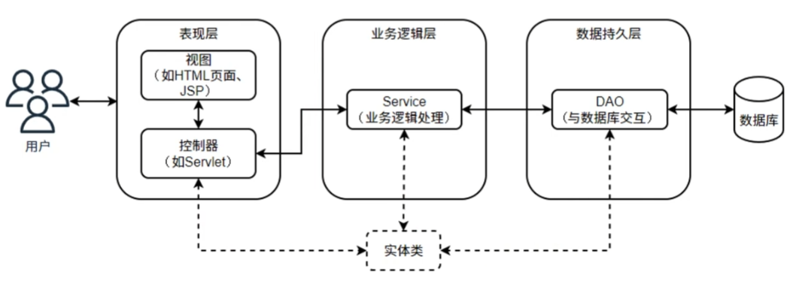
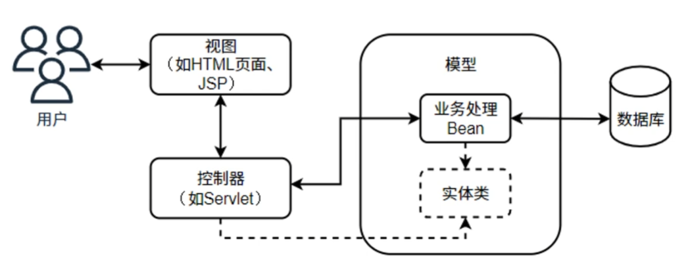
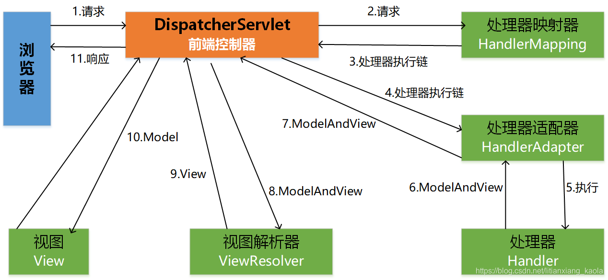
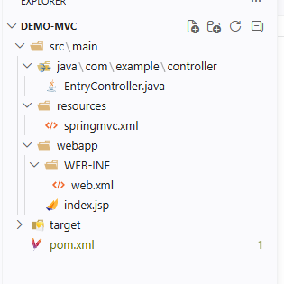

# springMVC

# 概念

## 简介

`SpringMVC`，即`spring web MVC`, 是 `Spring` 框架的一部分，用于构建基于 Web 的应用程序。它提供了一种基于 `MVC（Model-View-Controller）`模式的架构来组织代码。**实现上，`SpringMVC` 是对 `Servlet` 的封装**

## 三层架构



`jave web` 应用程序通常采用三层架构
- **表现层（Presentation Layer）** : 负责与用户交互，展示数据和接收用户输入
- **业务逻辑层（Business Logic Layer）**: 包含应用程序的核心逻辑，处理业务规则和数据操作
- **数据访问层（Data Access Layer）**: 负责与数据库进行交互，执行数据的增删改查操作

由于「表现层」的功能基本都是通用的（接收请求、发送响应、渲染界面等），因此，`SpringMVC` 将「表现层」的功能封装起来，开发者只需要关注业务逻辑和数据访问即可。

## MVC



经过 `SPringMVC` 封装后，三层架构可转为为 `MVC` 模式
- **View（视图）**：通常是与用户交互的 `web` 页面
- **Controller（控制器）**
  - **前端控制器**：基于 `servlet` 实现，主要接收请求、处理响应、转发请求给业务处理器、渲染视图等
  - **业务处理器**：处理真正的业务逻辑处理请求，**在框架中叫 `Controller`**
- **Model（模型）**
  - `pojo` 实体类，数据结构封装
  - `DAO` 层，负责数据访问和操作数据库

## 实现



`SpringMVC` 的心脏便是前端处理器 `DispatcherServlet` ，驱动所有流程执行，而开发的工作只需实现 `Handler` 访问 `Model` 完成处理业务，并返回 `ModelAndView` 即可。


# 开发环境

1. 使用 `maven` 的 `maven-archetype-webapp` 创建 `war` 项目
2. `pom.xml` 添加依赖
    ```xml

        <!-- springmvc 框架 -->
        <dependency>
            <groupId>org.springframework</groupId>
            <artifactId>spring-webmvc</artifactId>
            <version>5.3.18</version>
        </dependency>

        <!-- servlet 框架 -->
        <dependency>
            <groupId>javax.servlet</groupId>
            <artifactId>javax.servlet-api</artifactId>
            <version>4.0.1</version>
            <scope>provided</scope>
        </dependency>
    ```
3. 准备好 `tomcat` 服务器用于测试, **`tomcat` 与 `spring` 有版本对应关系，不能乱下载**

# 使用




1. 定义业务处理器

    ```java
    package com.example.controller;

    import javax.servlet.http.HttpServletRequest;
    import javax.servlet.http.HttpServletResponse;

    import org.springframework.web.servlet.ModelAndView;
    import org.springframework.web.servlet.mvc.Controller;

    public class EntryController implements Controller {

        @Override
        public ModelAndView handleRequest(HttpServletRequest arg0, HttpServletResponse arg1) throws Exception {
            ModelAndView mv = new ModelAndView("index"); 
            return mv;
        }

    }
    ```

2. 配置 `springmvc.xml` 路由

    ```xml
    <?xml version="1.0" encoding="UTF-8"?>
    <beans xmlns="http://www.springframework.org/schema/beans"
        xmlns:xsi="http://www.w3.org/2001/XMLSchema-instance"
        xmlns:mvc="http://www.springframework.org/schema/mvc"
        xsi:schemaLocation="
            http://www.springframework.org/schema/beans
            http://www.springframework.org/schema/beans/spring-beans.xsd
            http://www.springframework.org/schema/mvc
            http://www.springframework.org/schema/mvc/spring-mvc.xsd">

        <!-- 注册 controller -->
        <bean class="org.springframework.web.servlet.handler.BeanNameUrlHandlerMapping" />

        <!-- 指定路由 -->
        <bean id="/hello" class="com.example.controller.EntryController" />

        <!-- view 前缀、后缀过滤，"index" 组合后就是 "/index.jsp" -->
        <bean class="org.springframework.web.servlet.view.InternalResourceViewResolver">
            <property name="prefix" value="/" />
            <property name="suffix" value=".jsp" />
        </bean>
    </beans> 
    ```
3. `webapp` 配置

    ```xml
    <?xml version="1.0" encoding="UTF-8"?>
    <web-app xmlns="http://xmlns.jcp.org/xml/ns/javaee"
            xmlns:xsi="http://www.w3.org/2001/XMLSchema-instance"
            xsi:schemaLocation="http://xmlns.jcp.org/xml/ns/javaee
                                http://xmlns.jcp.org/xml/ns/javaee/web-app_4_0.xsd"
            version="4.0">

        <display-name>Archetype Created Web Application</display-name>

        <!-- 配置 servlet -->
        <servlet>
            <servlet-name>springmvc</servlet-name>
            <servlet-class>org.springframework.web.servlet.DispatcherServlet</servlet-class>

            <!-- 根据 springmvc.xml 初始化 servlet  -->
            <init-param>
                <param-name>contextConfigLocation</param-name>
                <param-value>classpath:springmvc.xml</param-value>
            </init-param>

            <!-- 加载完成 -->
            <load-on-startup>1</load-on-startup>
        </servlet>

        <!-- 配置跟目录映射 -->
        <servlet-mapping>
            <servlet-name>springmvc</servlet-name>
            <url-pattern>/</url-pattern>
        </servlet-mapping>
    </web-app>
    ```