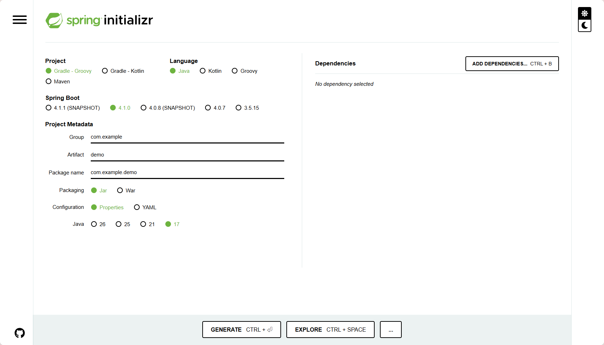

# SpringBoot

# 概念

`Spring Boot` 是一个用于简化 `Spring Framework` 开发的框架。它提供了自动配置、起步依赖和运行时支持，使得开发者可以快速构建独立的、生产级别的 `Spring` 应用程序。
- **自动化配置**： `Spring Framework` 中许多的 `xml` 配置自动生成
- **起步依赖**：提供 `spring-boot-starter-*` 等依赖包，简化了项目的依赖管理，**`Spring Initializr` 构建项目就在使用**
- **嵌入式服务器** : 提供了 `Tomcat`, `Jetty`, `Undertow` 等嵌入式服务器，**直接输出`jar` 包，可命令行启动**


# hello world

1. 使用 `Spring Initializr` 创建项目，选择 `jar` 包
2. 添加依赖
  - `spring web`
3. `pom.xml` 配置中已经自动配置好了**起步依赖**
    ```xml
        <parent>
            <!-- 通过 dependencyManagement 定义了许多包，这些包都不用考虑兼容性问题 -->
            <groupId>org.springframework.boot</groupId>
            <artifactId>spring-boot-starter-parent</artifactId>
            <version>4.0.7</version>
            <relativePath/> <!-- lookup parent from repository -->
        </parent>

        <dependencies>
            <dependency>
                <groupId>org.springframework.boot</groupId>
                <artifactId>spring-boot-starter-webmvc</artifactId>
            </dependency>

            <dependency>
                <groupId>org.springframework.boot</groupId>
                <artifactId>spring-boot-starter-webmvc-test</artifactId>
                <scope>test</scope>
            </dependency>
        </dependencies>

        <build>
            <plugins>
                <plugin>
                    <groupId>org.springframework.boot</groupId>
                    <artifactId>spring-boot-maven-plugin</artifactId>
                </plugin>
            </plugins>
        </build>
    ```

4. 在 `com.example.demo` 创建入口类，固定写法

    ```java
    package com.example.demo;

    import org.springframework.boot.SpringApplication;
    import org.springframework.boot.autoconfigure.SpringBootApplication;

    // @SpringBootApplication 注解，表示这是一个 Spring Boot 应用程序的入口类，包含了自动配置和组件扫描等功能。**默认只扫描入口类所在包及其子包，所以要放在 `com.example.demo.controller` 包的上一级**
    @SpringBootApplication
    public class DemoSpringbootApplication {

        public static void main(String[] args) {
            System.setProperty("server.port", "8081");
            SpringApplication.run(DemoSpringbootApplication.class, args);
        }

    }
    ```

5. 在 `com.example.demo.controller` 创建一个控制器类，**利用注解实现了`SpringMVC`的功能，大大简化`xml`配置**

    ```java
    package com.example.demo.controller;

    import org.springframework.web.bind.annotation.RequestMapping;
    import org.springframework.web.bind.annotation.RestController;

    // 使用@RestController 注解，表示这是一个控制器类，并且返回的数据是 JSON 格式
    @RestController
    public class HelloController {
        // 使用@RequestMapping 注解，表示当访问 /hello 路径时，会调用这个方法，并返回 "Hello, World!" 字符串
        @RequestMapping("/hello")
        public String hello() {
            return "Hello, World!";
        }
    }
    ```

6. 直接运行项目，然后在浏览器中访问 `http://localhost:8081/hello`，就可以看到 `Hello, World!` 的输出。

# Spring Initializr

[Spring Initializr](https://start.spring.io/) 是一个用于创建 `Spring Boot` 项目的在线工具。它提供了多种配置选项，如项目类型、语言、依赖等，可以根据需要进行选择。生成的项目结构和代码已经包含了 `Spring Boot` 的自动配置和起步依赖，可以快速上手开发。



**但是想在`IDE`中使用，必须保证网络能访问 `https://start.spring.io` 或者有镜像网站。如果内网无法访问只有`maven`镜像仓库，就只能在网页上配置，然后下载初始化项目工程。**


