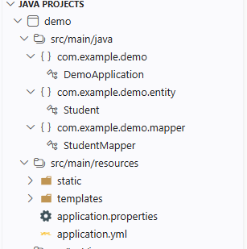
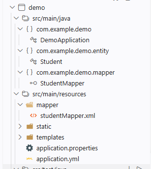

# Springboot - Mybatis

# 概述

通过 `Spring Boot` 和 `MyBatis` 的结合，跟方便的完成数据库操作
- 简单功能，使用注解简化开发，跳过 `XML` 配置文件
- 复杂功能，仍然使用 `XML` 配置文件进行灵活配置
- 系统配置，使用 `application` 进行统一管理


# 开发环境

1. 使用 `Spring Initializr` 创建项目，**一定要选择 `< 4.0.10` 的版本**
2. 添加依赖
  - `spring web`
  - `MyBatis Framework`
  - `Sqlit JDBC Driver` : 也可以换其他数据，如 `PostgreSQL`、`MySQL` 等。

3. 提前准备好数据库 `database/test.db`

    ```sql
    CREATE TABLE student (id INTEGER PRIMARY KEY AUTOINCREMENT,
                            username TEXT NOT NULL, 
                            age INTEGER);

    INSERT INTO student (username, age) VALUES ('sam', 18);
    INSERT INTO student (username, age) VALUES ('zelda', 16);
    INSERT INTO student (username, age) VALUES ('link', 16);
# 注解实现




1. 配置 `application.yml`

    ```yaml
    spring:
    datasource:
        url: jdbc:sqlite:database/test.db
        driver-class-name: org.sqlite.JDBC
    ```
2. 创建实体类 `Student.java`

    ```java
    package com.example.demo.entity;

    public class Student {
        private String username;
        private Integer age;
        private Integer id;

        public Student(String username, Integer age, Integer id) {
            this.username = username;
            this.age = age;
            this.id = id;
        }

        @Override
        public String toString() {
            return "Student{" +
                    "username='" + username + '\'' +
                    ", age=" + age +
                    ", id=" + id +
                    '}';
        }

        public String getUsername() {
            return username;
        }
        public void setUsername(String username) {
            this.username = username;
        }
        public Integer getAge() {
            return age;
        }
        public void setAge(Integer age) {
            this.age = age;
        }
        public Integer getId() {
            return id;
        }
        public void setId(Integer id) {
            this.id = id;
        }
    }
    ```

3. 创建 **`Mapper` 接口** `StudentMapper.java`

    ```java
    package com.example.demo.mapper;

    import java.util.List;

    import org.apache.ibatis.annotations.Mapper;
    import org.apache.ibatis.annotations.Select;
    import org.springframework.stereotype.Repository;

    import com.example.demo.entity.Student;

    @Mapper         // mapper 接口，MyBatis 会自动扫描并注册为 Bean
    @Repository     // 标记为 Repository 层，方便 Spring 扫描管理
    public interface StudentMapper {  // NOTE - 是接口，不是类

        @Select("SELECT * FROM student")
        List<Student> getAll();
    }
    ```

4. 调用测试

    ```java
    @SpringBootTest         // 启动测试类，加载 Spring 上下文
    public class testStudent {

        @Autowired   // 通过 bean 自动注入 Mapper 接口
        private StudentMapper studentMapper;

        @Test
        public void testGetAll() {
            List<Student> list = studentMapper.getAll();
            for (Student student : list) {
                System.out.println(student);
            }
        }
    }
    ```

# XML 配置实现



1. 配置 `application.yml`

    ```yaml
    spring:
      datasource:
        url: jdbc:sqlite:database/test.db
        driver-class-name: org.sqlite.JDBC
    mybatis:
      mapper-locations: classpath:mapper/*Mapper.xml  # 指定 mapper 配置路径
    ```
2. 创建实体类 `Student.java`

    ```java
    package com.example.demo.entity;

    public class Student {
        private String username;
        private Integer age;
        private Integer id;

        public Student(String username, Integer age, Integer id) {
            this.username = username;
            this.age = age;
            this.id = id;
        }

        @Override
        public String toString() {
            return "Student{" +
                    "username='" + username + '\'' +
                    ", age=" + age +
                    ", id=" + id +
                    '}';
        }

        public String getUsername() {
            return username;
        }
        public void setUsername(String username) {
            this.username = username;
        }
        public Integer getAge() {
            return age;
        }
        public void setAge(Integer age) {
            this.age = age;
        }
        public Integer getId() {
            return id;
        }
        public void setId(Integer id) {
            this.id = id;
        }
    }
    ```

3. 创建 **`Mapper` 接口** `StudentMapper.java`

    ```java
    package com.example.demo.mapper;

    import java.util.List;

    import org.apache.ibatis.annotations.Mapper;
    import org.apache.ibatis.annotations.Select;
    import org.springframework.stereotype.Repository;

    import com.example.demo.entity.Student;

    @Mapper         // mapper 接口，MyBatis 会自动扫描并注册为 Bean
    @Repository     // 标记为 Repository 层，方便 Spring 扫描管理
    public interface StudentMapper {  // NOTE - 是接口，不是类
        List<Student> getAll();
    }
    ```

4. 创建 **`XML` 配置文件** `StudentMapper.xml`

    ```xml
    <?xml version="1.0" encoding="UTF-8"?>
    <!DOCTYPE mapper PUBLIC "-//mybatis.org//DTD Mapper 3.0//EN" "https://mybatis.org/dtd/mybatis-3-mapper.dtd">
    <mapper namespace="com.example.demo.mapper.StudentMapper">
        <select id="getAll" resultType="com.example.demo.entity.Student">
            SELECT * FROM student
        </select>
    </mapper>
    ```

5. 调用测试

    ```java
    @SpringBootTest         // 启动测试类，加载 Spring 上下文
    public class testStudent {

        @Autowired   // 通过 bean 自动注入 Mapper 接口
        private StudentMapper studentMapper;

        @Test
        public void testGetAll() {
            List<Student> list = studentMapper.getAll();
            for (Student student : list) {
                System.out.println(student);
            }
        }
    }
    ```
