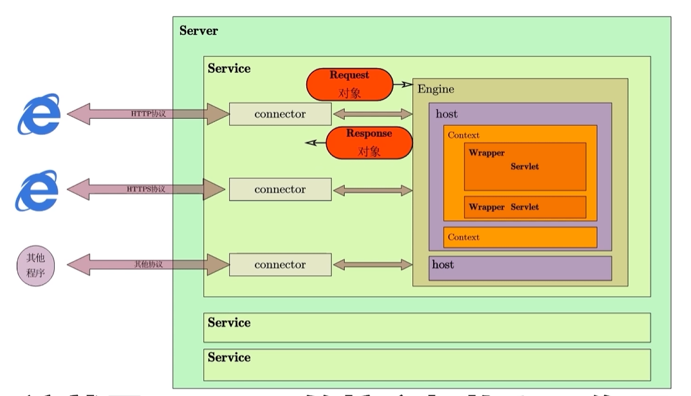

# tomcat

# 介绍

[Tomcat](https://tomcat.apache.org/) 是一个开源的 `Java Servlet` 容器，用于运行 `Java Web` 应用程序。它实现了 `Java Servlet` 规范和 `JavaServer Pages (JSP)` 规范，并提供了对 `HTTP` 协议的支持
- `Java Web` 应用程序: 后端网络服务，现代前后端分离架构中，主要用于提供 `Restful API` 接口服务，成果物为 `war` 包
- `Servlet`: Java 编写的服务器端组件，用于处理客户端请求并生成响应
- `JSP`: Java 编写的动态网页技术，最终会被翻译为 `html`, **已经被淘汰**

目录结构

```
.
├── bin                     tomcat 程序
│   ├── shutdown.bat        关闭服务
│   ├── shutdown.sh
│   ├── startup.bat         启动服务
│   └── startup.sh
├── conf                    配置文件
│   ├── context.xml
│   ├── server.xml           服务关键配置
│   ├── tomcat-users.xml
│   ├── tomcat-users.xsd
│   └── web.xml
├── lib
├── logs
├── temp
├── webapps                 tomcat 管理的 web 程序
└── work
```

# webapp 部署

1. 下载 [Tomcat](https://tomcat.apache.org/) 安装包
2. 解压安装包到指定目录
3. 使用 `bin/startup.sh` 脚本启动 Tomcat 服务
4. 访问 `http://localhost:8080` 验证是否成功部署
5. 部署 `war` 包到 `webapps` 目录下，Tomcat 会自动解压并部署应用
6. 访问 `http://localhost:8080/<包名>` 就能访问 `war` 包中的内容
7. 使用 `bin/shutdown.sh` 脚本关闭 Tomcat 服务

> [!note]
> `Tomcat` 与框架可能存在兼容性问题，不能随便使用，需要根据项目需求选择合适的版本


# 工作原理


```xml
<?xml version="1.0" encoding="UTF-8"?>
<Server port="8005" shutdown="SHUTDOWN">

  <Listener className="org.apache.catalina.startup.VersionLoggerListener" />
  <Listener className="org.apache.catalina.core.AprLifecycleListener" />
  <Listener className="org.apache.catalina.core.JreMemoryLeakPreventionListener" />
  <Listener className="org.apache.catalina.mbeans.GlobalResourcesLifecycleListener" />
  <Listener className="org.apache.catalina.core.ThreadLocalLeakPreventionListener" />


  <GlobalNamingResources>
    <Resource name="UserDatabase" auth="Container"
              type="org.apache.catalina.UserDatabase"
              description="User database that can be updated and saved"
              factory="org.apache.catalina.users.MemoryUserDatabaseFactory"
              pathname="conf/tomcat-users.xml" />
  </GlobalNamingResources>

  <Service name="Catalina">

    <Connector port="8081" protocol="HTTP/1.1"
               connectionTimeout="20000"
               redirectPort="8443"
               maxParameterCount="1000"
               />
  
    <Engine name="Catalina" defaultHost="localhost">
      <Realm className="org.apache.catalina.realm.LockOutRealm">
        <Realm className="org.apache.catalina.realm.UserDatabaseRealm"
               resourceName="UserDatabase"/>
      </Realm>

      <Host name="localhost"  appBase="webapps"
            unpackWARs="true" autoDeploy="true">
        <Valve className="org.apache.catalina.valves.AccessLogValve" directory="logs"
               prefix="localhost_access_log" suffix=".txt"
               pattern="%h %l %u %t &quot;%r&quot; %s %b" />

      </Host>
    </Engine>
  </Service>
</Server>
```

`Tomcat` 的 `server.xml` 配置文件，对应的就是其工作框架结构



- `server` : 就是 `Tomcat` 实例，仅此一个
  - `Service` : 对外提供服务
    - `Connector`: 连接器，监听网络端口，获取网络请求，封装 `request` 对象并传递给 `Engine` 处理，然后解析返回的 `response` 对象，生成通信协议响应
    - `Engine`: 引擎
      - `Host` : 虚拟主机,即 `webapps`，分发请求给应用处理
        - `Context`: 应用，即 `webapps/<war_package>` ，`war` 解压后的内容

