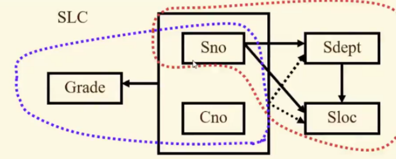

# 数据库设计

- [数据库设计](https://zhuanlan.zhihu.com/p/412909586)

# 设计流程

数据库设计分 6 个阶段：
- 需求分析
- 概念结构设计 : 将需求转换为 E-R 模型
- 逻辑结构设计 : 将 E-R 模型转为关系模式，然后应用规范化理论
- 物理结构设计
- 数据库实施
- 数据库运行和维护

# 通用规范

1. 主键都应当为自增的 `unsigned bigint` 类型
2. 字段命名由小写字母、下划线、数字，例如 `user_info`
3. **不要使用外键、触发器，编码一时爽，维护火葬场。**
4. 每张表必须有 `create_time`、`update_time`、`create_by`、`update_by` 字段，方便问题追溯
5. 使用 `is_deleted` 字段标记删除，不要真的删除数据
6. 避免使用 `NULL`，不利于优化，使用默认值代替
7. 单表超过 500 万行、或容量超过 `2GB`，才考虑分库分表

# E-R 设计

## 概念

- **实体集/实体型** ： 表示一类数据
- **实体** ： 具体的单条数据
- **属性** ： 实体中的字段
- **联系** ： 实体与实体之间的关系
- **联系的度** ： 参与联系关系讨论的实体集数量


## 联系类型

### 两个实体集

- **一对一 `1:1`**

**定义** ： 如果对于实体集 A 中的每一个实体，实体集 B 中至多有一个（也可以没有）实体与之联系，反之亦然，则称实体集 A 与实体集 B 具有一对一联系，记为 `1:1`。

例如，班级 (实体集) 与班主任（实体集）的关系 ，而一个班主任（实体）只在一个班级（实体）中任职，班级与班主任之间具有一对一联系

- **一对多 `1:n`**

**定义** ： 如果对于实体集 A 中的每一个实体，实体集 B 中有 n 个实体与之联系，反之，对于实体集 B 中的每一个实体，实体集 A 中至多只有一个实体与之联系，则称实体集 A 与实体集 B 有一对多联系，记为 `1:n`。

例如，班级 (实体集) 与学生 (实体集) 的关系，一个班级中有若干名学生，而每个学生只在一个班级中学习。

- **多对多 `m:n`**

**定义** ： 如果对于实体集 A 中的每一个实体，实体集 B 中有 n 个实体与之联系，反之，对于实体集 B 中的每一个实体，实体集 A 中也有 m 个实体与之联系，则称实体集 A 与实体集 B 具有多对多联系，记为 `m:n`。

例如，课程与学生的关系，一门课程同时有若干个学生选修，而一个学生可以同时选修多门课程。


### 多个实体集

两个以上的实体型之间也存在着一对一、一对多、多对多联系。

**一对多** : 对于课程、教师与参考书三个实体集，如果一门课程可以有若干个教师讲授，使用若干本参考书，而每一个教师只讲授一门课程，每一本参考书只供一门课程使用，则课程与教师、参考书之间的联系是一对多的，如图(a)所示。

**多对多** : 有三个实体集：供应商、项目、零件，一个供应商可以供给多个项目多种零件，而每个项目可以使用多个供应商供应的零件，每种零件可由不同供应商供给，由此看出供应商、项目、零件三者之间是多对多的联系，如图(b)所示。


### 单实体集

单实体集内的各实体之间也可以存在一对一、一对多、多对多联系。


**案例** : 职工 (实体集) 内部领导与员工的联系，一个员工对应一个领导，一个领导可以带领多个员工。


## E-R 图

### 规则

`E-R`图提供了表示实体集、属性和联系的方法
- **实体集**：用矩形表示，矩形框内写明实体名。
- **属性**：用椭圆形表示，并用无向边将其与相应的实体型连接起来。
- **联系**：用菱形表示，菱形框内写明联系名，并用无向边分别与有关实体型连接起来，同时在无向边旁标上联系的类型 `1:1、1:n 、m:n`。

### 案例

某个工厂物资管理的概念模型。物资管理涉及的实体有
- 仓库：属性有仓库号、面积、电话号码
- 零件：属性有零件号、名称、规格、单价、描述
- 供应商：属性有供应商号、姓名、地址、电话号码、账号
- 项目：属性有项目号、预算、开工日期
- 职工：属性有职工号、姓名、年龄、职称

实体间的联系
- 一个仓库可以存放多种零件，一种零件可以存放在多个仓库中，因此仓库和零件具有多对多的联系。用库存量来表示某种零件在某个仓库中的数量。
- 一个仓库有多个职工当仓库保管员，一个职工只能在一个仓库工作，因此仓库和职工之间是一对多的联系。
- 职工之间具有领导与被领导关系，即仓库主任领导若干保管员，因此职工实体型中具有一对多的联系。
- 供应商、项目和零件三者之间具有多对多的联系，即一个供应商可以供给若干项目多种零件，每个项目可以使用不同供应商供应的零件，每种零件可由不同供应商供给。


## 优化

### 实体与属性

> 为了简化 E-R 图，**能作为属性对待的，尽量作为属性对待**
> 1. 属性必须是不可分的数据项，不能包含其他属性
> 2. 属性不能与其他实体具有联系，即 E-R 图中所表示的联系是实体之间的联系

**案例1** : 拆分属性

职工是一个实体，职工号、姓名、年龄是职工的属性
- 职称若没有与工资、福利挂钩，即没有需要进一步描述的特性，则根据准则（1）可以作为职工实体的属性
- 不同的职称有不同的工资、住房标准和不同的附加福利，则职称作为一个实体更恰当


**案例2** : 属性与其他实体有联系

在医院中，一个病人只能住在一个病房，病房号可以作为病人实体的一个属性； 如果病房还要与医生实体发生联系，即一个医生负责几个病房的病人的医疗工作，则根据准则（2）病房应作为一个实体。


### E-R 图集成

> E-R 图的集成一般需要分两步：
> 1. **冲突合并**: 解决各 E-R 子图之间的冲突，将 E-R 子图合并起来生成初步 E-R 图。
> 2. **消除冗余** : 消除不必要的冗余，生成基本 E-R 图。


#### 冲突合并

E-R 子图之间的冲突主要有

- **属性冲突** : 同一属性的值的类型、取值范围、取值集合、单位等不一致
- **命名冲突** :  E-R 图上元素重命名
- **结构冲突**
  - 某一属性在另外一张 E-R 子图是实体集
  - 同一实体集在不同 E-R 子图中属性不一致
  - 实体间的联系在不同的 E-R 子图上不一致

**案例** 


图(a)中零件与产品之间存在多对多的联系「构成」


图(b)中产品、零件与供应商三者之间还存在多对多的联系「供应」


「构成」与「供应」是不同的关系，不能合并，需要单独表示。

#### 分析法


1. 图中 $Q_3$ 可以通过 $Q_1$ 与 $Q_2$ 计算得到，即 $Q_3 = Q_1 \times Q_2$，因此，属性「用量 $Q_3$」可以是冗余的，同时产品与材料的「使用」关系也可以删除
2. $Q_4$ 可以通过 $Q_5$ 计算得到，因此，$Q_4$ 也是冗余的


# 规范化理论


## 概念

- **关系** : 一张二维表
- **关系模式** ： 关系的定义

    ```txt

    R (U, D, DOM, F)

    R : 关系名
    U : 该关系属性集合
    D : U 中属性所来自的域
    DOM : 属性向域映射的集合
    F : 属性间依赖关系的集合 
    ```

- **关系数据库** ： 基于关系模型的数据库，**实现上是一组关系的集合**
- **完整性约束** : 对属性值的约束，例如取值范围、默认值
- **数据依赖** ： 定义「属性间」的依赖关系
  - 函数依赖 `FD (Functional Dependency)`
  - 多值依赖 `MVD (Multivalued Dependency)`
  - 连接依赖 

## 关系模式转换

E-R 图转换成关系模式的步骤

1. 实体集转换
   - 每个实体集对应一个关系模式（表）
   - 实体集属性对应关系模式的属性（表字段）
   - 实体标识符号对应关系模式的键/码（主键）
2. 二元联系转换:
   - `1:1` :  关系模式 A 与 关系模式 B 中选择一个关系模式，假设选择 A （ **尽量选择数量少的一方**），且将 B 的键与「联系」的属性都添加到 A 的属性中。
   - `1:n` : 将 1 端关系模式的键与「联系」的属性都添加到 n 端的属性中
   - `n:m` : 将「联系」也转换为关系模式 C，其属性包含两端的键、联系的属性，且 C 的键为两端键的组合
3. 一元联系转换：假设是关系模式一样的二元联系，即关系模式 A 与 关系模式 A，处理方式同二元
4. 多元联系转换：将「联系」转换为关系模式，处理方式同二元的 `n:m`


## 问题描述

现在我们建立一个描述学校教务的数据库，该数据库涉及的数据有
- 学号(Sno)
- 所在系 (Sdept)
- 系主任姓名 (Mname)
- 课程名 (Cname)
- 成绩 (Grade)

其关系模型可描述为

```txt
EducationSystem(sno, sdept, mname, cname, grade)
```

该模型存在以下问题
1. 数据冗余 : 当一个学生选修多门课程就会出现数据冗余
2. 更新异常 : 系主任变化时，需要查找到旧的系主任，然后全量更新
3. 插入异常 : 若新开课程，无学生选择，则无法录入数据库
4. 删除异常 : 学生毕业，清理数据库，则所有信息都会被清掉

产生上述问题的主要原因便是「数据依赖」存在问题。

> [!note]
> 规范化理论的作用便是优化「关系模型」解决「数据依赖」导致的数据冗余、更新异常、插入异常、删除异常等问题。

## 函数依赖

### 定义

**函数依赖** ： 定义属性集 $U$ 的关系模式 $R(U)$，且 $X, Y$ 是 $U$ 的子集，$r$ 是 $R(U)$ 的一个关系。从 $r$ 任意选择两个元组（表中两行数据），若两个元组在 $X$ 中属性值相等，在 $Y$ 中属性值肯定相等，则称「$X$ 决定 $Y$」或 「$Y$ 依赖 $X$」，标记为 $X \rightarrow Y$，且 $X$ 被称之为「决定属性集」


**案例** 

```txt
Student(no, name, sex, age)
```

假设 'name' 不会重名，则存在的函数依赖有

```txt
no -> name, no -> sex , no -> age
name -> no, name -> sex , name -> age
```

### 平凡与非平凡

在关系模式 $R(U)$ 中， $X, Y$ 是 $U$ 的子集
- 若 $Y \not \subseteq X$，则 $X \rightarrow Y$ 是非平凡的函数依赖
- 若 $Y \subseteq X$，则 $X \rightarrow Y$ 是平凡的函数依赖

**案例**

```txt
SC(Sno, Cno, Grade)

非平凡：  (sno, cno) -> grade 
平凡:   (sno, cno) -> sno , (sno, cno) -> cno
```

> [!note]
> 着重探讨 **非平凡函数依赖**

### 完全与部分

在关系模式 $R(U)$ 中， $X, Y$ 是 $U$ 的子集
- 若 $X' \subset X$，满足 $ X' \not \rightarrow Y $，则 $\overset{f}{X \rightarrow Y}$  是完全依赖
- 若 $X' \subset X$，不满足 $ X' \not \rightarrow Y $，则 $\overset{p}{X \rightarrow Y}$  是部分依赖


**案例**

```txt
Student(no, name, sex, dept)

name 不重名

完全 ： no -> dept , name -> dept
部分 : (no, name) -> dept
```

### 传递

在关系模式 $R(U)$ 中， $X, Y, Z$ 是 $U$ 的子集，若 $X \rightarrow Y, Y \rightarrow Z$，且 $Y \not \subseteq X, Y \not \rightarrow X$，则 $Z$ 传递依赖于 $X$


**案例**

```txt
Student(no, dept, dept_teacher)

no -> dept , dept -> dept_teacher

dept_teacher 传递依赖于 no
```


### 码

在关系模式 $R(U,F)$ 中，$K$ 为 $R$ 中的属性或属性组合 
- **候选码** ： $\overset{f}{K \rightarrow U}$，则 $K$ 为 $R$ 的候选码
- **主码** ：从候选码中选一个，即主键


## 范式

### 介绍

**范式(Normal Form)** : 评价构建的关系模式能够达到什么标准


关系模式 $R$ 满足第 $n$ 范式，记作 $ R \in nNF$

### 1NF

> **定义** ： 关系模式 $R$ 中的所有属性都不可再分

**案例** : 一个学生就属于一个系，每个系的学生住在同一个宿舍楼，一个学生学的每一门课程都有唯一的成绩。

```txt
SLC(Sno, Sdept, Sloc, Cno, Grade)
```

### 2NF

> **定义** ： 关系模式 $R \in 1NF$，且每一个非主属性都「完全函数依赖」于 $R$ 的码 


满足 $1NF$ 只是表明可以使用关系模式来进行数据存储，但还存在实现问题

```txt
所有函数依赖:

Sno → Sdept，Sdppt → Sloc，(Sno, Cno) → Grade

提取码：

(Sno, Cno) → Sno , (Sno, Cno) → Sdept
(Sno, Cno) → Sloc, (Sno, Cno) → Cno
```

**该关系模式只能选择 `(sno, cno)` 作为「码」，但码存在「部分函数依赖」，因此会导致四类问题。解决方案「拆分」**



```txt
SL (sno, sdept, sloc)

码 ： sno
完全依赖 ： sno -> sdept, sno -> sloc

SC (sno, cno, grade)

码 : (sno, cno)
完全依赖 ： (sno, cno) -> grade
```


### 3NF

> **定义** ：关系模式 $R \in 1NF$，且不存在「非主属性」对「码」的「传递依赖」。


虽然 `SL` 与 `SC` 均满足 $2NF$，但是 `SL` 还是存在问题

```txt
sno -> sdept , sdept -> sloc
```

**由于 `sloc` 传递依赖于 `sno` ，即在一个关系模型描述了 `sdept、sloc` 与 `sno、sdept、sloc` 两种关系模型** ，因此同样会导致四类问题。**解决方案同样是「拆分」，消除传递依赖**

```txt
SD (sno, sdept)
DL (sdept, sloc)
```

最终得到满足 $3NF$ 的模型

```txt
SC (sno, cno, grade)
SD (sno, sdept)
DL (sdept, sloc)
```


### BCNF

> **定义** : 关系模式 $R \in 1NF$，对于 $R$ 中的每一个函数依赖 $X \rightarrow Y, Y \not \subset X$，则 $X$ 中必定包含候选码


满足 $BCNF$ 的关系模式存在以下性质
- 非主属性 $\overset{f}{\rightarrow}$ 候选码
- 主属性 $\overset{f}{\rightarrow}$ 非主属性的候选码
- 属性 $\not  \overset{f}{\rightarrow}$ 非码属性

> [!note]
> 只要达到 $BCNF$ ，关系模式就完全消除了 「插入异常」与「删除异常」的问题


**案例**

描述学生、老师、课程的关系模型

```txt
STC (S, T, C)
```
假设每一个老师只教一门课，一门课可能存在多个老师
- 学生选择某个老师，就能确定是哪门课
- 学生选择某门课，就能固定下一个老师

```txt
T -> C
(S, C) -> T
(S, T) -> C
```

根据函数依赖可知，候选码有 `(S, C)` 和 `(S,T)`，因此该模型满足 $BCNF$

## 关系模式规范化


### 定义

**关系模式规范化** ： 通过「关系模式分解」，将关系模式转换为多个更高一级范式的关系模式，该转换过程被称之为关系模式规范化。通过规范化可解决数据冗余、更新异常、插入异常、删除异常等问题。

规范化步骤
- $1NF \rightarrow 2NF$ : 消除非主属性对码部分函数依赖
- $2NF \rightarrow 3NF$ : 消除非主属性对码的传递函数依赖
- $3NF \rightarrow BCNF$ : 消除非主属性对码的部分函数依赖、传递函数依赖
- $BCNF \rightarrow 4NF$ : 消除非平凡且非函数依赖的多值依赖
- $4NF \rightarrow 5NF$ : 消除非候选码所蕴含的连接依赖

> [!note]
> 按需进行规范化，不是层级越高越好，满足需求了就停止。**但最好达到 $3NF$ 或 $BCNF$**


### 关系模式分解


关系模式分解的标准
- **无损连接** ：拆后得到的关系模式通过自然合并，能还原回原数据（多了、少了都不行）
- **保持函数依赖** ： 原关系模式的函数依赖在分解后仍保持


