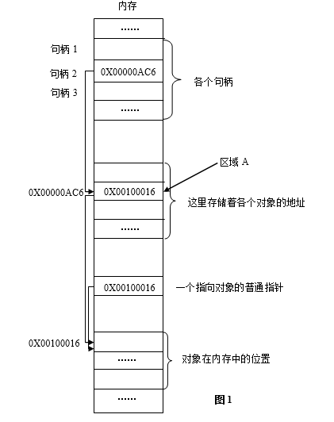

# 句柄

# 资源管理

## 内核资源共用


内核管理系统资源，对于系统资源结构描述的数据结构内存占用可能十分大。当进程去使用系统资源时，不可能一个进程就生成一个资源描述数据结构。内核里就放了一个公共点资源数据结构，每个进程要使用这个资源时，就向系统申请使用该结构。

**获取这个数据结构可以通过指针来获取，但是指针存在如下问题：**

1. 暴露了内核对象本身，使得程序（而不是操作系统内核）也可以任意地修改对象地内部状态；
2. 操作系统有定期整理内存的责任，如果一些内存整理过一次后，对象被搬走了怎么办？由于操作系统采用了虚拟内存的机制，当进程空闲时，会被放到磁盘的交换区里，等待下次要使用时，又调回内存。当调回内存时，内存地址就发生了改变，指针引用就完蛋了。

## 句柄机制



1. 每个进程会有一张“句柄表”，用来存储句柄
2. 句柄指向的是地址放入了真实对象的指针
3. 当对象位置发生变化时，就会更新句柄指向的对象指针


# 句柄定义

句柄（handle）是C++程序设计中经常提及的一个术语。它并不是一种具体的、固定不变的数据类型或实体，而是代表了程序设计中的一个广义的概念。句柄一般是指获取另一个对象的方法——一个广义的指针，它的具体形式可能是一个整数、一个对象或就是一个真实的指针，而它的目的就是建立起与被访问对象之间的唯一的联系。

> [!note]
> - 句柄的类型为 `void *`，本质上就是一个整型变量
> - 句柄只能是创建者拥有，只有创建者才能通过句柄访问句柄标记的对象。

**程序中句柄使用案例：**

```cpp
void * handle = nullptr;

int create_handle(void ** handle)
{
    Asset * asset = new Asset();
    *handle = asset;
}

int operate_handle(void * handle)
{
    // 还原句柄
    Asset * asset = (Asset*) handle;
    ....
}

int destroy_handle(void ** handle)
{
    // 还原句柄
    Asset * asset = (Asset*) *handle;
    delete asset;
    *handle = nullptr;
}

```