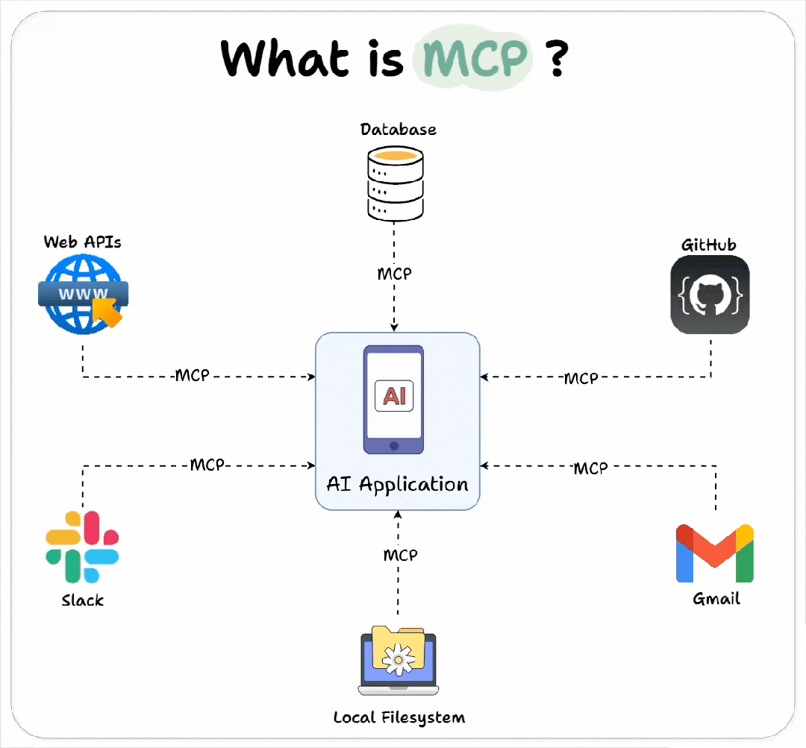
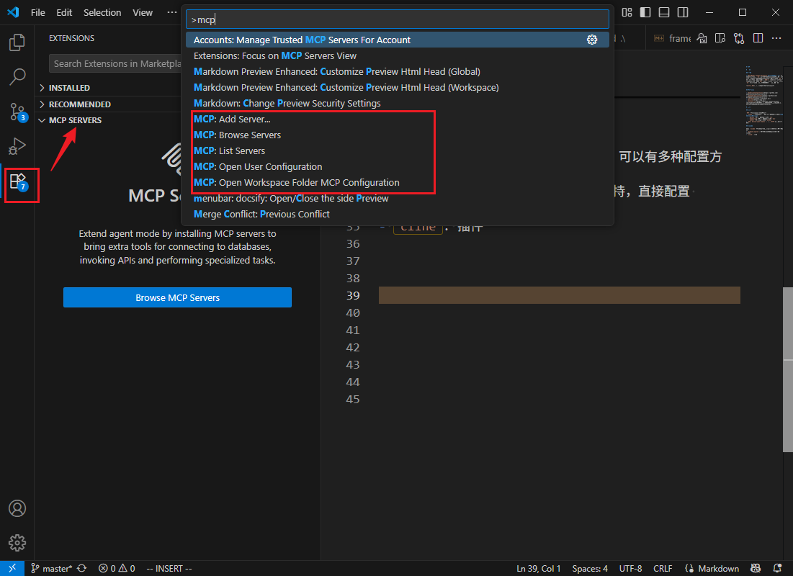
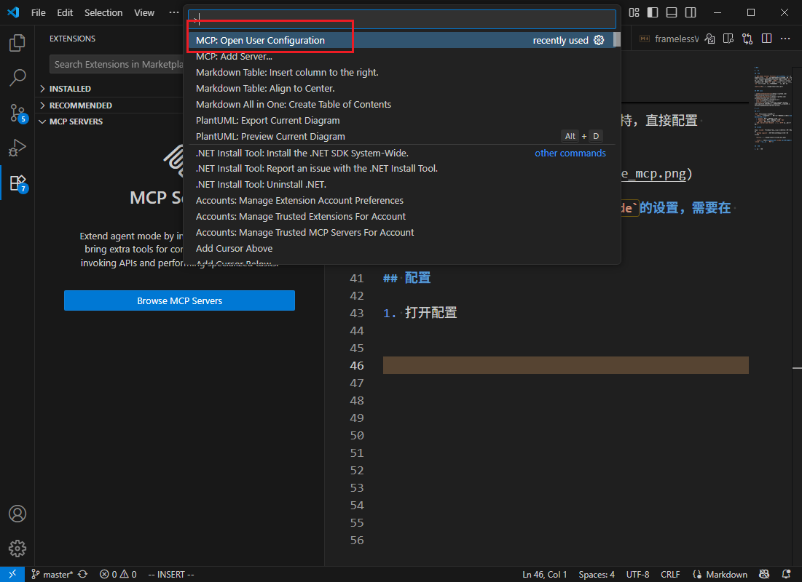
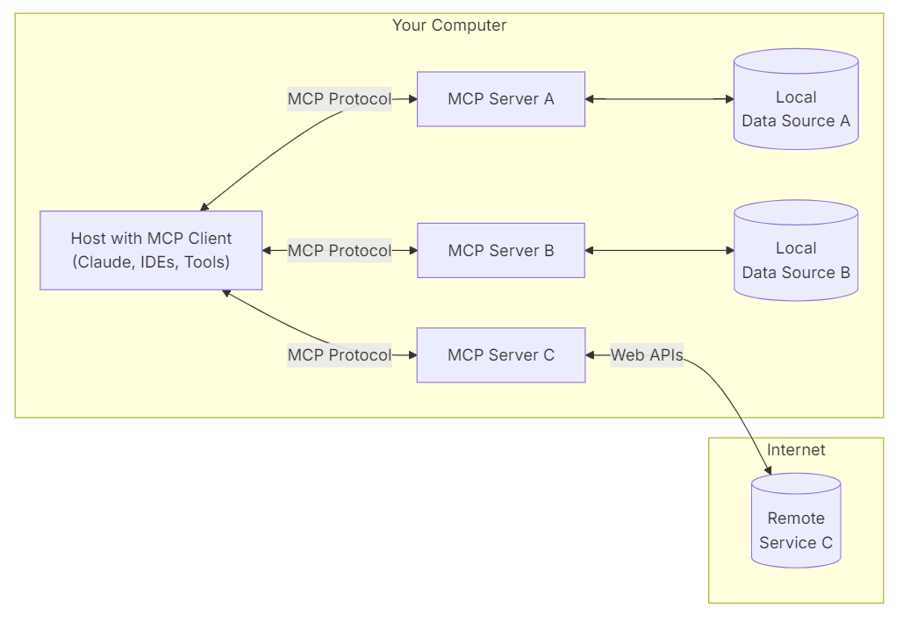

# MCP

# 简介

## 概念

**`MCP,Model Context Protocol`模型上下文协议**: 定义了应用程序和 `AI` 模型之间的消息通信。这使得开发者能够以一致的方式将各种数据源、工具和功能连接到 `AI` 模型（一个中间协议层），就像 `USB-C` 让不同设备能够通过相同的接口连接一样。`MCP` 的目标是创建一个通用标准，使 `AI` 应用程序的开发和集成变得更加简单和统一。




## MCP 仓库

- [modelcontextprotocol](https://github.com/modelcontextprotocol/servers)
- [awesome-mcp-servers](https://github.com/punkpeye/awesome-mcp-servers)
- [smithery](https://smithery.ai/)
- [mcp.so](https://mcp.so/)
- [阿里云百炼](https://bailian.console.aliyun.com/?spm=5176.29619931.J__Z58Z6CX7MY__Ll8p1ZOR.1.34f7521cSqUARw&tab=mcp#/mcp-market)


## 类型

`MCP` 根据通信模式有两种类型
- `stdio` 标准输入输出 : 服务与客户端均在本地，**但需要自己部署环境**
  - `python` 服务: 需要提前安装 `uv`，会用到配套的 `uvx` 工具
  - `Typescript` 服务: 需要提前安装 `nodejs`，会用到配套的 `npx` 工具
  - `docker` 服务：提前安装 `docker`
- `SSE, Server-sent Events` : 基于`HTTP`协议的远程服务

# vscode 使用


## 类型

针对 `vscode` 根据大模型的使用方式，可以有多种配置方案
- `github copilot`: 亲儿子，天然支持，直接配置 vscode

  

- `cline`: 插件，**不支持读取`vscode`的设置，需要在 `cline` 中单独添加 `MCP`**


## copilot

1. 打开`map.json`配置
   - 全局配置

    

   - 本地配置: `.vscode/mcp.json`

2. 从`MCP`仓库找到找到配置，**不同工具的配置方式不同，并不通用**

    ```json
    {
        "mcpServers": {
            "filesystem": {
                "command": "npx",
                "args": [
                    "-y",
                    "@modelcontextprotocol/server-filesystem",
                    "/Users/username/Desktop",
                    "/path/to/other/allowed/dir"
                ]
            }
        },
        "everything": {
            "command": "npx",
            "args": ["-y", "@modelcontextprotocol/server-everything"]
        }
    }
    ```

3. 配置成功后，大模型便能自动调用对应的 `MCP` 工具


# 工作原理


## 结构

`MCP` 由三个核心组件构成：`Host`、`Client` 和 `Server`。
- `Host` : 运行 `MCP` 的主应用程序，实现 `LLM` 与 `MCP client` 的交互，例如 `coplit`、`cline`
- `Client`:  接收 `LLM` 的请求，并将请求转发给 `MCP Server` ，最后将 `Server` 的处理结果返回给 `LLM`
- `Server`: 遵循 `MCP` 协议实现的业务服务，处理 `Client` 请求
  - `stdio`: 本地服务实现，通过 `uvx` 或 `npx` 运行
  - `SSE`: 远程服务实现，通过 `HTTP` 接口访问



## API 协议


`MCP` 的 `API` 协议主要有两个
- `tools/list`: 列出 `server` 支持的能力
- `tools/call`: 调用具体能力


# python 开发

## 环境

```term
triangle@LEARN:~$ pip install uv
```


