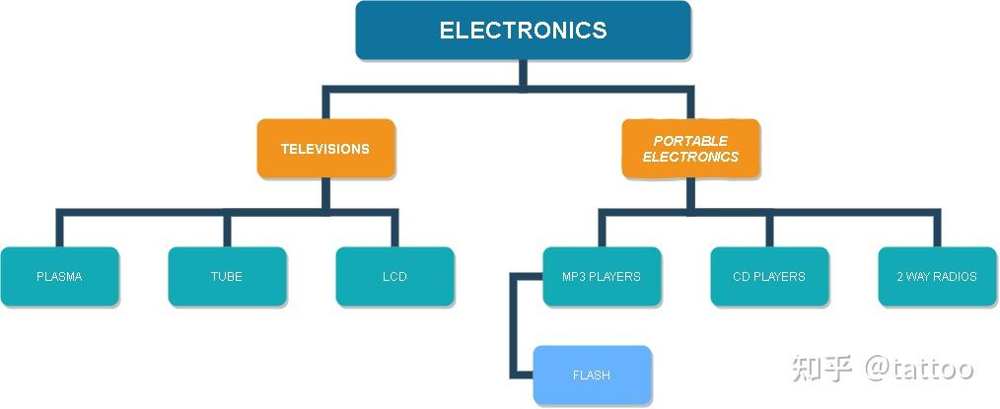

# 树状/层次结构数据的数据库表

- [树状/层次 结构数据的数据库表设计对比及使用](https://zhuanlan.zhihu.com/p/594549886)

# 概念

**树状图**：一种数据结构
- 每个结点有零个或多个子结点
- 没有父结点的结点称为根结点
- 每一个非根结点有且只有一个父结点
- 除了根结点外，每个子结点可以分为多个不相交的子树。

**树状图表适用于存储的具有“一对多”关系的数据集合**，例如公司的组织架构、文档库的目录结构、仓库的库位组织以及物件的分类等。在数据库中，树结构的实现模型有
- 邻接表模型
- 路径枚举模型
- 闭包表模型
- 嵌套集模型

> [!note]
> **归一化** : 是数据库设计中的一项重要技术，旨在消除数据冗余并确保数据完整性
> - 第一范式: 要求表中的每一列都不可再分，即每一列都必须是原子值。
> - 第二范式: 要求表中的每一列都与主键完全依赖，即表中的每一列都必须直接依赖于主键，而不能间接依赖
> - 第三范式: 要求表中的每一列都与主键完全依赖，并且不依赖于其他非主键列。
>
> **当出现不满足范式情形，应对方案都是拆分表或者拆分列**

# 邻接表模型

## 设计理念




```txt

CREATE TABLE category(
        id INT AUTO_INCREMENT PRIMARY KEY,
        name VARCHAR(20) NOT NULL,
        parent INT DEFAULT NULL
);

+-------------+----------------------+--------+
|          id | name                 | parent |
+-------------+----------------------+--------+
|           1 | ELECTRONICS          |   NULL |
|           2 | TELEVISIONS          |      1 |
|           3 | TUBE                 |      2 |
|           4 | LCD                  |      2 |
|           5 | PLASMA               |      2 |
|           6 | PORTABLE ELECTRONICS |      1 |
|           7 | MP3 PLAYERS          |      6 |
|           8 | FLASH                |      7 |
|           9 | CD PLAYERS           |      6 |
|          10 | 2 WAY RADIOS         |      6 |
+-------------+----------------------+--------+
```

**邻接表模型** : 将所有的节点都放入一张表中，并通过 `parent` 字段体现节点的层级关系。该模型实现简单，表结构直观，但缺点也很明显
- 违反范式一：`name` 是节点属性，而 `parent` 是层级关系，因此需要拆分为两张表
- 违反范式二：`parent` 与当前行的 `id` 无关
  - 会出现环状依赖关系
  - 直接删除中间节点，会使得层级关系断掉


## 层级查询

使用三次 `LEFT JOIN` 便能将所有的层级关系串联起来，得到所有从 `root` 节点开始到所有叶子节点的路径。

```txt
SELECT t1.name AS lev1, t2.name as lev2, t3.name as lev3, t4.name as lev4
FROM category AS t1
LEFT JOIN category AS t2 ON t2.parent = t1.id
LEFT JOIN category AS t3 ON t3.parent = t2.id
LEFT JOIN category AS t4 ON t4.parent = t3.id;

+-------------+----------------------+--------------+-------+
| lev1        | lev2                 | lev3         | lev4  |
+-------------+----------------------+--------------+-------+
| ELECTRONICS | TELEVISIONS          | TUBE         | NULL  |
| ELECTRONICS | TELEVISIONS          | LCD          | NULL  |
| ELECTRONICS | TELEVISIONS          | PLASMA       | NULL  |
| ELECTRONICS | PORTABLE ELECTRONICS | MP3 PLAYERS  | FLASH |
| ELECTRONICS | PORTABLE ELECTRONICS | CD PLAYERS   | NULL  |
| ELECTRONICS | PORTABLE ELECTRONICS | 2 WAY RADIOS | NULL  |
+-------------+----------------------+--------------+-------+
```

通过路径表，便能查询每个节点的路径

```txt
SELECT t1.name AS lev1, t2.name as lev2, t3.name as lev3, t4.name as lev4
FROM category AS t1
LEFT JOIN category AS t2 ON t2.parent = t1.id
LEFT JOIN category AS t3 ON t3.parent = t2.id
LEFT JOIN category AS t4 ON t4.parent = t3.id
WHERE t4.name = 'FLASH';

+-------------+----------------------+-------------+-------+
| lev1        | lev2                 | lev3        | lev4  |
+-------------+----------------------+-------------+-------+
| ELECTRONICS | PORTABLE ELECTRONICS | MP3 PLAYERS | FLASH |
+-------------+----------------------+-------------+-------+
```

> [!note]
> 其层级查询本质上是通过递归嵌套实现，对于数据量比较大的树，其查询效率会比较低。

## 获取叶子

查询所有 `id` 没有在 `parent` 中出现过的行

```txt
SELECT t1.name FROM category AS t1 
LEFT JOIN category as t2 ON t1.id = t2.parent
WHERE t2.id IS NULL;

+--------------+
| name         |
+--------------+
| TUBE         |
| LCD          |
| PLASMA       |
| FLASH        |
| CD PLAYERS   |
| 2 WAY RADIOS |
+--------------+
```

## 增/删节点

想要增加、删除某个节点都需要先将目标节点路径查询出来，然后再进行节点的增加、删除操作，最后按照需求更新节点的索引。

> [!note]
> 增/删节点操作十分麻烦

# 路径枚举模型

## 设计理念

**路径枚举（Path Enumeration）** : 模型通过一个字符串字段记录保存从根节点到本节点经过的所有节点枚举。


