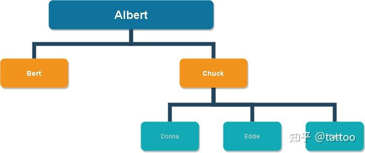
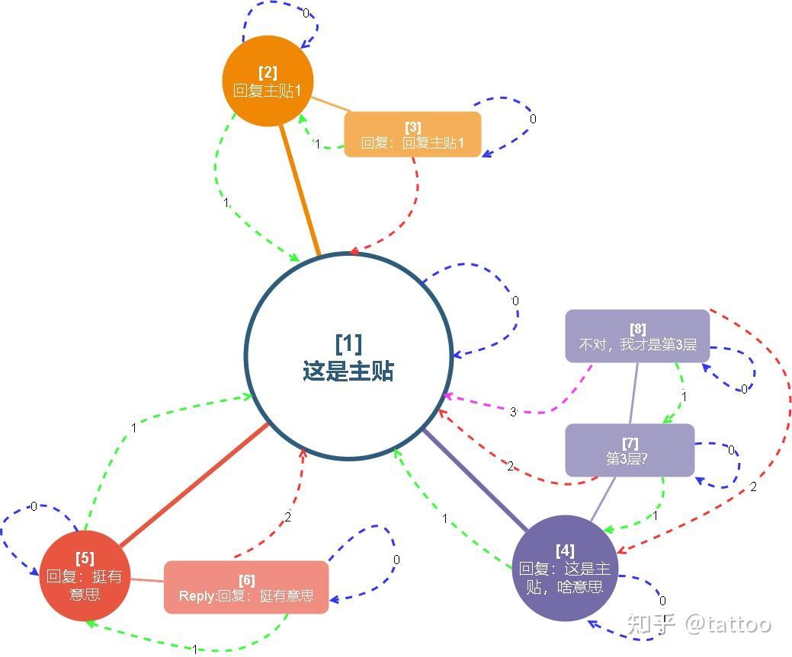
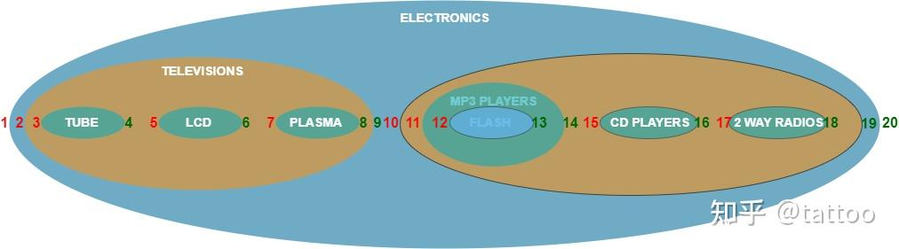
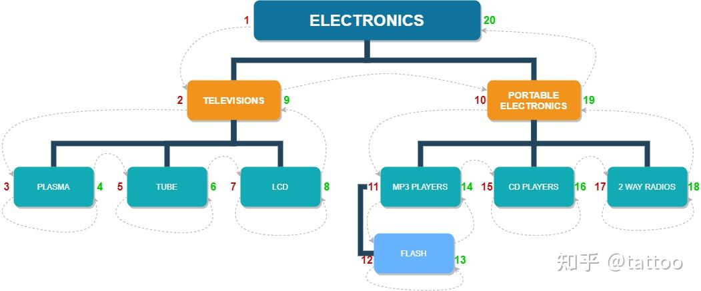
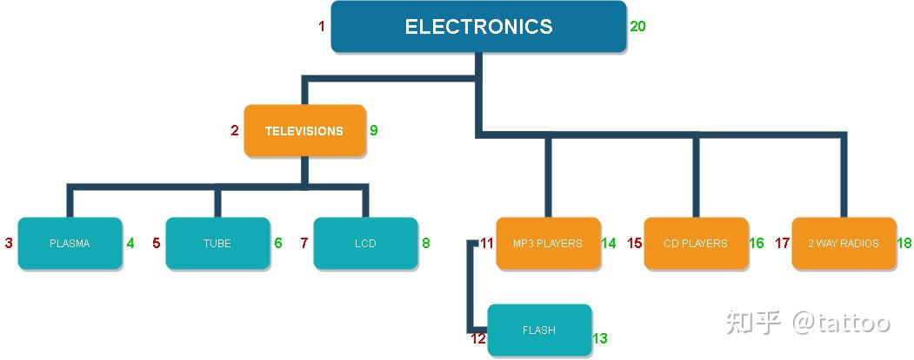

# 树状/层次结构数据的数据库表

- [树状/层次 结构数据的数据库表设计对比及使用](https://zhuanlan.zhihu.com/p/594549886)

# 概念

**树状图**：一种数据结构
- 每个结点有零个或多个子结点
- 没有父结点的结点称为根结点
- 每一个非根结点有且只有一个父结点
- 除了根结点外，每个子结点可以分为多个不相交的子树。

**树状图表适用于存储的具有“一对多”关系的数据集合**，例如公司的组织架构、文档库的目录结构、仓库的库位组织以及物件的分类等。在数据库中，树结构的实现模型有
- 邻接表模型
- 路径枚举模型
- 闭包表模型
- 嵌套集模型

> [!note]
> **归一化** : 是数据库设计中的一项重要技术，旨在消除数据冗余并确保数据完整性
> - 第一范式: 要求表中的每一列都不可再分，即每一列都必须是原子值。
> - 第二范式: 字段必须与主键完全相关，而不能与主键部分相关。
> - 第三范式: 字段必须要与主键直接相关，不能间接相关
>
> **当出现不满足范式情形，应对方案都是拆分表或者拆分列，但也不用完全满足所有的范式。**

# 邻接表模型

## 设计理念


```txt

CREATE TABLE category(
        id INT AUTO_INCREMENT PRIMARY KEY,
        name VARCHAR(20) NOT NULL,
        parent INT DEFAULT NULL
);

+-------------+----------------------+--------+
|          id | name                 | parent |
+-------------+----------------------+--------+
|           1 | ELECTRONICS          |   NULL |
|           2 | TELEVISIONS          |      1 |
|           3 | TUBE                 |      2 |
|           4 | LCD                  |      2 |
|           5 | PLASMA               |      2 |
|           6 | PORTABLE ELECTRONICS |      1 |
|           7 | MP3 PLAYERS          |      6 |
|           8 | FLASH                |      7 |
|           9 | CD PLAYERS           |      6 |
|          10 | 2 WAY RADIOS         |      6 |
+-------------+----------------------+--------+
```

**邻接表模型 `Adjacency List`** : 将所有的节点都放入一张表中，并通过 `parent` 字段体现节点的层级关系。该模型实现简单，表结构直观，但缺点也很明显
- `name` 是节点属性，而 `parent` 是层级关系，可以拆分为两张表
- 会出现环状依赖关系
- 直接删除中间节点，会使得层级关系断掉


## 层级查询

使用三次 `LEFT JOIN` 便能将所有的层级关系串联起来，得到所有从 `root` 节点开始到所有叶子节点的路径。

```txt
SELECT t1.name AS lev1, t2.name as lev2, t3.name as lev3, t4.name as lev4
FROM category AS t1
LEFT JOIN category AS t2 ON t2.parent = t1.id
LEFT JOIN category AS t3 ON t3.parent = t2.id
LEFT JOIN category AS t4 ON t4.parent = t3.id;

+-------------+----------------------+--------------+-------+
| lev1        | lev2                 | lev3         | lev4  |
+-------------+----------------------+--------------+-------+
| ELECTRONICS | TELEVISIONS          | TUBE         | NULL  |
| ELECTRONICS | TELEVISIONS          | LCD          | NULL  |
| ELECTRONICS | TELEVISIONS          | PLASMA       | NULL  |
| ELECTRONICS | PORTABLE ELECTRONICS | MP3 PLAYERS  | FLASH |
| ELECTRONICS | PORTABLE ELECTRONICS | CD PLAYERS   | NULL  |
| ELECTRONICS | PORTABLE ELECTRONICS | 2 WAY RADIOS | NULL  |
+-------------+----------------------+--------------+-------+
```

通过路径表，便能查询每个节点的路径

```txt
SELECT t1.name AS lev1, t2.name as lev2, t3.name as lev3, t4.name as lev4
FROM category AS t1
LEFT JOIN category AS t2 ON t2.parent = t1.id
LEFT JOIN category AS t3 ON t3.parent = t2.id
LEFT JOIN category AS t4 ON t4.parent = t3.id
WHERE t4.name = 'FLASH';

+-------------+----------------------+-------------+-------+
| lev1        | lev2                 | lev3        | lev4  |
+-------------+----------------------+-------------+-------+
| ELECTRONICS | PORTABLE ELECTRONICS | MP3 PLAYERS | FLASH |
+-------------+----------------------+-------------+-------+
```

> [!note]
> 其层级查询本质上是通过递归嵌套实现，对于数据量比较大的树，其查询效率会比较低。

## 获取叶子

查询所有 `id` 没有在 `parent` 中出现过的行

```txt
SELECT t1.name FROM category AS t1 
LEFT JOIN category as t2 ON t1.id = t2.parent
WHERE t2.id IS NULL;

+--------------+
| name         |
+--------------+
| TUBE         |
| LCD          |
| PLASMA       |
| FLASH        |
| CD PLAYERS   |
| 2 WAY RADIOS |
+--------------+
```

## 增/删节点

存在多种节点删除方式，根据业务逻辑进行选择
- 让被删节点的所有子节点都变成被删节点父节点的子节点
- 从被删节点中的子节点中选则一个来顶替被删节点的位置
- 把相关的中间节点的子树全部删掉

想要增加、删除某个节点都需要先将目标节点路径查询出来，然后再进行节点的增加、删除操作，最后按照需求更新节点的索引。


> [!note]
> 增/删节点操作十分麻烦

# 路径枚举模型

## 设计理念



```txt
CREATE TABLE Personnel_OrgChart(
    emp_name CHAR(10) NOT NULL,
    emp_id CHAR(1) NOT NULL PRIMARY KEY,
    path_string VARCHAR(500) NOT NULL
);

+----------+--------+-------------+
| emp_name | emp_id | path_string |
+----------+--------+-------------+
| Albert   | A      | A           |
| Bert     | B      | AB          |
| Chuck    | C      | AC          |
| Donna    | D      | ACD         |
| Eddie    | E      | ACE         |
| Fred     | F      | ACF         |
+----------+--------+-------------+
```

**路径枚举 `Path Enumeration`** : 通过一个字符串字段记录从根节点到本节点经过的所有节点。
- 会出现环状依赖关系
- 直接删除中间节点，链路不会断掉

## 层级查询

可以通过 `%` 对 `path_string` 进行模糊查询。

```txt
SELECT * FROM Personnel_OrgChart WHERE path_string LIKE '%C%';

+----------+--------+-------------+
| emp_name | emp_id | path_string |
+----------+--------+-------------+
| Chuck    | C      | AC          |
| Donna    | D      | ACD         |
| Eddie    | E      | ACE         |
| Fred     | F      | ACF         |
+----------+--------+-------------+
```

通过 `POSITION` 查询字符串包含关系，从而查询某个节点到根节点的全路径。

```txt
SELECT P2.*
FROM Personnel_OrgChart AS P1, Personnel_OrgChart AS P2
WHERE P1.emp_id = 'F' AND POSITION(P2.path_string IN P1.path_string)= 1;

+----------+--------+-------------+
| emp_name | emp_id | path_string |
+----------+--------+-------------+
| Albert   | A      | A           |
| Chuck    | C      | AC          |
| Fred     | F      | ACF         |
+----------+--------+-------------+
```

## 节点插入

插入一个节点后，需要对被插入节点和其子节点的路径进行更新，例如在 `Chuck` 前插入 `Gary` 节点

```txt
INSERT INTO Personnel_OrgChart VALUES('Gary','G','AG');
UPDATE Personnel_OrgChart SET path_string = REPLACE(path_string, 'AC', 'AGC') WHERE path_string LIKE 'AC%';

SELECT * FROM Personnel_OrgChart;
+----------+--------+-------------+
| emp_name | emp_id | path_string |
+----------+--------+-------------+
| Albert   | A      | A           |
| Bert     | B      | AB          |
| Chuck    | C      | AGC         |
| Donna    | D      | AGCD        |
| Eddie    | E      | AGCE        |
| Fred     | F      | AGCF        |
| Gary     | G      | AG          |
+----------+--------+-------------+
```

## 节点删除

存在多种节点删除方式，根据业务逻辑进行选择
- 让被删节点的所有子节点都变成被删节点父节点的子节点

    ```txt
    DELETE FROM Personnel_OrgChart WHERE emp_id = 'C';
    UPDATE Personnel_OrgChart SET path_string = REPLACE(path_string, 'C', '') WHERE path_string LIKE '%C%';

    SELECT * FROM Personnel_OrgChart;
    +----------+--------+-------------+
    | emp_name | emp_id | path_string |
    +----------+--------+-------------+
    | Albert   | A      | A           |
    | Bert     | B      | AB          |
    | Donna    | D      | AGD         |
    | Eddie    | E      | AGE         |
    | Fred     | F      | AGF         |
    | Gary     | G      | AG          |
    +----------+--------+-------------+
    ```

- 从被删节点中的子节点中选则一个来顶替被删节点的位置
- 把相关的中间节点的子树全部删掉
  
  ```txt
  DELETE FROM Personnel_OrgChart WHERE emp_id = 'C';
  DELETE FROM Personnel_OrgChart WHERE path_string = '%C_%';
  ```

# 闭包表模型

## 设计理念

**闭包表`Closure Table`** : 通过空间换时间，定义了一张关系表来存储从叶子节点到根节点的整条路径的距离关系，例如 `a/b/c` 路径，会存储的关系有
- `c -> c` 的距离为 `0`
- `c -> b` 的距离为 `1`
- `c -> a` 的距离为 `2`

```txt
CREATE TABLE `NodeInfo` (
    `node_id` INT NOT NULL AUTO_INCREMENT,
    `node_name` VARCHAR (255),
    PRIMARY KEY (`node_id`)
) DEFAULT CHARSET = utf8mb4;

CREATE TABLE `NodeRelation` (
    `id` INT(10) UNSIGNED NOT NULL AUTO_INCREMENT COMMENT '自增ID',
    `ancestor` INT(10) UNSIGNED NOT NULL DEFAULT '0' COMMENT '祖先节点',
    `descendant` INT(10) UNSIGNED NOT NULL DEFAULT '0' COMMENT '后代节点',
    `distance` TINYINT(3) UNSIGNED NOT NULL DEFAULT '0' COMMENT '相隔层级，>=1',
    PRIMARY KEY (`id`),
    UNIQUE KEY `uniq_anc_desc` (`ancestor`,`descendant`),
    KEY `idx_desc` (`descendant`)
) ENGINE = InnoDB DEFAULT CHARSET = utf8mb4 COMMENT = '节点关系表'
```

添加内容

```txt
CALL OrgAndUser.AddNode(NULL,'这是主贴');
CALL OrgAndUser.AddNode('这是主贴','回复主贴1');
CALL OrgAndUser.AddNode('回复主贴1','回复：回复主贴1');
CALL OrgAndUser.AddNode('这是主贴','回复：这是主贴，啥意思');
CALL OrgAndUser.AddNode('这是主贴','回复：挺有意思');
CALL OrgAndUser.AddNode('回复：挺有意思','Reply:回复：挺有意思');
CALL OrgAndUser.AddNode('回复：这是主贴，啥意思','第3层？');
CALL OrgAndUser.AddNode('第3层？','不对，我才是第3层');

SELECT * FROM NodeInfo;
+---------+-----------------------------------+
| node_id | node_name                         |
+---------+-----------------------------------+
|       1 | 这是主贴                           |
|       2 | 回复主贴1                          |
|       3 | 回复：回复主贴1                     |
|       4 | 回复：这是主贴，啥意思               |
|       5 | 回复：挺有意思                      |
|       6 | Reply:回复：挺有意思                |
|       7 | 第3层？                            |
|       8 | 不对，我才是第3层                   |
+---------+-----------------------------------+
```

生成的关系表



```txt
+----+----------+------------+----------+
| id | ancestor | descendant | distance |
+----+----------+------------+----------+
|  1 |        1 |          1 |        0 |
|  2 |        2 |          2 |        0 |
|  3 |        1 |          2 |        1 |
|  4 |        3 |          3 |        0 |
|  5 |        2 |          3 |        1 |
|  6 |        1 |          3 |        2 |
|  8 |        4 |          4 |        0 |
|  9 |        1 |          4 |        1 |
| 10 |        5 |          5 |        0 |
| 11 |        1 |          5 |        1 |
| 12 |        6 |          6 |        0 |
| 13 |        5 |          6 |        1 |
| 14 |        1 |          6 |        2 |
| 16 |        7 |          7 |        0 |
| 17 |        4 |          7 |        1 |
| 18 |        1 |          7 |        2 |
| 20 |        8 |          8 |        0 |
| 21 |        7 |          8 |        1 |
| 22 |        4 |          8 |        2 |
| 23 |        1 |          8 |        3 |
+----+----------+------------+----------+
```

## 节点添加

```txt
CREATE DEFINER = `root`@`localhost` PROCEDURE `AddNode`(`_parent_name` varchar(255),`_node_name` varchar(255))
BEGIN
    DECLARE _ancestor INT(10) UNSIGNED;
    DECLARE _descendant INT(10) UNSIGNED;
    DECLARE _parent INT(10) UNSIGNED;
    IF NOT EXISTS(SELECT node_id From NodeInfo WHERE node_name = _node_name)
    THEN
        INSERT INTO NodeInfo (node_name) VALUES(_node_name);
        SET _descendant = (SELECT node_id FROM NodeInfo WHERE node_name = _node_name);
        INSERT INTO NodeRelation (ancestor,descendant,distance) VALUES(_descendant,_descendant,0);

        IF EXISTS (SELECT node_id FROM NodeInfo WHERE node_name = _parent_name)
        THEN
            SET _parent = (SELECT node_id FROM NodeInfo WHERE node_name = _parent_name);
            INSERT INTO NodeRelation (ancestor,descendant,distance) SELECT ancestor,_descendant,distance+1 FROM NodeRelation WHERE descendant = _parent;
        END IF;
    END IF;
END;
```

## 子树查询

```txt
SELECT * FROM NodeInfo n1
INNER JOIN NodeRelation n2 ON n1.node_id = n2.ancestor
INNER JOIN NodeInfo n3 ON n2.descendant = n3.node_id;

ancestor 节点                       关系                           descendant 节点
+---------+----------+----+----------+------------+----------+---------+----------+
| node_id | node_name| id | ancestor | descendant | distance | node_id | node_name|
+---------+----------+----+----------+------------+----------+---------+----------+
```

通过上述内联语句可以构成一张 `ancestor 节点 | 关系 | descendant 节点` 的组合表。

通过 `ancestor 节点` 来查找子树

```txt
SELECT n3.node_name FROM NodeInfo n1
INNER JOIN NodeRelation n2 ON n1.node_id = n2.ancestor
INNER JOIN NodeInfo n3 ON n2.descendant = n3.node_id
WHERE n1.node_name = '回复：这是主贴，啥意思' AND n2.distance != 0;

+---------------------------+
| node_name                 |
+---------------------------+
| 第3层？                    |
| 不对，我才是第3层            |
+---------------------------+
```


## 叶子节点

叶节点的特征是没有子节点，所以它的 `node_id` 只会在关联表的 `ancestor` 字段出现一次。

```txt
SELECT n1.node_id, n1.node_name FROM NodeInfo n1
INNER JOIN NodeRelation n2 ON n1.node_id = n2.ancestor
GROUP BY n1.node_id, n1.node_name
HAVING COUNT(n2.ancestor) = 1;
+---------+-----------------------------+
| node_id | node_name                   |
+---------+-----------------------------+
|       3 | 回复：回复主贴1                |
|       6 | Reply:回复：挺有意思           |
|       8 | 不对，我才是第3层              |
+---------+-----------------------------+
```

## 父节点查询

```txt
SELECT n1.* FROM NodeInfo AS n1
INNER JOIN NodeRelation n2 on n1.node_id = n2.ancestor
WHERE n2.descendant = 8;

+---------+-----------------------------------+
| node_id | node_name                         |
+---------+-----------------------------------+
|       8 | 不对，我才是第3层                    |
|       7 | 第3层？                            |
|       4 | 回复：这是主贴，啥意思                |
|       1 | 这是主贴                           |
+---------+-----------------------------------+
```

## 子树删除

在 `NodeRelation` 表中，将所有 `ancestor` 等于目标节点的行都删掉

```txt
DELETE FROM NodeInfo WHERE node_id = 4;
DELETE FROM NodeRelation AS n1 
WHERE n1.descendant IN (
    SELECT a.descendant FROM (
        SELECT n2.descendant FROM NodeRelation AS n2 WHERE n2.ancestor = 4
    ) 
    AS a
);
```

# 嵌套集模型

## 设计理念

**嵌套集 `Nested Set`** : 也称之为预排序遍历树算法`MPTT (Modified Preorder Tree Taversal)`，在嵌套集的表里我们会有 `lft` 和 `rgt` 两个字段来记录一个节点的左右边到根节点左边的距离。
- 根节点左边初始为 `1`
- 进/出一个集合时，值 `+1`



将集合改为树状结构，**`lft` 和 `rgt`距离值其实就是「中序遍历」**




```txt
CREATE TABLE nested_category (
        category_id INT AUTO_INCREMENT PRIMARY KEY,
        name VARCHAR(20) NOT NULL,
        lft INT NOT NULL,
        rgt INT NOT NULL
);

+-------------+----------------------+-----+-----+
| category_id | name                 | lft | rgt |
+-------------+----------------------+-----+-----+
|           1 | ELECTRONICS          |   1 |  20 |
|           2 | TELEVISIONS          |   2 |   9 |
|           3 | TUBE                 |   3 |   4 |
|           4 | LCD                  |   5 |   6 |
|           5 | PLASMA               |   7 |   8 |
|           6 | PORTABLE ELECTRONICS |  10 |  19 |
|           7 | MP3 PLAYERS          |  11 |  14 |
|           8 | FLASH                |  12 |  13 |
|           9 | CD PLAYERS           |  15 |  16 |
|          10 | 2 WAY RADIOS         |  17 |  18 |
+-------------+----------------------+-----+-----+
```

## 子树查询

```txt
SELECT node.name
FROM nested_category AS node,
     nested_category AS parent
WHERE node.lft BETWEEN parent.lft AND parent.rgt
      AND parent.name = 'PORTABLE ELECTRONICS'
ORDER BY node.lft;

+----------------------+
| name                 |
+----------------------+
| PORTABLE ELECTRONICS |
| MP3 PLAYERS          |
| FLASH                |
| CD PLAYERS           |
| 2 WAY RADIOS         |
+----------------------+
```

## 父节点查询

```txt
SELECT parent.name 
FROM nested_category AS node,
     nested_category AS parent
WHERE node.lft > parent.lft AND node.rgt < parent.rgt
      AND node.name = 'LCD'
ORDER BY parent.lft DESC
LIMIT 1

+-------------+
| name        |
+-------------+
| TELEVISIONS |
+-------------+
```

## 查询链路

```txt
SELECT parent.name
FROM nested_category AS node,
     nested_category AS parent
WHERE node.lft BETWEEN parent.lft AND parent.rgt
      AND node.name = 'FLASH'
ORDER BY parent.lft;

+----------------------+
| name                 |
+----------------------+
| ELECTRONICS          |
| PORTABLE ELECTRONICS |
| MP3 PLAYERS          |
| FLASH                |
```

## 叶子节点

叶子节点的右值只比左值多步长的值（这里是1）。

```txt
SELECT name
FROM nested_category
WHERE rgt = lft + 1;

+--------------+
| name         |
+--------------+
| TUBE         |
| LCD          |
| PLASMA       |
| FLASH        |
| CD PLAYERS   |
| 2 WAY RADIOS |
+--------------+
```

## 节点添加

添加一个节点，需要更新全表的 `lft` 与 `rgt` 字段值

```txt
CREATE DEFINER = `root`@`localhost` PROCEDURE `AddNestedSetNode`(`parent_id` INT,`node_name` VARCHAR(20))
BEGIN
    DECLARE _rgt INT;
    DECLARE step INT;
    SET step = 1;
    SET autocommit=0;

    IF EXISTS(SELECT category_id From nested_category WHERE category_id = parent_id)
    THEN
        START TRANSACTION;
        SET _rgt = (SELECT rgt FROM nested_category WHERE category_id = parent_id);
        UPDATE nested_category SET rgt = rgt + 2 * step WHERE rgt >= _rgt;
        UPDATE nested_category SET lft = lft + 2 * step WHERE lft >= _rgt;

        INSERT INTO nested_category(name, lft, rgt) values(node_name, _rgt, _rgt + step);
        COMMIT;
    END IF;
END;
```

## 节点删除




直接删除节点 `PORTABLE ELECTRONICS` 后，其子节点都会变成父节点的子节点，除了索引值不连续外，对树结构没有影响。

更新索引值

```txt
CREATE DEFINER = `root`@`localhost` PROCEDURE `DeleteNestedSetLeaf`(`node_id` INT)
BEGIN
    DECLARE _lft INT;
    DECLARE _rgt INT;
    DECLARE step INT;
    DECLARE width INT;
    SET step = 1;
    SET autocommit=0;

    IF EXISTS(SELECT category_id From nested_category WHERE category_id = node_id AND rgt = lft + step)
    THEN
        START TRANSACTION;
        SELECT rgt,lft,(rgt-lft+step) INTO @_rgt,@_lft,@width FROM nested_category WHERE category_id = node_id;

        DELETE FROM nested_category WHERE lft BETWEEN @_lft AND @_rgt;

        UPDATE nested_category SET rgt = rgt - @width WHERE rgt > @_rgt;
        UPDATE nested_category SET lft = lft - @width WHERE lft > @_rgt;
        COMMIT;
    END IF;
END;
```

# 对比

| 模型     | 是否归一化 | 是否无限深度 | 查询需要递归 | 需要几个表 | 增删改是否简单 | 查询性能 |
| -------- | ---------- | ------------ | ------------ | ---------- | -------------- | -------- |
| 邻接表   | 否         | 是           | 是           | 1          | 是             | 低       |
| 路径枚举 | 否         | 否           | 否           | 1          | 一般           | 高       |
| 闭包表   | 是         | 是           | 否           | 2          | 一般           | 一般     |
| 嵌套集   | 是         | 是           | 否           | 1          | 一般           | 高       |
