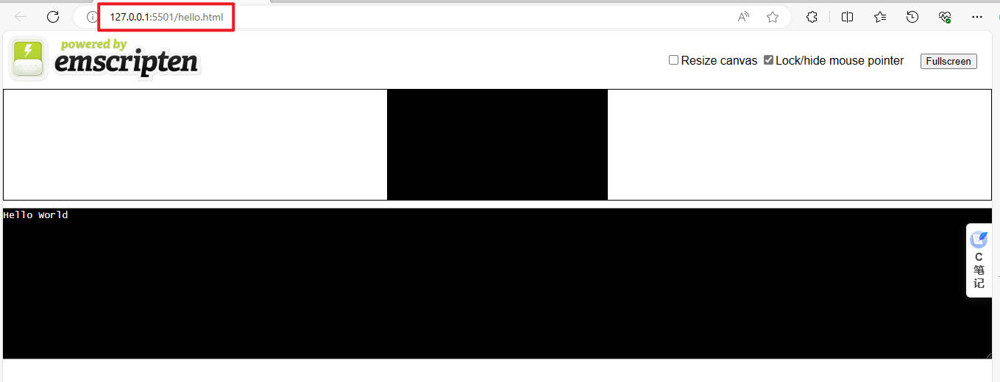
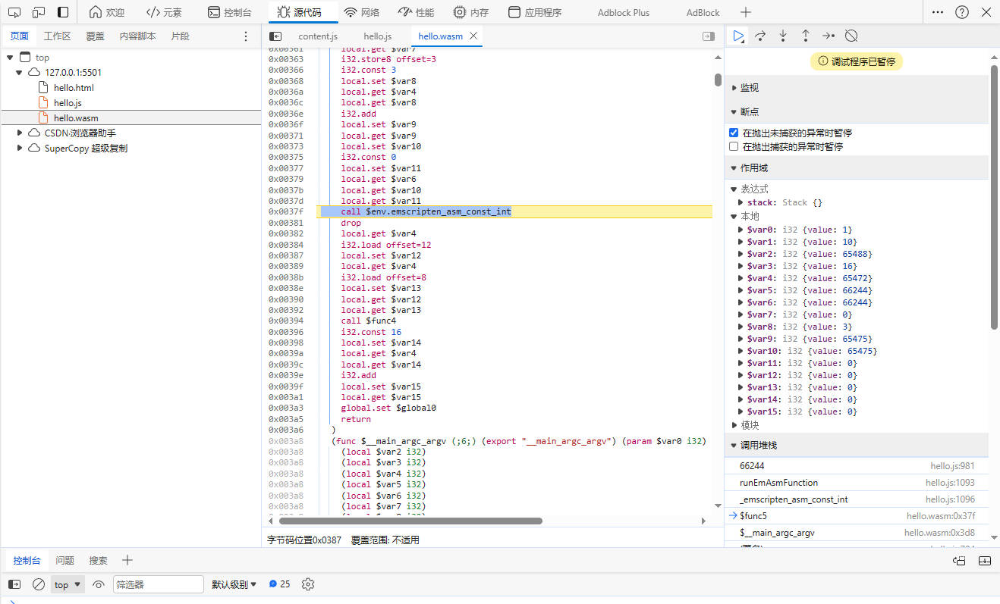
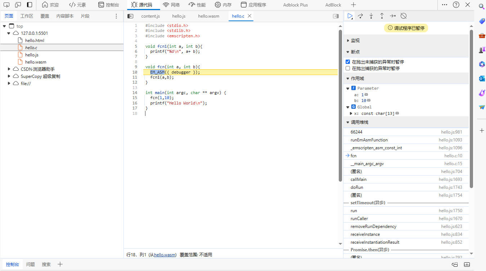

# Webassembly

# 介绍

**Webassembly (wasm):** 可以将 `c/c++, rust` 等源码编译成浏览器能直接运行的二进制文件，并且还能直接在 `javascript` 中直接运行。

Webassembly 不能替代 Javascript，相反，这两种技术是相辅相成的。通过 JavaScript API，你可以将 Webassembly模块加载到你的页面中。也就是说，你可以通过 Webassembly来充分利用编译代码的性能，同时保持 JavaScript 的灵活性。

# Emscripten


利用 [Emscripten](https://emscripten.org/docs/getting_started/downloads.html) 工具包，可以直接将 `c/c++` 源码编译成 `Webassembly` 项目。

```term
triangle@LEARN:~$ git clone https://github.com/emscripten-core/emsdk.git // 下载项目
triangle@LEARN:~$ cd emsdk
triangle@LEARN:~$ ./emsdk install latest // 下载最新版本
1. emsdk 文件
./emsdk 就是用于查找本地 python 的脚本
./emsdk install latest 等价于 python3 emsdk.py install latest

2. 安装需要挂梯子
triangle@LEARN:~$ ./emsdk activate latest // 激活版本
triangle@LEARN:~$ source ./emsdk_env.sh // 添加环境变量
1. emsdk_env.sh 中的换行符号可能是 CRFL ，需要替换成 FL，否则 Linux 无法执行
2. source ./emsdk_env.sh 只对当前终端有效，另开终端得重新执行
```

# 使用

## Hello

1. `c` 代码

```cpp
#include <stdio.h>
int main(int argc, char ** argv) {
  printf("Hello World\n");
}
```

2. 编译项目

```term
triangle@LEARN:~$ emcc hello.c -s WASM=1 -o hello.html
-s WASM=1 : 以 wasm 形式输出
triangle@LEARN:~$ tree
.
├── hello.c     # c 代码
├── hello.html  # 模板界面
├── hello.js    # 在原生 C 函数和 JavaScript/wasm 之间转换的胶水代码
└── hello.wasm  # 二进制的 wasm 模块代码
```

3. 预览结果

>[!note]
> **启用服务预览 `hello.html`** ，不能直接打开 `hello.html`。`vscode` 可以使用 [Live Server](https://marketplace.visualstudio.com/items?itemName=ritwickdey.LiveServer) 快速预览。



## 模板文件

 
通过 `emcc` 编译生成的 `hello.html` 是有一个默认模板文件 `shell_minimal.html` (可以在 `emsdk` 文件夹下搜索出来)。这个模板文件可以自定义

```term
triangle@LEARN:~$ emcc -o hello2.html hello2.c -O3 -s WASM=1 --shell-file html_template/shell_minimal.html
--shell-file html_template/shell_minimal.html : 指定自定义模板文件
```

也可以不提供 `.html` 模板文件，直接生成 `.js` 文件

```term
triangle@LEARN:~$ emcc hello.c -s WASM=1 -o hello.js 
```

## c 接口导出

1. `c` 代码

```cpp
// sum.c
#include <stdio.h>
#include <stdlib.h>
#include <emscripten.h>

// NOTE - js 在 wasm 中是按照 c 风格接口形式查找函数
#ifdef __cplusplus
extern "C" {
#endif

// EMSCRIPTEN_KEEPALIVE : 声明需要导出的接口
EMSCRIPTEN_KEEPALIVE int sum(int x, int y)
{
  return x + y;
}

// 默认只会导出 main
int main(int x)
{
   return sum(x,x);
}

#ifdef __cplusplus
}
#endif
```

2. 编译 `wasm`

```term
triangle@LEARN:~$  emcc hello.c -o sum.js -s EXPORTED_FUNCTIONS=_main,_sum -s WASM=1
EXPORTED_FUNCTIONS=_main,_sum: 指定需要导出的接口名，_xxx，c语言函数接口风格
```

3. `js` 中加载 `wasm`

```javascript
// 待加载的 wasm 文件
fetch("sum.wasm")
    .then((response) => response.arrayBuffer())
    .then((bytes) => Webassembly.compile(bytes))
    .then((module) => {
        // 生成实例
        const instance = new Webassembly.Instance(module);
        // 导出的接口集合
        const api = instance.exports;
        // 调用接口
        var result = api.sum(3,2);
    });
```

## C++ 接口导出

1. `c++` 代码

```cpp
#include <emscripten/bind.h>
using namespace emscripten;
struct Point {
    int x;
    int y;
};
 
Point getPoint() {
    Point point = {0};
       point.x = 100;
       point.x = 200;
       return point;
}

EMSCRIPTEN_BINDINGS(my_module) {
    // 绑定结构体
    value_object<Point>("Point")
        .field("x", & Point::x)
        .field("y", & Point::y)
        ;

    // 绑定 c++ 函数
   function("_getPoint", &getPoint);
}
```

2. 编译

```term
triangle@LEARN:~$  emcc --bind main.cpp -s WASM=1
# --bind : 启动绑定
```

3. 调用

```html
<!-- 添加 js -->
<script src="a.out.js"></script>

<script>
    // 等待 Module 加载完毕
    Module.onRuntimeInitialized = ()=>{
        // 直接调用接口
        var p = Module._getPoint();
        console.log(p.x);
        console.log(p.y);
    }
</script>
```

# 调试

> - 教程： [使用现代工具调试 WebAssembly](https://developer.chrome.com/blog/wasm-debugging-2020)
> - 浏览器调试工具： [C/C++ DevTools Support (DWARF)](https://developer.chrome.com/docs/devtools/wasm?hl=zh-cn)


## 汇编调试

安装好插件后，可以直接在汇编中打断点调试。




```cpp
#include <stdio.h>
#include <emscripten.h>

int main(int argc, char ** argv) {
    // 可以在代码中主动设置断点，方便找代码
    EM_ASM({ debugger });  
    printf("Hello World\n");
}

```

## DWARF


```term
triangle@LEARN:~$ emcc -g -fdebug-compilation-dir='.' hello.cpp -o hello.html
Options:
    -g                          生成调试信息
    -fdebug-compilation-dir     源码相对于 hello.html 的路径，通过 http 协议加载。若不指定则通过 file:// 协议获取本地源文件
```



## Source Map

```term
triangle@LEARN:~$ emcc -gsource-map hello.c -o hello.html
Options:
    -gsource-map                会生成 wasm 文件对应源码的映射文件
    -g4                         效果同上，新版 emscripten 不推荐使用
triangle@LEARN:~$ tree
.
├── hello.c
├── hello.html
├── hello.js
├── hello.wasm
└── hello.wasm.map              # 源码映射文件
```


> [!note]
> `Source Map` 只是将汇编对应到源码，堆栈还是展示汇编寄存器


