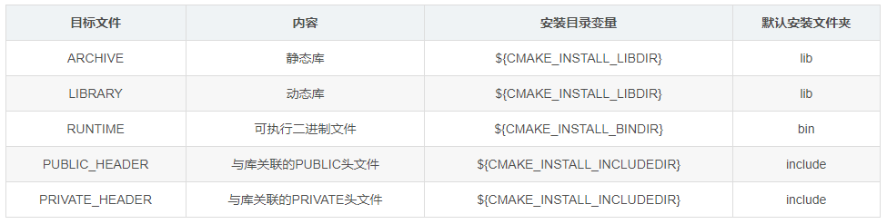

# Cmake

# 项目 CMakeLists 配置

```php
# cmake 版本
cmake_minimum_required(VERSION 2.8)

# 项目名
project(hello)

# 打印信息
message("${PROJECT_SOURCE_DIR}")

# 在源码外部自定义宏
add_definitions(-DDEBUG -DREAL_COOL_ENGINEER)

# 指定编译模式，会自动切换下面两个模式，不要再写 if 语句
set(CMAKE_BUILD_TYPE Debug)

# Debug模式下的编译指令
set(CMAKE_C_FLAGS_DEBUG "${CMAKE_C_FLAGS_DEBUG} -g -O0")
SET(CMAKE_CXX_FLAGS_DEBUG "$ENV{CXXFLAGS} -O0 -Wall -g -ggdb")
# Release模式下的编译指令
set(CMAKE_C_FLAGS_RELEASE "${CMAKE_C_FLAGS_RELEASE} -O2")
SET(CMAKE_CXX_FLAGS_RELEASE "$ENV{CXXFLAGS} -O3 -Wall ")

# 可执行文件路径
set(CMAKE_RUNTIME_OUTPUT_DIRECTORY ${PROJECT_SOURCE_DIR}/bin)
# debug 版的可执行文件路径
#set(CMAKE_RUNTIME_OUTPUT_DIRECTORY_DEBUG ${PROJECT_SOURCE_DIR}/bin)
# release 版的可执行文件路径
#set(CMAKE_RUNTIME_OUTPUT_DIRECTORY_RELEASE ${PROJECT_SOURCE_DIR}/bin) 

# 静态库存放路径，可指定 debug release
set(CMAKE_ARCHIVE_OUTPUT_DIRECTORY_ ${PROJECT_SOURCE_DIR}/bin)
# 动态库存放路径，可指定 debug release
set(CMAKE_LIBRARY_OUTPUT_DIRECTORY_ ${PROJECT_SOURCE_DIR}/bin)

#设置可执行文件的输出目录
#SET(EXECUTABLE_OUTPUT_PATH ${PROJECT_SOURCE_DIR}/bin) 
#设置库文件的输出目录      
SET(LIBRARY_OUTPUT_PATH ${PROJECT_SOURCE_DIR}/bin)           

# 添加头文件，全部都添加
include_directories(${PROJECT_SOURCE_DIR}/inc)

# 指定第三方库所在路径
link_directories(${PROJECT_SOURCE_DIR}/lib)

# 自动查找库，只有配置了 module 和 config 模式的 .cmake 配置文件的库才能找到
find_package(OpenCV REQUIRED)

# 查找当前目录所有源文件，保存在变量 DIR_LIB_SRCS中
aux_source_directory(. DIR_LIB_SRCS)
set(CPP_FILES ./main.cpp)
file(GLOB_RECURSE SRC_FILES "path/*.cpp") # 推荐方案，递归查找目标文件

# 生成目标可执行文件
add_executable(demo ${CPP_FILES} ${OPENCV_INCLUDES}) 
# 创建静态库
add_library(lib_name STATIC ${file_cpp})
# 创建动态库
add_library(lib_name SHARED ${file_cpp})

# 添加子目录文件夹
# add_subdirectory(${PROJECT_SOURCE_DIR}/src)

# 链接库
target_link_libraries(demo ${OpenCV_LIBS})

# 添加头文件，按照作用域进行添加，比 link_directories 更明确一些，同时也更麻烦
target_include_directories(demo ${PROJECT_SOURCE_DIR}/include)
```

# 命令行传参

```term
triangle@LEARN:~$ cmake .. -DVAR_NAME=value
```

# install

## 定义

**作用：** 用于指定在安装时运行的规则。它可以用来安装很多内容，可以包括目标二进制、动态库、静态库以及文件、目录、脚本等。

```php
install(
        TARGETS  ...
        [option] 
        )
```

- 文件类型
    - `FILES`：普通文本
    - `PROGRAMS`：非目标文件的可执行程序(如脚本文件)

    


- `option`可以指定
  - DESTINATION：指定磁盘上要安装文件的目录
  - PERMISSIONS：指定安装文件的权限。
  - CONFIGURATIONS：指定安装规则适用的构建配置列表(DEBUG或RELEASE等)
  - EXCLUDE_FROM_ALL：指定该文件从完整安装中排除，仅作为特定于组件的安装的一部分进行安装；
  - OPTIONAL：如果要安装的文件不存在，则指定不是错误。

- `dir` 指定安装路径
  - 默认安装根目录由 `CMAKE_INSTALL_PREFIX` 指定
  - 当采用 DESTINATION 可以自定义安装路径


## 案例

**指定安装路径：**

```php
INSTALL(TARGETS myrun mylib mystaticlib
       RUNTIME DESTINATION ${CMAKE_INSTALL_BINDIR}
       LIBRARY DESTINATION ${CMAKE_INSTALL_LIBDIR}
       ARCHIVE DESTINATION ${CMAKE_INSTALL_LIBDIR}
)
```
可执行二进制 myrun 安装到 `${CMAKE_INSTALL_BINDIR}`目录，动态库 libmylib 安装到 `${CMAKE_INSTALL_LIBDIR}` 目录，静态库 libmystaticlib 安装到 `${CMAKE_INSTALL_LIBDIR}` 目录

**区分 debug/release：**
```php
# debug
install(TARGETS target
        CONFIGURATIONS Debug
        RUNTIME DESTINATION Debug/bin)

# release
install(TARGETS target
        CONFIGURATIONS Release
        RUNTIME DESTINATION Release/bin)

```
> [!note]
> `CONFIGURATIONS` 指定的值仅适用于此选项之后列出的选项

## 执行安装

```term
triangle@LEARN:~$ cmake ..
triangle@LEARN:~$ make install
```

## 导出包

```php
# 配置导出配置文件
install(TARGETS target
        EXPORT exportName
        )
# 生成配置文件，一般是  xxxxConfig.cmake , findxxxx.cmake
export(export exportName)
```


# pkg-config

## 配置文件

pkg-config 是一个用来管理库头文件与库文件配置的工具。在编译时，快速生成库的配置。pkg-config 配置文件以 `.pc` 后缀结尾

```config
# 变量，可以在之后的配置中使用
prefix=
libdir=
sharedlibdir=
includedir=

# 库描述，没有实质用处，就是方便查看库信息
Name: 
Description: 

# 库的版本号
Version: 

# 可以依赖其他 .pc 配置
Requires: pc文件名 >= 版本号 
Requires.private: 不对外暴露，私有的

# 有冲突的库
Conficts:

# 库编译配置
Libs: -L${libdir} -L${sharedlibdir} -lz
Libs.private:

# 头文件编译配置 
Cflags: -I${includedir}
```

可以将 pc 文件的所在路径添加到环境变量 `PKG_CONFIG_PATH` 中，这样 pkg-config 就能识别到

```term
triangle@LEARN:~$ export PKG_CONFIG_PATH=$PKG_CONFIG_PATH:/usr/local/lib/pkgconfig/
triangle@LEARN:~$ pkg-config test --Libs // 查看 test.pc 中的库配置
-L/mnt/e/testspace/pkgconfig  -lz
triangle@LEARN:~$ pkg-config test --Cflags // 查看 test.pc 中的头文件配置
-I/mnt/e/testspace/pkgconfig
triangle@LEARN:~$ g++ main.cpp `pkg-config --Libs --Cflags lib` // 编译选项
```

## cmake 生成配置文件


```php
# 自定义变量
set(CMAKE_INSTALL_PREFIX "ok")
set(LIB_DIR ${CMAKE_CURRENT_BINARY_DIR})
set(INC_DIR "/path")

// 指定 pc 文件安装路径
set(INSTALL_PKGCONFIG_DIR "path")

// 指定 pc 文件生成路径
set(ZLIB_PC ${CMAKE_CURRENT_BINARY_DIR}/zlib.pc)

// 将文件从一个位置复制到另外一个位置，并替换调 @var@ 或者 ${var} 的内容
// @ONLY : 只替换 @var@ 
configure_file( ${CMAKE_CURRENT_SOURCE_DIR}/zlib.pc.cmakein 
                ${ZLIB_PC} 
                @ONLY)

// 生成配置文件
install(FILES ${ZLIB_PC} DESTINATION "${INSTALL_PKGCONFIG_DIR}")
```

pc 模版文件

```config
prefix=@CMAKE_INSTALL_PREFIX@
libdir=@LIB_DIR@
includedir=@INC_DIR@

Name: zlib
Description: zlib compression library
Version: @VERSION@

Requires:
Libs: -L${libdir} -L${sharedlibdir} -lz
Cflags: -I${includedir}
```

## cmake 导入配置文件

```php
// 指定 pc 文件所在路径
set(ENV{PKG_CONFIG_PATH} /usr/lib/pkgconfig)
// 添加 pkg config
find_package(PkgConfig)

// 添加包
pkg_search_module(自定义名 REQUIRED pc文件名)

// 库配置
MESSAGE(STATUS ${自定义名_LIBRARIES})

// 头文件配置
MESSAGE(STATUS ${自定义名_INCLUDE_DIRS})
```

# 函数

## 自定义

```php
// module_install : 函数名
// _module 自定义参数
// _dir 自定义参数
function(module_install _module _dir)
    install(TARGETS ${_module}
            CONFIGURATIONS debug
            DESTINATION ${PROJECT_SOURCE_DIR}/bin/debug/${_dir})

    install(TARGETS ${_module}
            CONFIGURATIONS release
            DESTINATION ${PROJECT_SOURCE_DIR}/bin/release/${_dir})
    
    // 通过 set 会将 out 变量作用域提升，可作为返回值，在外部使用
    set(out value)
endfunction()

// 使用
module_install(demo ./)
```

## 参数

- **ARG**

```php
function(foo x1 x2 x3)
    message("参数数量:${ARGC}, ARGV0:${ARGV0}, ARGV1:${ARGV1}, ARGV2:${ARGV2}")
endfunction()

# ARGV 所有参数
function(foo)
    message("ARGV:${ARGV}")
endfunction()

# ARGV 去除 x1，x2 之后的所有剩余参数
function(foo x1 x2)
    message("ARGN:${ARGN}")
endfunction()
```

- **参数解析**

```php
/* 语法规则
    - prefix : 变量前缀
    - options：可选参数
    - one_value_keywords：一个关键字对应一个值
    - multi_value_keywords：一个关键字对应多个值
*/
cmake_parse_arguments(<prefix> <options> <one_value_keywords>
                      <multi_value_keywords> <args>...)

cmake_parse_arguments(PARSE_ARGV <N> <prefix> <options>
                      <one_value_keywords> <multi_value_keywords>)
```

```php

macro(my_install)
    # 定义参数规则
    set(options LIBRARY RUNTIME OBJECTS OPTIONAL)
    set(oneValueArgs DESTINATION COMPONENT RENAME)
    set(multiValueArgs TARGETS CONFIGURATIONS)
    cmake_parse_arguments(MY_INSTALL "${options}" "${oneValueArgs}" "${multiValueArgs}" ${ARGN})

    # 多值关键词
    message("MY_INSTALL_TARGETS: ${MY_INSTALL_TARGETS}")
    # 可选关键词
    message("MY_INSTALL_LIBRARY: ${MY_INSTALL_LIBRARY}")
    message("MY_INSTALL_RUNTIME: ${MY_INSTALL_RUNTIME}")
    message("MY_INSTALL_OBJECTS: ${MY_INSTALL_OBJECTS}")
    # 多值关键词
    message("MY_INSTALL_CONFIGURATIONS: ${MY_INSTALL_CONFIGURATIONS}")
    # 单值关键词
    message("MY_INSTALL_DESTINATION: ${MY_INSTALL_DESTINATION}")
    message("MY_INSTALL_COMPONENT: ${MY_INSTALL_COMPONENT}")
    message("MY_INSTALL_RENAME: ${MY_INSTALL_RENAME}")
    # 可选关键词
    message("MY_INSTALL_OPTIONAL: ${MY_INSTALL_OPTIONAL}")

    # 特殊变量
    # 未解析的参数
    message("MY_INSTALL_UNPARSED_ARGUMENTS: ${MY_INSTALL_UNPARSED_ARGUMENTS}")
    # 关键字缺失值的参数
    message("MY_INSTALL_KEYWORDS_MISSING_VALUES: ${MY_INSTALL_KEYWORDS_MISSING_VALUES}")
endmacro()

```

## 宏

```php
macro(<name> [<arg1> ...])
    ...
endmacro()
```

宏语法规则基本与函数一致，其区别是
- `ARG` 在函数中是「变量」，在宏中是「宏」
- 函数具有作用域，宏则是代码的复制粘贴

## 子模块

如果将函数写在主 `CMakeLists.txt` 中，会使得可读性极差，通过 `CMake` 提供的子模块功能，可以进行优化：
- 在子模块中定义函数或者宏
- 主配置中引用子模块

```term
triangle@LEARN:~$ tree
.
├── cmake
│   └── install.cmake    # 子模块
└── CMakeLists.txt       # 主配置
```


```php
// 在主配置中导入子模块
include(cmake/install.cmake)

// 直接使用使用
module_install(demo ./)
```

# 库导入

## find_library

```php
# 就是查找 demo.lib 的绝对路径，放入 LIB 变量中
find_library(LIB
        NAMES demo.lib
        HINTS path/
        )

target_link_libraries(target ${LIB})
```

## find_package

`find_package` 分两种模式查找，先查找 `Module`，再查找 `Config`

- **Module 模式**

Module 模式对应 `Find<packageName>.cmake` 配置文件，cmake 通过搜索 `CMAKE_MODULE_PATH` 查找，主要用于包导入前的前处理，也可以直接导入第三库，作用类似于 cmake 的拓展脚本。

```php
/* =================================== */
find_path(ADD_INCLUDE_DIR libadd.h /usr/include/ /usr/local/include ${CMAKE_SOURCE_DIR}/ModuleMode)
find_library(ADD_LIBRARY NAMES add PATHS /usr/lib/add /usr/local/lib/add ${CMAKE_SOURCE_DIR}/ModuleMode)

if (ADD_INCLUDE_DIR AND ADD_LIBRARY)
    set(ADD_FOUND TRUE)
endif (ADD_INCLUDE_DIR AND ADD_LIBRARY)

/* ======================== */
# 将项目目录下的cmake文件夹加入到CMAKE_MODULE_PATH中，让find_pakcage能够找到我们自定义的函数库
set(CMAKE_MODULE_PATH "${CMAKE_SOURCE_DIR}/cmake;${CMAKE_MODULE_PATH}")
add_executable(addtest addtest.cc)
find_package(ADD)
if(ADD_FOUND)
    target_include_directories(addtest PRIVATE ${ADD_INCLUDE_DIR})
    target_link_libraries(addtest ${ADD_LIBRARY})
else(ADD_FOUND)
    message(FATAL_ERROR "ADD library not found")
endif(ADD_FOUND)
```

- **Config 模式**

Config 模式对应 `<packageName>Config.cmake` 配置文件，用于以 `packageName` 包名，导入第三库


```php

/* ============== demoConfig.cmake ================= */
find_library(DEMO_LIB
            NAMES demo.lib
            HINTS ${CMAKE_CURRENT_LIST_DIR}/lib)

#　IMPORTED　表明是导入的动态库
add_library(demo SHARED IMPORTED)
set_target_properties(hmk PROPERTIES
        INTERFACE_COMPILE_DEFINITIONS "_USRDLL" # 宏
        INTERFACE_INCLUDE_DIRECTORIES "${CMAKE_CURRENT_LIST_DIR}/include" # 头文件路径
        IMPORTED_LINK_INTERFACE_LANGUAGES "CXX" 
        IMPORTED_IMPLIB_DEBUG ${DEMO_LIB} # lib 库
        IMPORTED_IMPLIB ${DEMO_LIB})

/* ============== CMakeLists.txt ===================*/
find_package(demo PATHS path/ REQUIRED)

# 直接引入包配置
target_link_libraries(target demo)
```

# 自定义

## 命令

- **命令用于输出特定文件**

```php
#声明一个变量 wrap_BLAS_LAPACK_sources来保存wrap_BLAS_LAPACK.tar.gz 压缩包文件的名称
set(wrap_BLAS_LAPACK_sources
    ${CMAKE_CURRENT_BINARY_DIR}/wrap_BLAS_LAPACK/CxxBLAS.hpp
    ${CMAKE_CURRENT_BINARY_DIR}/wrap_BLAS_LAPACK/CxxBLAS.cpp
    ${CMAKE_CURRENT_BINARY_DIR}/wrap_BLAS_LAPACK/CxxLAPACK.hpp
    ${CMAKE_CURRENT_BINARY_DIR}/wrap_BLAS_LAPACK/CxxLAPACK.cpp
)
 
#当需要 wrap_BLAS_LAPACK_sources 内文件时，会执行 COMMAND 命令
add_custom_command(
    OUTPUT
        ${wrap_BLAS_LAPACK_sources}
    COMMAND #在构建时提取打包文件
        ${CMAKE_COMMAND} -E tar xzf ${CMAKE_CURRENT_SOURCE_DIR}/wrap_BLAS_LAPACK.tar.gz
    COMMAND #更新提取文件的时间戳
        ${CMAKE_COMMAND} -E touch ${wrap_BLAS_LAPACK_sources}
    WORKING_DIRECTORY #指定在何处执行命令
        ${CMAKE_CURRENT_BINARY_DIR}
    DEPENDS #列出了自定义命令的依赖项
        ${CMAKE_CURRENT_SOURCE_DIR}/wrap_BLAS_LAPACK.tar.gz
    COMMENT #在构建时打印状态消息
        "Unpacking C++ wrappers for BLAS/LAPACK"
    VERBATIM #告诉CMake为生成器和平台生成正确的命令，从而确保完全独立。
)


# 通过自定义 target 来触发自定义命令
add_custom_target(finish
                DEPENDS ${wrap_BLAS_LAPACK_sources}
            )
```

- **命令用于指定操作**

```php
add_executable(example "")
 
target_sources(example PRIVATE example.f90)

# 命令需要依赖具体的 target ，并指定命令运行的时机
# PRE_LINK ：链接前执行
# PRE_BUILD: 编译前执行
# POST_BUILD: 编译后执行
add_custom_command(
  TARGET
    example
  PRE_LINK 
  COMMAND
    ${PYTHON_EXECUTABLE}
      ${CMAKE_CURRENT_SOURCE_DIR}/echo-file.py
      ${CMAKE_CURRENT_BINARY_DIR}/CMakeFiles/example.dir/link.txt
  COMMENT
    "link line:"
  VERBATIM
  )
```

## 目标

cmake 中的目标只有两类：可执行文件`add_executable()`与库文件`add_library()`。通过 `add_custom_target` 可以自定义构建目标，且目标不依赖具体的源文件，可以执行其他的命令和操作。**其核心功能就是在 `makefile` 中自定义一个 `.PHONY` 目标，然后可以通过 `make [target]` 进行使用。**

```php
    add_custom_target(finish 
                    ALL # 在 `make all` 的时候，会调用当前自定义目标
                    COMMAND ${CMAKE_COMMAND} -E echo compile finish
    )
```
