# Doxygen

- [使用Doxygen生成html/chm范例](https://www.cnblogs.com/guohaoblog/p/15151353.html)

# 介绍

[Doxygen](https://doxygen.cpp.org.cn/) 是一个可以根据代码注释生成 API 手册的文档系统。在 `jave`、`c/c++`、`c#` 、`Python` 等语言中，按照 Doxygen 的规范编写接口注释，可以将注释输出为 `html`、`chm` 等帮助文档手册。

工具下载
- [Doxygen](https://www.doxygen.nl/download.html) 
    ```term
    triangle@LEARN:~$ dir .
        doxygen.exe             # doxygen 命令行工具，根据配置文件生成文档
        doxyindexer.exe
        doxysearch.cgi.exe
        doxywizard.exe          # doxygen 可视化界面，不用自己写配置文件
        libclang.dll
    ```
- [可选] [HTML Help Workshop](https://learn.microsoft.com/en-us/previous-versions/windows/desktop/htmlhelp/microsoft-html-help-downloads) : 用于生成 `chm` 离线帮助手册
- [可选] [Graphviz](https://graphviz.org/download/) ： 用于有向图绘制

# doxywizard 使用

 主界面

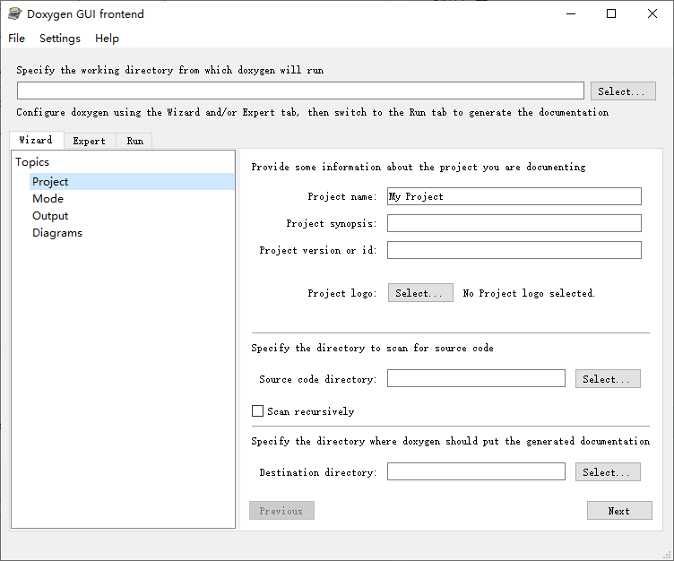

- `Wizard` : 配置文件的简单配置
- `Expert` : 配置文件的详细配置
- `Run` : 根据设定好的配置文件，调用 `doxygen.exe` 生成文档

## 简要配置

1. 工程项目配置

    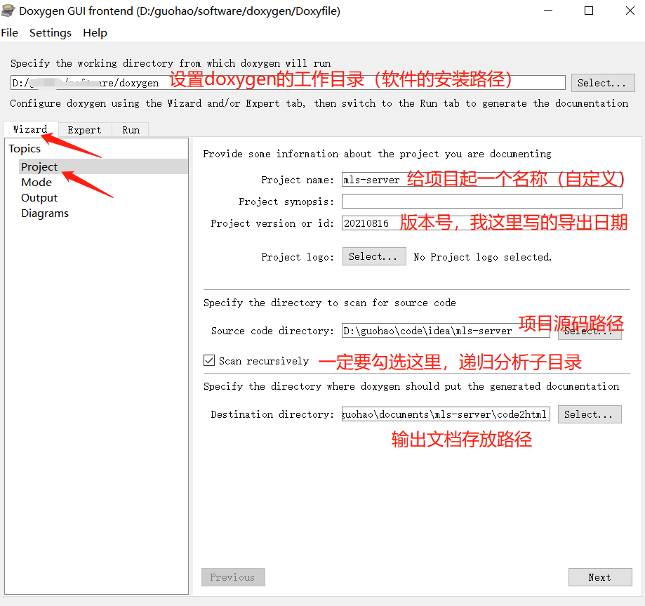

2. 源码信息配置

    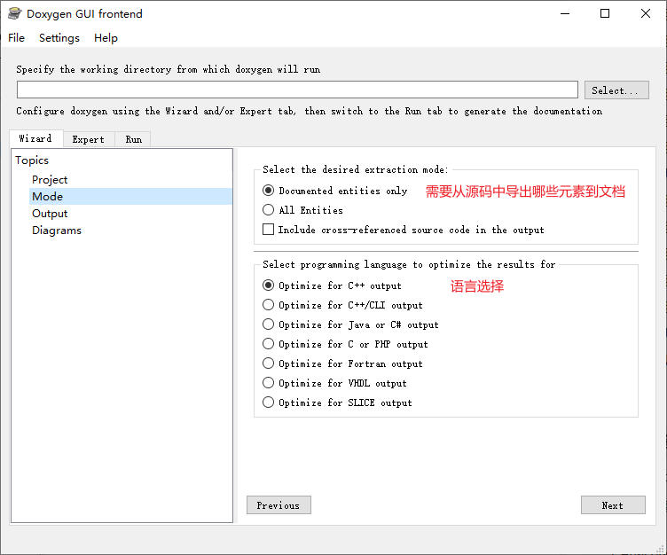

3. 输出文档配置

    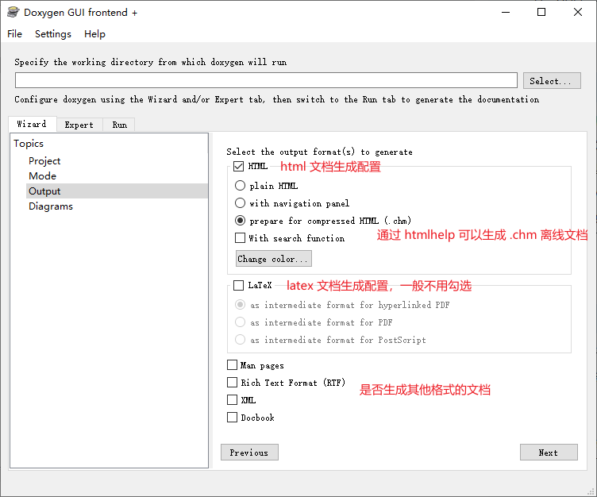

4. 有向图生成设置

    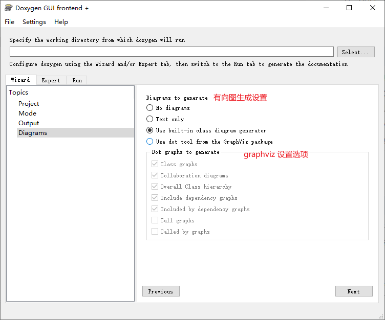

## 详细配置


1. 工程详细配置。除了下图展示的选项外，其他选项根据具体的语言类型进行选择

    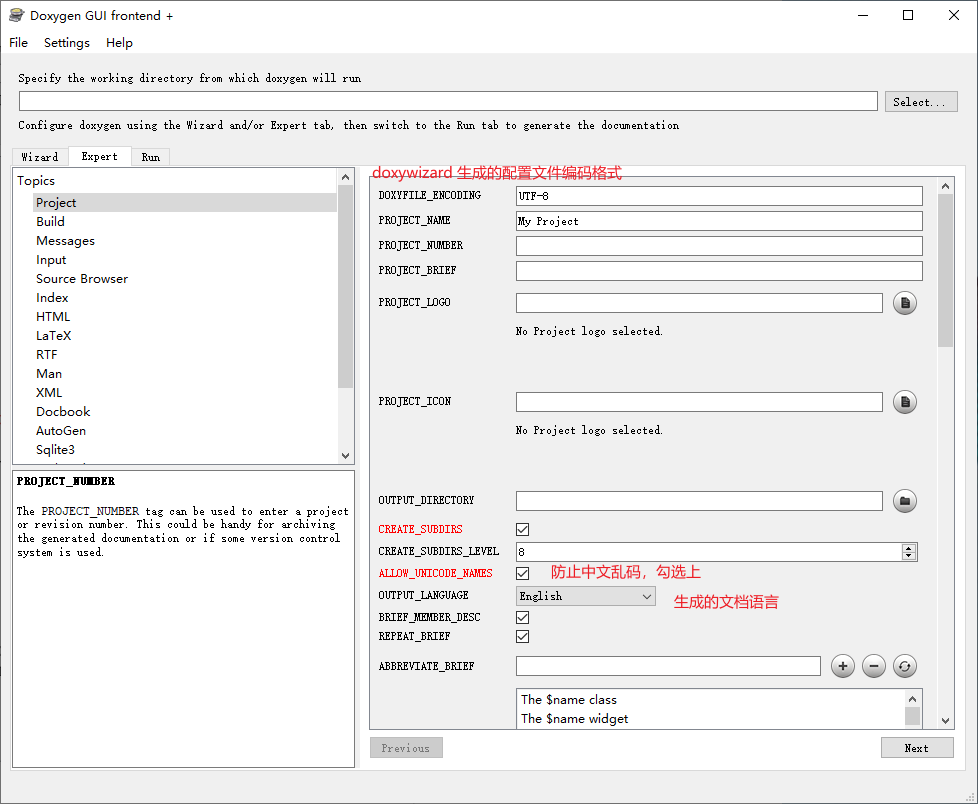

2. 源码信息配置

    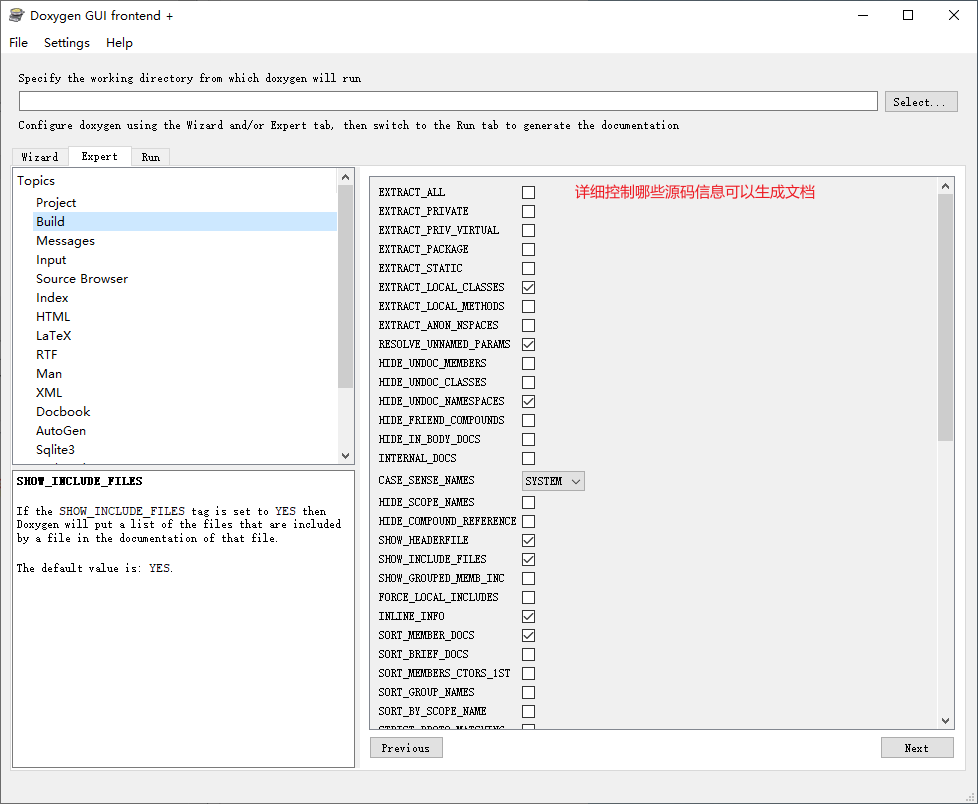

    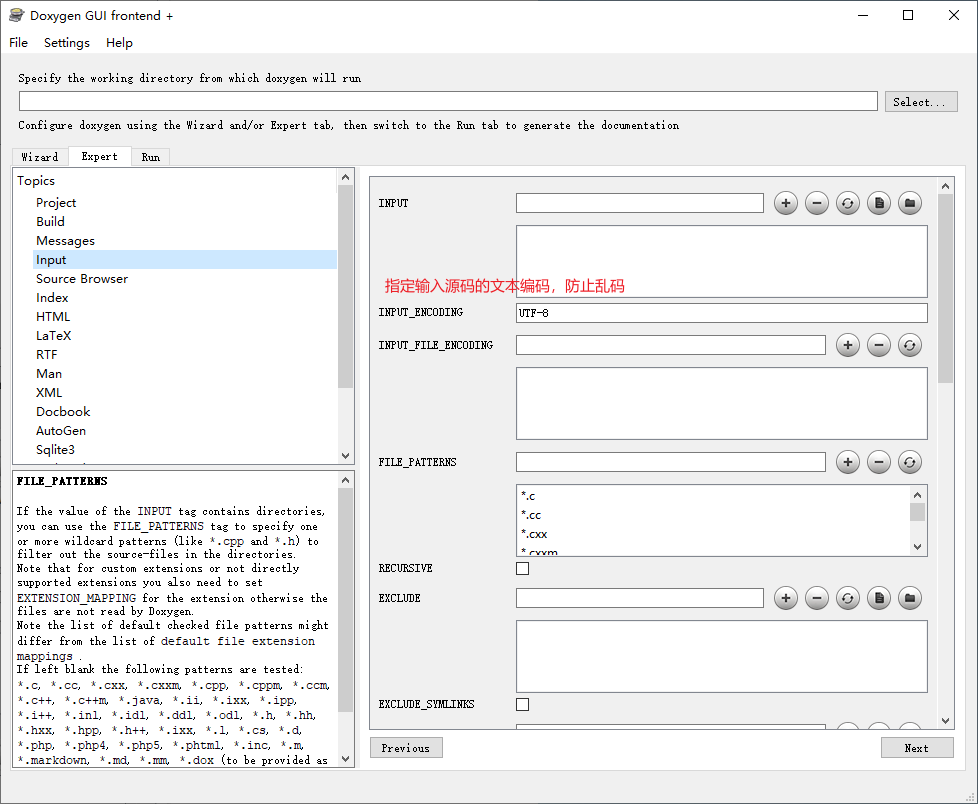

3. 配置 html 输出文档。配置  [HTML Help Workshop](https://learn.microsoft.com/en-us/previous-versions/windows/desktop/htmlhelp/microsoft-html-help-downloads) 用于生成 `.chm` 离线文档

    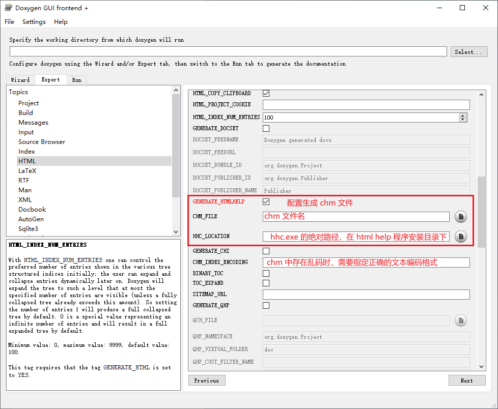

4. 配置 Graphviz 工具生成有向图

    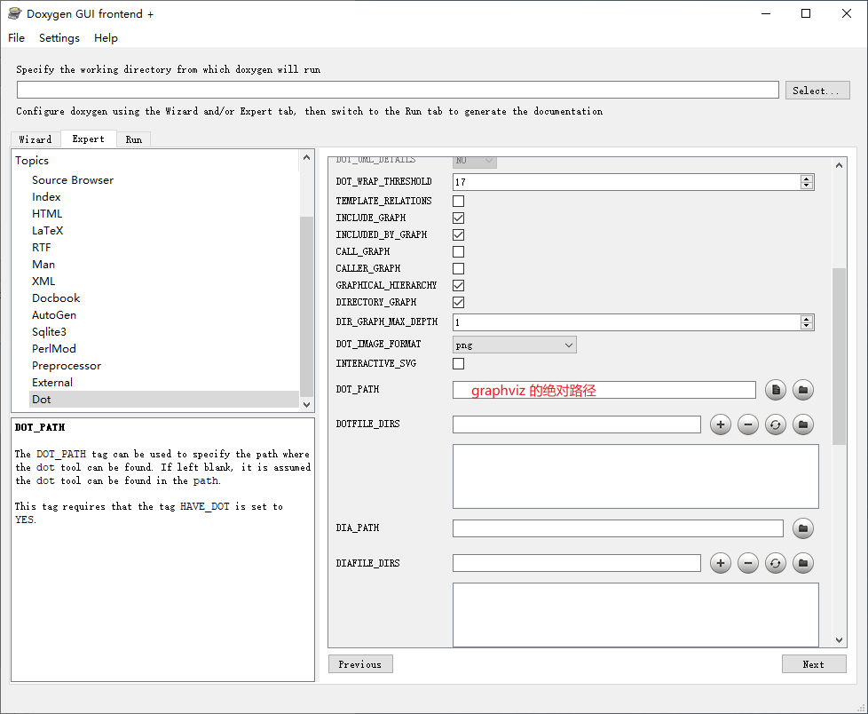


## 配置文件

完成上述配置流程后，可通过 `save` 或 `save as` 将当前配置通过配置文件 `doxyfile` 保存到本地，且之后通过 `open` 导入即可重复使用。

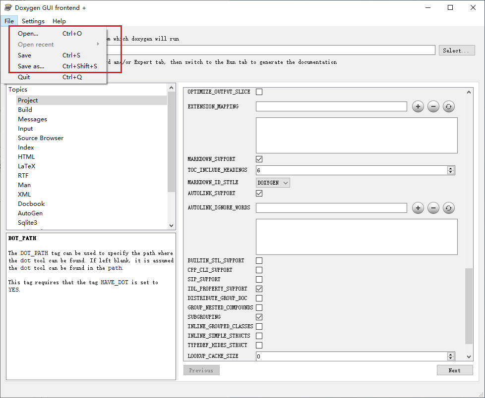

## 文档生成

点击 `run doxygen` 后，会在配置好的文档输出路径中生成 `html` 文件夹，里面存放的就是 html 形式的帮助文档。**若配置了 `chm` ，`html` 文件夹中也会生成一个 `.chm` 格式的离线文档。**

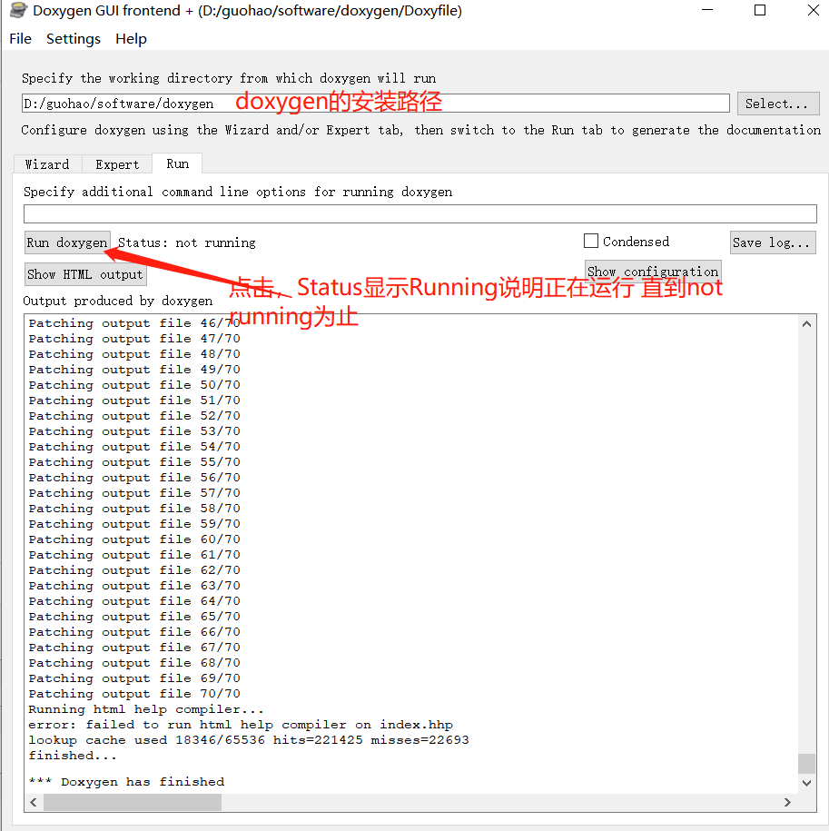


