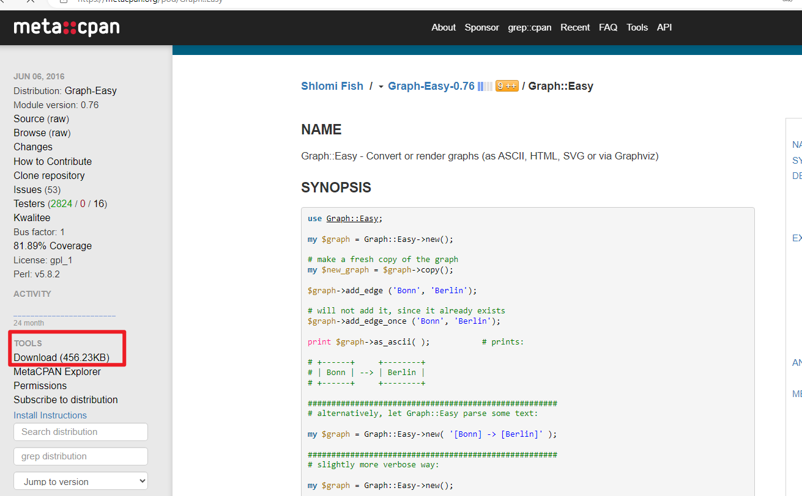

# Graph-easy

# 介绍

使用 [Graph:Easy](https://github.com/ironcamel/Graph-Easy.git) 工具可以流程图转化为文本。

```term
triangle@LEARN:~$ echo "[a] -> [b] -> [c] [b] -> [d]" | graph-easy
+---+     +---+     +---+
| a | --> | b | --> | d |
+---+     +---+     +---+
            |
            |
            v
          +---+
          | c |
          +---+
```

# 安装

1. `Graph:Easy` 是 `perl` 工具的模块库，因此需要先安装 `perl`

    ```term
    triangle@LEARN:~·$ sudo apt install perl 
    triangle@LEARN:~·$ sudo apt install graphviz // 可以配合导出 dot 格式
    ```
2. **在线安装** : 在线可以通过 `perl` 的 `CPAN` 包管理工具进行安装

    ```term
    triangle@LEARN:~$ cpan
    cpan[1] > install Graph::Easy
    ```

3. **离线安装** : 从 [仓库](https://metacpan.org/pod/Graph::Easy) 下载源码包

    

    然后依次执行

    ```term
    triangle@LEARN:~$ tar -zxvf Graph-Easy-0.76.tar.gz 
    triangle@LEARN:~$ cd Graph-Easy-0.76
    triangle@LEARN:~/Graph-Easy-0.76$ perl Makefile.PL
    triangle@LEARN:~/Graph-Easy-0.76$ make
    triangle@LEARN:~/Graph-Easy-0.76$ sudo make install
    ```

    若提示 `you may need to install the inc::Module::Install module` 则在 [仓库](https://metacpan.org/) 中搜索 `inc::Module::Install` 安装上述步骤安装即可

# 使用

- [语法介绍](https://blog.csdn.net/hbuxiaofei/article/details/109934802)

```term
triangle@LEARN:~$ echo "[a] -> [b] -> [c] [b] -> [d]" | graph-easy
+---+     +---+     +---+
| a | --> | b | --> | d |
+---+     +---+     +---+
            |
            |
            v
          +---+
          | c |
          +---+
```

