# 示波器

# 基本介绍

## 参数

- 带宽：示波器能检测信号的最高频率
- 采样率：应远高于带宽（通常 > 带宽的 2.5 倍）
- 通道数： 能同时展示几个信号。
- 存储深度：一次能展示多少采样点
- 触发能力：强大的触发选项是捕获异常事件的关键。
- 探头(非常重要)：质量的被动探头、有源探头、差分探头、电流探头是保证测量准确性的基础

## 探针

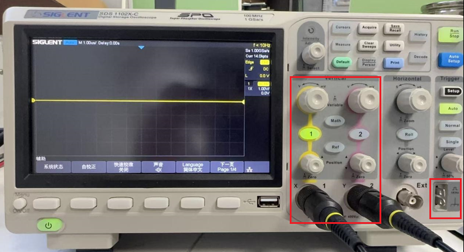

每一个通道对应一个探针，一个探针能展示一个波形（颜色同通道按钮，例如图中的黄色、粉色）。此外，在机器右下角还带有一个测试探针的标准方波生成接口

## 自动配置

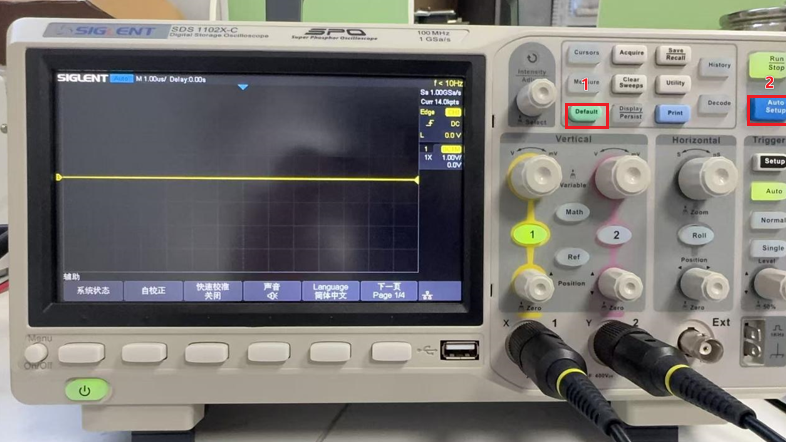

1. `default`: 配置重置
2. `Auto Setup`: 全自动配置参数

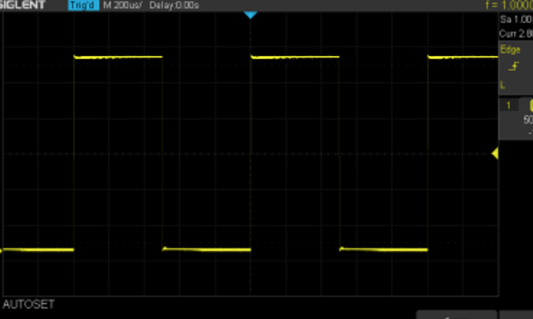

>[!note]
> 若连接标准接口，没有出现方波，需要调整探针的按钮

# 屏幕界面

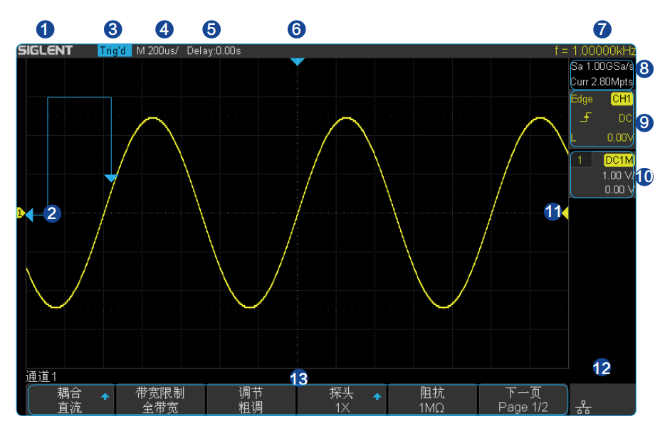

1. 商家商标 SIGLENT 为本公司注册商标。
2. 通道标记 / 波形：不同通道用不同的颜色表示，通道标记和波形的颜色一致。
3. 运行状态 
   - Arm（采集预触发数据）
   - Ready（等待触发）
   - Trigd（已触发）
   - Stop（停止采样）
   - Auto（自动采集）
4. 水平时基：表示屏幕`x`轴上每格所代表的时间长度
5. 触发位移：使用水平 `POSITION` 旋钮可以调节该参数。
6. 触发位置：显示屏幕中波形的触发位置。
7. 硬件频率计：显示当前触发通道波形信号的频率值。
8. 采样率和存储深度：显示示波器当前使用的采样率及存储深度。使用水平时基旋钮可以修改当前的采样率和存储深度。
9. 触发参数: 触发控制中的`Setup` 设置
10. 通道参数
11. 触发电平位置：显示当前触发通道的触发电平在屏幕上的位置。按下旋钮可使触发电平恢复至波形中心
12. 接口连接标识：显示`USB`和`LAN`口的连接，四通道机型支持`WIFI`功能
13. 菜单

# 控制面板

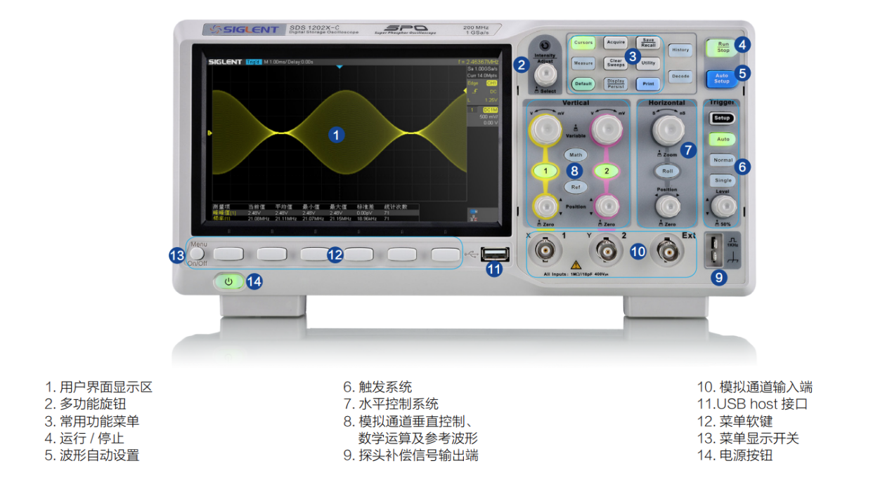

## 水平控制

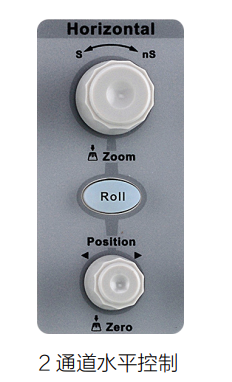

- 第一个旋钮：改变 `x` 轴的时间单位（界面上一个大格子宽度代表的时间）
- `roll`: 滚动实时展示波的形状
- 第二个旋律：在 `x` 方向左右移动波

## 垂直控制

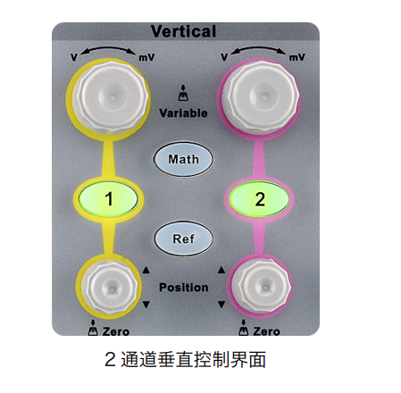

- 第一个旋钮：改变 `y` 轴的电压单位（界面上一个大格子宽度代表的电压）
- 数字按钮：探针通道开关
- 第二个旋钮：在 `y` 方向上下移动波
- `Math`: 对多个通道进行数学计算
- `Ref`: 存储与展示历史波形

## 触发控制

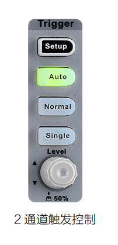

- `setup`: 配置波的展示参数，通过屏幕周围的按钮调节对应菜单设置
  - 触发类型
  - 通道
  - 噪声抑制
  - ..

    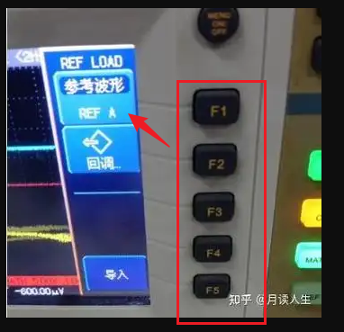

- `auto` : 根据配置自动展示波形，**不能保证配置是否正确**
- `Normal`: 根据配置展示波形，**若波不满足配置，则不展示**
- `Single`: 接收到一次触发信号之后会停止，配合 `RUN/STOP` 按钮重新启动匹配

## 运行控制

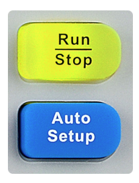

- `Run/Stop`: 示波器功能启动、停止
- `Auto Setup`: 波形自动设置

## 常用功能

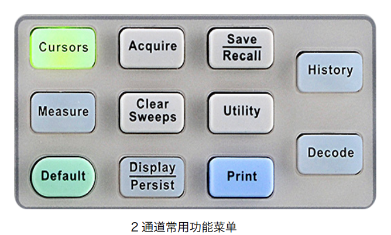

- `Default`: 主要恢复波形设置
- `Decode`: 解码通信协议数据
- `Cursor`: 获取指定位置的波信息
- `Measure`: 功能更强大的测量工具
- `Display/Persist`: 设置波展示样式
- `Acquire`: 配置采样功能
- `History`: 查看历史波的信息
- `Save/Recall`: 可存储 / 调 出的文件类型包括设置文件、波形文件、图像文件和 CSV 文件
- `Utility`: 系统设置