# PyAEDT 

# 介绍

## AEDT

**Ansys Electronics Desktop (AEDT)** :  是一个综合性的电子设计自动化（EDA）平台，用于电磁场（EM）仿真、热分析、信号完整性分析等。AEDT 提供了一个集成的工作环境，使用户可以方便地访问 Ansys 的多个 EDA 工具，从而支持从概念设计到详细仿真再到最终验证的全流程。AEDT 客户端提供了一个统一的用户界面，集成了多个 Ansys EDA 工具，包括
- `HFSS`：用于三维全波电磁场仿真。
- `Maxwell`：用于低频电磁场仿真。
- `Q3D Extractor`：用于提取高频电路中的寄生参数。
- `SIwave`：用于信号完整性和电源完整性分析。
- `Icepak`：用于热分析。


此外 AEDT 还提供了自动化仿真的能力
- `IronPython` : 可以执行所有的 AEDT 界面操作的脚本代码，支持宏录制生成（类似 Excel 中的 VB）
- `ACT` ： 在  `IronPython` 的基础上，可实现 GUI 开发
- `PyAEDT` : 关于 `IronPython` 的 Python 库实现

## IronPython


`IronPython` : 基于 `.NET` 实现的脚本，语法规则同 `Python`
- 可调用 AEDT 的所有 API
- 支持宏录制生成（类似 Excel 中的 VB）


```python
# ----------------------------------------------
# Script Recorded by ANSYS Electronics Desktop Version 2015.0.0
# 10:04:03  May 13, 2015
# ----------------------------------------------
import ScriptEnv
ScriptEnv.Initialize("Ansoft.ElectronicsDesktop")
oDesktop.RestoreWindow()
oProject = oDesktop.SetActiveProject("AntennaTemplate2")
oDesign = oProject.SetActiveDesign("HFSSDesign1")
oDesign.ChangeProperty(
    [
        "NAME:AllTabs",
        [
            "NAME:HfssTab",
            [
                "NAME:PropServers",
                "AnalysisSetup:Setup8"
            ],
            [
                "NAME:ChangedProps",
                [
                    "NAME:Solution Freq",
                    "MustBeInt:="           , False,
                    "Value:="               , "800MHz"
                ]
            ]
        ]
    ])
oDesign.ChangeProperty(
    [
        "NAME:AllTabs",
        [
            "NAME:LocalVariableTab",
            [
                "NAME:PropServers",
                "LocalVariables"
            ],
            [
                "NAME:ChangedProps",
                [
                    "NAME:N",
                    "Value:="               , "7"
                ]
            ]
        ]
    ])
```

## ACT

ACT 是面向 Ansys 产品的统一二次开发平台，可以基于 `IronPython` 脚本，定制工具界面，类似插件开发。

## PyAEDT

[PyAEDT（Python for Ansys Electronics Desktop)](https://github.com/ansys/pyaedt): 是一个 `Python` 库，而非 AEDT 的集成模块，为简化 AEDT API 交互而设计。它支持HFSS, Icepak, Maxwell 3D 和 Q3D Extractor，以及2D工具和Ansys Mechanical。PyAEDT还扩展到电路工具（如Nexxim）和系统仿真工具（如Twin Builder），甚至在 Ansys 布局工具（如 HFSS 3D Layout）中提供脚本功能。

实现功能：
- 自动化仿真 : 自动修改参数，然后得到一系列结果
- 系统化仿真 : 利用 Python 链接不同仿真软件或模块，实现不同软件或模块间的数据交互
- 设计优化
- 远程控制
- 数据后处理
- 数据格式化


# 安装

```term
triangle@LEARN:~$ pip install pyaedt
```

# 自动化仿真


## 界面操作案例

通过 AEDT 界面操作实现一个简单的 HFSS 天线仿真案例

1. 创建工程。`1` 创建 `project`；`2` 创建 `design`，包含 `Icepak`、`HFSS` 等
    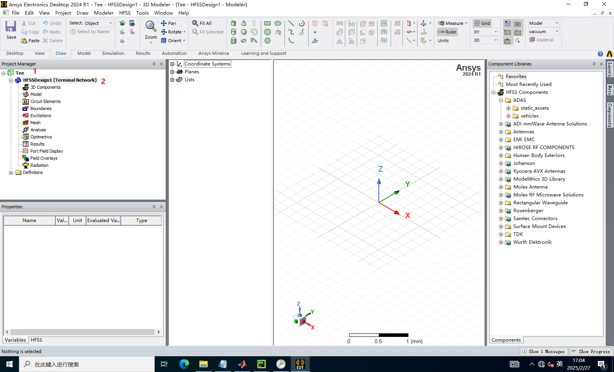

2. 设置求解模型

    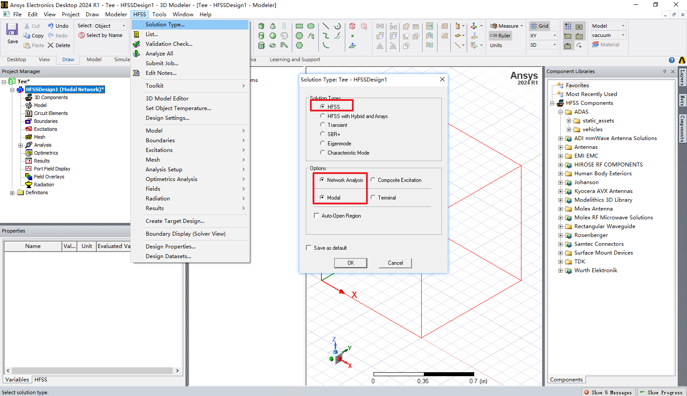

3. 调整单位

    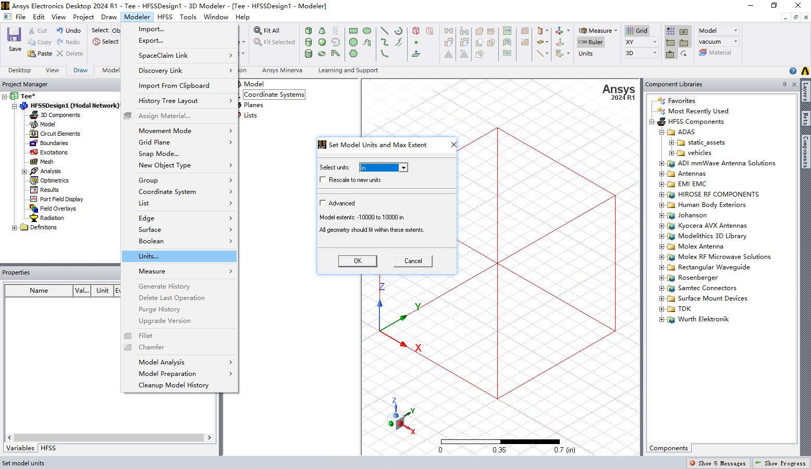

4. 创建模型

    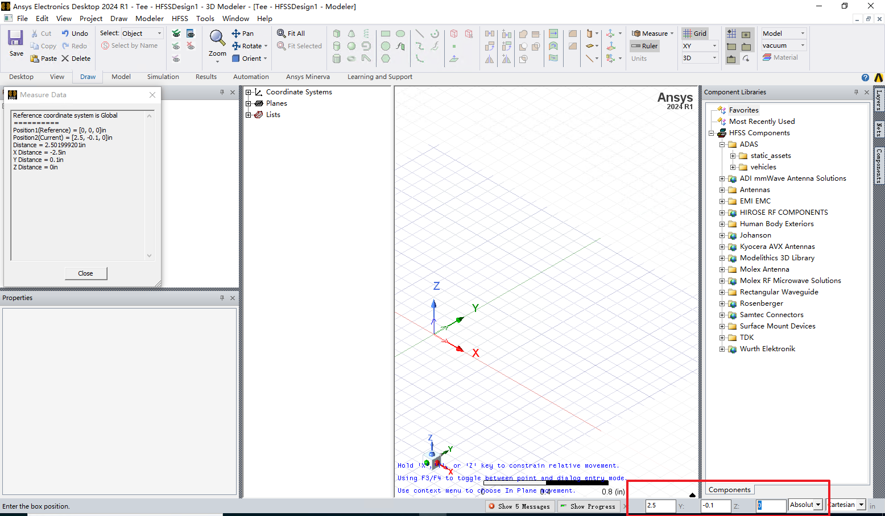

5. 调整模型属性，`value` 中可以添加自定义变量，实现参数化控制

    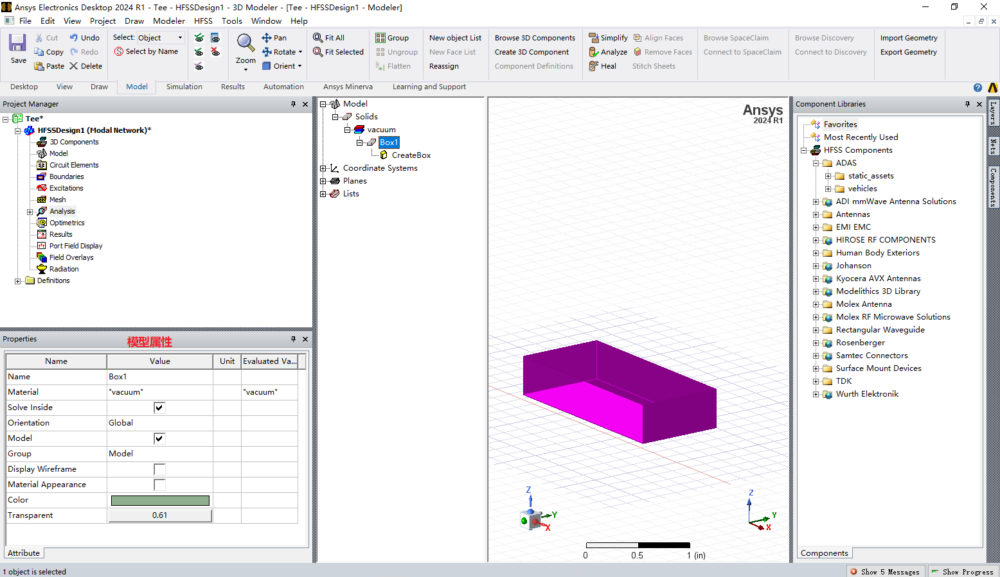

    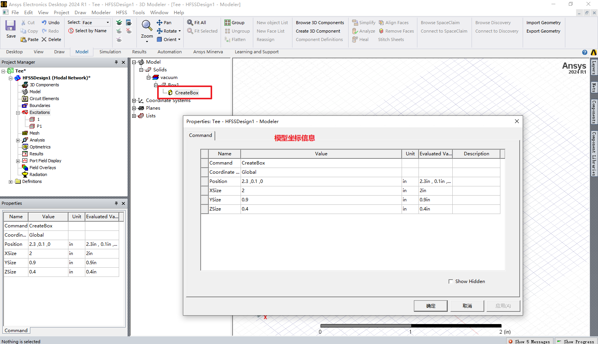

6. 选中目标边/面/物体，可设置边界条件/激励

    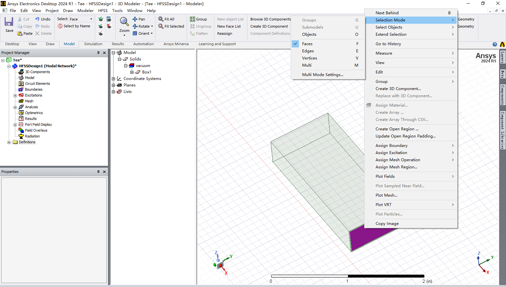

    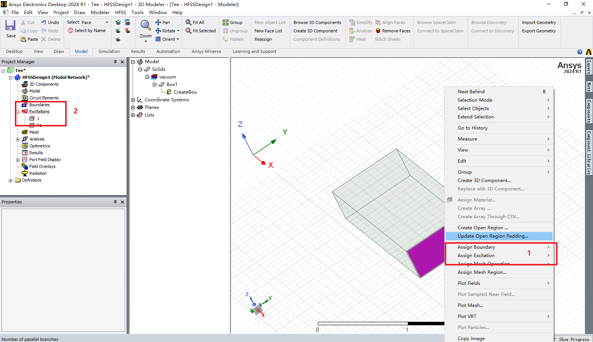

7. 设置分析规则

    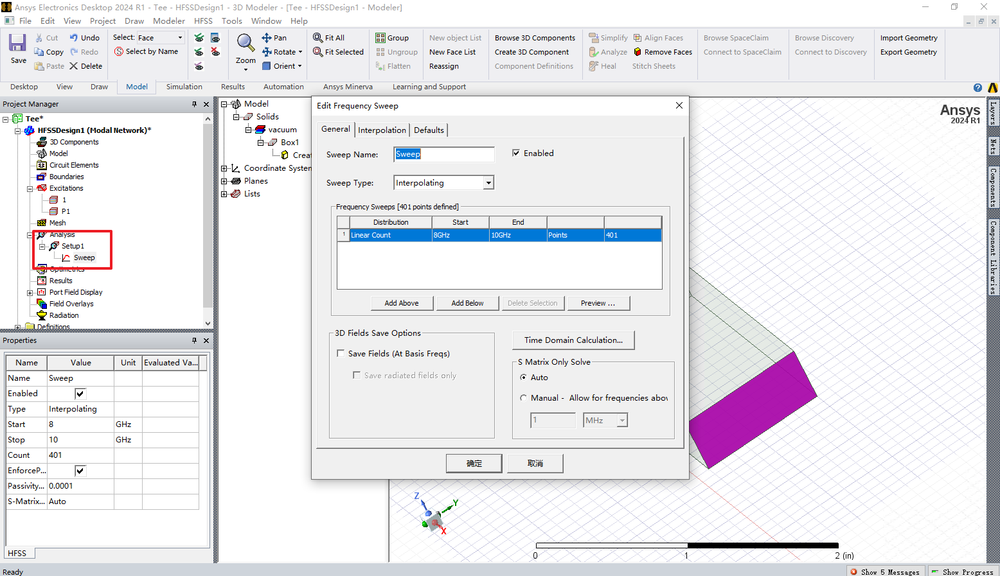

7. 检查项目工程是否正确

    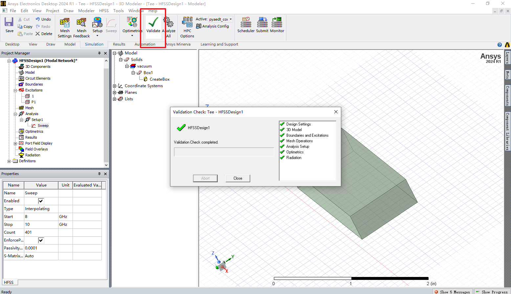

8. 运行工程

    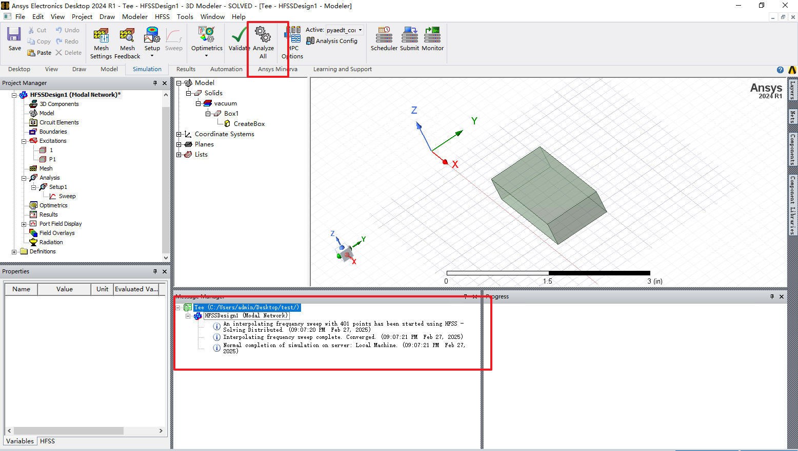

9. 生成曲线结果

    

    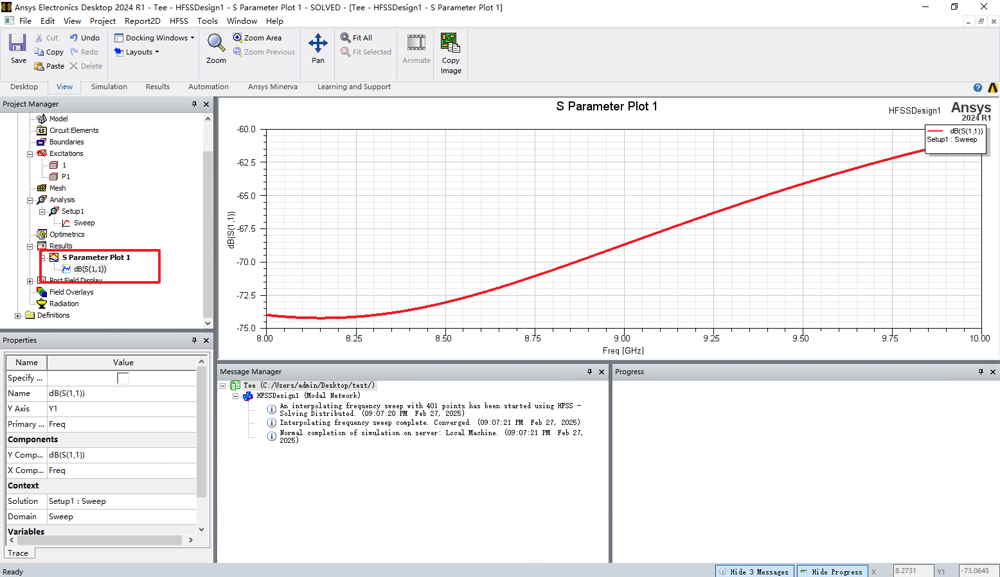

10. 生成场结果，选中场结果还能查看动画帧结果

    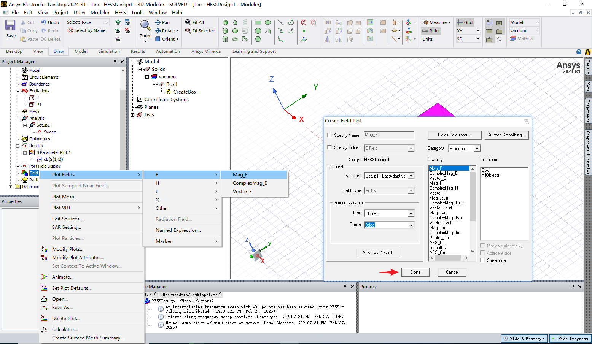

    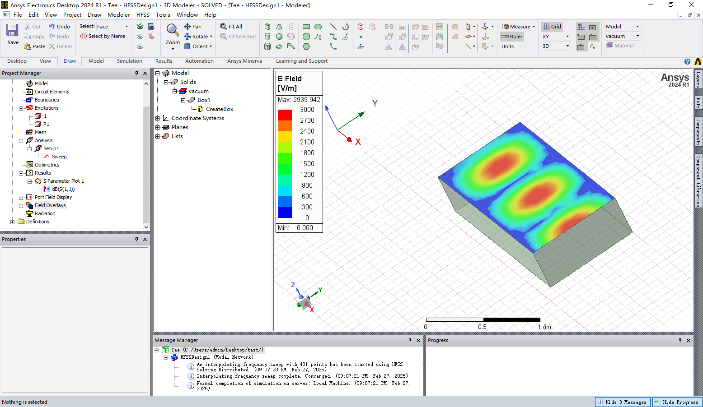

## 简洁版 API

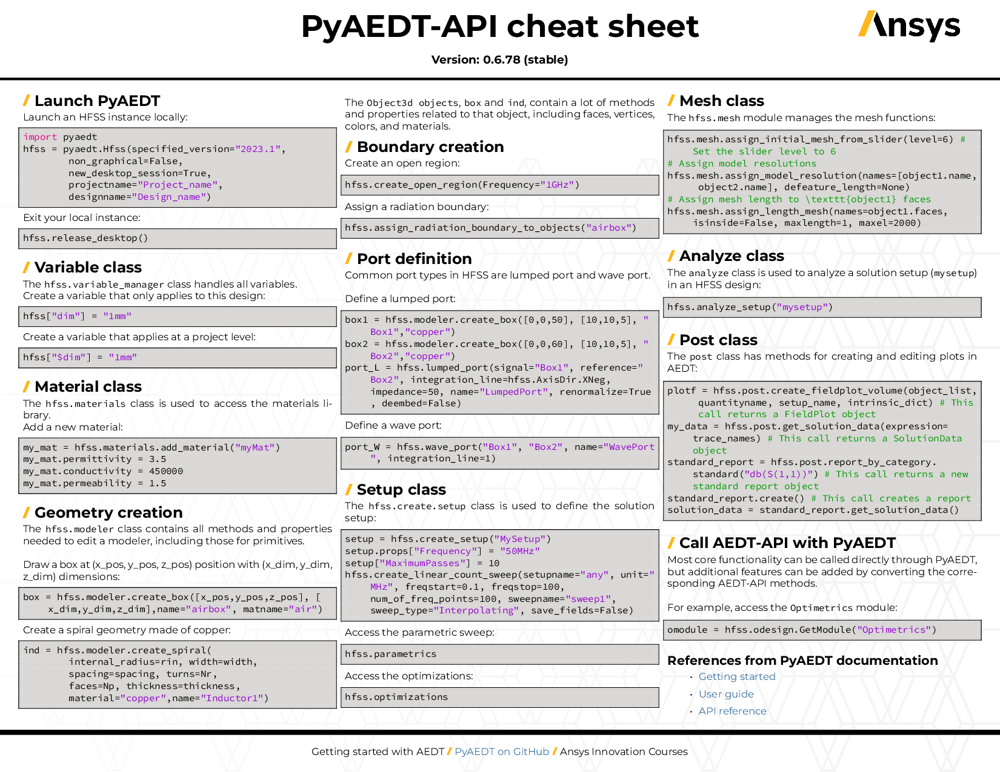

## 详细版 API

- [PyAEDT API 手册](https://aedt.docs.pyansys.com/version/stable/User_guide/index.html)

### 项目工程

```python
import ansys.aedt.core

# 以非界面模式启动一个 AEDT 客户端
desktop = ansys.aedt.core.Desktop(non_graphical=True)

# 创建 HFSS 设计
# 会自动创建 desktop，可省略 ansys.aedt.core.Desktop(non_graphical=True)
hfss = ansys.aedt.core.Hfss()

# 保存 HFSS  设计
hfss.save_project('path')

# 1. 添加模型
# 2. 设置边界条件/激励
# 3. 设置网格
# 4. 配置求解
# 5. 仿真运行
# 6. 结果后处理

# 关闭客户端
desktop.release_desktop()
```

### 配置

通过 `pyaedt_settings.yaml` 文件可以对 PyAEDT 工程进行全局配置，该配置文件可以放在以下路径
- 环境变量 `PYAEDT_LOCAL_SETTINGS_PATH` 自定义路径
- `windows` 默认路径 `%APPDATA%/pyaedt_settings.yaml`
- `linux` 默认路径 `/home/pyaedt_settings.yaml`


[配置文件](https://aedt.docs.pyansys.com/version/stable/_downloads/63bcf862f4be1c7d7e63271b501e63e2/pyaedt_settings.yaml)格式

```yaml
# Settings related to logging
log:
    # Enable or disable the logging of EDB API methods
    enable_debug_edb_logger: false
    # Enable or disable the logging of the geometry operators
    enable_debug_geometry_operator_logger: false
    # Enable or disable the logging of the gRPC API calls
    enable_debug_grpc_api_logger: false
    # Enable or disable the logging of internal methods
    enable_debug_internal_methods_logger: false
    # Enable or disable the logging at debug level
    enable_debug_logger: false
    # Enable or disable the logging of methods' arguments at debug level
    enable_debug_methods_argument_logger: false
    # Enable or disable the logging to the AEDT message window
    enable_desktop_logs: true
    # Enable or disable the logging to a file
    enable_file_logs: true
    # Enable or disable the global PyAEDT log file located in the global temp folder
    enable_global_log_file: true
    # Enable or disable the local PyAEDT log file located in the ``projectname.pyaedt`` project folder
    enable_local_log_file: false
    # Enable or disable the logging overall
    enable_logger: true
    # Enable or disable the logging to STDOUT
    enable_screen_logs: true
    # Global PyAEDT log file path
    global_log_file_name: null
    # Global PyAEDT log file size in MB
    global_log_file_size: 10
    # Date format of the log entries
    logger_datefmt: '%Y/%m/%d %H.%M.%S'
    # PyAEDT log file path
    logger_file_path: null
    # Message format of the log entries
    logger_formatter: '%(asctime)s:%(destination)s:%(extra)s%(levelname)-8s:%(message)s'
    # Path to the AEDT log file
    aedt_log_file: null

# Settings related to Linux systems running LSF scheduler
lsf:
    # Command to launch in the LSF Scheduler
    custom_lsf_command: null
    # Command to launch the task in the LSF Scheduler
    lsf_aedt_command: 'ansysedt'
    # Number of LSF cores
    lsf_num_cores: 2
    # Operating system string
    lsf_osrel: null
    # LSF queue name
```

### 变量

- **常量**

```python
import pyaedt

hfss = pyaedt.Hfss()

# 定义 project 范围内的变量，通过 `$` 进行标识
hfss["$dim"] = "1mm"

# 定义 design 范围内的变量
hfss["dim"] = "1mm"

# 通过 `variable_manager` 更细致的配置变量
hfss.variable_manager.set_variable(
    name ='name',
    expression= '3 * cos(34 deg)',
    read_only=False,
    overwrite=True
)

# 删除变量
hfss.variable_manager.delete_variable("name")

```

- **带有单位的变量**

```python
import pyaedt

# 定义带有单位的变量
var1 = pyaedt.Quantity(
    expression= 1,
    unit="GHz"
)

# 带有单位的变量计算
var2 = var1 + 1
var3 = var1 + "1MHz"
```

- **`Optimetrics` 参数设计优化**

设计优化模块 `Optimetrics` 可以自动分析设计参数的变化对求解结果的影响
- 参数扫描分析 `Parametric`：可用来分析物体的性能随着指定变量的变化而变化的关系，在优化设计前一般使用参数扫描分析功能来确定被优化变量的合理变化区间
- 优化设计`Optimization`：根据特定的优化算法在所有可能的设计变化中寻找出一个满足设计要求的值的过程
- 调谐分析`Tuning)`：在改变变量值的同时实时显示求解结果
- 灵敏度分析`Sensitivity`：分析设计参数的微小变化对求解结果的影响程度
- 统计分析`Statistical`：利用统计学的观点来研究设计参数的容差对求解结果的影响，常用的方法是蒙特卡罗法


```python
import pyaedt

# 参数扫描分析
hfss.parametrics.add(
    variable="var",
    start_point= 1,
    end_point= 100,
    step= 1,
    variation_type= "LinearCount",
)

# 优化设计
hfss.optimizaitons.add(
    calculation= "name"
)
```

### 模型

```python
# `from ansys.aedt.core import *` 就是 ansys.aedt.core 包的简化导入方式
import pyaedt
import pyaedt.modeler
import pyaedt.modeler.cad.elements3d as elements3d

# 打开 AEDT 并创建 HFSS
hfss = pyaedt.Hfss()

# 创建模型 hfss.modeler.create_xxxx
boxA = hfss.modeler.create_box(
    origin=[0,0,0], # 坐标
    sizes=[10,"dim",10], # 边长， `dim` 为自定义变量
    name="boxA", # 模型名
    material= "aluminum" # 材质
)

# 读写属性
boxA.color = "red"
boxA.transparency = "0.4"


# 根据 模型名 或者 模型ID 获取模型
box = hfss.modeler["boxA"]

# 遍历边、点、面
face : elements3d.FacePrimitive
for face  in box.faces:
    edge : elements3d.EdgePrimitive
    for edge in face.edges:
        vertice : elements3d.VertexPrimitive
        for vertice in edge.vertices:
            print(vertice.position)

# 添加模型
boxB = hfss.modeler.add_vehicle(
    input_dir = "folder", # 包含描述模型的 `.json` 文件与模型文件 `.a3dcomp`
    speed=0, # 边界条件参数
    yaw=10,
    ...
)

# 布尔操作
boxA.unite(boxB)
boxA.subtract(boxB)

# 复制模型
hfss.modeler.duplicate_along_line(
    assignment = "boxA", # 模型名/模型ID
    vector = [x,y,z], # 复制方向
    clones = 2, # 复制数量
)

# 关闭
hfss.release_desktop()
```

### 网格

```python
import pyaedt
import pyaedt.modules
import pyaedt.modules.Mesh

hfss = pyaedt.Hfss()

# 通用网格操作配置
operates = hfss.mesh.meshoperations
meshOp :pyaedt.modules.Mesh.MeshOperation = operates[0]
meshOp.props["prop"] = "value"
meshOp.update()

# Icepak 独有操作
icepak = pyaedt.Icepak()
globalMesh = icepak.mesh.global_mesh_region
```


### 求解

在开始仿真计算前，还需进行求解设置，即创建 `setup` 

```python
import pyaedt
import pyaedt.modules
import pyaedt.modules.Mesh

hfss = pyaedt.Hfss()

# 创建新的 setup
setup = hfss.create_setup("new")

# 配置 setup 属性
setup.props["MaximumPasses"] = 10
setup["Frequency"] = "10GHz"

# 在 setup 下创建 sweep
setup.create_linear_step_sweep(
    unit= "GHz",
    start_frequency=5,
    stop_frequency=10,
    name="sweep"
)

# 访问全部的 setup 配置
all = hfss.setups
```


### 仿真

```python
import pyaedt

hfss = pyaedt.Hfss()


# 启动仿真
hfss.analyze_setup(
    name="setup", # setup 名
    cores= 4,  # CPU 数
    gpus= 0, # GPU 数
    tasks = 1, # 仿真任务数
)

# 启动批量仿真
hfss.solve_in_batch()

# `analyze_setup` 与 `solve_in_batch` 两种仿真模式的封装
hfss.analyze(
    solve_in_batch = False, # 切换两种模式
)
```

### 后处理

```python
import pyaedt

hfss = pyaedt.Hfss()

# 生成图像
hfss.post.create_report(
    expressions=["db(S11)","db(S12)"]
)

# 获取数据
trace = hfss.get_traces_for_plot()
report = hfss.post.create_report(trace)
solution = report.get_solution_data()
```