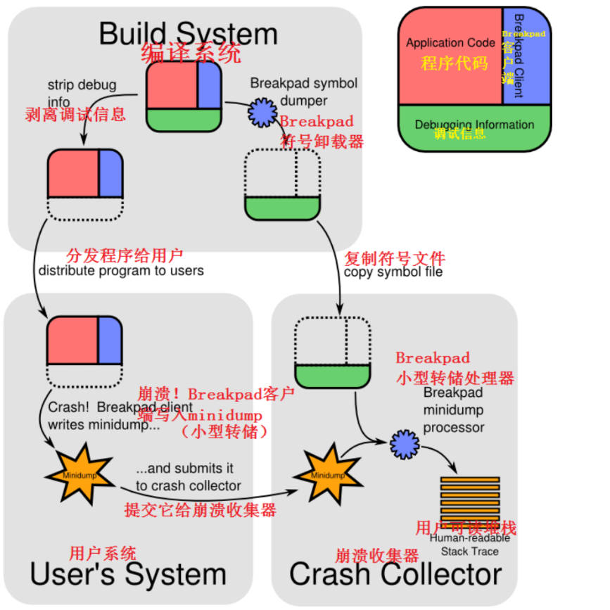

# windbg

# 调试方式

主要的调试方式有两种：
1. 静态分析 dump 文件
    - mini dump: 文件小，内存信息保存较少
    - full dump: 文件大，内存信息较全
3. 动态分析目标程序。动态分析又分为「启动」和「附加」
    - 启动：直接启动程序并调试
    - 附加：程序先运行起来，然后将调试器附加到进程


# dump 

## 生成

- `cpp`接口生成

该方式生成的是 `mini dump` 文件，且某些异常可能会捕获不到，例如数组越界。

```cpp
#include <Windows.h>
#include <DbgHelp.h>
#pragma comment(lib,"Dbghelp.lib")
/// <summary>
/// 生成dmp文件
/// </summary>
/// <param name="exceptionPointers">异常信息</param>
/// <param name="path">文件路径（包括文件名）</param>
/// <returns></returns>
static int GenerateDump(EXCEPTION_POINTERS* exceptionPointers, const std::string& path)
{
	HANDLE hFile = ::CreateFileA(path.c_str(), GENERIC_WRITE, 0, NULL, CREATE_ALWAYS, FILE_ATTRIBUTE_NORMAL, NULL);
	if (INVALID_HANDLE_VALUE != hFile)
	{
		MINIDUMP_EXCEPTION_INFORMATION minidumpExceptionInformation;
		minidumpExceptionInformation.ThreadId = GetCurrentThreadId();
		minidumpExceptionInformation.ExceptionPointers = exceptionPointers;
		minidumpExceptionInformation.ClientPointers = TRUE;
		bool isMiniDumpGenerated = MiniDumpWriteDump(
			GetCurrentProcess(),
			GetCurrentProcessId(),
			hFile,
			MINIDUMP_TYPE::MiniDumpNormal,
			&minidumpExceptionInformation,
			nullptr,
			nullptr);
		CloseHandle(hFile);
		if (!isMiniDumpGenerated)
		{
			printf("MiniDumpWriteDump failed\n");
		}
	}
	else
	{
		printf("Failed to create dump file\n");
	}
	return EXCEPTION_EXECUTE_HANDLER;
}

// 注册异常处理函数，采用的是 SEH 机制
LPTOP_LEVEL_EXCEPTION_FILTER SetUnhandledExceptionFilter(
  [in] LPTOP_LEVEL_EXCEPTION_FILTER lpTopLevelExceptionFilter
);
```
- [CrashRpt](https://crashrpt.sourceforge.net/)

通过在 hook 接口 `CreateThread()` ，为每一个线程挂载一个异常 `unhandled exception filter`。这就导致 CrashRpt 没有修改到的线程，就不能捕获到相应异常信息。

- [Breakpad](https://github.com/google/breakpad)

实现了客户端与服务端，支持对 dump 的远程收集



- 调试器中生成

- 任务管理器生成 `full dump`


## 分析

- `SEH` 异常类型

```cpp
#define STILL_ACTIVE                        STATUS_PENDING
#define EXCEPTION_ACCESS_VIOLATION          STATUS_ACCESS_VIOLATION
#define EXCEPTION_DATATYPE_MISALIGNMENT     STATUS_DATATYPE_MISALIGNMENT
#define EXCEPTION_BREAKPOINT                STATUS_BREAKPOINT
#define EXCEPTION_SINGLE_STEP               STATUS_SINGLE_STEP
#define EXCEPTION_ARRAY_BOUNDS_EXCEEDED     STATUS_ARRAY_BOUNDS_EXCEEDED
#define EXCEPTION_FLT_DENORMAL_OPERAND      STATUS_FLOAT_DENORMAL_OPERAND
#define EXCEPTION_FLT_DIVIDE_BY_ZERO        STATUS_FLOAT_DIVIDE_BY_ZERO
#define EXCEPTION_FLT_INEXACT_RESULT        STATUS_FLOAT_INEXACT_RESULT
#define EXCEPTION_FLT_INVALID_OPERATION     STATUS_FLOAT_INVALID_OPERATION
#define EXCEPTION_FLT_OVERFLOW              STATUS_FLOAT_OVERFLOW
#define EXCEPTION_FLT_STACK_CHECK           STATUS_FLOAT_STACK_CHECK
#define EXCEPTION_FLT_UNDERFLOW             STATUS_FLOAT_UNDERFLOW
#define EXCEPTION_INT_DIVIDE_BY_ZERO        STATUS_INTEGER_DIVIDE_BY_ZERO
#define EXCEPTION_INT_OVERFLOW              STATUS_INTEGER_OVERFLOW
#define EXCEPTION_PRIV_INSTRUCTION          STATUS_PRIVILEGED_INSTRUCTION
#define EXCEPTION_IN_PAGE_ERROR             STATUS_IN_PAGE_ERROR
#define EXCEPTION_ILLEGAL_INSTRUCTION       STATUS_ILLEGAL_INSTRUCTION
#define EXCEPTION_NONCONTINUABLE_EXCEPTION  STATUS_NONCONTINUABLE_EXCEPTION
#define EXCEPTION_STACK_OVERFLOW            STATUS_STACK_OVERFLOW
#define EXCEPTION_INVALID_DISPOSITION       STATUS_INVALID_DISPOSITION
#define EXCEPTION_GUARD_PAGE                STATUS_GUARD_PAGE_VIOLATION
#define EXCEPTION_INVALID_HANDLE            STATUS_INVALID_HANDLE
#define EXCEPTION_POSSIBLE_DEADLOCK         STATUS_POSSIBLE_DEADLOCK
#define CONTROL_C_EXIT                      STATUS_CONTROL_C_EXIT
```

- 命令

```term
triangle@LEARN:~$ .ecxr // Exception Context Record, 显示异常上下文
triangle@LEARN:~$ kn // k* 系列指令展示当前线程的栈帧，n : 展示栈帧 numbers
  *** Stack trace for last set context - .thread/.cxr resets it
 # Child-SP          RetAddr               Call Site
00 000000a4`812ffc50 00007ff7`4a903a89     demo!main+0x2e [E:\testspace\cpp\src\main.cpp @ 72] 
01 000000a4`812ffca0 00007ff7`4a90392e     demo!invoke_main+0x39 [D:\a\_work\1\s\src\vctools\crt\vcstartup\src\startup\exe_common.inl @ 79] 
...
04 000000a4`812ffd90 00007fff`beb77344     demo!mainCRTStartup+0xe [D:\a\_work\1\s\src\vctools\crt\vcstartup\src\startup\exe_main.cpp @ 17] 
...
triangle@LEARN:~$ lm vm demo* // lm, List Loaded Modules 展示模块对应的 pdb，用于检查pdb是否加载成功
Browse full module list
start             end                 module name
00007ff7`4a900000 00007ff7`4a913000   demo     C (private pdb symbols)  C:\ProgramData\Dbg\sym\demo.pdb\5AC16F7DBB3F4C94BE2F3022BCD56A231\demo.pdb
    Loaded symbol image file: demo.exe
	...
    Image name: demo.exe
    Browse all global symbols  functions  data
	// 时间是唯一的，可以当作唯一表示符
    Timestamp:        Wed Oct 25 21:08:12 2023 (6539133C) 
	...
triangle@LEARN:~$ .reload /f demo.exe // 强制加载 pdb 文件
```

# 附加

## 辅助工具

- [Process Explorer](https://learn.microsoft.com/en-us/sysinternals/downloads/process-explorer): 比任务管理器更适合用来程序开发，可查看的进程信息更多且可以查看堆栈信息

