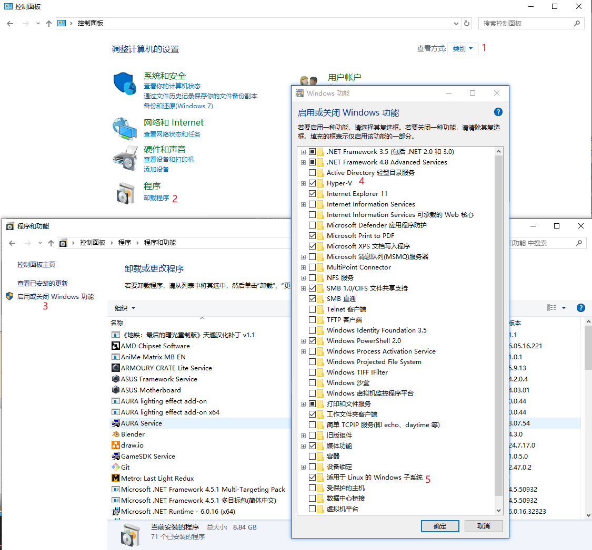
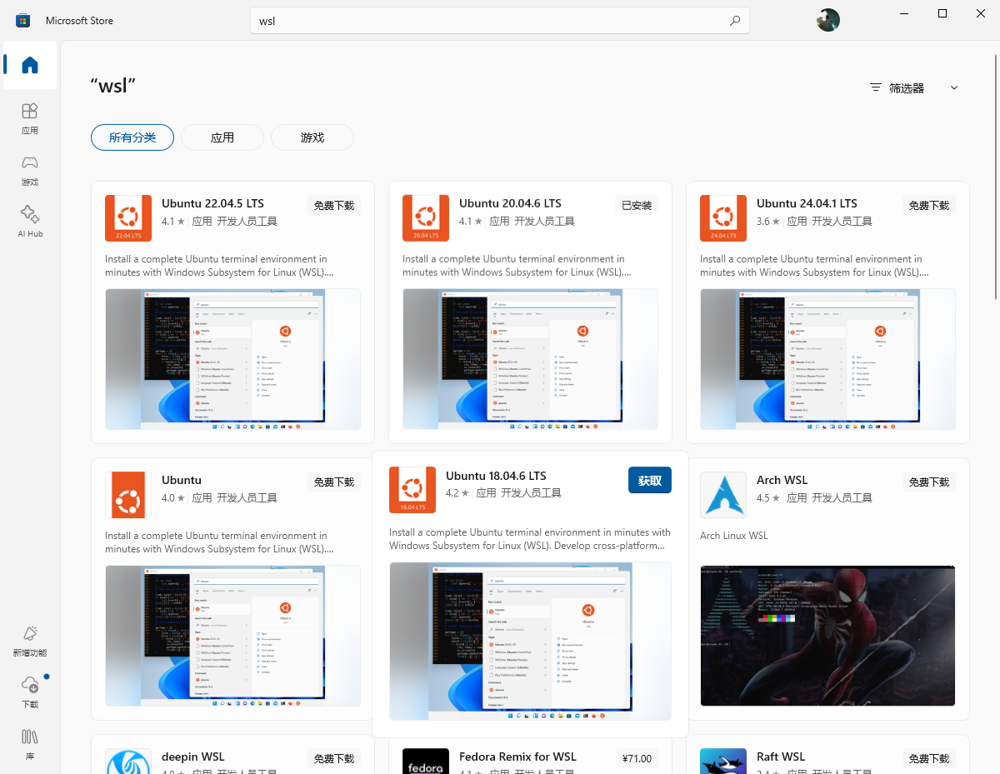

# WSL

# 安装

1. 开启 `windows` 支持选项



2.  `windows store` 中下载 `wsl`



3. [可选] 升级 `WSL2` 
    1. 下载[内核包](https://wslstorestorage.blob.core.windows.net/wslblob/wsl_update_x64.msi)，并安装

    2. 切换版本

```term
triangle@LEARN:~$ wsl --list -v // 查看安装版本 name
NAME            STATE           VERSION
* Ubuntu-20.04    Stopped         1
triangle@LEARN:~$ wsl --set-version Ubuntu-20.04 2 // 切换版本
正在进行转换，这可能需要几分钟时间...
有关与 WSL 2 的主要区别的信息，请访问 https://aka.ms/wsl2
转换完成。
```

# 命令行

```term
triangle@LEARN:~$ wsl --help // 查看帮助信息
triangle@LEARN:~$ wsl --list -v // 查看安装版本
triangle@LEARN:~$ wsl // 启动当前激活的 wsl 
```


# 网络代理

1. `powershell` 管理员模式下执行下列命令，使得 `WSL2` 能通过防火墙

```term
triangle@LEARN:~$ New-NetFirewallRule -DisplayName "WSL" -Direction Inbound  -InterfaceAlias "vEthernet (WSL)"  -Action Allow
```

2. 代理工具开启「局域网代理」
3. 设置代理

```term
triangle@LEARN:~$ ipconfig.exe
    ...
以太网适配器 vEthernet (WSL):

   连接特定的 DNS 后缀 . . . . . . . :
   本地链接 IPv6 地址. . . . . . . . : fe80::b578:9760:b8f3:fee3%55
   IPv4 地址 . . . . . . . . . . . . : 172.18.160.1
   子网掩码  . . . . . . . . . . . . : 255.255.240.0
   默认网关. . . . . . . . . . . . . :
   ...
triangle@LEARN:~$ export all_proxy=htttp:/172.18.160.1:port
```


