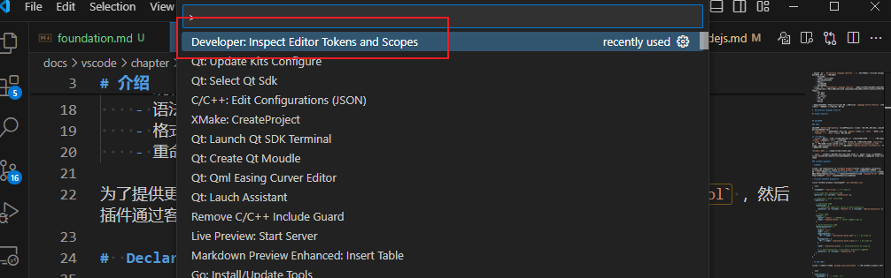
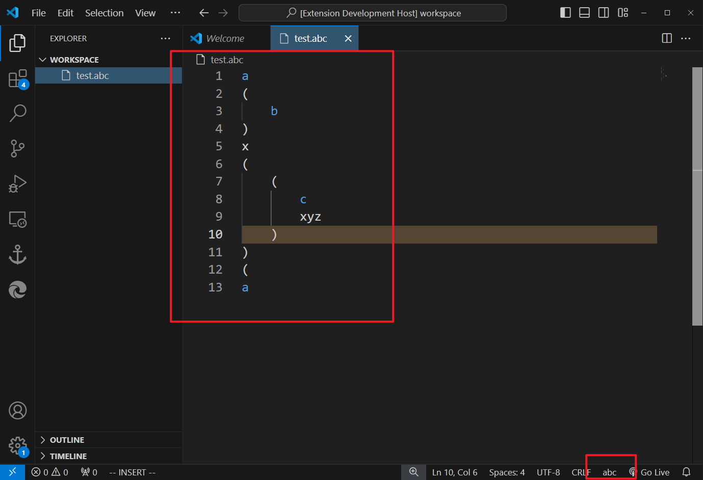
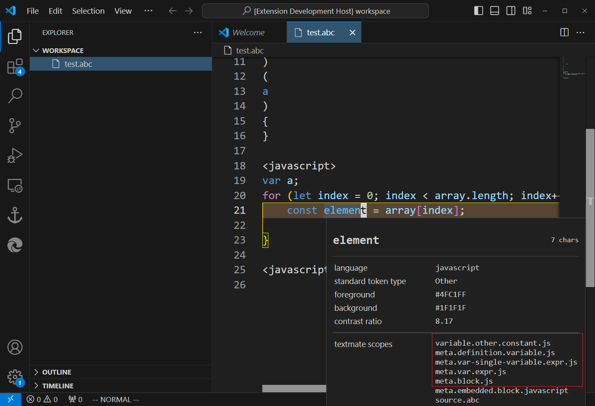
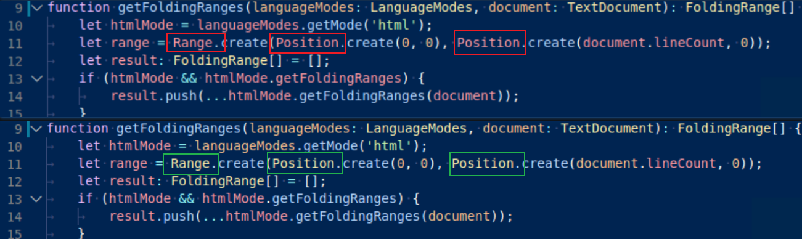
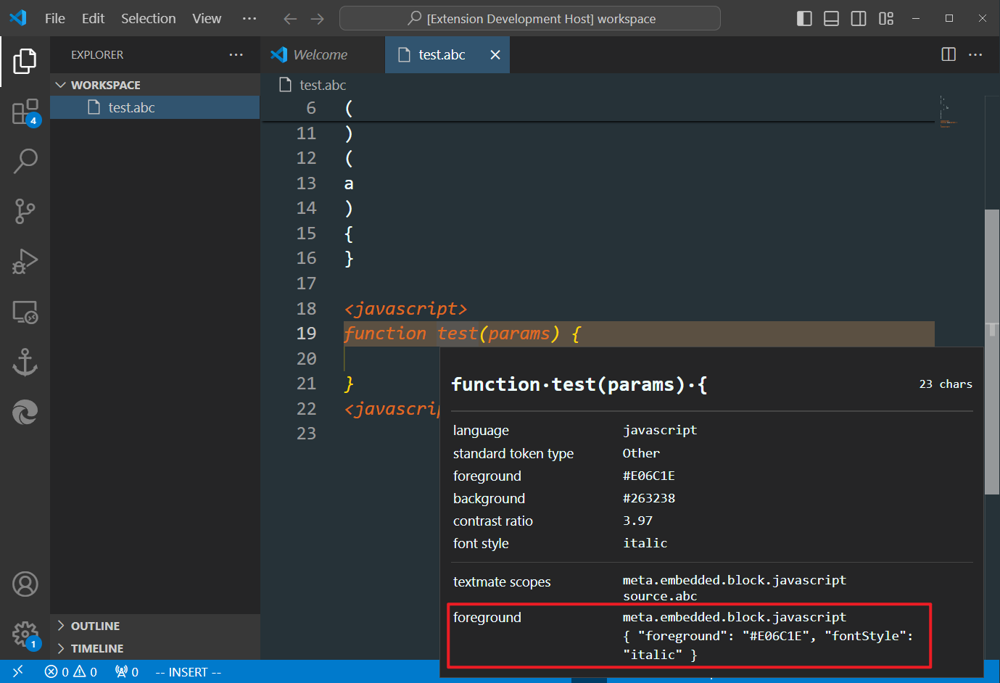
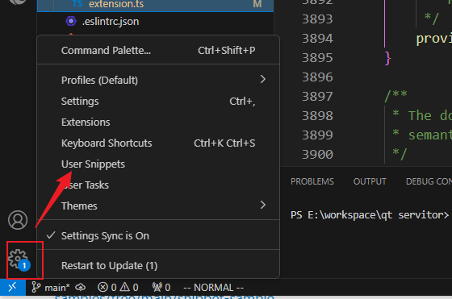

# 声明语言特性

# 介绍

在 vscode 中，语言特性分为两类： 

- 声明语言特性 `Declarative language features` : 属于文本编辑特性，vscode 已经提供了专门的 API 用于实现其功能
    - 语法高亮
    - 括号匹配与自动补全
    - 固定代码片段补全
    - 代码缩进
    - 注释快捷键
    - 代码块折叠
- 程序语言特性 `Programmatic language features` : 需要自己编写额外模块，对项目代码进行动态分析，才能实现相关功能。vscode 只提供了相关的界面展示接口，具体展示内容依赖于代码分析结果
    - API 提示
    - 自动补全
    - 跳转到定义
    - 语法检查
    - 格式化
    - 重命名

为了提供更强的语言分析能力，vscode 运行用户自定义 `Language Server Protocol` ，然后插件通过客户端的形式连接上语言服务。

# Scope inspector

vscode 自带的语法规则探测工具。



# 语法高亮

## 介绍

语法高亮 `Syntax highlighting` 确定了源码展示在 vscode 中的颜色和样式。关于语法高亮存在两个重要的概念：
- `Tokenization` : 将源码划分为各个小节 `Segment`，然后使用 `token` 标记这些小节
- `Theming` : 为 `token` 显示添加样式或颜色
  
**基本概念：**
- `Tocken`: 可以是一个或多个字符，表示的是同一类语法元素，例如 `+ - /` 是操作符、`varVal` 是变量名，`"test"` 是字符串。
- `Scope` : 通过 `.` 进行命令，用于描述 Tocken 的一个数据结构，例如 `javascript` 中的 `+` 操作符号 Tocken 对应的 scope 是 `keyword.operator.arithmetic.js`，且 Scope 也存在嵌套关系，`source.js` 是最底层的，`keyword.operator.arithmetic.js` 则是最靠近操作符的。 


- `Theme` : 描述文本颜色与样式。vscode 会将 Theme 添加到各个 Scope 上，这样就能使得 Tocken 具有文本样式的区分，即「语法高亮」，且 Token 会优先使用最靠近的 Scope 相关的 Theme 

## TextMate grammars

- **介绍**

vscode 中的 Tokenization 由 [TextMate grammars](https://macromates.com/manual/en/language_grammars) 解析。`TextMate grammars` 是由一系列正则表达构成的 `.xml` 或 `.json` 文件，**因此 TextMate grammars 只能提供文本层面的源码解析能力**，例如作用域、函数、字符串、注释等，而复杂的语法规则识别则只能依靠 `Language Server` 对源码进行分析，例如区分 `const` 修饰的变量名与普通变量名。

- **自定义 TextMate grammars**

自定义 TextMate grammars 语法解析规则 `abc.tmGrammar.json`

```json
{
  "scopeName": "source.abc", // 根 scope 名

  // 根 scope 包括 expression 元素
  "patterns": [{ "include": "#expression" }],

  // repository 中定义所有相关元素
  "repository": {

    // expression 元素
    "expression": {
       // expression 元素又包含 letter 与 paren-expression
      "patterns": [{ "include": "#letter" }, { "include": "#paren-expression" }]
    },
    
    // letter 元素
    "letter": {
      "match": "a|b|c", // 正则表达式
      "name": "keyword.letter" // letter 元素的 scope 名
    },
    
    // paren-expression 元素
    "paren-expression": {
      // 匹配 () 
      "begin": "\\(",
      "end": "\\)",
      "beginCaptures": {
        "0": { "name": "punctuation.paren.open" } // ( 的 scope 名
      },
      "endCaptures": {
        "0": { "name": "punctuation.paren.close" } // ) 的 scope 名
      },

      "name": "expression.group", // paren-expression 的 scope 名

      // 在 paren-expression 中又能嵌套包含 expression 元素内容
      "patterns": [{ "include": "#expression" }]
    }
  }
}
``` 

- **插件配置**

vscode 中，可以在插件的 `package.json/contributes` 中配置 TextMate grammars 规则


```json
{
  "contributes": {
    "languages": [  // 定义语言类型
      {
        "id": "abc", // 语言标识符
        "extensions": [".abc"] // 语言源文件后缀
      }
    ],
    "grammars": [
      {
        "language": "abc", // 作用于哪类语言
        "scopeName": "source.abc", // 最顶层的 scope 名
        "path": "./syntaxes/abc.tmGrammar.json" // TextMate grammars
      }
    ]
  }
}
```




## Embedded languages

通过 `embeddedLanguages` 还可以在定义的语法规则中，嵌套其他语言的语法规则。

```json
{
  "contributes": {
       "languages": [
        {
          "id": "abc",
          "extensions": [".abc"]
        }
      ],
      "grammars": [
        {
          "language": "abc",
          "scopeName": "source.abc",
          "path": "./syntaxes/abc.tmGrammar.json",
          "embeddedLanguages": {
            // meta.embedded.block.javascript 这个 scope 对应的语言为 javascript
            "meta.embedded.block.javascript": "javascript"
          }
        }
      ]
  }
}
```

在 `abc.tmGrammar.json` 中定义 `meta.embedded.block.javascript`

```json
{
  "scopeName": "source.abc",
  "patterns": [{ "include": "#expression" }],
  "repository": {
    "expression": {
      "patterns": [{ "include": "#letter" }, { "include": "#paren-expression" },{ "include": "#javascript" }]
    },
    "letter": {
      "match": "a|b|c",
      "name": "keyword.letter"
    },
    "paren-expression": {
      "begin": "\\(",
      "end": "\\)",
      "beginCaptures": {
        "0": { "name": "punctuation.paren.open" }
      },
      "endCaptures": {
        "0": { "name": "punctuation.paren.close" }
      },
      "name": "expression.group",
      "patterns": [{ "include": "#expression" }]
    },

    // 由 <javascript> 与 <javascript/> 包裹的内容就是 meta.embedded.block.javascript
    "javascript":{
        "begin": "\\<javascript>",
        "end": "\\<javascript/>",
        "name": "meta.embedded.block.javascript",

        // NOTE - 将 javascript 的 TextMate Grammars 添加进来，就能实现语法高亮
        "patterns":[{"include": "source.js"}]
    }
  }
}
```




>[!note]
> `embeddedLanguages` 只能简单的使植入语言具有注释、片段提示、括号匹配的能力。自动补全等能力需要适配 [Language Server](https://github.com/microsoft/vscode-extension-samples/tree/main/lsp-embedded-language-service)

##  Injection


```json
{
  "contributes": {
    "grammars": [
      {
        "path": "./syntaxes/injection.json",
        "scopeName": "todo-comment.injection",
        // 向 source.js 中注入扩充规则
        "injectTo": ["source.js"]
      }
    ]
  }
}
```

# 语义高亮

## 介绍

语法高亮 `Syntax highlight` 只实现了文本层面的样式区分，并未实现语言特定语义的样式区分，为了弥补这个缺陷，vscode 提供了「语义高亮 `Semantic Highlight`」的机制。



语义高亮基于 `language servers` 对源码分析得到的语法树，区分出了 `Range、Position` 并非是变量，而是一个类型，进而通过不同的 Token 进行标记。 

## Token 

Token 存储的数据结构为一个整型数组，且 `5` 个整型表示一个 Token，第 `i` 号 token 存储结构为：

| 索引      | 含义             | 描述                                             |
| --------- | ---------------- | ------------------------------------------------ |
| `5*i`     | `deltaLine`      | 相对行号，当前 Token 行号减去上一个 Token 行号   |
| `5*i + 1` | `deltaStart`     | 相对起始字符位置                                 |
| `5*i + 2` | `length`         | 长度                                             |
| `5*i + 3` | `tokenType`      | 类型， 即 `SemanticTokensLegend.tokenTypes`      |
| `5*i + 4` | `tokenModifiers` | 设置位，即 `SemanticTokensLegend.tokenModifiers` |

- **deltaStart**

```python
if deltaLine == 0:
    当前 Token 起始字符减去上一个 Token 起始字符 
else ： 
    当前 Token 起始字符
```

- **tokenType**

Token 的类型定义类似枚举，一个整数表示一个一个类型

```ts
const tokenTypes = [
        'class',    // tokenType = 0
        'interface', // tokenType = 1
        'enum', // tokenType = 2
        'function', // tokenType = 3
        'variable'] // tokenType = 4
```

- **tokenModifiers**

tokenModifiers 则采用标记位的形式进行存储 

```ts
const tokenModifiers = [
            'declaration', // 0xb00000001
            'documentation']; // 0xb00000010
```

>[!note]
> [type 与 modifier 的定义](https://code.visualstudio.com/api/language-extensions/semantic-highlight-guide#standard-token-types-and-modifiers) 


**案例：**

```python
# 原始的 token
tokenObj1 = { line: 2, startChar:  5, length: 3, tokenType: "property",  tokenModifiers: ["private", "static"] }
tokenObj2 = { line: 2, startChar: 10, length: 4, tokenType: "type",      tokenModifiers: [] }
tokenObj3 = { line: 5, startChar:  2, length: 7, tokenType: "class",     tokenModifiers: [] }

# 按照上述规则计算 Token 值
tokenObj1 = { deltaLine: 2, deltaStartChar: 5, length: 3, tokenType: 0, tokenModifiers: 3 },
tokenObj2 = { deltaLine: 0, deltaStartChar: 5, length: 4, tokenType: 1, tokenModifiers: 0 },
tokenObj3 = { deltaLine: 3, deltaStartChar: 2, length: 7, tokenType: 2, tokenModifiers: 0 }

# 储存为数组
   #       tokenObj1,  tokenObj2,  tokenObj3
Token = [  2,5,3,0,3,  0,5,4,1,0,  3,2,7,2,0 ]
```


## Provider

```ts
// 定义 Token 标签
const tokenTypes = ['class', 'interface', 'enum', 'function', 'variable'];
const tokenModifiers = ['declaration', 'documentation'];
const legend = new vscode.SemanticTokensLegend(tokenTypes, tokenModifiers);

const provider: vscode.DocumentSemanticTokensProvider = {

    // 提供当前文档所有的 Token，重新生成 Token 数组
    provideDocumentSemanticTokens(
        document: vscode.TextDocument
    ): vscode.ProviderResult<vscode.SemanticTokens> {

        // 靠 Language Servers 解析出 Token
        // on line 1, characters 1-5 are a class declaration
        // token.linePos = new vscode.Position(1,1);
        // token.startPos = new vscode.Position(1,5);
        // token.type = "class";
        // token.modifiers = ["declaration"];
        let tokens = []

        // Semantic token 构造器，进行 Token 编码操作
        const tokensBuilder = new vscode.SemanticTokensBuilder(legend);
        for(let token of tokens){
            tokensBuilder.push(
                new vscode.Range(token.linePos, token.startPos),
                token.type,
                token.modifiers
            );
        }
        return tokensBuilder.build();
    }

    // 提供当前文档所有的 Token，在原有的 Token 数组上追加
    provideDocumentSemanticTokensEdits?
};

//  定义  Semantic token provider 作用范围
const selector = { language: 'java', scheme: 'file' }; 

// 向 vscode 中注册一个 Semantic token provider
// vscode 会自动调用，获取 Semantic Token
vscode.languages.registerDocumentSemanticTokensProvider(selector, provider, legend);
```


# 主题

## 介绍

vscode 中主题样式为两类：
- `Workbench color` : vscode 界面的主题样式设置，[theme color reference](https://code.visualstudio.com/api/references/theme-color)
- `Syntax colors and styles` : 编辑器中源码的主题样式。可以对 `TextMate themes` 与 `semantic tokens` 进行设置

两类主题都能在 `settings.json` 配置文件中进行自定义

```json
{
    "workbench.colorCustomizations": {
        "titleBar.activeBackground": "#ff0000"
    },
    "editor.tokenColorCustomizations": {
        "comments": "#FF0000", // TextMate themes
        "[Material Theme]": { // semantic tokens
            "semanticHighlighting": true
        }
    }
}
```

## 插件

- **插件配置**

在 `package.json/contributes` 下的 `themes` 中可以配置主题样式

```json
{
    "contributes": {
        "themes": [
            {
                "label": "test",
                "uiTheme": "vs-dark", // Workbench 基本主题
                "path": "./themes/test-color-theme.json" // 主题配置文件
            }
        ]
    }
}
```

- **test-color-theme.json**

```json
{
	"name": "test",

    // Workbench color 定义
	"colors": {
		"editor.background": "#263238",
		"editor.foreground": "#eeffff",
		"activityBarBadge.background": "#007acc",
		"sideBarTitle.foreground": "#bbbbbb"
	},

    // Syntax colors and styles 定义
	"tokenColors": [
		{
			"name": "Comment",
			"scope": [ // TextMate 或 semantic 的 scope 名称
				"comment",
				"punctuation.definition.comment"
			],
			"settings": { // 样式设置
				"fontStyle": "italic",
				"foreground": "#546E7A"
			}
		},
		{
			"name": "test",
			"scope":[
				"meta.embedded.block.javascript"
			],
			"settings": {
				"fontStyle": "italic",
				"foreground": "#e06c1e"
			}
		}
	]
}
```



# Snippet 

在插件的 `package.json/contributes` 还能配置可以快捷输入的代码块，其配置规则见 [Snippets in Visual Studio Code](https://code.visualstudio.com/docs/editor/userdefinedsnippets#_creating-your-own-snippets)

```json
{
  "contributes": {
    "snippets": [
      {
        "language": "javascript",
        "path": "./snippets.json"
      }
    ]
  }
}
```

`Snippet` 也可以在 vscode 中进行自定义

# 语言配置

```json
{
    "contributes": {
        "languages": [
            {
            "id": "javascript",
            "extensions": [
                ".js"
            ],
            "aliases": [
                "js",
                "JavaScript"
            ],
            "configuration": "./language-configuration.json"
            }
        ]
    }
}
```

vscode 的 `package.json/contributes` 可以 `Declarative language features` 的其他特性进行配置。`language-configuration.json` 配置细节见 [Language Configuration Guide](https://code.visualstudio.com/api/language-extensions/language-configuration-guide)



