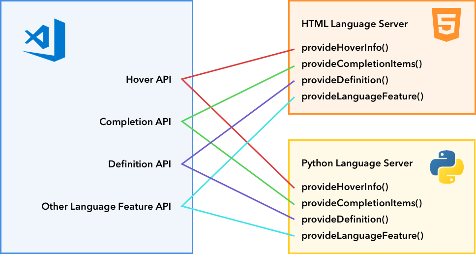
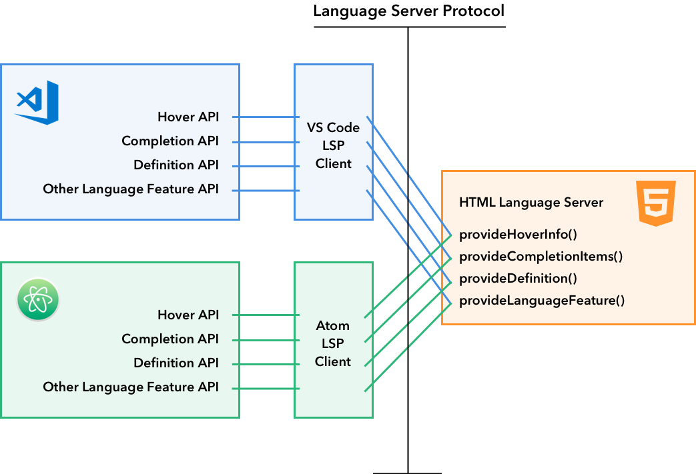
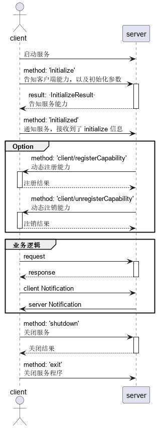

# 程序语言特性

# 工作原理



程序语言特性 `Programmatic language features` : 需要自己编写额外的 `Language Server` 对项目代码进行动态分析，才能实现例如语法检测、自动补全等功能。vscode 只提供了相关的界面展示接口，具体展示内容依赖于代码分析结果
- API 提示
- 自动补全
- 跳转到定义
- 语法检查
- 格式化
- 重命名


以实现 `Hover` 为例，在插件中使用 `vscode.languages.registerHoverProvider` 注册要展示内容。当前编辑 `javascript` 文件时，鼠标悬停到指定位置，vscode 就会检索所有的 `HoverProvider` 并将 `HoverProvider` 的结果渲染到编辑窗口，完成 `haver` 

```ts
vscode.languages.registerHoverProvider('javascript', {
    provideHover(document, position, token) {
        // 会展示的内容
        return {
            contents: ['Hover Content'] 
        };
    }
});
```

# 语言特性 API

vscode 提供的所有语言特性相关的 API 都在 `vscode.languages.*` 作用域下，详细接口说明见 [Programmatic Language Features](https://code.visualstudio.com/api/language-extensions/programmatic-language-features)


| VS Code API                                   | LSP method                            | 描述                                |
| --------------------------------------------- | ------------------------------------- | ----------------------------------- |
| `createDiagnosticCollection`                  | `PublishDiagnostics`                  | 错误报告信息                        |
| `registerCompletionItemProvider`              | `Completion & Completion Resolve`     | 语法补全                            |
| `registerHoverProvider`                       | `Hover`                               | 提示                                |
| `registerSignatureHelpProvider`               | `SignatureHelp`                       | 函数形参列表                        |
| `registerDefinitionProvider`                  | `Definition`                          | 跳转定义                            |
| `registerTypeDefinitionProvider`              | `TypeDefinition`                      |                                     |
| `registerImplementationProvider`              | `Implementation`                      |                                     |
| `registerReferenceProvider`                   | `References`                          | 函数或变量在何处被使用              |
| `registerDocumentHighlightProvider`           | `DocumentHighlight`                   | 文档中高亮显示符号                  |
| `registerDocumentSymbolProvider`              | `DocumentSymbol`                      | 当前文档中的符号定义，用于 `@` 查找 |
| `registerCodeActionsProvider`                 | `CodeAction`                          | 小灯泡功能                          |
| `registerCodeLensProvider`                    | `CodeLens & CodeLens Resolve`         | 代码中的导航栏                      |
| `registerDocumentLinkProvider`                | `DocumentLink & DocumentLink Resolve` |                                     |
| `registerColorProvider`                       | `DocumentColor & Color Presentation`  | 颜色拾取工具                        |
| `registerDocumentFormattingEditProvider`      | `Formatting`                          | 全文代码格式化                      |
| `registerDocumentRangeFormattingEditProvider` | `RangeFormatting`                     | 局部代码格式化                      |
| `registerOnTypeFormattingEditProvider`        | `OnTypeFormatting`                    | 根据变量类型格式化代码              |
| `registerRenameProvider`                      | `Rename & Prepare Rename`             | 重命名                              |
| `registerFoldingRangeProvider`                | `FoldingRange`                        |                                     |

# Language Server Protocol

## 介绍

通过 vscode 接口 `vscode.languages.*` 能直接实现一个简易的 `Language Server`，但是这样只能通过 `TypeScript` 或 `JavaScript` 进行实现。通过 `JavaScript` 实现的语言服务其性能肯定不如后端语言 `Java`、`c/c++`、`c#` 等，此外该语言服务也只适用于 vscode ，不能兼容其他的 IDE 工具。为了解决上述问题，vscode 的 Language Server 也支持通过 `Language Server Protocol (LSP)` 实现。



在 LSP 结构下，vscode 是通过 LSP 客户端来与 LSP 服务进行通信，这样确保了 LSP 服务与 vscode 并无关联，LSP 服务是啥语言实现的对 vscode 而言根本没啥影响，只要能保证 LSP 客户端能通信就行。此外，其他支持 LSP 的 IDE 工具也只需实现一个自己的 LSP 客户端，就能直接白嫖 LSP 服务。

>[!note|style:flat]
> LSP 首先假定一个服务只服务于一个客户端，多个客户端不能共享一个服务。


> [!tip]
> - [lsp-sample](https://github.com/microsoft/vscode-extension-samples/tree/main/lsp-sample) : 简单案例
> - [lsp-multi-server-sample](https://github.com/microsoft/vscode-extension-samples/tree/main/lsp-multi-server-sample) : `lsp-sample` 案例的升级版，用于支持 [Multi-root workspaces](https://code.visualstudio.com/docs/editor/workspaces#_multiroot-workspaces)


## 通信协议

> - [JSON-RPC](https://www.jsonrpc.org/specification)
> - [Language Server Protocol 定义](https://microsoft.github.io/language-server-protocol/overviews/lsp/overview/)

### JSON-RPC

为了实现不同语言环境间的通信，LSP 使用 `JSON-RPC` 实现数据传输

```json
/* 请求格式 */
{
	"jsonrpc": "2.0", 
	"method": "subtract", 
	"id": 1,
	"params": [42, 23] //请求参数
}

/* 响应格式 */
 {
	"jsonrpc": "2.0",
	"id": 1,
	"result": 19  // 返回数据
}

/* 错误信息 */
 {
	"jsonrpc": "2.0",
	"id": null,
	"error": {  // 错误信息
		"code": -32700,
		"message": "Parse error"
	}
}
```

<details>
<summary><span class="details-title">案例</span></summary>
<div class="details-content"> 

客户端实现 `Goto Definition` 功能：

- **客户端请求**

```json
{
    "jsonrpc": "2.0",
    "id" : 1,
    "method": "textDocument/definition",
    "params": {
        "textDocument": {
            "uri": "file:///p%3A/mseng/VSCode/Playgrounds/cpp/use.cpp"
        },
        "position": {
            "line": 3,
            "character": 12
        }
    }
}
```

- **服务端响应**

```json
{
    "jsonrpc": "2.0",
    "id": 1,
    "result": {
        "uri": "file:///p%3A/mseng/VSCode/Playgrounds/cpp/provide.cpp",
        "range": {
            "start": {
                "line": 0,
                "character": 4
            },
            "end": {
                "line": 0,
                "character": 11
            }
        }
    }
}
```
</div>
</details>

### 数据类型

- **基本类型**

在 LSP 中， `params` 支持的基础类型有：
```ts
// 数组
export type LSPArray = LSPAny[];

// map<string, LSPAny>
export type LSPObject = { [key: string]: LSPAny };

// 基本类型
export type LSPAny = LSPObject | LSPArray | string | integer | uinteger |
	decimal | boolean | null;
```

>[!note]
> 允许用户自定义的参数类型，必须使用 `object`，而非 `array` ，可以用 `object` 包裹 `array`

- **url**

```txt
  foo://example.com:8042/over/there?name=ferret#nose
  \_/   \______________/\_________/ \_________/ \__/
   |           |            |            |        |
scheme     authority       path        query   fragment
   |   _____________________|__
  / \ /                        \
  urn:example:animal:ferret:nose
```

客户端和服务端的编码格式可能不一样，这个就需要自行转换

```txt
file:///c:/project/readme.md
file:///C%3A/project/readme.md
```

- **Regular Expressions**

由于正则表达版本也贼多，为了保证客户端能正确运行，客户端会提前告知自己支持的正则表达式

```ts
/**
 * Client capabilities specific to regular expressions.
 */
export interface RegularExpressionsClientCapabilities {
	/**
	 * The engine's name.
	 */
	engine: string;

	/**
	 * The engine's version.
	 */
	version?: string;
}
```

- **Enumerations**

LSP 支持两种枚举类型：
- `Integer` : 起始为 `1`
- `string`

>[!note]
> 未知枚举值应当直接忽略，而不是异常报错，提升兼容性


### 消息结构

LSP 信息分为头和正文部分，兼容 `HTTP`，且换行均使用 `\r\n`

```json
/* 头 */
Content-Length: xxx  \r\n
Content-Type: application/vscode-jsonrpc; charset=utf-8

/* 正文基于 JSON-RPC 协议 */
{
	"jsonrpc": "2.0",
	"id": 1,
	"method": "textDocument/completion",
	"params": {
		...
	}
}
```

### 通信方式

客户端与服务的通信方式有两种
- **请求响应** 

```json
/* 客户端请求 */
{
    "jsonrpc": "2.0",
    "id" : 1,
    "method": "textDocument/definition",
    "params": {}
}

/* 服务响应 */
{
    "jsonrpc": "2.0",
    "id": 1,
    "result": {}
}
```

> [!note]
> - [错误响应](https://microsoft.github.io/language-server-protocol/specifications/lsp/3.17/specification/#responseError)
> - **安全起见，服务应该按照客户端的请求顺序依次返回响应**。当然，如果响应顺序不会影响客户端结果，可以打乱顺序返回，接口是否支持见[LSP 接口定义](https://microsoft.github.io/language-server-protocol/specifications/lsp/3.17/specification/)

- **消息通知**

```json
{
    "jsonrpc": "2.0",
	// 通知消息
    "method": "msg",
    "params": {}
}
```


### 基础特性

- **`"method": "$/xxxx"`**

以 `$/` 开头的请求或消息，不是所有的服务或客户端都支持。因此，当发现无法支持时，请求：返回错误码 `code:-32601`；通知：可以直接忽略。

- **取消请求**

```json
/* 取消成功后，也必须返回一个响应 */
{
    "jsonrpc": "2.0",
    "id" : 1,
    "method": "$/cancelRequest",
    "params": {
		"id": 3 // 需要取消的操作 id 
	}
}
```

- **进度报告**

```json
{
    "jsonrpc": "2.0",
    "id" : 1,
    "method": "$/progress",
    "params": {
		"token": "int | string",
		"value":{ // 进度信息
		}
	}
}
```

### Capabilities

在 LSP 中，服务不需要实现全部的语言特性，客户端也不用集成服务的全部特性。这就需要客户声明自己需要哪些特性，服务端表明自己能提供哪些特性。因此， LSP 定义了 `capabilities` 机制：
- [initialize](https://microsoft.github.io/language-server-protocol/specifications/lsp/3.17/specification/#initialize) 是客户端发送「第一个请求」，用于确认服务能提供的能力
- 在 `initialize` 请求完成之前，服务接收到的请求都必须返回 `code:-32002` 响应
- 在 `initialize` 请求完成之前，服务可以处理客户端的消息
- 在 `initialize` 请求完成之前，服务只能向客户端发送 `window/showMessag`，`window/logMessage`，`telemetry/event`、`window/showMessageRequest`。
- 在 `initialize` 请求完成之前，若客户端发送了 `workDoneToken`，服务也能使用 `$/progress` 返回进度

此外，服务还能通过发送 `client/registerCapability` 请求，实现在客户端[动态注册新能力](https://microsoft.github.io/language-server-protocol/specifications/lsp/3.17/specification/#client_registerCapability)。

### 启动关闭流程




### 服务实现准则

服务需要能支持客户端发送的 `Cancel` 消息，取消正在执行的请求。因为用户可能在客户端疯狂修改代码，导致服务的处理速度跟不上用户修改速度，那么客户端就会多次发送请求，服务就需要保证只返回最新请求的结果，并取消执行旧的请求。
- 服务检测到请求无效，取消操作，并返回响应 `ContentModified`
- 请求取消应当以客户端为准，避免服务自行取消

通信方式
- `stdio` : 直接通过 `stdout、stdin、stderr` 进行通信
- `pipe` : pipe 或 socket 文件进行通信，并通过 `--pipe=` 参数配置服务
- `socket` : 套接字通信，通过 `--port=` 参数配置服务
- `node-ipc` : nodejs 独有的 IPC 通信协议

此外还需要服务能监控客户端的存活状态，如果客户端崩溃了，服务也需要能够自己结束退出。需要服务能通过 `--clientProcessId` 接收客户端进程号。


## 客户端

### lsp-sample 客户端

```ts

import * as path from 'path';
import { workspace, ExtensionContext } from 'vscode';

// NOTE - 客户端的实现需要安装 vscode-languageclient 库
import {
	LanguageClient,
	LanguageClientOptions,
	ServerOptions,
	TransportKind
} from 'vscode-languageclient/node';

let client: LanguageClient;

export function activate(context: ExtensionContext) {
	
	// 获取服务 js 的路径，./server/out/server.js
	const serverModule = context.asAbsolutePath(
		path.join('server', 'out', 'server.js')
	);


	/* 
	 * 启动服务
	 * run: 一般模式下的服务
	 * debug: 该模式指的是插件 debug 开发
	 * 两种参数模式：

		1. 用于启动本地可执行文件的服务
		export interface Executable {
			command: string;  
			transport?: Transport; // 指定客户端与服务的通信模式
			args?: string[];
			options?: ExecutableOptions;
		}

		2. 用于启动 nodejs 模块实现的服务
		export interface NodeModule {
			module: string;
			transport?: Transport;
			args?: string[];
			runtime?: string;
			options?: ForkOptions;
		}
	*/
	const serverOptions: ServerOptions = {
		run: { 
			module: serverModule, 
			transport: TransportKind.ipc 
		},
		debug: {
			module: serverModule,
			transport: TransportKind.ipc,
		}
	};

    // 日志输出窗口
    const outputChannel: OutputChannel = Window.createOutputChannel('lsp-multi-server-example');

	// Options to control the language client
	const clientOptions: LanguageClientOptions = {
		// Register the server for plain text documents
		documentSelector: [{ scheme: 'file', language: 'plaintext' }],
		synchronize: {
			// Notify the server about file changes to '.clientrc files contained in the workspace
			fileEvents: workspace.createFileSystemWatcher('**/.clientrc')
		},
         outputChannel: outputChannel,
	};

	// Create the language client and start the client.
	client = new LanguageClient(
		'languageServerExample',
		'Language Server Example',
		serverOptions,
		clientOptions
	);

	// Start the client. This will also launch the server
	client.start();
}

export function deactivate(): Thenable<void> | undefined {
	if (!client) {
		return undefined;
	}
	return client.stop();
}
```

### lsp-multi 客户端

> [!note]
> 多工作区的解决思路就是为每一个 `workspace` 都创建一个自己的客户端和服务

```ts
import * as path from 'path';
import {
	workspace as Workspace, window as Window, ExtensionContext, TextDocument, OutputChannel, WorkspaceFolder, Uri
} from 'vscode';

import {
	LanguageClient, LanguageClientOptions, TransportKind
} from 'vscode-languageclient/node';

let defaultClient: LanguageClient;
const clients: Map<string, LanguageClient> = new Map();

let _sortedWorkspaceFolders: string[] | undefined;
function sortedWorkspaceFolders(): string[] {
	if (_sortedWorkspaceFolders === void 0) {
		_sortedWorkspaceFolders = Workspace.workspaceFolders ? Workspace.workspaceFolders.map(folder => {
			let result = folder.uri.toString();
			if (result.charAt(result.length - 1) !== '/') {
				result = result + '/';
			}
			return result;
		}).sort(
			(a, b) => {
				return a.length - b.length;
			}
		) : [];
	}
	return _sortedWorkspaceFolders;
}
Workspace.onDidChangeWorkspaceFolders(() => _sortedWorkspaceFolders = undefined);

/* 当存在多个 workspace 嵌套时， 返回最外层的 workspace*/
function getOuterMostWorkspaceFolder(folder: WorkspaceFolder): WorkspaceFolder {
	const sorted = sortedWorkspaceFolders();
	for (const element of sorted) {
		let uri = folder.uri.toString();
		if (uri.charAt(uri.length - 1) !== '/') {
			uri = uri + '/';
		}
		if (uri.startsWith(element)) {
			return Workspace.getWorkspaceFolder(Uri.parse(element))!;
		}
	}
	return folder;
}

export function activate(context: ExtensionContext) {

	const module = context.asAbsolutePath(path.join('server', 'out', 'server.js'));
	const outputChannel: OutputChannel = Window.createOutputChannel('lsp-multi-server-example');

	function didOpenTextDocument(document: TextDocument): void {
		// 校验
		// We are only interested in language mode text
		if (document.languageId !== 'plaintext' || (document.uri.scheme !== 'file' && document.uri.scheme !== 'untitled')) {
			return;
		}

		const uri = document.uri;

		// 临时文件使用默认客户端和服务
		if (uri.scheme === 'untitled' && !defaultClient) {
			const serverOptions = {
				run: { module, transport: TransportKind.ipc },
				debug: { module, transport: TransportKind.ipc }
			};
			const clientOptions: LanguageClientOptions = {
				documentSelector: [
					{ scheme: 'untitled', language: 'plaintext' }
				],
				diagnosticCollectionName: 'lsp-multi-server-example',
				outputChannel: outputChannel
			};
			defaultClient = new LanguageClient('lsp-multi-server-example', 'LSP Multi Server Example', serverOptions, clientOptions);
			defaultClient.start();
			return;
		}

		// 检测 document 是否在一个 workspace 中，返回所在的 workspace
		let folder = Workspace.getWorkspaceFolder(uri);
		if (!folder) {
			return;
		}

		// 多个 workspace 存在嵌套，返回最外层的 workspace
		folder = getOuterMostWorkspaceFolder(folder);

		// 创建客户端和服务
		if (!clients.has(folder.uri.toString())) {
			const serverOptions = {
				run: { module, transport: TransportKind.ipc },
				debug: { module, transport: TransportKind.ipc }
			};
			const clientOptions: LanguageClientOptions = {
				documentSelector: [
					{ scheme: 'file', language: 'plaintext', pattern: `${folder.uri.fsPath}/**/*` }
				],
				diagnosticCollectionName: 'lsp-multi-server-example',
				workspaceFolder: folder,
				outputChannel: outputChannel
			};
			const client = new LanguageClient('lsp-multi-server-example', 'LSP Multi Server Example', serverOptions, clientOptions);
			client.start();
			clients.set(folder.uri.toString(), client);
		}
	}

	Workspace.onDidOpenTextDocument(didOpenTextDocument);
	Workspace.textDocuments.forEach(didOpenTextDocument);
	Workspace.onDidChangeWorkspaceFolders((event) => {
		// 关闭退出的 workspace
		for (const folder  of event.removed) {
			const client = clients.get(folder.uri.toString());
			if (client) {
				clients.delete(folder.uri.toString());
				client.stop();
			}
		}
	});
}

export function deactivate(): Thenable<void> {
	const promises: Thenable<void>[] = [];
	if (defaultClient) {
		promises.push(defaultClient.stop());
	}
	for (const client of clients.values()) {
		promises.push(client.stop());
	}
	return Promise.all(promises).then(() => undefined);
}

```

### socket 连接

```ts

function connect(socket: string | int, command: string) {

	// 环境变量
	let env =  process.env;
	env.path = "D:/ProgramData/Qt6/6.7.0/msvc2019_64/bin" + split + env["path"];
	
	// 服务启动参数
	let args : string[] =[
		"-v"
	]; 

	// 启动服务目标程序
	let	server = spawn(command, args, {
		env: env,
	});
	
	server.on("spawn",()=>{

		// 连接 socket
		let serverOptions = () => {
			let socket = net.connect(socketSuffix + tmpSocket);
			let result: StreamInfo = {
				writer: socket,
				reader: socket
			};
			return Promise.resolve(result);
		};

		const clientOptions: LanguageClientOptions = {
			documentSelector: [
				{ scheme: 'file',language: 'qml' }
			],
			diagnosticCollectionName: 'lsp-multi-server-example',
			outputChannel: outputChannel
		};

		// 创建 lsp 客户端
		defaultClient = new LanguageClient('lsp-multi-server-example', 'LSP Multi Server Example', serverOptions, clientOptions);
		defaultClient.start();

	});

	server.on("message", (msg)=>{
		outputChannel.appendLine(`message: ${msg}`);
	});

	// 子进程异常
	server.on("error", (error)=>{
		outputChannel.appendLine(`Failed to launch server. error: ${error}`);
	});

	server.on("close", (code)=>{
		outputChannel.appendLine(`Close server. code: ${code}`);
	});
}
```

### 自定义接口


```ts

import { workspace, ExtensionContext } from 'vscode';

import {
	LanguageClient,
	LanguageClientOptions,
	ServerOptions,
	Executable,
	Middleware,
	TransportKind
} from 'vscode-languageclient/node';

let client: LanguageClient;

export function activate(context: ExtensionContext) {
	
	// Executable
	let exeRun : Executable = {
		command: "**.exe",
		transport: TransportKind.pipe
	}
	let exeDebug : Executable = {
		command: "**.exe",
		transport: TransportKind.pipe
	}

	const serverOptions: ServerOptions = {
		run: exeRun,
		debug: exeDebug
	};

	/**
	 * 通过 Middleware 可自定义与 LSP 服务交互的 API 接口
	 * 请求服务的 API 接口：
			type Middleware =
				& _Middleware 
				& TextDocumentSynchronizationMiddleware 
				& CompletionMiddleware 
				& HoverMiddleware 
				& DefinitionMiddleware 
				& SignatureHelpMiddleware 
				& DocumentHighlightMiddleware 
				& DocumentSymbolMiddleware 
				& WorkspaceSymbolMiddleware 
				& ReferencesMiddleware 
				& TypeDefinitionMiddleware 
				& ImplementationMiddleware 
				& ColorProviderMiddleware 
				& CodeActionMiddleware 
				& CodeLensMiddleware 
				& FormattingMiddleware 
				& RenameMiddleware 
				& DocumentLinkMiddleware 
				& ExecuteCommandMiddleware 
				& FoldingRangeProviderMiddleware 
				& DeclarationMiddleware 
				& SelectionRangeProviderMiddleware 
				& CallHierarchyMiddleware 
				& SemanticTokensMiddleware 
				& LinkedEditingRangeMiddleware 
				& TypeHierarchyMiddleware 
				& InlineValueMiddleware 
				& InlayHintsMiddleware 
				& NotebookDocumentMiddleware 
				& DiagnosticProviderMiddleware 
				& InlineCompletionMiddleware 
				& GeneralMiddleware;
	**/ 
	const middle : Middleware = {
		/* 自定义各个接口 */
	}

	// Options to control the language client
	const clientOptions: LanguageClientOptions = {
		// Register the server for plain text documents
		documentSelector: [{ scheme: 'file', language: 'plaintext' }],
		synchronize: {
			// Notify the server about file changes to '.clientrc files contained in the workspace
			fileEvents: workspace.createFileSystemWatcher('**/.clientrc')
		},
		middleware: middle
	};
	

	// Create the language client and start the client.
	client = new LanguageClient(
		'languageServerExample',
		'Language Server Example',
		serverOptions,
		clientOptions
	);

	// Start the client. This will also launch the server
	client.start();
}

export function deactivate(): Thenable<void> | undefined {
	if (!client) {
		return undefined;
	}
	return client.stop();
}
```

## 服务端

### TypeScript

依赖 `vscode-languageserver` 与 `vscode-languageserver-textdocument` 实现，在 [lsp-sample](https://github.com/microsoft/vscode-extension-samples/tree/main/lsp-sample) 中已经定义好了模板，照着抄就行。

### 其他

需要根据 [通讯协议](#通信协议) 自定实现。
