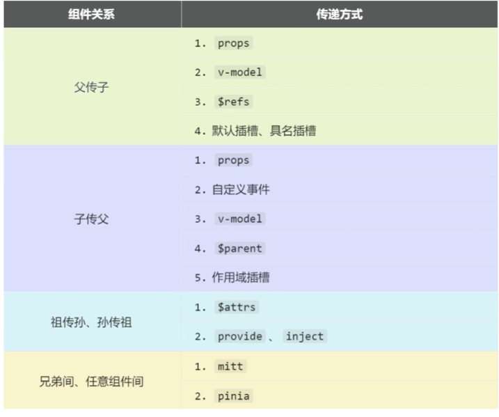

# 组件

# 组件定义

```term
triangle@LEARN:~$ tree -L 2 ./src
./src/
├── assets      
├── components
│   └── Component.vue
├── App.vue     
└── main.ts
```

- `components/Component.vue`

```vue
<template>
    <div>  
        测试 : {{ message }}
    </div>
</template>

<script lang="ts" setup name="Component">
    let message = 'hello'
</script>
```

- `App.vue`

```vue
<template>
    <!-- 模板中使用子组件 -->
    <Component/>
</template>

<script lang="ts" setup name="app">
    // 导入子组件
    import  Component from "./components/Component.vue";
</script>
```

# 生命周期

> 组件的生命周期一般存在四个环节
> - 创建
> - 挂载: 优先挂载子组件
> - 更新
> - 销毁

## vue2

```vue
<script lang="ts">
  export default {
    // 创建
    beforeCreate(){
    },
    created(){
    },
    // 挂载
    beforeMount(){
    },
    mounted() {
    },
    // 更新
    beforeUpdate(){
    },
    updated() {
    },
    // 销毁
    beforeDestroy() {
    },
    destroyed() {
    },
  }
</script>
```

## vue3

```vue
<script lang="ts" setup name="Component">
    import { onBeforeMount,onBeforeUnmount,onBeforeUpdate,onMounted,onUnMounted,onUpdated} from 'vue';

    // 创建
    console.log("创建")
    
    // 挂载
    onBeforeMount(()=>{
    })
    onMounted(()=>{
    })

    // 更新
    onBeforeUpdate(()=>{
    })
    onUpdated(()=>{
    })

    // 卸载
    onBeforeUnmount(()=>{
    })
    onUnMounted(()=>{
    })
</script>
```


# 数据通信



## 暴露数据

- `components/Component.vue`

```vue
<template>
    <div>  
        测试 : {{ message }}
    </div>
</template>

<script lang="ts" setup name="Component">
    let message = 'hello'

    // 将属性暴露给父组件
    defineExpose({message})
</script>
```

- `App.vue`

```vue
<template>
  <Component ref="human"/>

  <button @click="print" >打印</button>
</template>

<script lang="ts" setup name="app">
  import { ref } from "vue";
  import  Component from "./components/Component.vue";

  let human = ref()

  function print(){
    console.log(human.value.message)
  }
</script>
```

组件的 `ref="human"` 获取的不在是 `html` 标签，而是子组件实例对象。

## html 标签属性

### 数据传递

- `components/Component.vue`

```vue
<template>
    <h2>{{ prop }}</h2>
    <h2>{{ student.name }}</h2>
    <h2>{{ student.age }}</h2>
</template>


<script lang="ts" setup name="Component">
    import { defineProps } from 'vue';

    // 'defineProps' : 为组件 html 标签定义属性
    // 'props' : 获取传入的 html 标签属性值
    let props = defineProps(['prop','student'])
</script>
```

- `App.vue`

```vue
<template>
  <!-- 通过 'v-bind' 可以将父组件的数据赋值给标签属性 -->
  <Compoent prop="html 属性"  v-bind:student="student" />
</template>

<script lang="ts" setup name="app">
  import Compoent from "./components/Component.vue";
  import {type Person } from "./types";

  let student:Person= {
    name: 'zhang',
    age: 18
  }
</script>
```


上述写法虽然实现在父模板中定义子组件的 html 标签属性，**但是在子组件中没有对标签类型进行严格定义。**

- `components/Component.vue`

```vue
<template>
    <h2>{{ prop }}</h2>

    <!-- 由于 student 为非必填，所以需要检测存在性 -->
    <h2 v-if="student">{{ student.name }}</h2>
    <h2 v-if="student">{{ student.age }}</h2>
</template>


<script lang="ts" setup name="Component">
    import { defineProps,withDefaults } from 'vue';
    import {type Person } from '@/types';

    // '?' : 定义非必填
    // withDefaults : 设置默认值
    let props = withDefaults(
        defineProps<{prop:string, student?:Person}>(),
            {
                // 使用 getter 返回默认参数
                prop: () => 'default'
            } 
        )
</script>
```

### 方法传递

- `components/Component.vue`

```vue
<template>
  <button @click="sendNumber(num)">传送</button>
</template>

<script lang="ts" setup name="Component">
    import { defineProps, ref } from 'vue';

    let num = ref(10)
    defineProps(['sendNumber'])
</script>
```

- `App.vue`

```vue
<template>
  <!-- 标签属性可以传递方法 -->
  <Compoent prop="html 属性"  v-bind:sendNumber="getNumber" />
</template>

<script lang="ts" setup name="app">
  import Compoent from "./components/Component.vue";

  function getNumber(val:number) {
      // val ：子组件传递过来的数据
  }
</script>
```

## 自定义事件


> [!note]
> 事件使用 `word-word-word` 的命名格式

- `components/Compoent.vue`

```vue
<script setup lang="ts">
    import { onMounted } from 'vue';

    // 定义 custom-event 名的事件
    const emit = defineEmits(['custom-event'])

    onMounted(()=>{
        // 触发事件 (事件名，参数...)
        emit('custom-event', 'value')
    })
</script>
```

- `App.vue`

```vue
<template>
  <!-- 注册 custom-event 事件的回调函数 -->
  <Component @custom-event="onCustomEvent"/>
</template>


<script lang="ts" setup name="App">
	import Component from './components/Component.vue';

	function onCustomEvent(value:string){
		console.log(value)
	}
</script>

```

## mitt

使用 `mitt` 充当事件中间件，用于事件接收与发布。

```term
triangle@LEARN:~$ npm i mitt
triangle@LEARN:~$ tree ./src
./src
├── components
│   ├── Compoent1.vue
│   └── Compoent2.vue
├── App.vue
├── main.ts
└── utils             # 工具类定义 
    └── emitter.ts    # emitt 中间件定义
```

- `utils/emitter.ts`

```ts
import emitt from "emitt";

// 定义一个事件中间件
const emitter = emitt()
// emitter.emit() : 触发事件
// emitter.on() : 注册事件
// emitter.off() : 删除事件
// emitter.all() : 获取全部事件

export {emitter}
```

- `components/Compoent1.vue`

```vue
<template>
    <button @click="emitter.emit('event-2')"></button>
</template>

<script setup lang="ts">
    import { onUnmounted } from 'vue';
    import {emitter} from "@/utils/emitter"

    let handler = ()=>{
        console.log('event 1')
    }
    emitter.on('event-1', handler)

    onUnmounted(()=>{
        // 卸载 handler
        emitter.off('event-1', handler) 
    })

</script>
```

- `components/Compoent2.vue`

```vue
<template>
    <button @click="emitter.emit('event-1')"></button>
</template>

<script setup lang="ts">
    import { onUnmounted } from 'vue';
    import {emitter} from "@/utils/emitter"

    let handler = ()=>{
        console.log('event 2')
    }
    emitter.on('event-2', handler)

    onUnmounted(()=>{
        // 卸载 handler
        emitter.off('event-2', handler) 
    })
</script>
```

## v-model

组件 `v-model` 实现的本质便是
- 在子组件中定义 `modelValue` 属性与 `update:modelValue` 事件
- `<Component v-model="text"/>` 中会自动将 `text` 数据关联到 `modelValue` 属性与 `update:modelValue` 事件

- `App.vue`

```vue
<template>
    <Component v-model="text"/>

    <!-- 
        - 该实现方式与 v-model 等价
        - $event : 是子标签触发 'update:modelValue' 事件时，传递的数据
    -->
    <Component :modelValue="text" @update:modelValue="text = $event"/>
</template>

<script lang="ts" setup name="App">
    import Component from './components/Component.vue';
    import { ref } from 'vue';

    let text = ref('')
</script>
```

- `components/Compoent.vue`

```vue
<template>
    <input type="text" :value="modelValue" 
                        @input="emit('update:modelValue', (<HTMLInputElement>$event.target).value)">
</template>

<script setup lang="ts">
    defineProps(['modelValue'])
    const emit = defineEmits(['update:modelValue'])
</script>
```


其中 `modelValue` 属性与 `update:modelValue` 事件是 `vue` 框架的默认命名，可以增加其他属性

```vue
<template>
    <Component v-model="text" v-model:value="val" />
</template>
```

定义 `v-model:value` 后，就需要在子组件中提供 `value` 属性与 `update:value` 事件


