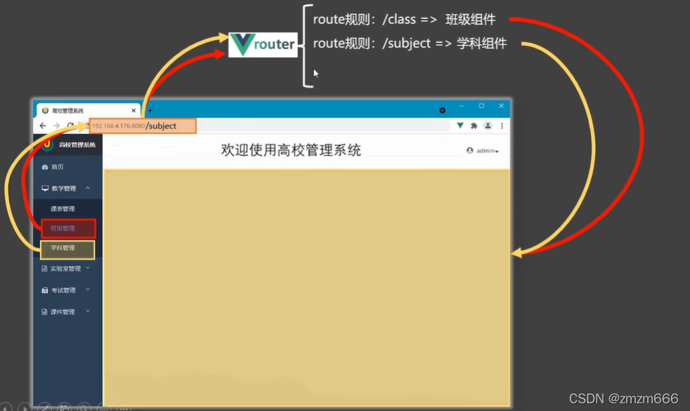
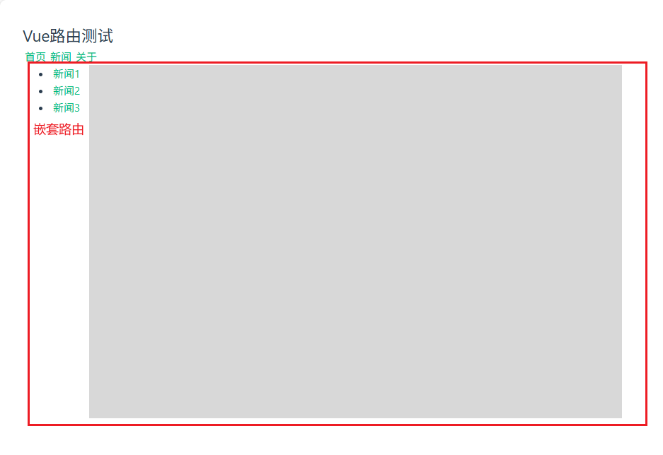

# 路由

# 概念


- **路由器 `router`** : 输入一个 `url` 能找到对应的 `handler` 进行处理
- **路由 `route`** : 一个 `url` 与对应 `handler` 的对应关系
- **单页面应用 `SPA (Single Page Web Application)`** : 整个 web 界面只有一个 `.html` 文件，然后通过激活 `url` 触发路由机制，实现对界面元素的更新。




**使用路由机制特别适合创建「后台管理系统」**
- 导航区域按钮触发`url`
- `vue` 路由器激活 `url` 对应的 `handler`
- `handler` 中访问数据库数据并进行业务逻辑处理，并修改展示区的界面元素


# 路由工程

```term
triangle@LEARN:~$ npm install vue-router // 安装路由插件
triangle@LEARN:~$ tree ./src/
./src
├── components
│   ├── About.vue
│   ├── Home.vue
│   └── News.vue
├── router              # 路由规则定义
│   └── index.ts
├── App.vue     
└── main.ts
```

- `components/Home.vue`

```vue
<template>
    <div style="width: inherit; height: inherit; display: flex; justify-content: center;">
        <iframe title="notebook" width="100%" src="https://www.bilibili.com"></iframe>
    </div>
</template>
```

- `router/index.ts`

```ts 
import {createRouter,createWebHistory} from 'vue-router'
 
// 引入组件
import Home from '@/components/Home.vue'
import About from '@/components/About.vue'
import News from '@/components/News.vue'
 
// 创建路由器
const router = createRouter({
    // 路由器工作模式
    history:createWebHistory(),
    // 路由规则: 一个 url 对应一个组件
    routes:[ 
        {
            path:'/home',
            component:Home
        },
        {
            path:'/news',
            component:News
        },
        {
            path:'/about',
            component:About
        },
    ]
})

// 导出路由
export default router
```

- `App.vue`

```vue
<template>
  <div class="container">
    <h2 class="title">Vue路由测试</h2>

    <!-- 导航区 -->
    <div class="navigate">
      <RouterLink to="/home" >首页</RouterLink>
      <RouterLink to="/news">新闻</RouterLink>
      <RouterLink to="/about">关于</RouterLink>
    </div>

    <!-- 展示区 -->
    <div class="main-content">
      <RouterView></RouterView>
    </div>
  </div>
</template>

<script lang="ts" setup name="App">
    import { RouterView, RouterLink } from 'vue-router'
</script>

<style>
#app {
  display: block;
  width: 100%;
  height: inherit;
}

.main-content {
  display: block;
  height: 1080px;
  width: inherit;
}

</style>
```

- `main.ts`

```ts
import './assets/main.css'

import { createApp } from 'vue'
import App from './App.vue'
import router from './route/index'

// 安装路由
createApp(App).use(router).mount('#app')
```


# 路由组件

**路由组件** ：由路由器加载的组件

```ts
// 创建路由器
const router = createRouter({
    // 路由器工作模式
    history:createWebHistory(),
    // 路由规则: 一个 url 对应一个组件
    routes:[ 
        {
            path:'/home',
            component:Home          // Home 、News、About 均是路由组件
        },
        {
            path:'/news',
            component:News
        },
        {
            path:'/about',
            component:About
        },
    ]
})
```

**为了与一般组件进行区分，在实际项目工程中会将「路由组件」放入 `views/pages` 文件夹下，而一般组件则放入`components`下。**

```term
triangle@LEARN:~$ npm install vue-router // 安装路由插件
triangle@LEARN:~$ tree ./src/
./src
├── components          # 常规组件
│   └── component.vue
├── views               # 路由相关的组件
│   ├── About.vue
│   ├── Home.vue
│   └── News.vue
├── router              # 路由规则定义
│   └── index.ts
├── App.vue     
└── main.ts
```

> [!note]
> 路由组件切换时候， `RouterView` 中会将旧的组件卸载，然后重新加载新的组件


# 路由模式

- `history` : 在路由组件切换时， `url` 不会存在 `#`，需要服务器额外配置进行规避，否则会出现 `404` （因为，该路由 `url` 是前端自定义的，在服务上可能不存在，需要屏蔽 ）

```ts
const router = createRouter({
    history:createWebHistory(),
})
```

- `hash` : 在路由组件切换时， `url` 会存在 `#`，服务不需要额外处理

```ts
const router = createRouter({
    history:createWebHashHistory(),
})
```

# 路由命令

```ts
const router = createRouter({
    routes:[ 
        {
            name: 'xinwen'      // 给路由定义一个名字
            path:'/news',
            component:News
        },
    ]
})
```


# to

```vue
<template>
    <!-- 字符串写死 -->
    <RouterLink to="/home" >首页</RouterLink>
    <!-- 传递对象，可实现动态赋值 -->
    <RouterLink :to="{routeAbout}">关于</RouterLink>
    <!-- 使用路由命名 -->
    <RouterLink :to="{name:'xinwen'}">关于</RouterLink>
</template>

<script lang="ts" setup name="App">
    import { RouterView, RouterLink } from 'vue-router'

    /* NOTE - 需要定义 'path' 属性或 'name' */
    let routeAbout = {
        path: "/about"
    }
</script>
```

# 路由嵌套


在 `News.vue` 在嵌套一个 `Detail.vue` 组件展示新闻详情

```term
triangle@LEARN:~$ tree ./src
./src
├── views               # 路由相关的组件
│   ├── Detail.vue
│   └── News.vue
├── router              # 路由规则定义
│   └── index.ts
├── App.vue     
└── main.ts
```

- `views/Detail.vue`

```vue
<template>
    <div>编号</div>
    <div>内容</div>
</template>
```

- `views/News.vue`

```vue
<template>
    <div class="page">
        <!-- 嵌套的导航栏 -->
        <div class="navigate">
            <ul v-for="item in news" :key="item.id">
                <li>
                    <RouterLink to="/news/detail"> {{ item.title }} </RouterLink>
                </li>
            </ul>
        </div>
        
        <!-- 嵌套的子视图 -->
        <div class="content">
            <RouterView></RouterView>
        </div>
    </div>
</template>

<script setup lang="ts">
    import { reactive } from 'vue';
    import { RouterLink, RouterView } from 'vue-router';

    let news = reactive([
        {id: 1, title:"新闻1", content: "第1条新闻"},
        {id: 2, title:"新闻2", content: "第2条新闻"},
        {id: 3, title:"新闻3", content: "第3条新闻"},
    ])

</script>

<style scoped>
.page{display: flex;justify-content: flex-start;align-items: flex-start;width: 100%;height: 500px;}
.navigate{width: 10%;}
.content{ width: 80%; height: inherit; display: flex;  flex-direction: column; background-color: rgb(216, 216, 216);}
</style>
```

- `router/index.ts`

```ts
import {createRouter,createWebHistory} from 'vue-router'
 
// 引入组件
import News from '@/views/News.vue'
import Detail from '@/views/Detail.vue'
 
const router = createRouter({
    history:createWebHistory(),
    routes:[ 
        {
            path:'/news',
            component:News,
            children:[                  // 在 '/news' 路由下再嵌套一个子路由 'detail'
                {
                    name: "xiangqing",  // NOTE - 对子路由进行命名，便不用再自己拼接 url
                    path:"detail",      // 访问 url 为 '/news/detail'
                    component: Detail
                }
            ]
        },
    ]
})

export default router
```




# 路由通信

## query 传参

类似 http 的 `GET` 请求传参


- `views/Detail.vue`

```vue
<template>
    <div>编号: {{ route.query.id }}</div>
    <div>内容: {{ route.query.content }}</div>
</template>

<script setup lang="ts">
    import { useRoute } from 'vue-router';

    // 通过 route 获取 '/news/detail' 传输的参数
    let route = useRoute()
</script>

```

- `views/News.vue`

```vue
<template>
    <div class="page">
        <div class="navigate">
            <ul v-for="item in news" :key="item.id">
                <li>
                    <!-- 类似 get 请求直接传参 -->
                    <RouterLink :to="`/news/detail?id=${item.id}&content=${item.content}`"> {{ item.title }} </RouterLink>
                </li>
            </ul>
        </div>
        
        <div class="content"> <RouterView></RouterView> </div>
    </div>
</template>
```

通过字符串的方式拼接 query 请求太丧心病狂，可以使用对象的形式进行简写

```vue
<RouterLink 
    :to="{
        name: "xiangqing",  // NOTE - 使用子路由命名，不用自己拼 url
        query: {
            id: item.id,
            content: item.content
        }
    }"
>  
    {{ item.title }} 
</RouterLink>
```

## param 传参

类似 http 请求的 `url` 路径传参


- `views/Detail.vue`

```vue
<template>
    <div>编号: {{ route.params.id }}</div>
    <div>内容: {{ route.params.content }}</div>
</template>

<script setup lang="ts">
    import { useRoute } from 'vue-router';

    // 通过 route 获取 '/news/detail' 传输的参数
    let route = useRoute()
</script>
```

- `router/index.ts`

```ts
const router = createRouter({
    routes:[ 
        {
            path:'/news',
            component:News,
            children:[
                {
                    name: "xiangqing",
                    path:"detail/:id/:content",  // NOTE - 定义 param 参数解析规则
                    component: Detail
                }
            ]
        },
    ]
})
```

- `views/News.vue`

```vue
<template>

    <div class="page">
        <div class="navigate">
            <ul v-for="item in news" :key="item.id">
                <li>
                    <RouterLink :to="`/news/detail/${item.id}/${item.content}`"> {{ item.title }} </RouterLink>
                </li>
            </ul>
        </div>
        
        <div class="content"> <RouterView></RouterView> </div>
    </div>
</template>
```

同 query 传参，param  传参也可以不用拼接字符串

```vue
<RouterLink 
    :to="{
        name: "xiangqing",  // NOTE - 用 name ，别用 path
        params: {
            id: item.id,
            content: item.content
        }
    }"
>  
    {{ item.title }} 
</RouterLink>
```

> [!note]
> 使用 params 无法传递数组、对象

## props 配置

### 简化 param

- `views/Detail.vue`

```vue
<template>
    <div>编号: {{ id }}</div>
    <div>内容: {{ content }}</div>
</template>

<script setup lang="ts">
    defineProps<{id:number, content:string}>()
</script>
```

- `router/index.ts`

```ts
const router = createRouter({
    routes:[ 
        {
            path:'/news',
            component:News,
            children:[
                {
                    name: "xiangqing",
                    path:"detail/:id/:content",  // NOTE - 定义 param 参数解析规则
                    component: Detail

                    // 将 url 中的路径参数当作 html 标签属性传递给 Detail 组件
                    props: true
                }
            ]
        },
    ]
})
```

### 简化 query

- `views/Detail.vue`

```vue
<template>
    <div>编号: {{ id }}</div>
    <div>内容: {{ content }}</div>
</template>

<script setup lang="ts">
    defineProps<{id:number, content:string}>()
</script>
```

- `router/index.ts`

```ts
const router = createRouter({
    routes:[ 
        {
            path:'/news',
            component:News,
            children:[
                {
                    name: "xiangqing",
                    path:"detail",  
                    component: Detail

                    // NOTE - 直接将 query 参数解析结果当 html 标签属性传递给 Detail 组件
                    props(route){
                        return route.query
                    }
                }
            ]
        },
    ]
})
```

# 路由导航

## 导航方式

路由在跳转的时候，浏览器会记录用户的操作记录用以实现 「前进」与「后退」
- `push` : 将操作记录放入一个堆栈中，可实现「前进」与「后退」
- `replace` : 当前操作会覆盖栈顶的操作，无法「前进」与「后退」


```vue
<template>
  <div class="container">

    <!-- 导航区 -->
    <div class="navigate">
      <!-- '/home' 路由采用 'replace' 模式 -->
      <RouterLink replace to="/home" active-class="xiaozhupeiqi">首页</RouterLink>
      <!-- 默认都是 'push' 模式 -->
      <RouterLink to="/news" active-class="xiaozhupeiqi">新闻</RouterLink>
      <RouterLink to="/about" active-class="xiaozhupeiqi">关于</RouterLink>
    </div>

    <!-- 展示区 -->
    <div class="main-content"> <RouterView></RouterView> </div>
  </div>
</template>
```

## 编程导航

上述路由跳转均是定义了 `RouterLink` 标签，然后通过用户点击界面控件实现路由跳转，但是为了编码灵活性，**还需要实现代码自动路由跳转**，即「编程式路由导航」。

```vue
<script lang="ts" setup name="App">
  import { onMounted } from 'vue'
  import { useRouter } from 'vue-router'

  const router = useRouter()

  onMounted(()=>{
    setTimeout(()=>{
      // 使用 'push' 方式，跳转到 '/news' 
      router.push('/news')
    },1000)
  })

  function active(id:number, content:string){
      // 参数传递同 'RouterLink' 的 'to' 属性
      router.push({
        name: "xiangqing", 
        params: {
            id: id,
            content: content
        }
      })
  }
</script>
```

# 重定向

```ts
const router = createRouter({
    routes:[ 
        {
            path:'/home',
            component:Home
        },
        {
            // 将 '/' 重定向到 '/home' 
            path: '/',
            redirect: '/home'
        }
    ]
})
```
