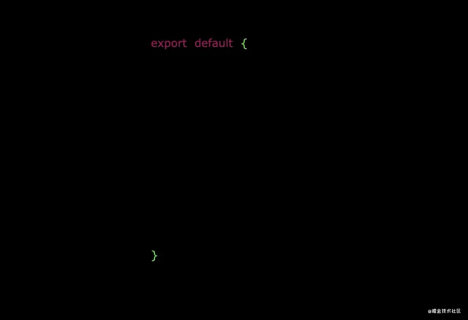
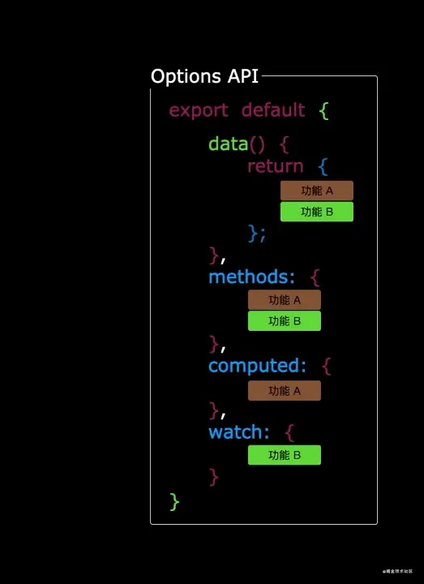
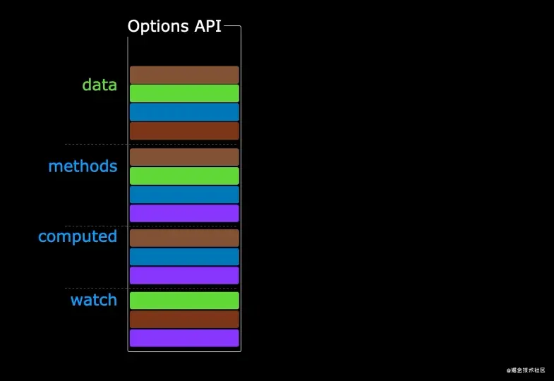
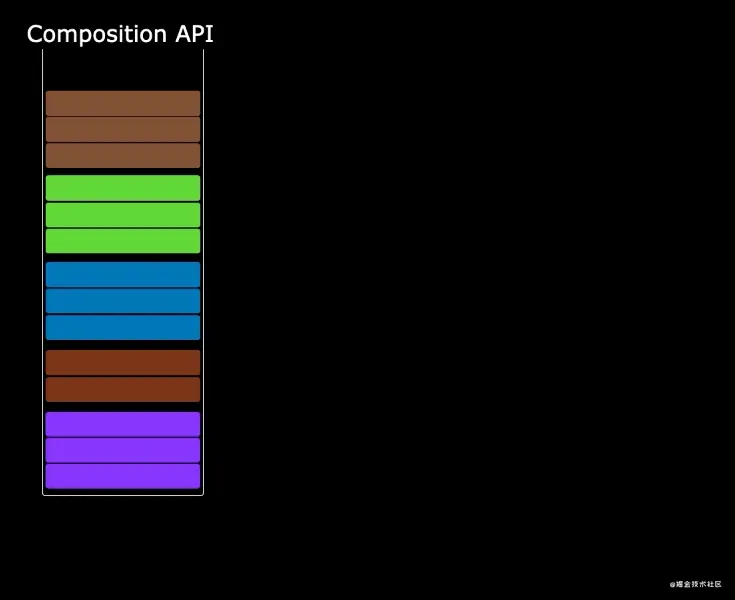

# setup

# 选项式与组合式

## 选项式

选项式 `OptionsAPI` 为 `vue2` 中的语法格式，`script` 中的数据、函数均以「选项」的形式注入到 `template` 中进行使用。

 


> [!tip]
> 随着业务复杂度越来越高，代码量会不断的加大；由于相关业务的代码需要遵循option的配置写到特定的区域，导致后续维护非常的复杂，代码可复用性也不高。

```vue
<template>
  <div class="hello">
    <table>
      <!-- 模板变量，可以访问 `data` 标签的数据 -->
      <h2>命名: {{ name }} </h2>
      <h2>年龄: {{ age }} </h2>

      <!-- 点击事件，可以触发 `methods` 中的函数 -->
      <button @click="click_add">添加</button>
    </table>
  </div>
</template>

<!-- 脚本 -->
<script lang="ts">
  export default {
    /* 组件名 */
    name : "app",

    /* 数据选项 */
    data() {
      return {
        name : "命名",
        age : 10
      }
    },

    /* 函数选项 */
    methods: {
      click_add(){
        this.age ++;
      }
    }
  }
</script>

<!-- 
  样式
  scoped : 当前样式只作用当前组件，不会影响别人的
-->
<style scoped></style>
```


## 组合式





组合式 `CompositionAPI` 在 `vue3` 中实现，将选项式的 `data`、`methods` 等标签均集中到 `setup` 中

```vue
<template>
  <div class="hello">
    <table>
      <h2>命名: {{ name }} </h2>
      <h2>年龄: {{ alias_age }} </h2>
      <button @click="click_add">添加</button>
    </table>
  </div>
</template>

<!-- 脚本 -->
<script lang="ts">
  export default {
      name : "app",
      setup() {
        /* 数据 */
        let name = '命名'
        let age = 10      // 当前数据并非响应式（不能实时刷新）
        let phone = '10086'

        /* 函数 */
        function click_add(){
          alert('test')
        }
        
        /* 导出 */
        return {name, alias_age:age, click_add}
      }
  }
</script>

<!-- 样式 -->
<style scoped></style>
```

## 混用

在 `vue3` 中也兼容选项式，因此选项式与组合式可以混用
- `setup` 在所有的 `data`、`methods` 等选项之前初始化
- `data`、`methods` 等选项可以访问 `setup` 暴露的数据、函数
- `setup` 中不能使用 `this`


# 返回值

只有 `setup` 返回的对象在 `template` 中才能被访问，可返回渲染函数、函数名、数据等。

```vue
<script lang="ts">
  export default {
      name : "app",
      setup() {
        /* 数据 */
        let name = '命名'
        let age = 10 
        let phone = '10086'

        /* 函数 */
        function click_add(){
          alert('test')
        }
        
        /* 导出 */
        return {name, alias_age:age, click_add}
      }
  }
</script>
```

- **渲染函数**: `template` 将无效，直接渲染函数返回内容

```vue
<script lang="ts">
  export default {
      name : "app",
      setup() {
        return () => 'hello vue'
      }
  }
</script>
```

# 简化语法

## setup 简化

使用标签 `<script setup>` ，便能不用再定义 `setup(){ return{} }`，所有数据、函数自动返回。

```vue
<script>
    export default {
        name : "Person"
    }
</script>

<script setup>
    let name = 'test'
    let age = 10

    function click(){
        alert('hello')
    }
</script>
```

## name 简化

在上述写法中组件 `name` 还需要单独定义一个 `<script>` 实现，这个可以通过插件进行简化

```term
triangle@LEARN:~$ npm.cmd i -D vite-plugin-vue-setup-extend
```

- `vite.config.ts`

```ts
import { fileURLToPath, URL } from 'node:url'

import { defineConfig } from 'vite'
import vue from '@vitejs/plugin-vue'
import vueDevTools from 'vite-plugin-vue-devtools'
import vueSetup from 'vite-plugin-vue-setup-extend' // 导入插件

// https://vite.dev/config/
export default defineConfig({
  plugins: [
    vue(),
    vueDevTools(),
    vueSetup()      // 注册插件
  ],
  resolve: {
    alias: {
      '@': fileURLToPath(new URL('./src', import.meta.url))
    },
  },
})
```

更简化的写法，不用再单独定义一个 `<script>` 

```vue
<script lang="ts" setup name="Person">
    let name = 'test'
    let age = 10

    function click(){
        alert('hello')
    }
</script>
```

