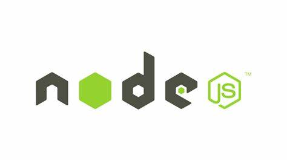

# NodeJs

# 概述




[Node.js](https://nodejs.org/en) 是一个基于 Chrome JavaScript 运行时建立的一个平台。其功能类似于 `Python.exe` 为 JavaScript 提供了一整套完整的生态平台：运行环境、包管理、语言解析、调试器等。 `Node.js` 提供的是「本地运行环境」，且不同于「浏览器平台」，因此功能是 NodeJs 环境特有的，例如 `fs`。

```term
triangle@LEARN:~$ node ./test.js // 执行 javascript
```

# SDK 管理

## fnm

[fnm (Fast Node Manager)](https://github.com/Schniz/fnm) 是一个 `Node.js` 版本管理工具，可以在同一台机器上安装和切换多个 `Node.js` 版本，方便开发者在不同项目中使用不同版本的 `Node.js`。
1. 特殊环境变量设置，**一定要在 `fnm env` 配置前设置**

    ```bash
    FNM_DIR = "C:\Users\GOD\AppData\Roaming\fnm"        # node 存储路径
    FNM_NODE_DIST_MIRROR = "https://nodejs.org/dist"    # node 下载仓库
    ```

2. 安装与配置教程见仓库说明
3. 由于 `fnm` 的工作原理是在终端启动前，修改环境变量，从而实现 `node` 版本切换，**这就导致 `windows` 桌面环境根本就没有 `node` 环境** 
   1. windows 系统环境变量中添加 `fnm` 的 `default` 路径
   2. 修改配置命令

        ```powershell
            fnm env --use-on-cd --shell powershell | Out-String | Invoke-Expression; 
            # 移除系统 node 配置，使用 fnm 提供的 node
            $env:PATH = ($env:PATH -split ';' | ? { $_ -ine '<node_default_path>' }) -join ';' ;
        ```

## vfox (推荐)

[vfox](https://vfox.dev/) 是一个支持 `java`、`nodejs`、`make`、`cmake` 等开发 `SDK` 的通用版本管理工具，安装相应 `SDK` 的插件后，便能实现`SDK`版本管理功能。

1. 下载 [vfox](https://github.com/version-fox/vfox)
2. vfox 的 SDK 、插件，配置默认存放目录在 `$HOME/.fox/`
   - 修改插件存储位置 `vfox.exe config storage.sdkPath <your_sdk_path>`
3. 安装管理插件 `vfox add nodejs` , **下载不了也能离线安装，`vfox add --source nodejs.zip  nodejs`**
4. 通过 `VFOX_NODEJS_MIRROR=https://registry.npmmirror.com/` 添加镜像源
5. 安装 `vfox install nodejs@20.9.0`
6. 使用
   1. `vfox use nodejs[@version]` 终端切换
   2. `vfox use -g nodejs[@version]` 系统默认

如果是完全断网的离线环境，可以从 `https://registry.npmmirror.com/` 下载压缩包，然后通过[vfox-install](../../code/bash/vfox-install.sh)快速解压到 `vfox.exe config storage.sdkPath` 目录下，目录组织结构如下

```
.
└── nodejs
    └── v-24.17.0
        └── nodejs-24.17.0
            ├── ...
            └── node.exe
```


# npm

## 介绍

[npm (node package manger)](https://www.npmjs.com/): 是 `NodeJs` 的包管理系统，可以方便地下载、安装、升级、删除包，也可以让你作为开发者发布并维护包。

```term
triangle@LEARN:~$ npm -v // 本版
triangle@LEARN:~$ npm -l // 常用命令
```

## 使用

- **配置**

```term
triangle@LEARN:~$ npm config list -l // 配置
triangle@LEARN:~$ npm config set registry https://registry.npmmirror.com // 修改源
triangle@LEARN:~$ npm config set prefix [dir] // 设为模块的全局安装目录
triangle@LEARN:~$ npm config set init.author.name [name] // 配置 package.json 初始化设置
```

- **包管理**

```term
triangle@LEARN:~$ npm info [package] // 查看包信息
triangle@LEARN:~$ npm install [Options] [foo] // 安装包
Options:
    -g          安装到全局路径，没有则下载到 node_modules 文件夹
    --save      包信息添加到 package.json 的 `dependencies` 字段中
    --save-dev  包信息添加到 package.json 的 `devDependencies` 字段中

foo:
    -空         安装所有
    -包名       从仓库下载
    -路径       将本地包配置到 package.json 文件中
triangle@LEARN:~$ npm uninstall [foo] // 卸载包
triangle@LEARN:~$ npm search [name] // 在仓库搜索
triangle@LEARN:~$ npm list // 查看当前目录下的包
triangle@LEARN:~$ npm update [package name] // 升包
```

- **运行**

```term
triangle@LEARN:~$ npm run [scripts] // 执行 package.json 中配置的脚本
- 该命令会在 $PATH 中添加 node_modules/.bin 目录
- `scripts` 配置了 `pre` 与 `post`，则会依次执行
    1. npm run prescripts
    2. npm run scripts
    3. npm run postscripts
```

- **链接**

```term
triangle@LEARN:~$ npm link  // 将当前「正在开发的包」临时放入全局包
triangle@LEARN:~$ npm link [package] // 其他项目引用放入全局包的「临时包」
triangle@LEARN:~$ npm unlink [package] // 删除临时包
```

- **发布**

```term
triangle@LEARN:~$ npm publish [--tag beta] // 发布到 npmjs.com
```

## package.json

> [package.json](https://dev.nodejs.cn/learn/the-package-json-guide/) 是 `Nodejs` 项目工程配置文件。

```json
{
    "name": "test-project",
    "version": "1.0.0", 
    "description": "A Vue.js project",
    // 主页
    "homepage": "url",
    // bug 追踪页
    "bugs":"url",
    // 仓库
    "repository":"url",
    // 证书
    "license":"MIT",
    // 防止被意外发布到 npmjs.com
    "private": true,
    // 包的入口
    "main": "src/main.js",
    // 自定义快捷指令
    "scripts": {
        "dev": "webpack-dev-server --inline --progress --config build/webpack.dev.conf.js",
        "start": "npm run dev",
        "unit": "jest --config test/unit/jest.conf.js --coverage",
        "test": "npm run unit",
        "lint": "eslint --ext .js,.vue src test/unit",
        "build": "node build/build.js"
    },
    // 包运行依赖， npm install package 会自动更新
    "dependencies": {
        "vue": "^2.5.2"
    },
    // 包开发依赖，npm install package 会自动更新
    "devDependencies": {
        "autoprefixer": "^7.1.2",
        //...
    },
    // 指定 nodejs 版本
    "engines": {
        "node": ">= 6.0.0",
        "npm": ">= 3.0.0"
    },
    // 哪些浏览器能运行
    "browserslist": ["> 1%", "last 2 versions", "not ie <= 8"],
}
```

```term
triangle@LEARN:~$ npm init // 初始化 package.json
triangle@LEARN:~$ npm run [scripts] // 运行 package.json 中脚本
```