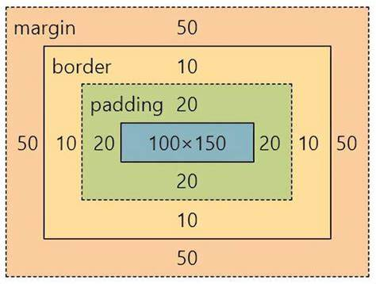

# CSS

# 选择器

> [!note]
> `css` 选择器用于选择 `HTML` 元素并修改其样式

## 常用选择器

- **元素选择器** : 直接选择对应的 `html` 标签

```css
h1 {
    color: aqua
}
```

- **类选择器** : 对标签中的 `class` 属性进行选择

```html
<div class="category"></div>

<style>
    .category{
        background-color: aqua;        
    }
</style>
```

- **ID 选择器** : 对标签中的 `id` 进行选择

```html
<div id="index"></div>

<style>
    #index{
        background-color: aqua;        
    }
</style>
```

- **通用选择器**：选择所有

```css
*{
    background-color: aqua;
}
```

## 组合选择器


- **群组选择器** ：满足一个选择条件，则会被选择

```css
.box1,#box2,h1{
    border: 1px solid  black;
}
```

- **后代选择** ： 选择当前元素的内部节点

```html
<div class="box">
    <div class="son">
        <h1>测试</h1>
    </div>
</div>

<style>
    .box h1{
        width: 50px;
        height: 50px;
        background-color: brown;
    }
</style>
```

- **子代选择器** ：只能选择第一代内部节点

```html
<div class="box">
    <div class="son">
        <h1>测试</h1>
    </div>
</div>

<style>
    .box > .son{
        width: 50px;
        height: 50px;
        background-color: brown;
    }
</style>
```

- **相邻兄弟选择器** ： 紧挨着当前元素的下一个相邻元素（上一个选不中）

```html
<h1>测试</h1>
<div class="box"></div>
<h2>测试</h2>

<style>
  .box + h2{
      color: brown;
  }
</style>
```

- **通用兄弟选择器** ： 当前元素的下面任意一个元素（上一个选不中）

```html
<h1>测试</h1>
<div class="box"></div>
<h2>测试</h2>
<h3>测试</h3>

<style>
  .box + h3{
      color: brown;
  }
</style>
```

## 属性选择器

根据标签属性进行选择

```html
<h1 title="标题1">测试</h1>
<h1 title="标题2">测试</h1>

<style>
  h1[title="标题2"]{
      color: brown;
  }
</style>
```

## 伪类选择器

为处于某个状态的已有元素添加对应的样式，这个状态是根据用户行为而动态改变的，使用 `:` 标记

- `:link`: 应用于未被访问过的链接
- `:hover`: 应用于鼠标悬停到的元素
- `:active`: 应用于被激活的元素
- `:visited`: 应用于被访问过的链接，与 `:link` 互斥
- `:focus`:  应用于拥有键盘输入焦点的元素

```css
a:hover {
    color: red;
}
```

## 伪元素选择器

伪元素为 `::` 引用选项，可以选择指定位置
- `::after`：在元素内容之后插入内容
- `::before`：在元素内容之前插入内容
- `::first-letter`：选择元素的第一个字母
- `::first-line`：选择元素的第一行
- `::selection`：选择用户选中的文本部分

```html
<div class="box">
    <!-- ::before -->
    <h1>测试1</h1>
    <!-- ::after -->
</div>

<style>
  .box{
    width: 200px;
    display: block;
  }

  .box::after {
    content: "div 后插入内容";
    display: block;
    width: 100%;
    background-color: red;
  }  
  .box::before {
    content: "div 前插入内容";
    display: block;
    width: 100%;
    background-color: yellow;
  }  
</style>
```

<div style='display:block; background-color: #f1f2f6; padding: 40px;'>

<div class="box">
    <h1>测试1</h1>
</div>

<style>
<style>
  .box{
    width: 200px;
    display: block;
  }

  .box::after {
    content: "div 后插入内容";
    display: block;
    width: 100%;
    background-color: red;
  }  
  .box::before {
    content: "div 前插入内容";
    display: block;
    width: 100%;
    background-color: yellow;
  }  
</style>
</style>
</div>


# 属性

## overflow

属性用于控制当内容溢出元素框时的行为
- visible: 默认值。内容不会被剪裁，会呈现在元素框之外。
- hidden: 内容会被剪裁，不会显示在元素框之外。
- scroll: 内容会被剪裁，但会提供滚动条以便查看被剪裁的内容。
- auto: 如果内容溢出，则提供滚动条；否则不提供。


## 盒子模型

所有`HTML`元素可以看作是「矩形盒子」，且可以通过 `style` 属性对 `margin、border、padding` 值进行调节



```html
<div style="
    width: 100px;
    height: 80px;
    background-color: red;
    border-style: solid;
    border-color: purple;
                  /* 上 右 下 左 */
    border-width: 10px 5px 15px 20px;
"></div>
```

<div style='display:block; background-color: #f1f2f6; padding: 40px'>
    <div style="
        width: 100px;
        height: 80px;
        background-color: red;
        border-style: solid;
        border-color: purple;
        border-width: 10px 5px 15px 20px;
    "></div>
</div>


## 单位

- `px` : 像素单位，任何设备上都不改变
- `rem` : 基准像素值为 `html` 标签的 `font-size` 像素大小

    ```css
    html{
        font-size: 15px
    }
    .{
        width: 2rem;  /* 其像素大小为：2 * 15 = 30 px */
    }
    ```
- `vw` : 视口宽度的百分比
- `vh` : 视口高度的百分比


# 变量

```html
<div class='father'>
    <div class='son'>
    </div>
</div>

<style>
    .father{
        --div--width: 100px
        width: var(--div--width)
    }

    .son{
        /* 自定义变量可继承 */
        width: var(--div--width)
    }
</style>
```


# 布局

## 文档流

标签均自带默认的布局方式，分为两大类

- **块元素** ： 标签元素独占一行，例如 `div、p、h、ul、ol、li、table、form` 等
- **行内元素** ：一行元素的中的内部元素，例如 `a、span、input、img` 等

「块元素」与「行内元素」在界面的上的排版就如同写文档一样

```html
<div>
    <h1>一级标题</h1>
    <p>段落文本</p>
    <h2>二级标题</h2>
    <p>段落文本</p>
    <p><b>加粗</b> <i>斜体</i> <u>下划线</u> </p>
</div>
```

<div style='display:block; background-color: #f1f2f6; padding: 40px'>
    <h1>一级标题</h1>
    <p>段落文本</p>
    <h2>二级标题</h2>
    <p>段落文本</p>
    <p><b>加粗</b> <i>斜体</i> <u>下划线</u> </p>
</div>


块元素与行内元素可以通过 `display` 属性进行修改

```css
.{
    /* 块元素 */
    display: block; 
}

.{
    /* 行内元素 */
    display: inline;
}
```


## float

**浮动`float`** : 打破「块元素」与「行内元素」的规定，允许用户自由布局。**浮动效果只会在父元素内部进行**。

```html
<div style="background-color: lightskyblue;width: 400px;height: 100px;">
    <div style="margin: 1px; background-color: red; float: left; height: 50px; width: 95px;">右</div>
    <div style="margin: 1px; background-color: red; float: left; height: 50px; width: 95px;">右</div>
    <div style="margin: 1px; background-color: red; float: left; height: 50px; width: 95px;">右</div>
    <div style="margin: 1px; background-color: greenyellow; float: right; height: 50px; width: 80px;">左</div>
    <div style="margin: 1px; background-color: greenyellow; float: right; height: 50px; width: 80px;">左</div>
    <div style="margin: 1px; background-color: greenyellow; float: right; height: 50px; width: 80px;">左</div>
</div>
```

<div style='display:block; background-color: #f1f2f6; padding: 40px'>
    <div style="background-color: lightskyblue;width: 400px;height: 100px;">
        <div style="margin: 1px; background-color: red; float: left; height: 50px; width: 95px;">右</div>
        <div style="margin: 1px; background-color: red; float: left; height: 50px; width: 95px;">右</div>
        <div style="margin: 1px; background-color: red; float: left; height: 50px; width: 95px;">右</div>
        <div style="margin: 1px; background-color: greenyellow; float: right; height: 50px; width: 80px;">左</div>
        <div style="margin: 1px; background-color: greenyellow; float: right; height: 50px; width: 80px;">左</div>
        <div style="margin: 1px; background-color: greenyellow; float: right; height: 50px; width: 80px;">左</div>
    </div>
</div>

## position

### relative

```html
<div class="box1"></div>
<div class="box2"></div>
<div class="box3"></div>

<style>
    .box1{
        width: 50px;
        height: 50px;
        background-color: red;
    }
    .box2{
        width: 50px;
        height: 50px;
        background-color: green;
        position: relative;         /* 将 box2 位置将相对于「文本流」原位置变化 */
        top: 20px;                  /* 通过 top right left bottom 控制相对距离 */
        right: 50px;
    }
    .box3{
        width: 50px;
        height: 50px;
        background-color: blue;
    }
</style>
```


<div style='display:block; background-color: #f1f2f6; padding: 40px;'>

<div class="box1"></div>
<div class="box2"></div>
<div class="box3"></div>

<style>
.box1{
	width: 50px;
	height: 50px;
	background-color: red;
}
.box2{
	width: 50px;
	height: 50px;
	background-color: green;
	position: relative;
	top: 20px;
	right: 50px;
}
.box3{
	width: 50px;
	height: 50px;
	background-color: blue;
}
</style>
</div>

### absolute


```html
<div class="box"></div>

<style>
    .box{
        width: 50px;
        height: 50px;
        background-color: green;
        position: absolute;         /* 将 box 位置将相对于「渲染界面」左上角进行定位 */
        top: 20px;                  /* 通过 top right left bottom 控制距离 */
        right: 50px;
    }
</style>
```

### fixed

```html
<div class="box"></div>

<style>
    .box{
        width: 50px;
        height: 50px;
        background-color: green;
        position: fixed;            /* 将 box 位置将相对于「窗口界面」左上角进行定位 */
        top: 20px;                  /* 通过 top right left bottom 控制距离 */
        right: 50px;
    }
</style>
```

> [!note]
> `fixed` 类似元素置顶，不受滚动条控制，而 `absolute` 在渲染界面内，会受到滚动条控制


## flex

### 模型


`Flex` 弹性盒子模型
- **容器`container`** : 容器内的子元素才能参与 Flex 布局
- **项目`item`** : 参与 Flex 布局的元素

### container


容器可以配置的属性有
- `flex-direction` : 决定 `main axis` 的方向，`item` 默认会沿着主轴放置

    

- `flex-wrap` ：`item` 在轴线上放置不下式，如何换行

    

- `justify-content` : 定义 `item` 在 `main axis` 上的对齐方式

    

- `align-items` : 定义 `item` 在 `cross axis` 上的对齐方式

    

- `align-content` : 定义多根轴线的对齐方式，如果项目只有一根轴线，该属性不起作用

    

- `flex-flow` : `flex-wrap` 与 `flex-direction` 的简写形式

### item

`item` 可以设置的属性有
- `order` :  item 排列顺序，数值越小，排列越靠前
- `flex-grow` ：放大比例因子，默认为 0，即按照比例因子划分空间
- `flex-shrink` : 缩小比例，默认为1，即如果空间不足，该项目将缩小
- `flex` : `flex-grow` 与 `flex-shrink` 简写
- `flex-basis` : 给一个 item 在 `main axis` 上推荐占用的空间，默认为 item 自身长度
- `align-self` : 单个项目有与其他项目不一样的对齐方式，覆盖`align-items`属性

# 填充屏幕

## position

**`top、bottom、left、right` 一定设置为 `0px`**

```css
div {
    position: absolute;
    width: 100%;
    height: 100%;
    top: 0px;
	bottom: 0px;
	left: 0px;
	right: 0px;
}
```

## html/body

**需要一层一层的调节所有父元素宽高**

```css
html, body {
    width: 100%;
    height: 100%;
}
```

## viewport

**需要 `div` 是最顶层元素，否则会出现滚动条**

```css
div {
    width: 100vw;
    height: 100vh;
}
```