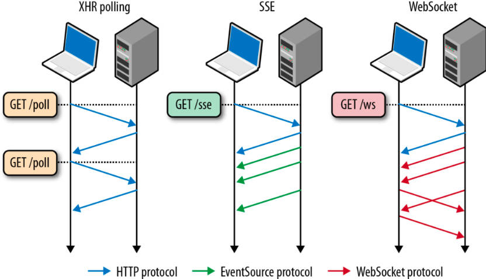

# JavaScript


# 库

- **导出**

```javascript
/* 一般用法 */
export var target; // 导出变量
export function fcn() { // 导出函数
    
}
```

- **NodeJs 导入**

```javascript
import { export_content } from "module";

const module = require("module");
```

- **浏览器导入**

```html
    <script type="text/javascript" src="module.js"></script>
```

# WebSocket



服务器与客户端的交互一般是客户端主动发起请求，服务返回响应的形式进行，但是这种交互模式不能实现服务端对客户端主动发送消息，例如服务器发生了某一事件，需要主动通知客户端发生了什么事件。
- `polling`: 轮询，客户端间隔一段时间就发送一次请求，服务器检测到事件就会通知在响应中通知客户端。
- `long-polling`: 长轮询，客户端一直发送请求，无间隔时间
- `WebSocket`: 客户端与服务端直接建立一个类似 `socket` 的连接，支持相互收发信息。

```javascript
    // NodeJs 获取 
    const WebSocket = require("ws")
    // 浏览器获取
    const WebSocket = window.WebSocket;
    
    // 按照 ws、wss 协议进行通信，会自动对 http、https 协议进行封装
    var web = new WebSocket("ws://127.0.0.1:5500");
    
    web.onopen = ()=>{
        console.log("open");
    };
    
    web.onmessage = (ev)=>{
        console.log(ev.data);
    }
    
    web.onerror = (ev)=>{
        console.log(ev);
    };
```


