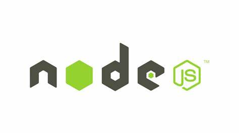

# NodeJs

# 概述




[Node.js](https://nodejs.org/en) 是一个基于 Chrome JavaScript 运行时建立的一个平台。其功能类似于 `Python.exe` 为 JavaScript 提供了一整套完整的生态平台：运行环境、包管理、语言解析、调试器等。 `Node.js` 提供的是「本地运行环境」，且不同于「浏览器平台」，因此功能是 NodeJs 环境特有的，例如 `fs`。

```term
triangle@LEARN:~$ node ./test.js // 执行 javascript
```

# npm

## 介绍

[npm (node package manger)](https://www.npmjs.com/): 是 `NodeJs` 的包管理系统，可以方便地下载、安装、升级、删除包，也可以让你作为开发者发布并维护包。

```term
triangle@LEARN:~$ npm -v // 本版
triangle@LEARN:~$ npm -l // 常用命令
```

## 使用

- **配置**

```term
triangle@LEARN:~$ npm config list -l // 配置
triangle@LEARN:~$ npm config set registry https://registry.npmmirror.com // 修改源
triangle@LEARN:~$ npm config set prefix [dir] // 设为模块的全局安装目录
triangle@LEARN:~$ npm config set init.author.name [name] // 配置 package.json 初始化设置
```

- **包管理**

```term
triangle@LEARN:~$ npm info [package] // 查看包信息
triangle@LEARN:~$ npm install [Options] [foo] // 安装包
Options:
    -g          安装到全局路径，没有则下载到 node_modules 文件夹
    --save      包信息添加到 package.json 的 `dependencies` 字段中
    --save-dev  包信息添加到 package.json 的 `devDependencies` 字段中

foo:
    -空         安装所有
    -包名       从仓库下载
    -路径       将本地包配置到 package.json 文件中
triangle@LEARN:~$ npm uninstall [foo] // 卸载包
triangle@LEARN:~$ npm search [name] // 在仓库搜索
triangle@LEARN:~$ npm list // 查看当前目录下的包
triangle@LEARN:~$ npm update [package name] // 升包
```

- **运行**

```term
triangle@LEARN:~$ npm run [scripts] // 执行 package.json 中配置的脚本
- 该命令会在 $PATH 中添加 node_modules/.bin 目录
- `scripts` 配置了 `pre` 与 `post`，则会依次执行
    1. npm run prescripts
    2. npm run scripts
    3. npm run postscripts
```

- **链接**

```term
triangle@LEARN:~$ npm link  // 将当前「正在开发的包」临时放入全局包
triangle@LEARN:~$ npm link [package] // 其他项目引用放入全局包的「临时包」
triangle@LEARN:~$ npm unlink [package] // 删除临时包
```

- **发布**

```term
triangle@LEARN:~$ npm publish [--tag beta] // 发布到 npmjs.com
```

## package.json

> [package.json](https://dev.nodejs.cn/learn/the-package-json-guide/) 是 `Nodejs` 项目工程配置文件。

```json
{
    "name": "test-project",
    "version": "1.0.0", 
    "description": "A Vue.js project",
    // 主页
    "homepage": "url",
    // bug 追踪页
    "bugs":"url",
    // 仓库
    "repository":"url",
    // 证书
    "license":"MIT",
    // 防止被意外发布到 npmjs.com
    "private": true,
    // 包的入口
    "main": "src/main.js",
    // 自定义快捷指令
    "scripts": {
        "dev": "webpack-dev-server --inline --progress --config build/webpack.dev.conf.js",
        "start": "npm run dev",
        "unit": "jest --config test/unit/jest.conf.js --coverage",
        "test": "npm run unit",
        "lint": "eslint --ext .js,.vue src test/unit",
        "build": "node build/build.js"
    },
    // 包运行依赖， npm install package 会自动更新
    "dependencies": {
        "vue": "^2.5.2"
    },
    // 包开发依赖，npm install package 会自动更新
    "devDependencies": {
        "autoprefixer": "^7.1.2",
        //...
    },
    // 指定 nodejs 版本
    "engines": {
        "node": ">= 6.0.0",
        "npm": ">= 3.0.0"
    },
    // 哪些浏览器能运行
    "browserslist": ["> 1%", "last 2 versions", "not ie <= 8"],
}
```

```term
triangle@LEARN:~$ npm init // 初始化 package.json
triangle@LEARN:~$ npm run [scripts] // 运行 package.json 中脚本
```

# webpack

## 简介

[webpack](https://blog.csdn.net/chen4565/article/details/118093586) 是一个构建工具，为了将开发好的代码进行优化压缩，得到体积更小、语法统一更利于运行的代码。
- **代码压缩**: 将 js、css 混淆压缩
- **编译语法**: 编写JS时使用ES6、TypeScript等语法，需要转换为浏览器能识别的规则。
- **处理模块化**: 浏览器不支持 `import`，需要转换为 `require()`

## 使用

- **安装**

```term
triangle@LEARN:~$ npm install webpack webpack-cli -g
triangle@LEARN:~$ npm install css-loader style-loader // 安装 loader ，可选
```

- **配置文件 `webpack.config.js`**

```javascript
const path = require('path') // 引用path模块
module.exports = {
    entry: "./main.js", // 程序入口 js
    output: {
        path: path.resolve(__dirname,'build'),  // 输出路径
        filename: "out.js", // 打包输出结果

        // NOTE - 需要从 out.js 中 export 内容时，才使用
        library: "libraryName", // 导出的库名
        libraryTarget:"type", // 库的提供方式：var、commonjs、commonjs2、this、window
    },
    module: {
        rules: [ 
            { 
                // 匹配文件
                test: /\.css$/, 
                // loader执行顺序, 从右到左, 从下到上, 依次执行
                use:[
                    'style-loader',
                    'css-loader'
                ]
            }
        ]
    },
    // 打包模式
    mode:"development"
};
```

指定 `library` 与 `libraryTarget` 后，能导出 `export` 修饰的内容给外部使用，即[库](https://blog.csdn.net/qq_17175013/article/details/119753486)。若不指定，导出的`js` 文件则是单纯的可执行脚本，且内部元素不会向外暴露。

```javascript
/* 不指定库时的打包结果，外部无法调用 */
(
    var xx;
    dosomething();
)();
```

- **执行打包**

```term
triangle@LEARN:~$ webpack // 配置了 webpack.config.js 直接运行
triangle@LEARN:~$ webpack ./index.js -o ./bin/out.js // 命令行
Options:
    -o                  打包输出
    --mode              指定打包模式 development, production
```

# TypeScript

## tsc

```term
triangle@LEARN:~$ npm i -g typescript // 安装
triangle@LEARN:~$ tsc --init // 初始化生成 tsconfig.json 文件，需要配合 npm init 一起初始化项目
triangle@LEARN:~$ tsc --help
Options
    -p              根据 tsconfig.json 编译项目
    -w              监视文件
```

- **tsconfig.json**

```json
{
    "compilerOptions": {
        "module": "commonjs",   // 生成的 javascript 格式
        "target": "ES2020",
        "outDir": "out",        // js 输出目录
        "lib": [                // 语法支持库
            "ES2020",
            "ES2021.String"
        ],
        "sourceMap": true,      // js 输出文件可以映射到 ts
        "rootDir": "src",       // ts 文件所在文件夹
        "strict": true   /* enable all strict type-checking options */
        /* Additional Checks */
        // "noImplicitReturns": true, /* Report error when not all code paths in function return a value. */
        // "noFallthroughCasesInSwitch": true, /* Report errors for fallthrough cases in switch statement. */
        // "noUnusedParameters": true,  /* Report errors on unused parameters. */
    }
}
```

- **package.json**

```json
{
  "name": "vscode-util",
  "version": "1.0.0",
  "description": "",
  "main": "out/main.js",
  "scripts": {
    "compile": "tsc -p ./",             // tsc 编译
    "watch": "tsc -watch -p ./",        // tsc 实时监控编译
  },
  "author": "",
  "license": "ISC",
  "dependencies": {
    "util-kit": "^0.1.4"
  }
}

```

## 多模块

```term
triangle@LEARN:~$ tree .
    .
    ├── package.json        # 项目配置
    ├── tsconfig.base.json  # 根 typescript 配置
    ├── shared/             # 共享代码
    │   └── <code ts>
    ├── module1/
    │   ├── src/
    │   │   └── <code ts>
    │   └── tsconfig.json   # module1 的 ts 配置
    └──  module2/
        ├── src/
        │   └── <code ts>
        └── tsconfig.json   # module2 的 ts 配置
```

- **tsconfig.base.json** ： 公共配置

```json
{
	"compilerOptions": {
		"module": "Node16",
		"target": "ES2022",
		"lib": [
			"ES2022"
		],
		"sourceMap": true,
		"strict": true,   /* enable all strict type-checking options */

        /* 
            公共代码路径配置
            import { Foo } from '~shared/foo';
        */
        "paths": {
            "~shared/*": ["../shared/*"]
        },
	}
}
```

- **tsconfig.json**

```json
{
    // 配置当前模块的编译选项
	"compilerOptions": {
		"outDir": "../../out/extension",
		"rootDir": "./",
	},

    // 继承基础配置
	"extends": "../tsconfig.base.json"
}

```