# 堆调试

# window 内存管理

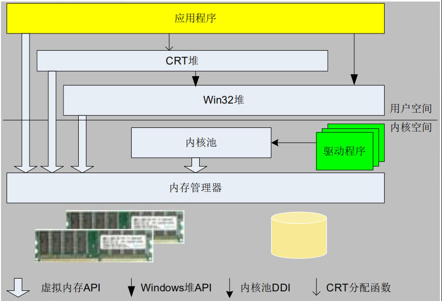


# 堆概述

## 堆管理

堆的用途可以理解为一个内存池。堆管理器会持有很大一片内存，其负责接管应用程序中内存的申请释放等请求。管理器的表现形式就是生成的具体堆对象。

## 堆分类

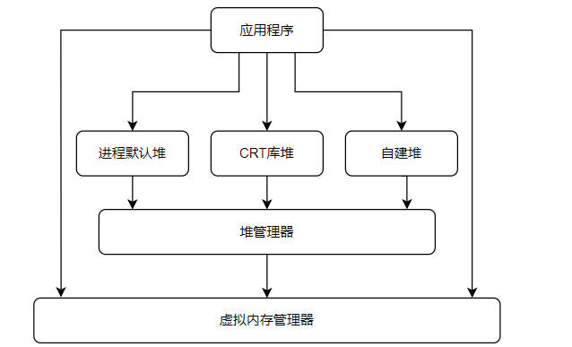

- `进程默认堆` : 在 `ntdll.dll` 中实现的堆管理器，系统为每个进程创建的默认堆。如`LocalAlloc`或者`GlobalAlloc`是从进程默认堆上分配内存。可以使用`GetProcessHeap`获取进程默认堆的句柄，然后根据用这个句柄去调用`HeapAlloc`达到在系统默认堆上分配内存的效果。

- `CRT库堆` : 标准库创建的堆，如 `malloc` 与 `new` 从堆上获取内存。`vs2010` 之前 CRT库通过`HeapCreate` 创建堆；`vs2015` 之后则使用进程默认堆。

- `自建堆` : 进程自己创建的堆。泛指程序通过`HeapCreate`去创建的堆，然后利用`HeapAlloc`等API去操作堆


## API

- **堆对象创建**

```cpp
// 创建一个堆对象，虚拟地址空间中保留空间，物理内存则初始化部分
HANDLE HeapCreate(
  [in] DWORD  flOptions,
  [in] SIZE_T dwInitialSize,
  [in] SIZE_T dwMaximumSize
);

// 创建可由进程使用的堆对象，由 HeapCreate 调用。
NTSYSAPI PVOID RtlCreateHeap(
  [in]           ULONG                Flags,
  [in, optional] PVOID                HeapBase,
  [in, optional] SIZE_T               ReserveSize,
  [in, optional] SIZE_T               CommitSize,
  [in, optional] PVOID                Lock,
  [in, optional] PRTL_HEAP_PARAMETERS Parameters
);

```

- **堆内存申请**

```cpp
// 从堆中分配内存块。 分配的内存不可移动。
DECLSPEC_ALLOCATOR LPVOID HeapAlloc(
  [in] HANDLE hHeap,
  [in] DWORD  dwFlags,
  [in] SIZE_T dwBytes
);

// 分配堆中的内存块
NTSYSAPI PVOID RtlAllocateHeap(
  [in]           PVOID  HeapHandle,
  [in, optional] ULONG  Flags,
  [in]           SIZE_T Size
);


// 创建虚拟内存，由 RtlCreateHeap 与 RtlAllocateHeap 调用。
NTSYSAPI NTSTATUS ZwAllocateVirtualMemory(
  [in]      HANDLE    ProcessHandle,
  [in, out] PVOID     *BaseAddress,
  [in]      ULONG_PTR ZeroBits,
  [in, out] PSIZE_T   RegionSize,
  [in]      ULONG     AllocationType,
  [in]      ULONG     Protect
);
```

- **内存释放**

```cpp
// 释放由 HeapAlloc 或 HeapReAlloc 函数从堆分配的内存块。
BOOL HeapFree(
  [in] HANDLE                 hHeap,
  [in] DWORD                  dwFlags,
  [in] _Frees_ptr_opt_ LPVOID lpMem
);

// 释放由 RtlAllocateHeap 从堆分配的内存块。
BOOLEAN RtlFreeHeap(
  _In_     PVOID HeapHandle,
  _In_opt_ ULONG Flags,
  _In_     PVOID HeapBase
);

// 取消提交指定进程的虚拟地址空间中的页面区域。只有当空闲空间达到一定的量才会还给操作系统
NTSYSAPI NTSTATUS ZwFreeVirtualMemory(
  [in]      HANDLE  ProcessHandle,
  [in, out] PVOID   *BaseAddress,
  [in, out] PSIZE_T RegionSize,
  [in]      ULONG   FreeType
);
```

- **销毁堆对象**

```cpp
BOOL HeapDestroy(
  [in] HANDLE hHeap
);

NTSYSAPI PVOID RtlDestroyHeap(
  [in] PVOID HeapHandle
);

```


## 查看堆

```term
triangle@LEARN:~$ !heap // 查看存在哪些堆管理器
        Heap Address      NT/Segment Heap

              8d0000              NT Heap
triangle@LEARN:~$ !gflag // 支持哪些堆的操作
Current NtGlobalFlag contents: 0x00000070
    htc - Enable heap tail checking 
    hfc - Enable heap free checking
    hpc - Enable heap parameter checking
triangle@LEARN:~$ !peb // 查看进程控制块
PEB at 007d0000
    InheritedAddressSpace:    No
    ReadImageFileExecOptions: No
    BeingDebugged:            Yes
    ImageBaseAddress:         004d0000
    NtGlobalFlag:             70
    ...
    SubSystemData:     00000000
    ProcessHeap:       008d0000 // 默认堆的句柄
    ProcessParameters: 008d1fc0
    CurrentDirectory:  'C:\Windows\System32\'
    ....
triangle@LEARN:~$ !heap 8d0000 // 具体堆的使用情况
Index   Address  Name      Debugging options enabled
  1:   008d0000 
    Segment at 008d0000 to 009cf000 (0000b000 bytes committed)
```

# 堆结构

## 概况

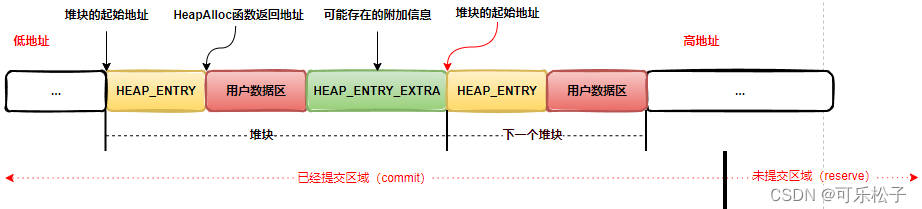

堆管理器被创建时，会从虚拟内存管理器中获取一片内存。管理器将这片内存按照「堆段 `heap segment`」 的结构进行内存管理，每一个堆段内部又会划分为一个个「堆块」。并且「堆段」数量会随着使用量的增加而增长
- **堆段初始化**：会对虚拟内存低地址一部分进行初始化，并标记为 `commit` 状态。剩余的虚拟内存则标记为 `reserve` 状态。
- **内存申请**：`commit` 状态的用户数据内存够用，就把 `commit` 状态的内存给用户；若不够用了，则把 `reserve` 状态的内存变成 `commit` 状态给用户使用
- **堆段内存用完**：堆管理器将创建一个新的堆段 `heap segment`，默认创建新堆段大小是之前的2倍（详细要看算法）；会用一个链表统一记录相关的堆段 `heap segment`

> [!note]
> 堆管理器不会主动将内存释放，还给虚拟内存管理器。只有当 `reserve` 状态的内存达到一定程序，才会被虚拟内存管理收回。因此 `HeapFree` 的作用不是真正的内存释放。

堆对象主要包含三个重要的结构体：
- `HEAP`: 描述堆对象 
- `HEAP_SEGMENT`: 描述堆段
- `HEAP_ENTRY`: 描述堆块

每个堆至少拥有一个`00`号段，最多可拥有64个段；堆管理器在创建堆时会建立一个段，如果堆是可以增长的话，用完一个段后堆会自动增长；`00` 号段开始处存放着一个`HEAP`结构的头部信息，每个段都有一个`HEAP_SEGMENT` 结构（在每个段的起始处）

```term
triangle@LEARN:~$ !heap
        Heap Address      NT/Segment Heap

             1070000              NT Heap
triangle@LEARN:~$ dt _HEAP 1070000 -r2 // 将 1070000 地址的数据转化为 _HEAP 结构体进行展示
ntdll!_HEAP # heap 结构体
   +0x000 Segment          : _HEAP_SEGMENT # 堆段
      +0x000 Entry            : _HEAP_ENTRY # 堆块
         +0x000 UnpackedEntry    : _HEAP_UNPACKED_ENTRY
         +0x000 Size             : 0x7237
         +0x002 Flags            : 0x55 'U'
         +0x003 SmallTagIndex    : 0x78 'x'
         +0x000 SubSegmentCode   : 0x78557237
         +0x004 PreviousSize     : 0x300c
         +0x006 SegmentOffset    : 0 ''
         +0x006 LFHFlags         : 0 ''
         +0x007 UnusedBytes      : 0x1 ''
         +0x000 ExtendedEntry    : _HEAP_EXTENDED_ENTRY
         +0x000 FunctionIndex    : 0x7237
         +0x002 ContextValue     : 0x7855
         +0x000 InterceptorValue : 0x78557237
         +0x004 UnusedBytesLength : 0x300c
         +0x006 EntryOffset      : 0 ''
         +0x007 ExtendedBlockSignature : 0x1 ''
         +0x000 Code1            : 0x78557237
         +0x004 Code2            : 0x300c
         +0x006 Code3            : 0 ''
         +0x007 Code4            : 0x1 ''
         +0x004 Code234          : 0x100300c
         +0x000 AgregateCode     : 0x0100300c`78557237
      +0x008 SegmentSignature : 0xffeeffee
      +0x00c SegmentFlags     : 2
      +0x010 SegmentListEntry : _LIST_ENTRY [ 0x10700a4 - 0x10700a4 ]
      。。。
```

## HEAP

堆管理器使用 `HEAP` 结构记录和维护每个堆的管理信息，位于每个堆的开始处，即存放在第一个堆段的起始位置。`HeapCreate` 返回的句柄是创建堆的起始地址，即 `HEAP` 结构体的指针。


```term
triangle@LEARN:~$ dt _HEAP 1070000 
ntdll!_HEAP
   +0x000 Segment          : _HEAP_SEGMENT
   +0x000 Entry            : _HEAP_ENTRY
   +0x008 SegmentSignature : 0xffeeffee               # 标记是堆，还是堆段
   +0x00c SegmentFlags     : 2
   +0x010 SegmentListEntry : _LIST_ENTRY [ 0x10700a4 - 0x10700a4 ] # 段链表入口
   +0x018 Heap             : 0x01070000 _HEAP
   +0x01c BaseAddress      : 0x01070000 Void
   +0x020 NumberOfPages    : 0xff
   +0x024 FirstEntry       : 0x010704a8 _HEAP_ENTRY
   +0x028 LastValidEntry   : 0x0116f000 _HEAP_ENTRY
   +0x02c NumberOfUnCommittedPages : 0xf8
   +0x030 NumberOfUnCommittedRanges : 1
   +0x034 SegmentAllocatorBackTraceIndex : 0
   +0x036 Reserved         : 0
   +0x038 UCRSegmentList   : _LIST_ENTRY [ 0x1076ff0 - 0x1076ff0 ]
   +0x040 Flags            : 0x40000062
   +0x044 ForceFlags       : 0x40000060
   +0x048 CompatibilityFlags : 0
   +0x04c EncodeFlagMask   : 0x100000
   +0x050 Encoding         : _HEAP_ENTRY
   +0x058 Interceptor      : 0
   +0x05c VirtualMemoryThreshold : 0xfe00                 #最大堆块大小（单位是分配粒度）
   +0x060 Signature        : 0xeeffeeff
   +0x064 SegmentReserve   : 0x100000                     #段的保留空间大小
   +0x068 SegmentCommit    : 0x2000                       #段的每次提交的大小
   +0x06c DeCommitFreeBlockThreshold : 0x200              #解除提交的单块阈值（以分配粒度为单位）
   +0x070 DeCommitTotalFreeThreshold : 0x2000
   +0x074 TotalFreeSize    : 0x195                        #空闲块总大小（以分配粒度为单位）
   +0x078 MaximumAllocationSize : 0x7ffdefff
   +0x07c ProcessHeapsListIndex : 1
   +0x07e HeaderValidateLength : 0x258
   +0x080 HeaderValidateCopy : (null) 
   +0x084 NextAvailableTagIndex : 0
   +0x086 MaximumTagIndex  : 0
   +0x088 TagEntries       : (null) 
   +0x08c UCRList          : _LIST_ENTRY [ 0x1076fe8 - 0x1076fe8 ]
   +0x094 AlignRound       : 0x17
   +0x098 AlignMask        : 0xfffffff8
   +0x09c VirtualAllocdBlocks : _LIST_ENTRY [ 0x107009c - 0x107009c ]
   +0x0a4 SegmentList      : _LIST_ENTRY [ 0x1070010 - 0x1070010 ]
   +0x0ac AllocatorBackTraceIndex : 0
   +0x0b0 NonDedicatedListLength : 0
   +0x0b4 BlocksIndex      : 0x01070270 Void
   +0x0b8 UCRIndex         : (null) 
   +0x0bc PseudoTagEntries : (null) 
   +0x0c0 FreeLists        : _LIST_ENTRY [ 0x1073e18 - 0x10766d0 ]    #记录空闲堆块链表的表头
   +0x0c8 LockVariable     : 0x01070258 _HEAP_LOCK
   +0x0cc CommitRoutine    : 0x1d5bd820     long  +1d5bd820
   +0x0d0 StackTraceInitVar : _RTL_RUN_ONCE
   +0x0d4 CommitLimitData  : _RTL_HEAP_MEMORY_LIMIT_DATA
   +0x0e4 FrontEndHeap     : (null) 
   +0x0e8 FrontHeapLockCount : 0
   +0x0ea FrontEndHeapType : 0 ''
   +0x0eb RequestedFrontEndHeapType : 0 ''
   +0x0ec FrontEndHeapUsageData : 0x010704b0  ""
   +0x0f0 FrontEndHeapMaximumIndex : 0x80
   +0x0f2 FrontEndHeapStatusBitmap : [257]  ""
   +0x1f4 Counters         : _HEAP_COUNTERS
   +0x250 TuningParameters : _HEAP_TUNING_PARAMETERS
```
- **分配粒度**： 一粒度一般指 8bytes 长度。

- `VirtualMemoryThreshold : 0xfe00` : 在段中，堆块的用户数据区的最大值，单位是分配粒度。`0xfe00*8=0x7f000=508KB=504+4` ，意味着堆中最大的普通堆块的用户数据区是 508K，超过 508K，直接调用 `ZwAllocateVirtualMemory` 分配内存；如果堆可以增长，可以直接分配 512K。

- `FreeLists`: 当有新的分配内存请求时，堆管理器会先在 `FreeLists` 链表里寻找最接近且满足要求的堆块；找到便分配出去；没有找到，提交新的内存也并建立新的堆块；用户释放时负责回收。

- `VirtualAllocdBlocks`: 如果申请内存大于虚拟内存的阈值，则直接从虚拟内存管理器中进行分配

## HEAP_SEGMENT

> [!note]
> `00` 堆段的结构体 `HEAP_SEGMENT` 与 `HEAP` 结构体的首地址其实是一样的

```term
triangle@LEARN:~$ dt _HEAP_SEGMENT 1070000 
ntdll!_HEAP_SEGMENT
   +0x000 Entry            : _HEAP_ENTRY
   +0x008 SegmentSignature : 0xffeeffee
   +0x00c SegmentFlags     : 2
   +0x010 SegmentListEntry : _LIST_ENTRY [ 0x10700a4 - 0x10700a4 ]
   +0x018 Heap             : 0x01070000 _HEAP                       #属于的堆
   +0x01c BaseAddress      : 0x01070000 Void                        #段的基地址
   +0x020 NumberOfPages    : 0xff                                   #段的内存页数
   +0x024 FirstEntry       : 0x010704a8 _HEAP_ENTRY                 #第一个堆块，最有用的信息
   +0x028 LastValidEntry   : 0x0116f000 _HEAP_ENTRY                 #堆块的边界
   +0x02c NumberOfUnCommittedPages : 0xf8
   +0x030 NumberOfUnCommittedRanges : 1
   +0x034 SegmentAllocatorBackTraceIndex : 0

```

## HEAP_ENTRY

> [!note]
> 堆段划分为堆块，因此第一个堆块的首地址其实和堆段的一样

```term
triangle@LEARN:~$  dt _HEAP_ENTRY 0x010704a8 
ntdll!_HEAP_ENTRY
   +0x000 UnpackedEntry    : _HEAP_UNPACKED_ENTRY
   +0x000 Size             : 0x7281                 #堆块的大小（以分配粒度为单位）
   +0x002 Flags            : 0x5b '['               #堆块的状态
   +0x003 SmallTagIndex    : 0xc0 ''                #用于检查栈溢出的cookie
   +0x000 SubSegmentCode   : 0xc05b7281
   +0x004 PreviousSize     : 0x3099                 #前一个堆块的大小
   +0x006 SegmentOffset    : 0 ''
   +0x006 LFHFlags         : 0 ''
   +0x007 UnusedBytes      : 0x1 ''
   +0x000 ExtendedEntry    : _HEAP_EXTENDED_ENTRY
   +0x000 FunctionIndex    : 0x7281
   +0x002 ContextValue     : 0xc05b
   +0x000 InterceptorValue : 0xc05b7281
   +0x004 UnusedBytesLength : 0x3099
   +0x006 EntryOffset      : 0 ''
   +0x007 ExtendedBlockSignature : 0x1 ''
   +0x000 Code1            : 0xc05b7281
   +0x004 Code2            : 0x3099
   +0x006 Code3            : 0 ''
   +0x007 Code4            : 0x1 ''
   +0x004 Code234          : 0x1003099
   +0x000 AgregateCode     : 0x01003099`c05b7281
triangle@LEARN:~$ !heap -x 01070000 // 第一个堆块
Entry     User      Heap      Segment       Size  PrevSize  Unused    Flags
-----------------------------------------------------------------------------
01070000  01070008  01070000  01070000       4a8         0         1  busy 
triangle@LEARN:~$ !heap -x 01070000+4a8 // 第二个堆块，可以通过 Size 与 PrevSize 进行段块的前后索引
Entry     User      Heap      Segment       Size  PrevSize  Unused    Flags
-----------------------------------------------------------------------------
010704a8  010704b0  01070000  01070000       118       4a8         1  busy extra fill  internal
```

# 堆调试

```cpp
#include <malloc.h>
#include <Windows.h>

// 填充内存使用
void fill(char* p, int len, char ch){
    for (size_t i = 0; i < len; i++)
    {
        p[i] = ch;
    }
}

int main(int argc, char const *argv[])
{
    int len = 12;
    char * buffer = nullptr;

    // malloc
    buffer = (char *) malloc(10);
    fill(buffer,len,'w');
    free(buffer);
    buffer = nullptr;

    // new
    buffer = new char[len]();
    fill(buffer, len , 'x');
    delete [] buffer;
    buffer = nullptr;

    // 系统堆 
    HANDLE heap = HeapCreate(0,1024, 0);
    buffer = (char*)HeapAlloc(heap, 0, len);
    fill(buffer,len, 'y');
    HeapFree(heap, 0, buffer);
    HeapDestroy(heap);

    return 0;
}

```

```term
triangle@LEARN:~$ // 编译器使用的是 msvc 2017，因此 crt 堆就是用的默认堆
triangle@LEARN:~$ !heap
        Heap Address      NT/Segment Heap

              7c0000              NT Heap # crt 堆和默认堆是同一个
triangle@LEARN:~$ // 执行 malloc
triangle@LEARN:~$ dt buffer
Local var @ 0x73f814 Type char*
0x007c5538  "wwwwwwwwwwww???"
triangle@LEARN:~$ !heap 7c0000 -a 
        ...
        007c52d0: 00078 . 001e8 [107] - busy (1cc), tail fill
        007c54b8: 001e8 . 00078 [107] - busy (60), tail fill
        # busy (a) : 0xa 就是 10，表示该 HEAP_ENTRY 申请了 10 的内存空间
        007c5530: 00078 . 00030 [107] - busy (a), tail fill 
        007c5560: 00030 . 00028 [107] - busy (10), tail fill
        007c5588: 00028 . 00018 [104] free fill
        007c55a0: 00018 . 00068 [107] - busy (4a), tail fill
        ....
triangle@LEARN:~$ dt _HEAP_ENTRY 007c5530 // 查看块
# 信息乱码，这是因为内存中的结构体存在编码，需要对内存信息解码才能得到正确的结构体信息
ntdll!_HEAP_ENTRY 
   +0x000 UnpackedEntry    : _HEAP_UNPACKED_ENTRY
   +0x000 Size             : 0x694c
   +0x002 Flags            : 0xfe ''
   +0x003 SmallTagIndex    : 0xd0 ''
   ...
triangle@LEARN:~$ dd 007c5538 // buffer 内存，填充了 'w'
007c5538  77777777 77777777 77777777 abababab
007c5548  feeeabab feeefeee feeefeee feeefeee
007c5558  00000000 00000000 d3fe694f 1800aa1a
007c5568  007c5568 007c51b8 007c4100 007c4fe8
triangle@LEARN:~$ dd 007c5530 // 块内存
# d0fe694c 2600aa13 : HEAP_ENTRY 内容，进行过编码
# abababab : 堆尾填充，防止溢出。再释放前进行检测
# baadf00d : 堆刚被申请出来时的默认填充值
# feeefeee : free 块填充的残留
007c5530  d0fe694c 2600aa13 77777777 77777777
007c5540  77777777 abababab feeeabab feeefeee
007c5550  feeefeee feeefeee 00000000 00000000
007c5560  d3fe694f 1800aa1a 007c5568 007c51b8
007c5570  007c4100 007c4fe8 abababab abababab
triangle@LEARN:~$ // 执行 new
triangle@LEARN:~$ !heap 7c0000 -a 
...
# busy (c) : 0xc 就是 12
# 00df3dc0 : 重新启动过程序，内存地址有变，不用太过纠结 
00df3dc0: 00040 . 00028 [107] - busy (c), tail fill
...
triangle@LEARN:~$ dd 00df3dc0 // 查看块内存
00df3dc0  f9d69a3d 1c0072b2 78787878 78787878
00df3dd0  78787878 abababab abababab feeefeee
00df3de0  00000000 00000000 fdd59a3a 000072bf
00df3df0  00df4028 00df00c0 f9d69a3d 180072b8
00df3e00  00df40f8 00df4fe8 00df3e08 00df3b08
triangle@LEARN:~$ !heap 7c0000 -a // delete [] 后再次查看
..
# new 的堆块已经变成的 free 块
00df3dc0: 00040 . 00038 [104] free fill
..
triangle@LEARN:~$ dd 00df3dc0 // delete [] 后再次查看
# 堆块已经全部由 feeefeee 进行填充。delete 会立即执行 ，而 free 没有
00df3dc0  f8d59a3f 000072b2 00df5650 00df5590
00df3dd0  feeefeee feeefeee feeefeee feeefeee
00df3de0  feeefeee feeefeee feeefeee feeefeee
00df3df0  feeefeee feeefeee f9d69a3d 180072bd
00df3e00  00df40f8 00df4fe8 00df3e08 00df3b08
triangle@LEARN:~$ // 执行 HeapCreate
triangle@LEARN:~$ dt heap
Local var @ 0xcffc98 Type void*
0x01340000 
triangle@LEARN:~$ !heap
        Heap Address      NT/Segment Heap

              df0000              NT Heap
             1340000              NT Heap # 通过 HeapCreate 创建的堆
triangle@LEARN:~$ dd 013405c0 // 执行 HeapFree
013405c0  8297a836 00005f34 013400c0 013400c0
013405d0  feeefeee feeefeee feeefeee feeefeee
013405e0  feeefeee feeefeee feeefeee feeefeee
013405f0  feeefeee feeefeee feeefeee feeefeee
```

# 堆溢出

## TAIL 填充

```cpp
#include <malloc.h>
#include <Windows.h>

void fill(char* p, int len, char ch){
    for (size_t i = 0; i < len; i++)
    {
        p[i] = ch;
    }
}

int main(int argc, char const *argv[])
{
    int len = 12;
    char * buffer = nullptr;

    // new
    buffer = new char[len]();
    fill(buffer, len + 2 , 'x'); // 存在越界
    delete [] buffer;
    buffer = nullptr;

    return 0;
}
```

```term
triangle@LEARN:~$ !heap
        Heap Address      NT/Segment Heap

             15c0000              NT Heap
triangle@LEARN:~$ !heap 15c0000 -a
015c3dc0: 00040 . 00028 [107] - busy (c), tail fill
triangle@LEARN:~$ dd 015c3dc0 // fill(buffer, len + 2 , 'x') 执行后
015c3dc0  7475e0ea 1c00f683 78787878 78787878
# abab7878 : 检测标记位被覆盖
015c3dd0  78787878 abab7878 abababab feeefeee
015c3de0  00000000 00000000 7076e0ed 0000f68e
015c3df0  015c4028 015c00c0 7475e0ea 1800f689
015c3e00  015c40f8 015c4fe8 015c3e08 015c3b08
015c3e10  abababab abababab 00000000 00000000
triangle@LEARN:~$ g // 运行 delete [] buffer;
# 释放内存之前，检测到内存释放异常。
HEAP[demo.exe]: Heap block at 015C3DC0 modified at 015C3DD4 past requested size of c
WARNING: This break is not a step/trace completion.
The last command has been cleared to prevent
accidental continuation of this unrelated event.
... 
triangle@LEARN:~$ g // 不管 WARNING 继续运行 buffer = nullptr;
triangle@LEARN:~$ dd 015c3dc0 // 查看块释放情况，可以看到内存根本没有释放
015c3dc0  7475e0ea 1c00f683 78787878 78787878
015c3dd0  78787878 abab7878 abababab feeefeee
015c3de0  00000000 00000000 7076e0ed 0000f68e
015c3df0  015c4028 015c00c0 7475e0ea 1800f689
triangle@LEARN:~$ !heap 15c0000 -v // 手动执行堆检查
    ...
    Heap block at 015c3dc0 modified at 015c3dd4 past requested size of c (5 * 8 - 1c)
##The above errors were found in segment at 0x015C0000
```

> [!note]
> 采用末尾填充 `abababab` 检测堆块内存异常情况，只会在内存释放时进行检测（**存在延迟**），且检测到异常后并不会继续释放内存，导致内存泄漏。

## 页堆

**页堆：** TAIL 填充存在问题，为了更高效的检测堆溢出问题，专门引入「页堆（DPH）」。**页堆大量使用内存页，以性能为代价，能实时检测堆溢出问题。** 

页堆又提供的两种方式
- 完全页堆 `full page heap`
- 准页堆 `normal page heap`

### 完全页堆


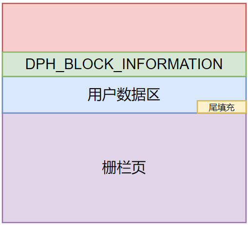

**工作原理：** 完全堆页会为数据堆块分配一个额外的「栅栏页」且用户数据区紧挨着栅栏页，并将栅栏页属性设置为「不可访问」。当对用户数据访问越界时，就会进入到栅栏页并抛出异常，系统捕获到异常后会试图中断执行并将该异常上报。
- 读越界，但只是访问了块尾填充部分数据，那么系统不会报错
- 写越界，但只篡改了图中块尾填充的部分，那么在堆块释放的时候会报错
- 读越界，且超过了块尾填充的部分，访问到了栅栏页，那么系统会立即抛出一个异常并中断执行
- 写越界，且超过了块尾填充部分，写到了栅栏页，那么系统会立即抛出一个异常并中断执行

完全堆页的结构同普通堆不同。`HEAP_ENTRY` 由 `DPH_BLOCK_INFORMATION` 代替，**当 `DPH_BLOCK_INFORMATION` 被破坏时，在释放内存块的时候系统会报错**。

> [!note]
> `尾填充` 的目的是用于保证内存分配大小为分配粒度的整数倍，即内存对齐。**因此 `尾填充` 部分不一定存在**。


```cpp
#include <malloc.h>
#include <Windows.h>

void fill(char* p, int len, char ch){
    for (size_t i = 0; i < len; i++)
    {
        p[i] = ch;
    }
}

int main(int argc, char const *argv[])
{
    int len = 12;
    char * buffer = nullptr;

    // 系统堆 
    HANDLE heap = HeapCreate(0,1024, 0);
    buffer = (char*)HeapAlloc(heap, 0, len);
    fill(buffer,len + 2, 'y');
    HeapFree(heap, 0, buffer);
    HeapDestroy(heap);

    return 0;
}

```


```term
triangle@LEARN:~$ .\gflags.exe -i demo.exe +hpa // 指定程序启用 DPH
triangle@LEARN:~$ .\gflags.exe -i demo.exe -hpa // 撤销 DPH
triangle@LEARN:~$ .restart // gflags 的设置重启进程后生效
triangle@LEARN:~$ !gflag // 查看启用状态
Current NtGlobalFlag contents: 0x02000000
    hpa - Place heap allocations at ends of pages
triangle@LEARN:~$  dv heap // 创建的堆
           heap = 0x05e10000
triangle@LEARN:~$  dv buffer // 申请的内存
         buffer = 0x05e15ff0 "???"
triangle@LEARN:~$ dd 0x05e15ff0 // 查看内存
# c0 : 用户内存初始值
# d0 : 填充值
# ?? : 不可访问
05e15ff0  c0c0c0c0 c0c0c0c0 c0c0c0c0 d0d0d0d0
05e16000  ???????? ???????? ???????? ????????
05e16010  ???????? ???????? ???????? ????????
05e16020  ???????? ???????? ???????? ????????
triangle@LEARN:~$ g // 检测堆溢出


===========================================================
VERIFIER STOP 0000000F: pid 0x352C: corrupted suffix pattern 

	05E11000 : Heap handle
	05E15FF0 : Heap block
	0000000C : Block size
	05E15FFC : corruption address
===========================================================
This verifier stop is not continuable. Process will be terminated 
when you use the `go' debugger command.
===========================================================

(352c.2f58): Break instruction exception - code 80000003 (first chance)
eax=009d8000 ebx=00000000 ecx=00000001 edx=00aff188 esi=6f3daa40 edi=00000000
eip=6f3ddab2 esp=00aff128 ebp=00aff130 iopl=0         nv up ei pl nz na po nc
cs=0023  ss=002b  ds=002b  es=002b  fs=0053  gs=002b     
```


> [!note]
> `GFlags` 的设置均保存在注册表表中，只有重启相关进程后，设置才会生效


### 准页堆

完全页堆会增加一个内存页性能消耗较大，准页堆则在完全页堆与 TAIL 填充之前取了一个折中：**不再利用内存页充当隔离区，而是采用8或16字节的 `0xA0` 充当隔离区，且在释放堆块时进行堆溢出检查。检测到溢出后，会产生异常上报调试器**。


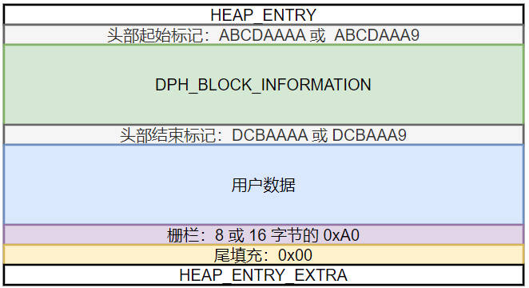


# GC Heap

## 介绍

上面介绍的堆都属于 `Native Heap`，与操作系统内存最接近的内存管理器，类似 `c/c++` 这种 `Native Code` 语言能直接使用，例如 `new/delete、malloc/free`。这种简单粗暴的内存管理器就会导致以下问题：
- 程序无法跨平台。不同的操作系统都有自己的内存管理机制，而 `Native Code` 则与操作系统的内存管理机制强相关
- 存在内存泄漏风险。`Native Code` 得自己维护内存的申请与释放，如果代码出现 bug ，就会导致内存泄漏。

为了解决该问题，一些高级语言便提出了 `GC Heap (Garbage Collection Heap)` 的概念，即 **「垃圾回收机制」**，语言底层自动实现内存申请与释放。其基本思路就是在 `Native Heap` 的基础上，再实现一套语言自己的内存管理系统。

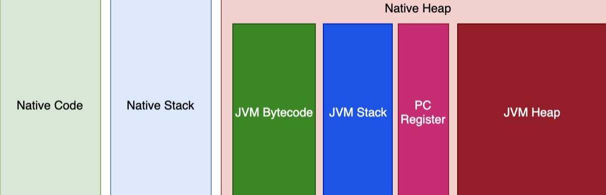


## .Net GC

```term
triangle@LEARN:~$ !eeheap -gc // 查看 .net 应用的 GC 内存分配情况
Number of GC Heaps: 2
------------------------------
Heap 0 (001c3a88)   // windows 堆 0 上构建的 GC Heap
generation 0 starts at 0x0310d288
generation 1 starts at 0x030ee154
generation 2 starts at 0x03030038
ephemeral segment allocation context: none
segment   begin    allocated size                reserved
001c92f0  7a733370 7a754b98  0x00021828(137,256) 00004000
001c5428  790d8620 790f7d8c  0x0001f76c(128,876) 00004000
03030000 03030038 03115294 0x000e525c(938,588) 03d3f000
Large object heap starts at 0x0b030038
segment   begin     allocated  size                    reserved
0b030000 0b030038 0b4d5aa8 0x004a5a70(4,872,816) 01af8000
Heap Size 0x5cbc60(6,077,536)
------------------------------
Heap 1 (001c4a48) // windows 堆 1 上构建的 GC Heap
generation 0 starts at 0x0712614c
generation 1 starts at 0x071014ac
generation 2 starts at 0x07030038
ephemeral segment allocation context: none
segment   begin     allocated  size                    reserved
07030000 07030038 07134158 0x00104120(1,065,248) 03d2f000
Large object heap starts at 0x0d030038
segment    begin    allocated  size                  reserved
0d030000 0d030038 0d0f3588 0x000c3550(800,080) 01f3c000
Heap Size 0x1c7670(1,865,328)
------------------------------
GC Heap Size 0x7932d0(7,942,864)
```

- **结构**

`.Net` 的 `GC Heap` 实现由两部分组成:
- `generation` : 管理小对象，generation 与 heap segment 不是一一对应的，一个 generation 可能由多个 heap segment 组成，一个 heap segment 也可能包含多个 generation
- `LOH（Large Object Heap)` : 管理大对象

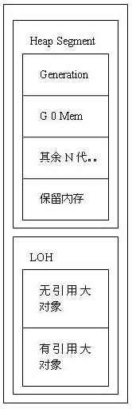

- **工作原理流程**

新对象都是在 `generation 0` 中被创建；当「收集」发生时，需要存活的对象就会被迁移到到`generation 1`；当收集时， `generation 1` 中还要存活的对象，又会被迁移到 `generation 2`中；以此类推，需要长时间存活的对象会被一直迁移，直到生命结束。会发生收集的条件：
1. `generation 0` 中没有内存创建新对象
2. 主动调用 `GC.Collect()`
3. 存在内存压力

- **Root**

若一个对象被其他对象引用，则这个对象会被设置为「根 `Root`」。

- **LOH（Large Object Heap）**

`LOH` 是一个或多个很特殊的段，那里面的对象往往都大于 `85000 Byte`，这个大小指的是这个对象本身的结构行大小，并不包含这个对象的大小和它的子对象的大小。一般存放的是比较大的数组或者字符串。


# 内存泄漏

## CRT 堆

CRT 堆有自带的内存泄漏检测机制，会在程序结束时给出内存泄漏报告。**但是该机制只能在 `debug` 标准库中使用，即 `/MDd` `/MTd`；且只有在程序被 `debug` 时，才会输出报告结果** 。 内存检测控制，主要靠 [_crtDbgFlag](https://learn.microsoft.com/zh-cn/cpp/c-runtime-library/reference/crtsetdbgflag?view=msvc-170) 进行控制。

```cpp
#include <Windows.h>
#include <crtdbg.h>

void fill(char* p, int len, char ch){
    for (size_t i = 0; i < len; i++)
    {
        p[i] = ch;
    }
}

int main(int argc, char const *argv[])
{
    // 修改 _crtDbgFlag
    int nFlag = _CrtSetDbgFlag(_CRTDBG_ALLOC_MEM_DF|_CRTDBG_LEAK_CHECK_DF);

    // 设置 _CrtCheckMemory 检查频率。
    nFlag = (nFlag & 0x0000FFFF) | _CRTDBG_CHECK_EVERY_16_DF;

    // 重新更新标志
    _CrtSetDbgFlag(nFlag);

    int len = 12;
    char * buffer = nullptr;


    buffer = new char[len]();
    fill(buffer, len, 'x');

    return 0;
}
```

```term
triangle@LEARN:~$ g
ModLoad: 759a0000 759af000   C:\Windows\SysWOW64\kernel.appcore.dll
ModLoad: 76ae0000 76b9f000   C:\Windows\SysWOW64\msvcrt.dll
ModLoad: 76a20000 76adf000   C:\Windows\SysWOW64\RPCRT4.dll
Detected memory leaks!
Dumping objects ->
{61} normal block at 0x05E44FF0, 12 bytes long.
 Data: <xxxxxxxxxxxx> 78 78 78 78 78 78 78 78 78 78 78 78 
Object dump complete.
eax=00000000 ebx=00000000 ecx=00000004 edx=00000000 esi=00000000 edi=77dc5b40
eip=77d12e6c esp=0099f614 ebp=0099f6e8 iopl=0         nv up ei pl nz na pe nc
cs=0023  ss=002b  ds=002b  es=002b  fs=0053  gs=002b             efl=00000206
ntdll!NtTerminateProcess+0xc:
77d12e6c c20800          ret     8
triangle@LEARN:~$ !heap -p -a 0x05E44FF0   // 泄漏点定位 ，需要配合 gflags.exe -i demo.exe +hpa 才能使用
```

> [!warning|style:flat]
> `windbg` 一定要下载 [Windows 10 SDK 版本 2104 (10.0.20348.0)](https://developer.microsoft.com/zh-cn/windows/downloads/sdk-archive/) 版，否则不能使用 `!heap -p` 相关命令。**但是也有概率失效**


```txt
{61} normal block at 0x05E44FF0, 12 bytes long.
 Data: <xxxxxxxxxxxx> 78 78 78 78 78 78 78 78 78 78 78 78 
Object dump complete.
```
报告格式：
- `{61}` : CRT 堆里面块的序号
- `normal block` : 块类型。普通、客户、CRT
- `0x05E44FF0, 12 bytes long.` : 内存地址和长度
- `<...>` : 问题块的前16个字节 ASCII 码展示

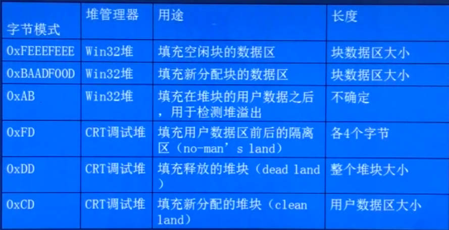

## UMDH

### 介绍

[UMDH (User-Mode Dump Heap)](https://learn.microsoft.com/zh-cn/windows-hardware/drivers/debugger/umdh) 能对指定进程的 Microsoft Windows 堆内存分配进行分析
- **分析正在运行的进程**: UMDH 捕获和分析进程的堆内存分配，并输出日志文件。 对于每个分配，UMDH 显示分配大小、开销大小、指向分配的指针和分配堆栈。 如果进程有多个活动内存堆，则 UMDH 会捕获所有堆。
- **分析 UMDH 日志文件**: MDH 分析它之前创建的日志文件。 UMDH 可以比较在不同时间为同一进程创建的两个日志，并显示分配大小增加最大的调用。 此方法可用于查找内存泄漏。

> [!tip]
> `UMDH` 的工作原理是比对同一进程前后两段时间内的内存分配日志，然后得出内存差异供用户分析。该方式不用调试器参与。**可用于排除内存持续增长问题** 。

### 操作

> [!warning]
> `WIN10` 可能不能使用，原因未知

```term
triangle@LEARN:~$ cmd // 切换到 cmd 才能使用 set 命令
triangle@LEARN:~$ set _NT_SYMBOL_PATH=pdb_path // 设置 pdb 文件路径，可选
triangle@LEARN:~$ set OANOCACHE=1 // 禁用 BSTR 缓存，这个会导致追踪结果不准确
triangle@LEARN:~$ powershell.exe 
triangle@LEARN:~$ .\gflags.exe -i demo.exe +ust // 创建运行时堆栈跟踪数据库
triangle@LEARN:~$ .\demo.exe // 启动程序
triangle@LEARN:~$ umdh.exe -pn:demo.exe -f:mem1.log // 抓取快照
triangle@LEARN:~$ umdh.exe -pn:demo.exe -f:mem2.log // 程序运行一段时间，再抓取快照
triangle@LEARN:~$ umdh.exe -d mem1.log mem2.log > res.log // 比对两个日志，得到分析结果
```

## windbg

内存检测思路同 `UMDH` 。 首先开启 `gflags.exe -i demo.exe +hpa`，利用 windbg 间隔一段时间采集两次 `.dmp` ，然后比对两次堆分配变化，定位泄漏点 
- 泄漏点必定持续泄漏，内存申请疯涨 (不疯涨，量小，也没必要管等系统回收就好)。`!heap -s` 查看堆的使用情况
- 找泄漏的堆。`!heap -stat -h xxxxxxx` 查看异常堆的内存申请情况
- 泄漏点基本尺寸大小固定 (同一个地方申请的，肯定有规律)。`!heap -flt s xx` 查看尺寸为 `xx` 在哪个堆
- 泄漏点定位。`!heap -p -a xxxxxxx` 打印 `xxxxxxx` 地址的调用栈

> [!tip]
> **该方案也有几率用不了**
> - [内存泄漏排查案例](https://www.cnblogs.com/lanxiaoke/p/12997032.html)

## 内存分析

上面的方法对于现代应用进行泄露分析都有各种各样的问题，可以通过内存分析工具对内存泄漏进行排查
- [PerfView](https://github.com/microsoft/perfview) : `windows`平台下，能分析 `unmange memory` 与 `GC Heap`
- [VMMAP](https://learn.microsoft.com/zh-cn/sysinternals/downloads/vmmap) : `windows`平台下， 统计所有内存信息
- [ASAN](https://github.com/google/sanitizers/wiki/AddressSanitizerFlags) : 只有高版本`c++`编译器能用 
- [valgrind](https://zhuanlan.zhihu.com/p/56538645) : `Linux` 上的内存检测工具，性能没有 `ASAN` 好，但是兼容低版本编译器
- [Electric Fence](https://github.com/kallisti5/ElectricFence) : `Linux` 堆越界检测工具
- [gperftools](https://github.com/gperftools/gperftools) : `Linux` 内存分析工具，该工具提供了提供了著名的 `tcmalloc`


# VMMAP

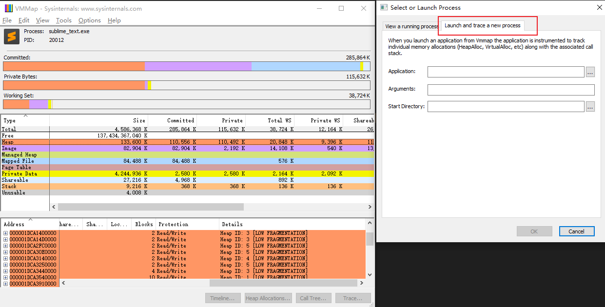

只有 `Launch and trace a new process` 模式，才会按时间记录所有的内存使用情况；`view a running process` 只是会抓取一次内存快照。

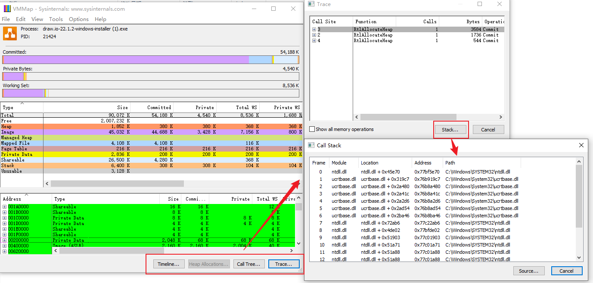

通过 `Launch and trace a new process` 启动的程序，才能使用下方的四个按钮
- `Timeline` : 展示内存变化的时间线
- `Heap Allocation` : 展示 `Virtual Alloce` 的变化，只有类 `c/c++` 的程序才会直接调用系统接口创建 `unmange heap`，若是基于 `GC Heap` 语言编写的程序，则不能使用该选项。
- `Call Tree` : 程序执行内存申请的调用树，从程序入口出发
- `Trace` : 追踪每个申请内存的函数接口，并且可以通过 `Stack` 查看调用堆栈 （**可用于查内存泄漏点**）

通过结果的字段说明：

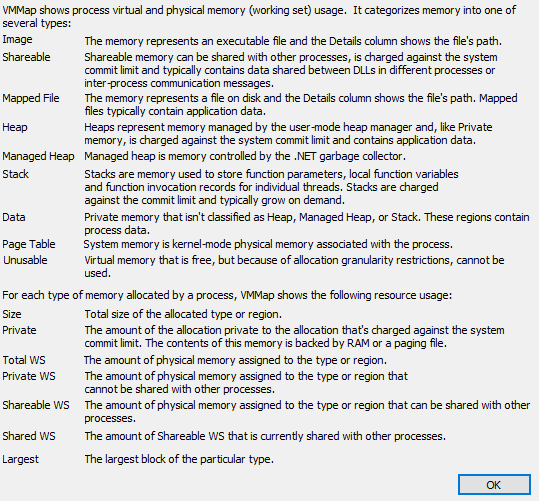

# PerfView

## GC Heap 

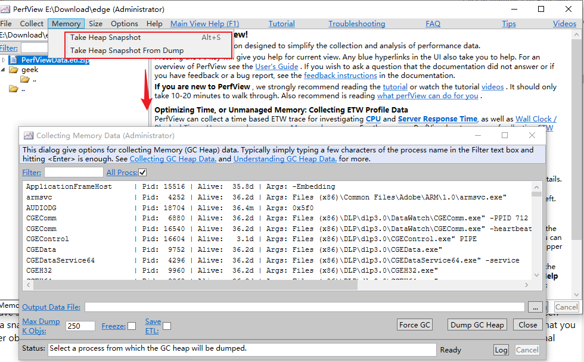

`Memmory` 工具栏提供了抓取 `.Net` 应用的 `GC Heap` 内存快照的功能。抓取快照后，可在 PerfView 中进行内存分析。按道理抓取 GC Heap 内存快照，只要把所有的 `Root` 都保存下来就完事了，但这么干存在以下问题：

- **内存快照过大**：为防止该问题，PerfView 对内存对象进行「采样」，所有的大对象都会被准确记录，而小对象则是抽检，保证每一类小对象都会被至少记录一次，然后通过对象总数来估算内存。**细节见官方文档 `Understanding GC Heap Sampling `**
- **程序运行运行干扰**：内存采样过程需要一定耗时，若采样过程中内存申请释放会对结果有一定影响。但内存采样过程中中断程序运行，也会影响生成环境，例如探测服务器。因此，PerfView 给了一个 `Freeze` 开关
- **图转换树**：Heap 的数据结构为「图」，但图不利于数据分析，因此需要转换为「树」结构。**细节见官方文档`Converting a Heap Graph to a Heap Tree `**


## Unmanaged Memory

`GC Heap` 是由程序自动管理内存的申请与释放，这样的模式也被称之为 `Managed Memory`；而类似 `c/c++` 这种，由程序猿主动维护内存申请与释放的内存管理模式则称之为 `Unmanaged Memory`。PerfView  同样也提供了分析 `Unmanaged Memory` 的能力。

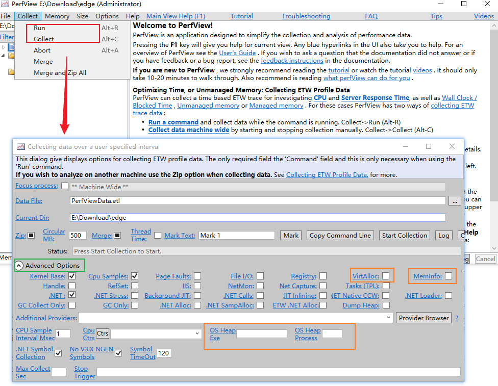

一个应用程序内存占用主要来源就两个：
- `mapped memory` : 加载可执行程序与动态库到内存，`Image Load Stacks` 表格可查看
- `VirtualAlloc API`: 系统调用，向操作系统申请内存，`VirtAlloc` 选项启用事件捕获

> [!note]
> 由于 `VirtualAlloc API` 会频繁调用，且申请的内存大小至少是 `64K`，因此其统计结果较粗糙。只有程序中主动调用 `VirtualAlloc API` 接口， 捕获的 `VirtAlloc` 事件才有一定分析价值。

监控整个操作系统 Heap 内部内存申请与释放不太现实，因为所有程序都会频繁进行内存操作，其记录结果也会十分庞大。 PerfView 针对该问题，提供了只监控指定程序 Heap 事件的功能：
- `OS Heap Exe` : 监控还未执行的 exe
- `OS Heap Process` : 监控正在执行的进程

启用 OS Heap 与 VirtAlloc 事件后，会生成 `OS Heap Alloc Stacks` 与 `VirtualAlloc Stacks` 表格。表格中所有不存在 `memory alloce` 与之配对的 `memory free` 事件将被忽略。但选中一段时间范围 `when`，内存权值可能是负数，这只是说明在这个时间范围内，内存被释放了。

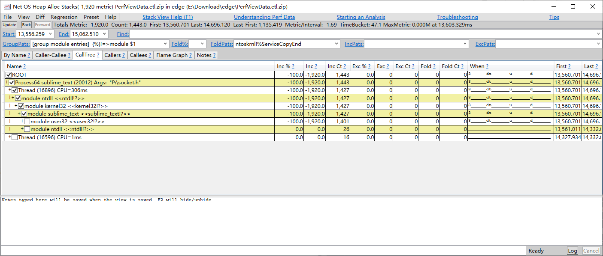


## Diff

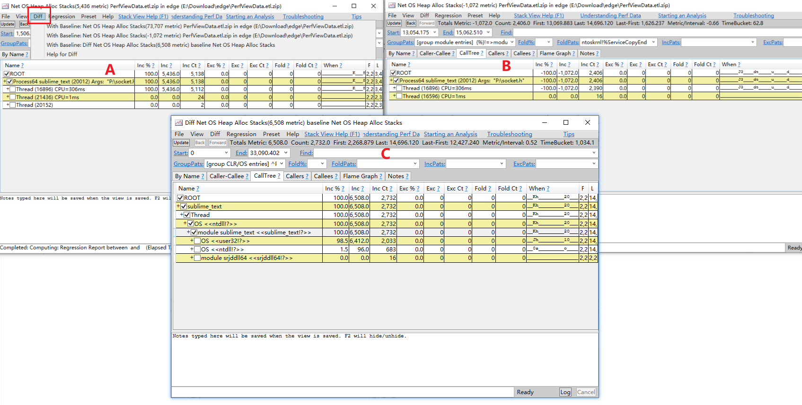

在获取到 `OS Heap Alloc Stacks` 还能利用 PerfView 的 `Diff` 功能进行内存泄漏分析。
1. 打开两个窗口 `A` 与 `B`
2. 在 `A` 窗口启用与 `B` 窗口的 `Diff`
3. 比对结果输出到 `C`

在 PerfView 中，`Diff` 的工作原理就是将 A 中 `Metric` 与 `Count` 与 B 表中数据作差，即 `A - B = C`。

> [!note]
> 在使用 `Diff` 功能功能之前，需要尽量保证 A 与 B 表中的 `Metric` 的符号相同（要么正，要么负），这样差值运算结果就不会出现一些奇奇怪怪的干扰值。例如 `1000 - (-1000) = 2000`


