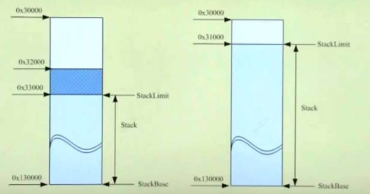
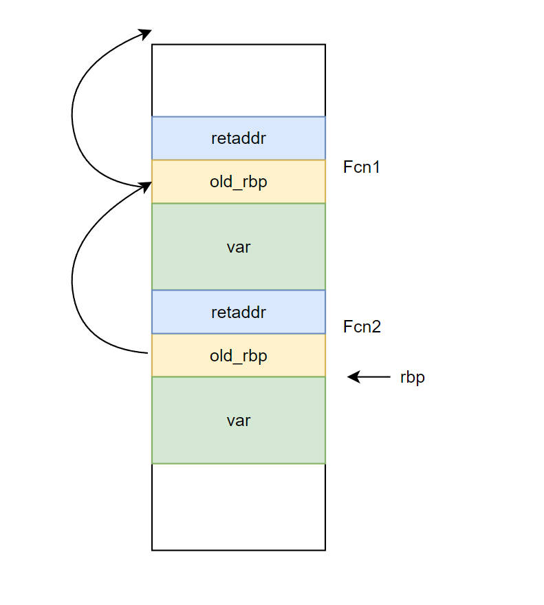

# 栈调试

# 栈结构



操作系统会为每一个线程预留一部分地址作为栈区（而非真是内存），例如`0x130000 ~ 0x30000`。在栈的底部会设置一块保护区（即图中的`0x33000~0x32000`），当栈增长到保护区内，就会产生`page fault`让操作系统来分配真正的物理内存。当栈保护区到达了栈的最底部，则会产生 `stack overflow` 异常，告诉操作系统线程没有预览内存了。

```term
triangle@LEARN:~$ !teb // 查看当前线程的信息
TEB at 000000f2e1e3d000
    ExceptionList:        0000000000000000
    StackBase:            000000f2e1d30000 // 栈的基地址
    StackLimit:           000000f2e1d2d000 // 栈底
    SubSystemTib:         0000000000000000
    FiberData:            0000000000001e00
    ArbitraryUserPointer: 0000000000000000
    Self:                 000000f2e1e3d000
    EnvironmentPointer:   0000000000000000
    ClientId:             000000000000409c . 0000000000004018
    ...
triangle@LEARN:~$ dd 000000f2e1d2d000 - 10
000000f2`e1d2cff0  ???????? ???????? ???????? ???????? // ? 代表了保护页
000000f2`e1d2d000  00000000 00000000 00000000 00000000
000000f2`e1d2d010  00000000 00000000 00000000 00000000
000000f2`e1d2d020  00000000 00000000 00000000 00000000
000000f2`e1d2d030  00000000 00000000 00000000 00000000
000000f2`e1d2d040  00000000 00000000 00000000 00000000
000000f2`e1d2d050  00000000 00000000 00000000 00000000
000000f2`e1d2d060  00000000 00000000 00000000 00000000
triangle@LEARN:~$ !address 000000f2`e1d2cff0 // 查看地址的状态

Usage:                  Stack
Base Address:           000000f2`e1d2a000
End Address:            000000f2`e1d2d000
Region Size:            00000000`00003000 (  12.000 kB)
State:                  00001000          MEM_COMMIT
Protect:                00000104          PAGE_READWRITE | PAGE_GUARD
Type:                   00020000          MEM_PRIVATE
Allocation Base:        000000f2`e1c30000
Allocation Protect:     00000004          PAGE_READWRITE
More info:              ~0k
```

# 栈帧



> [!note|style:flat]
> 该机制仅限于 `x86` 编译的程序。`x64` 的程序不使用 `RBP`

- `RBP` : 当前函数在栈中的基地址，即栈帧指针
  - `RBP - 4 ...`: 函数的局部变量
  - `RBP`: 指向上一层函数栈帧的首地址
  - `RBP + 4` : 上一层函数代码的 `PC` 值
  - `RBP + 8 ...` : 当前函数的形参

```nasm
; x86 架构函数
fcn:
    push    rbp  ; 将上一个函数的基地址 rbp 入栈
    mov     rbp, rsp ; 将栈顶 rsp 给 rbp，当作当前函数的基地址
    push    ecx
    mov     DWORD PTR _a1$[ebp], 3276   ; 00000cccH
    mov     eax, DWORD PTR _a$[ebp]
    add     eax, DWORD PTR _b$[ebp]
    ...

; x64 架构函数
fcn:
    mov     DWORD PTR [rsp+24], r8d ; 直接初始化函数形参
    mov     DWORD PTR [rsp+16], edx
    mov     DWORD PTR [rsp+8], ecx
    sub     rsp, 24
    mov     DWORD PTR a1$[rsp], 3276      ; 00000cccH
    ...
```

<details>
<summary><span class="details-title">测试案例</span></summary>
<div class="details-content"> 


```cpp
int fcn(int a1,int b1){
    int a = 0xaaa3;
    int b = 0xbbb7; 
    return a + b + a1 + b1;
}

int main(int argc, char const *argv[])
{
    int c = 0xccc9;
    c = fcn(0xaaa1,0xbbb2);
    return 0;
}
```
```term
triangle@LEARN:~$ k
 # 栈帧     PC
 # ChildEBP RetAddr      
00 00dcf748 00e9143a     demo!fcn+0x14 [E:\testspace\cpp\src\main.cpp @ 5] 
01 00dcf75c 00e91893     demo!main+0x1a [E:\testspace\cpp\src\main.cpp @ 12] 
02 00dcf77c 00e916e7     demo!invoke_main+0x33 [D:\a\_work\1\s\src\vctools\crt\vcstartup\src\startup\exe_common.inl @ 78] 
....
triangle@LEARN:~$ dd 00dcf748 - 10 // 查看 demo!fcn 对应的栈内存
# 0000bbb7 0000aaa3 ： demo!fcn 的局部变量
00dcf738  00dcf744 70f1042e 0000bbb7 0000aaa3
# 00dcf75c : demo!main 的栈帧
# 00e9143a : demo!main 的 PC，即指向 demo.cpp:11 行的位置
# 0000aaa1 0000bbb2 : demo!fcn 的形参
00dcf748  00dcf75c 00e9143a 0000aaa1 0000bbb2
00dcf758  0000ccc9 00dcf77c 00e91893 00000001
00dcf768  013b5b10 013b5c08 00000001 013b5b10
00dcf778  013b5c08 00dcf7d8 00e916e7 183e2d38
00dcf788  00e91014 00e91014 01103000 00000000
00dcf798  00000000 00000000 00000000 00000000
00dcf7a8  00000000 00000000 00000000 00e9754c
```

</div>
</details>

- `FPO` : 优化技术，在汇编中会把 `RBP` 给省略掉。**不推荐使用**

# Cookie

- **栈溢出：** 局部变量的赋值是从低地址到高地址，而栈的增长是从高地址到低地址。若局部变量的拷贝越界，就会将预先存储在栈上的栈帧信息给覆盖掉（把栈上的上一层函数的`RBP`值和`PC`给修改了），导致函数返回出现未定义行为。 


- **DEP (Data Execution Prevention):** CPU 层面的栈溢出保护，防止运行数据段或者栈上的代码，这样就能制止有些B利用栈溢出将程序跳转到栈或数据段上，并运行预先设定好的代码块。

- [Cookie机制](https://learn.microsoft.com/zh-cn/cpp/build/reference/gs-control-stack-checking-calls?view=msvc-170)： 在栈帧的其实位置存放一个整数，在函数返回时校验该整数的完整性。若保持完整，则栈未产生溢出；若损坏，则说明当前栈帧存在溢出风险。

```txt
/Gs # 在 msvc 中使用该选项开启 Cookie 机制
```

> [!note]
> - 默认情况下，当函数需要的堆栈空间多于一页时，编译器才会启用 Gs 检测机制
> - Gs机制检测到栈溢出后，不允许进行异常捕获

**源码**

```cpp
void fcn(int a){
    int b = 0xbbb3;
    char c[1024] = {'0'};
}

int main(int argc, char const *argv[])
{
    int a = 0xccc1;
    fcn(0xaaa2);
    return 0;
}
```

**反汇编**

```nasm
    demo!fcn:
004d1400 55                   push    ebp
004d1401 8bec                 mov     ebp, esp
004d1403 b808040000           mov     eax, 408h
004d1408 e843fcffff           call    demo!@ILT+75(__alloca_probe) (4d1050)
004d140d a104704d00           mov     eax, dword ptr ds:[004D7004h]
...
004d1441 33cd                 xor     ecx, ebp
                                      ; Gs 检测机制
004d1443 e871fcffff           call    demo!@ILT+180(@__security_check_cookie@4) (4d10b9)
004d1448 8be5                 mov     esp, ebp
004d144a 5d                   pop     ebp
```


```term
triangle@LEARN:~$ k
 # ChildEBP RetAddr      
00 0046f944 004d1465     demo!fcn+0x12 [E:\testspace\cpp\src\main.cpp @ 1] 
01 0046f954 004d1923     demo!main+0x15 [E:\testspace\cpp\src\main.cpp @ 9] 
....
triangle@LEARN:~$ dd 0046f944 - 20
0046f924  00000000 00000000 00000000 00000000
# 763299c6 : Gs 机制的校验码，通过 demo!@ILT+180(@__security_check_cookie@4) 进行校验
0046f934  00000000 00000000 00000000 763299c6
# 0046f954 : demo!main 的 栈帧
0046f944  0046f954 004d1465 0000aaa2 0000ccc1
0046f954  0046f974 004d1923 00000001 008d5a98
0046f964  008d9f98 00000001 008d5a98 008d9f98
0046f974  0046f9d0 004d1777 76329952 004d1014
0046f984  004d1014 007d0000 00000000 00000000
0046f994  00000000 00000000 00000000 00000000
```
