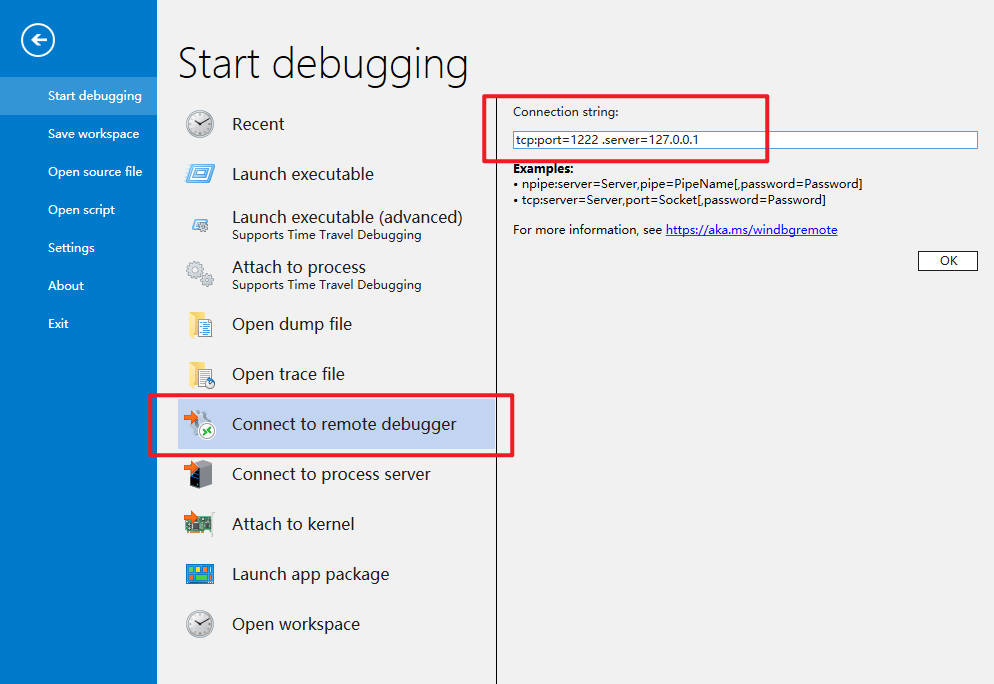

# Windbg

> [!warning|style:flat]
> 要想使用 `!heap -p` 相关命令，`windbg` 一定要下载 [Windows 10 SDK 版本 2104 (10.0.20348.0)](https://developer.microsoft.com/zh-cn/windows/downloads/sdk-archive/) 


# 调试器命令

## 命令类型

- [常规命令](https://learn.microsoft.com/en-us/windows-hardware/drivers/debuggercmds/commands)：一般是缩写，例如 `d*、e*、b*、r` 等
- [元命令](https://learn.microsoft.com/en-us/windows-hardware/drivers/debuggercmds/meta-commands): `.` + 单词，例如 `.reload`
- [扩展命令](https://learn.microsoft.com/en-us/windows-hardware/drivers/debuggercmds/general-extensions): `!` + 单词，例如 `!process`

## 调试器命令窗口提示

- `*BUSY*` : 正在运行
- `0:005>` : 进程号 + 线程号
- `0:kd>` : 内核调试号为 0 的 CPU
- `lkd>` : 本地内核调试

## 别名

[别名文档](https://learn.microsoft.com/zh-cn/windows-hardware/drivers/debuggercmds/using-aliases)

- **User-Named 别名**: 别名中不能有空格

```term
triangle@LEARN:~\$ as Name EquivalentLine // as 定义
triangle@LEARN:~\$ aS Name EquivalentPhrase  // aS 重定义
triangle@LEARN:~\$ aS Name "EquivalentPhrase" 
triangle@LEARN:~\$ as /e Name EnvironmentVariable  // /e , 环境变量设置别名
triangle@LEARN:~\$ as /ma Name Address // /m*，设置的别名是字符串的首地址
triangle@LEARN:~\$ as /mu Name Address 
triangle@LEARN:~\$ as /msa Name Address 
triangle@LEARN:~\$ as /msu Name Address 
triangle@LEARN:~\$ as /x Name Expression  // /x, 表达式的别名
triangle@LEARN:~\$ aS /f Name File  
triangle@LEARN:~\$ as /c Name CommandString
triangle@LEARN:~\$ ad [/q] Name // 删除别名
triangle@LEARN:~\$ al // 列出所有别名
triangle@LEARN:~\$ as test FUCK 
triangle@LEARN:~\$ .echo test
FUCK
triangle@LEARN:~\$ .echo ${test}
FUCK
```

- **Fixed-Named 别名**：固定别名有10个，`\$u0, \$u1, ..., \$u9`

```term
triangle@LEARN:~\$ r \$.u0 = demo!main // 定义别名
triangle@LEARN:~\$ .echo \$u0 // 使用别名 
demo!main
```

- **自动别名**：已经定义好的变量

```term
triangle@LEARN:~\$ .echo \$ntnsym //  NT 符号的最合适的模块
ntdll
```

| 别名名称                 | 含义                                                                                                                                                                                                             |
| :----------------------- | :--------------------------------------------------------------------------------------------------------------------------------------------------------------------------------------------------------------- |
| \$ntnsym                 | 计算机本机体系结构上 NT 符号的最合适的模块。 此别名可以等于 ntdll 或 nt。                                                                                                                                        |
| \$ntwsym                 | 在使用 WOW64 的 32 位调试过程中，最适合 NT 符号的模块。 此别名可以是 ntdll32 或其他 32 位版本的 Ntdll.dll。                                                                                                      |
| \$ntsym                  | 与当前计算机模式匹配的 NT 符号的最合适的模块。 在本机模式下调试时，此别名与 \$ntnsym 相同。 在非本机模式下调试时，调试器会尝试查找与此模式匹配的模块。 (例如，在使用 WOW64 的 32 位调试期间，此别名与 \$ntwsym.) |
| \$CurrentDumpFile        | 调试器加载的最后一个转储文件的名称。                                                                                                                                                                             |
| \$CurrentDumpPath        | 调试器加载的最后一个转储文件的目录路径。                                                                                                                                                                         |
| \$CurrentDumpArchiveFile | 调试器加载的上一个转储存档文件 (CAB 文件) 的名称。                                                                                                                                                               |
| \$CurrentDumpArchivePath | 调试器加载的最后一个转储存档文件 (CAB 文件的目录路径) 。                                                                                                                                                         |

- **别名解释器**

```term
triangle@LEARN:~$ .echo ${/d:test} // ${} 别名解释器，/d 是否定义别名
0
triangle@LEARN:~$ .echo ${/v:fuck} // /v 防止别名做任何计算，就是纯文本
```

## Self-Repeating 命令

```term
triangle@LEARN:~$ j 1 == 2 .echo a; .echo b; // if-else
b
triangle@LEARN:~$ Command ; z( Expression ) // while 循环，用户态
triangle@LEARN:~$ Command ; [Processor] z( Expression ) // while 循环，内核态
triangle@LEARN:~$ ~2e r; k; kd // 在 2 号线程中执行多条命令，与 ~2r; ~2k; ~2kd 等效
```


# 计算表达式

## 类型

表达式具有两种类型：
- [MASM 表达式](https://learn.microsoft.com/zh-cn/windows-hardware/drivers/debuggercmds/masm-numbers-and-operators)：宏汇编程序，所有符号都被视为地址
- [C++ 表达式](https://learn.microsoft.com/zh-cn/windows-hardware/drivers/debuggercmds/c---numbers-and-operators)：与实际 C++ 代码中使用的表达式相同，符号被理解为适当的数据类型

```term
triangle@LEARN:~$ windbg  -ee {masm|c++}  // 启动 windbg.exe 时指定默认表达式。默认为 masm
triangle@LEARN:~$ .expr /s masm // 指定默认表达式
triangle@LEARN:~$ .expr // 查看当前默认表达式类型
Current expression evaluator: MASM - Microsoft Assembler expressions
```

## 运行

```term
triangle@LEARN:~$ ? Expression // 计算表达式，取决于默认表达式
triangle@LEARN:~$ ? @rip + 8 // 寄存器 rip 加 8；@rip 表示应用寄存器 rip
Evaluate expression: 140694682147274 = 00007ff6-088d19ca
triangle@LEARN:~$ ?? Expression // 表达式始终按照 c++ 类型计算
triangle@LEARN:~$ ?? @eip // 查看寄存器
unsigned int 0x771e1a02 
triangle@LEARN:~$ .expr /s c++ // 将默认表达式设置为 c++
triangle@LEARN:~$ ? @@masm(poi(00000078`267d7108)) // 需要 @@masm() 来运行 masm 表达式
```

# 语法规则

## 字符串通配符

- `*`
- `?` : 任何单个字符
- `[]`
- `#` : 零个或多个字符
- `+` : 一个或多个字符
- `\` : 转义符

## 寄存器

- **寄存器** :为CPU的真实寄存器。寄存器在表达式中的格式 `@ + 寄存器名`。使用 `r` 命令则不需要 `@` 符号

```term
triangle@LEARN:~$ ? @rax
Evaluate expression: 10 = 00000000`0000000a
triangle@LEARN:~$ r rax
rax=000000000000000a
```

- [伪寄存器](https://learn.microsoft.com/en-us/windows-hardware/drivers/debuggercmds/pseudo-register-syntax) ： 调试器会自动为伪寄存器设置为某些有用值。在表达式中的格式为 `$ + 伪寄存器名` ，对于 MASM 表达式，则要写为 `@$ + 伪寄存器名`

```term
triangle@LEARN:~$ r $t1 // r 指令则不需要添加 @
```


- **用户自定伪寄存器** : 用户可以自定义的伪寄存器，写入或读取整数变量。寄存器名为`t0,t1 ~ t19`

```term
triangle@LEARN:~$ r $t0 = 7
triangle@LEARN:~$ r $t1 = 128*poi(MyVar)
```

## 源码行

```term
triangle@LEARN:~$ `[[Module!]Filename][:LineNumber]` // 只能 MASM 表达式使用
triangle@LEARN:~$ bp `demo.exe!demo.cpp:10` // 打断点
```

## 地址

```term
triangle@LEARN:~$ dd 805287637256 // 打印 805287637256 地址对应的内存
triangle@LEARN:~$ dd poi(000000bb`7ee23108) // 打印指针指向的内存
triangle@LEARN:~$ dd 0x000002205bc3d2c0 0x000002205bc3d2d0 // 写两个地址，表示一个地址范围
00000220`5bc3d2c0  745c3a45 73747365 65636170 7070635c
00000220`5bc3d2d0  6e69625c
triangle@LEARN:~$ dd 0x000002205bc3d2c0 L2 // L 指定显示长度，从0x000002205bc3d2c0 开始算
00000220`5bc3d2c0  745c3a45 73747365
triangle@LEARN:~$ u 0x000002205bc3d2c0 L3 // 反编译内存
00000220`5bc3d2c0 453a5c7465      cmp     r11b,byte ptr [r12+rsi*2+65h]
00000220`5bc3d2c5 7374            jae     00000220`5bc3d33b
00000220`5bc3d2c7 7370            jae     00000220`5bc3d339
```

## 线程与进程

```term
triangle@LEARN:~$ ~. // 当前线程
triangle@LEARN:~$ ~# // 导致当前异常或调试事件的线程
triangle@LEARN:~$ ~* // 所有线程
triangle@LEARN:~$ ~n // n，指定线程号
triangle@LEARN:~$ ~[表达式] // 表达式计算结果的线程
triangle@LEARN:~$ ~~[TID] // 线程 ID 为 TID 的线程
triangle@LEARN:~$ // 下面全是进程的
triangle@LEARN:~$ !. 
triangle@LEARN:~$ !# 
triangle@LEARN:~$ !* 
triangle@LEARN:~$ !n 
triangle@LEARN:~$ ![表达式] 
triangle@LEARN:~$ !~[TID] 
triangle@LEARN:~$ // 下面为系统
triangle@LEARN:~$ ||. // 当前系统
triangle@LEARN:~$ ||# // 异常系统
triangle@LEARN:~$ ||*
```

# 命令令牌

- 命令分隔符

```term
triangle@LEARN:~$ .echo a;.echo b; .echo c // 多行命令依次执行
a
b
c
```

- 注释

```term
triangle@LEARN:~$ r eax; $$ some text; // $$ 开始 ; 结束
triangle@LEARN:~$ r eax; * some text; // * 号后面全部为注释
```

- 脚本

```term
triangle@LEARN:~$ Commands ; .catch { Commands } ; Commands // .catch 捕获异常
triangle@LEARN:~$ .if (Condition) { Commands } .else { Commands } 
triangle@LEARN:~$ .while (...) { ... ; .if (Condition) .break ; ...}
triangle@LEARN:~$ .printf /D "Click <link cmd=\".chain /D\">here</link> to see extensions DLLs."
```

# 常用命令

## 程序运行指令

```term
triangle@LEARN:~$ g // 运行
triangle@LEARN:~$ gh // go handled
triangle@LEARN:~$ gn // go not handled
triangle@LEARN:~$ gc // go Condition
triangle@LEARN:~$ gu // go up
triangle@LEARN:~$ p // step 汇编单步
triangle@LEARN:~$ pa // step to address
triangle@LEARN:~$ pc // step to next call
triangle@LEARN:~$ t // trace 源码单步
triangle@LEARN:~$ ta // trace to address
triangle@LEARN:~$ tc // trace to next call
triangle@LEARN:~$ tb // trace to next branch
triangle@LEARN:~$ wt // 给出运行报告
```

## 内存与寄存器

```term
triangle@LEARN:~$ d* // 展示内存
triangle@LEARN:~$ dv // 局部变量
triangle@LEARN:~$ e* // 编辑内存
triangle@LEARN:~$ ~2 r // 展示线程 2 的寄存器
triangle@LEARN:~$ ~* r eax // 展示所有线程的 eax 寄存器
triangle@LEARN:~$ r eax = @ebx // 将 ebx 寄存器值赋值给 eax
```

## 断点

```term
triangle@LEARN:~$ bp breakpoint [commands] // 设置断点
triangle@LEARN:~$ bu // 延迟断点
triangle@LEARN:~$ bm // 匹配模式
triangle@LEARN:~$ ba // 硬件断点
triangle@LEARN:~$ bc // 删除断点
triangle@LEARN:~$ bl // 断点展示
```

## 栈

```term
triangle@LEARN:~$ k* // 展示栈的信息
triangle@LEARN:~$ dt // 查看变量
```

## 路径设置

```term
triangle@LEARN:~\$ .srcpath  [path]// 源码路径
triangle@LEARN:~\$ .exepath  [path]// 可执行文件映像路径
triangle@LEARN:~\$ .sympath  [path]// 符号文件路径
```

## 符号文件

```term
triangle@LEARN:~\$ .sympath C:\Dir1;C:\Dir2\DirA;C:\Dir2\DirB // 指定符号文件查询路径
triangle@LEARN:~\$ .sympath cache*localsymbolcache;\\internetShare //cache* 表示缓存：将 \\internetShare 上的符号文件下载到本地目录 localsymbolcache（不填，则下载到默认地址）
triangle@LEARN:~\$ .sympath srv* // 将从符号服务器的默认符号存储中获取符号，本地不缓存
triangle@LEARN:~\$ .sympath srv*https://msdl.microsoft.com/download/symbols // 指定符号服务器
triangle@LEARN:~\$ .sympath srv*C:\MyServerSymbols*https://msdl.microsoft.com/download/symbols // 指定本地缓存路径 C:\MyServerSymbols
triangle@LEARN:~\$ .reload // 重新加载符号文件
triangle@LEARN:~\$ ld [ModuleName] // 加载模块
triangle@LEARN:~\$ !sym noisy // 展示符号表查找过程
triangle@LEARN:~\$ lm // 查看所有模块

# private pdb symbols : 信息最多的符号
# pdb symbols : 私有的调试信息被删除

start             end                 module name
00007ff6-088d0000 00007ff6-088e3000   demo     C (private pdb symbols)  E:\testspace\cpp\bin\demo.pdb
...
00007ffa-6aaa0000 00007ffa-6ad96000   KERNELBASE   (deferred)             
00007ffa-6ada0000 00007ffa-6aea0000   ucrtbase   (deferred)             
00007ffa-6c920000 00007ffa-6c9dd000   KERNEL32   (pdb symbols)          d:\test\kernel32.pdb\B07C97792B439ABC0DF83499536C7AE51\kernel32.pdb
00007ffa-6ce90000 00007ffa-6d087000   ntdll      (pdb symbols)          d:\test\ntdll.pdb\098C3B3D8A70012FD489F407118976001\ntdll.pdb

```

> [!note]
> [离线机下载符号文件](https://learn.microsoft.com/zh-cn/windows-hardware/drivers/debugger/using-a-manifest-file-with-symchk)

## dump

```term
triangle@LEARN:~$ .dump [Options] <dump path> // 创建dump
Options:
/f              full dump
/m              mini dump
triangle@LEARN:~$ .opendump <dump path> // 打开dump
```

# 远程调试

- 服务端

```term
triangle@LEARN:~$ // 通过 windbg 启动服务
triangle@LEARN:~$ .server tcp:Port=2000 // 创建debug服务
Server started.  Client can connect with any of these command lines
0: <debugger> -remote npipe:Pipe=DbgX_32f8418120a34dcebd0f7c2ede22df96,Password=*,Server=DESKTOP-3J5K69
1: <debugger> -remote tcp:Port=1222,Server=DESKTOP-3J5K69
triangle@LEARN:~$ // 通过 Dbgsrv 启动服务
triangle@LEARN:~$ Dbgsrv -t tcp:port=1222 // 被调试机启动调试服务
```

- 客户端

