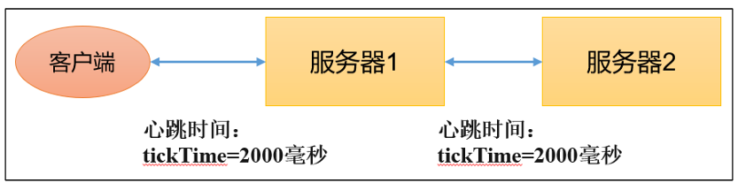

# 配置参数


# 配置文件

`zookeeper` 的配置文件为 `conf/zoo.cfg`

```ini
dataDir=/data
dataLogDir=/datalog
tickTime=2000
initLimit=5
syncLimit=2
autopurge.snapRetainCount=3
autopurge.purgeInterval=0
maxClientCnxns=60
standaloneEnabled=true
admin.enableServer=true
server.1=localhost:2888:3888;2181
```

# 配置项

## tickTime

通信心跳时间，单位 `ms`



## initLimit

`Follower` 与 `Leader` 的初始化连接通信时间，即 `initLimit * tickTime`。若超过该时间，仍然未建立连接，则连接失败

## syncLimit

`Follower` 与 `Leader` 的同步心态时间，即 `syncLimit * tickTime`。若超过该时间未通信成功，则 `Leader` 会认为 `Follower` 寄了。