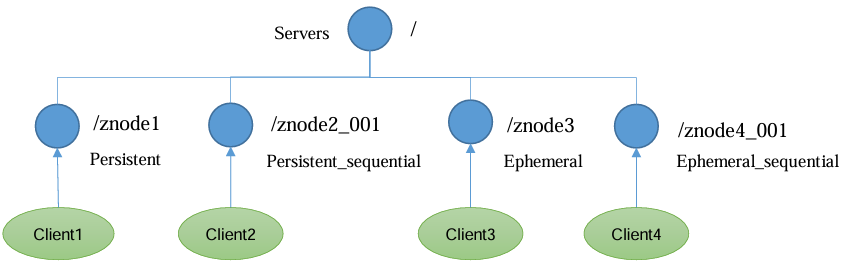
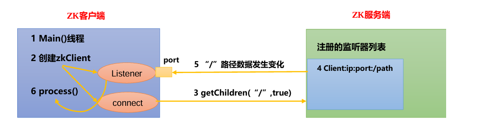

# 数据管理

# 概念

## 数据结构


在 `zookeeper` 中，状态是通过 `data-tree` 实现（本质上也是`key-value` 的形式）
- `path  (key)`: 每个节点的路径标识，唯一不重复，用于节点定位
- `ZNode (value)`: 树中的节点，存储数据大小 `< 1MB`

## 节点类型

`znode` 类型
- **持久`Persistent`**：客户端和服务器端断开连接后，创建的节点不删除
- **短暂`Ephemeral`**: 客户端和服务器端断开连接后，创建的节点自己删除
- **序列 `sequential`** : 会为同一个节点标识自动添加一个编号



## 监听器

`zookeeper` 可对 `znode` 状态进行监听
- `znode` 增删
- `znode` 的数据变化



监听器的工作流程
1. 启动 `main` 线程
2. 在 `main` 线程中创建 `Zookeeper` 的客户端，`zk client` 会启动两个线程
   - `connect`: 负责网络连接通信
   - `listener`: 负责监听
3. 通过`connect`线程将注册的监听事件发送给 `Zookeeper`
4. 在`Zookeeper`的注册监听器列表中将注册的监听事件添加到列表中
5. `Zookeeper` 监听到有数据或路径变化，就会将这个消息发送给`listener`线程
6. `listener` 线程内部调用 `process()` 方法

> [!note]
> 监听器只能监听一次变化，若要继续监听，则需要重新创建

# 日志

## 问题

默认情况 `zookeeper` 的日志打印级别为 `DEBUG` ，这样在使用 `./zkCli.sh` 时便会产生量日志信息，**需要修改默认日志配置**。

> [!note]
> - `zookeeper >= 3.8.0`: 使用 `logback.xml`
> - `zookeeper < 3.8.0` : 使用 `log4j.properties`

## log4j

1. 创建配置文件 `conf/log4j.properties`
2. 配置日志文件

```properties
log4j.rootLogger=INFO, CONSOLE
log4j.appender.CONSOLE=org.apache.log4j.ConsoleAppender
log4j.appender.CONSOLE.Threshold=INFO
log4j.appender.CONSOLE.layout=org.apache.log4j.PatternLayout
log4j.appender.CONSOLE.layout.ConversionPattern=%d{ISO8601} [%t] %-5p %c{2} (%F:%L) - %m%n
```

3. 重启 `zookeeper`

## logback

1. 创建配置文件 `conf/logback.xml`
2. 配置日志打印

```xml
<configuration>
 <property name="zookeeper.console.threshold" value="INFO" />
 <property name="zookeeper.log.threshold" value="INFO" />
 <appender name="ROLLINGFILE" class="ch.qos.logback.core.rolling.RollingFileAppender">
   <File>${zookeeper.log.dir}/${zookeeper.log.file}</File>
   <encoder>
     <pattern>%d{ISO8601} [myid:%X{myid}] - %-5p [%t:%C{1}@%L] - %m%n</pattern>
   </encoder>
   <filter class="ch.qos.logback.classic.filter.ThresholdFilter">
     <level>${zookeeper.log.threshold}</level>
   </filter>
   <rollingPolicy class="ch.qos.logback.core.rolling.FixedWindowRollingPolicy">
     <maxIndex>${zookeeper.log.maxbackupindex}</maxIndex>
     <FileNamePattern>${zookeeper.log.dir}/${zookeeper.log.file}.%i</FileNamePattern>
   </rollingPolicy>
   <triggeringPolicy class="ch.qos.logback.core.rolling.SizeBasedTriggeringPolicy">
     <MaxFileSize>${zookeeper.log.maxfilesize}</MaxFileSize>
   </triggeringPolicy>
 </appender>
 <root level="INFO">
   <appender-ref ref="ROLLINGFILE" />
 </root>
</configuration>
```

3. 重启 `zookeeper`


# 命令行

## 命令

```term
triangle@LEARN:~$ ./zkCli.sh
triangle@LEARN:~$ help
ZooKeeper -server host:port -client-configuration properties-file cmd args
        addWatch [-m mode] path # optional mode is one of [PERSISTENT, PERSISTENT_RECURSIVE] - default is PERSISTENT_RECURSIVE
        addauth scheme auth
        close
        config [-c] [-w] [-s]
        connect host:port
        create [-s] [-e] [-c] [-t ttl] path [data] [acl]
        delete [-v version] path
        deleteall path [-b batch size]
        delquota [-n|-b|-N|-B] path
        get [-s] [-w] [-b] [-x] path
        getAcl [-s] path
        getAllChildrenNumber path
        getEphemerals path
        history
        listquota path
        ls [-s] [-w] [-R] path
        printwatches on|off
        quit
        reconfig [-s] [-v version] [[-file path] | [-members serverID=host:port1:port2;port3[,...]*]] | [-add serverId=host:port1:port2;port3[,...]]* [-remove serverId[,...]*]
        redo cmdno
        removewatches path [-c|-d|-a] [-l]
        set path data [-s] [-v version] [-b]
        setAcl [-s] [-v version] [-R] path acl
        setquota -n|-b|-N|-B val path
        stat [-w] path
        sync path
        version
        whoami
```

## 创建

```term
triangle@LEARN:~$ create /demo 'demo-value' // 创建永久节点
Created /demo
triangle@LEARN:~$ create -s /demo/a 'aaaa' // 创建序列节点
Created /demo/a0000000000
triangle@LEARN:~$ create -s /demo/a 'aaaa' 
Created /demo/a0000000001
triangle@LEARN:~$ create -e /demo/b 'bbb' // 临时节点
Created /demo/b
```

## 查看

```term
triangle@LEARN:~$ ls -s /   // 查看根节点详情
[zookeeper]                                 当前节点的子节点
cZxid = 0x0                                 创建时的事务 ID
ctime = Thu Jan 01 00:00:00 UTC 1970        znode 被创建的毫秒数
mZxid = 0x0                                 最后修改的事务 ID
mtime = Thu Jan 01 00:00:00 UTC 1970
pZxid = 0x0                                 最后更新子节点的事务 ID
cversion = -1                               子节点被修改次数
dataVersion = 0                             数据版本号
aclVersion = 0                              访问控制表的变化号
ephemeralOwner = 0x0                        临时节点，znode 拥有者的 session id
                                            非临时节点，值为 0
dataLength = 0                              节点存储数据长度
numChildren = 1                             子节点数
triangle@LEARN:~$  get -s /demo / // 查看节点值详情
demo-value                                  值
cZxid = 0xc
ctime = Sat Nov 01 06:22:21 UTC 2025
mZxid = 0xc
mtime = Sat Nov 01 06:22:21 UTC 2025
pZxid = 0xc
cversion = 0
dataVersion = 0
aclVersion = 0
ephemeralOwner = 0x0
dataLength = 10
numChildren = 0
triangle@LEARN:~$ stat /demo // 只查看 znode 状态信息
```

## 修改

```term
triangle@LEARN:~$ set /demo/a0000000000 "aaa1" // 修改 sequential 节点需要写全序号
triangle@LEARN:~$ set /demo/b "bbb1" 
```

## 监听器

```term
triangle@LEARN:~$ get -w /demo // 监听数据变化
triangle@LEARN:~$ ls -w /demo // 监听节点变化
```

## 删除

```term
triangle@LEARN:~$ delete /demo/b  // 只删除一个 znode
triangle@LEARN:~$ deleteall /demo // 删除 znode 及其子 znode
```