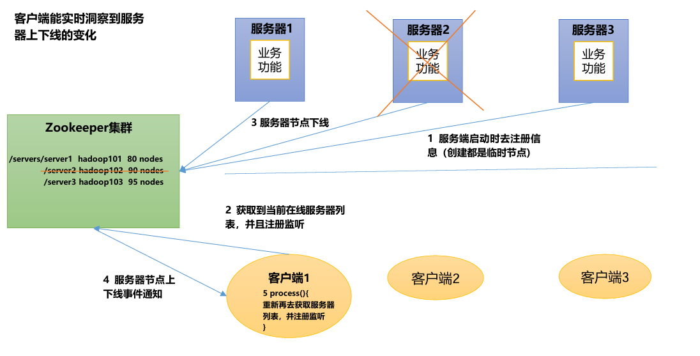

# 简介

# zookeeper


[zookeeper](https://zookeeper.apache.org/): 是一个基于观察者模式设计的分布式服务管理框架，它负责存储和管理大家都关心的数据，然后接受观察者的注册，一旦这些数据的状态发生变化，`Zookeeper`就将负责通知已经在`Zookeeper`上注册的那些观察者做出相应的反应。


- `zookeeper` 集群由 `Leader` 与 `Follower` 构成
  - `Leader` : 负责状态读/写
  - `Follower` : 状态备份，数据只读
- `zookeeper` 集群采用类 `Raft` 算法实现，适合奇数台机器部署
- **只保证了同一客户端读/写操作的「强一致性」，而非整个系统**


# 应用场景

## 统一命名服务

在分布式环境下，经常需要对应用/服务进行统一命名 (类似反向代理)，便于识别。


## 统一配置管理

`ZooKeeper`实现配置中心
1. 可将配置信息写入`ZooKeeper`上的一个`Znode`
1. 各个客户端服务器监听这个`Znode`
1. 一旦`Znode`中的数据被修改，`ZooKeeper`将通知各个客户端服务器


## 统一集群管理

实时监控节点状态变化
1. 可将节点信息写入`ZooKeeper`上的一个`ZNode`。
2. 监听这个`ZNode`可获取它的实时状态变化。


## 服务动态上下线



## 软负载均衡

服务访问负载均衡


# 安装

```term
triangle@LEARN:~$ docker pull zookeeper
```

```txt
docker run -d --name zookeeper --privileged=true -p 2181:2181 \
-v <local path>/data:/data \
-v <local path>/conf:/conf \
-v <local path>/logs:/datalog \
zookeeper
```

> [!note]
> 若 `zookeeper` 启动不了，需要修改 `<local path>/conf` 的拥有者，默认可能是 `root`

# 命令行脚本

```term
triangle@LEARN:~$ docker exec -it zookeeper /bin/bash // 进入容器
triangle@LEARN:~$ cd /apache-zookeeper-<version>-bin/bin // 进入安装目录
triangle@LEARN:bin$ ./zkServer.sh status // 服务状态
triangle@LEARN:bin$ ./zkServer.sh start // 启动服务
triangle@LEARN:bin$ ./zkServer.sh stop // 关闭服务
triangle@LEARN:bin$ ./zkCli.sh          // 客户端
```

