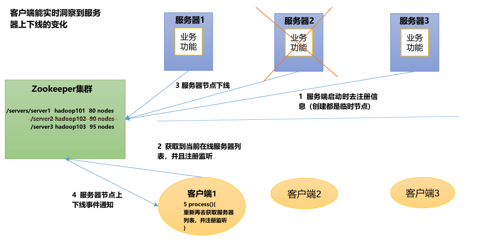
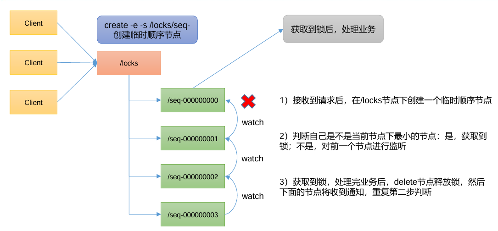

# python

# 库

```term
triangle@LEARN:~$ pip install kazoo
```

# API

## 基本操作

```python
from kazoo.client import KazooClient

if __name__ == "__main__":
    zk = KazooClient(hosts='localhost:2181')
    zk.start()

    zk.create('/my_node', b'my_data')

    has = zk.exists('/my_node')
    if has:
        print("/my_node exists")

    val = zk.get('/my_node')
    if val:
        print(f"Data at /my_node: {val[0].decode('utf-8')}")

    zk.stop()
```

## 监听器

```python
from kazoo.client import KazooClient
from kazoo.protocol.states import WatchedEvent


# 定义监听器函数
def my_listener(event: WatchedEvent):
    """当被监视的节点发生变化时，此函数将被调用"""
    print(f"监听到事件: {event}")
    if event.type == "CHANGED":
        # NOTE - 重新设置监听器
        result = zk.get(event.path, watch=my_listener)
        if result:
            data, stat = result
            print(f"节点 {event.path} 的新数据是: {data.decode('utf-8')}")
    elif event.type == "DELETED":
        # NOTE - 重新设置监听器
        if zk.exists(event.path, watch=my_listener):
             print(f"在 {event.path} 重新设置了监听。")


if __name__ == "__main__":
    zk = KazooClient(hosts='localhost:2181')
    zk.start()

    # 确保节点存在，如果不存在则创建
    if not zk.exists("/my_node"):
        zk.create("/my_node", b"initial data", makepath=True)

    # 获取节点数据，并设置监听器
    result = zk.get("/my_node", watch=my_listener)
    if result:
        data, stat = result
        print(f"当前节点 /my_node 的数据是: {data.decode('utf-8')}")

    # 保持程序运行以接收事件
    try:
        import time
        while True:
            time.sleep(1)
    finally:
        zk.stop()
        zk.close()
```


# 案例

## 服务动态上下线



- `server.py`

```python
import time
from kazoo.client import KazooClient

class Server:

    def __init__(self, name, hosts='localhost:2181'):
        self.zk: KazooClient| None = None
        self.hosts = hosts
        self.name = name

    def register_node(self):
        self.zk = KazooClient(hosts=self.hosts)
        if self.zk is None:
            raise Exception("ZooKeeper client is not initialized.")
        self.zk.start()

        self.zk.create(f"/servers/{self.name}", b"active", makepath=True,ephemeral=True)
    
    def do_something(self):
        time.sleep(2)

    def close(self):
        if self.zk is not None:
            self.zk.stop()
            self.zk.close() 
            self.zk = None
```

- `application.py`

```python
import time
from kazoo.client import KazooClient

class Application:
    def __init__(self, hosts='localhost:2181'):
        self.zk: KazooClient | None = None
        self.hosts = hosts
        self._servers:list[str] = []

    @property
    def servers(self) -> list[str]:
        return self._servers

    def start(self):
        self.zk = KazooClient(hosts=self.hosts)
        if self.zk is None:
            raise Exception("ZooKeeper client is not initialized.")
        self.zk.start()

        # 使用 exists 监听 /servers 节点本身的创建/删除
        if self.zk.exists("/servers", watch=self._watch_servers_node) is None:
            return

        # /servers 下的子服务节点
        datas = self.zk.get_children("/servers", watch=self._server_change_listener)
        if datas is None:
            return

        self._servers.clear()
        for data in datas:
            self._servers.append(data)

    def do_something(self):
        time.sleep(1)

    def close(self):
        if self.zk is not None:
            self.zk.stop()
            self.zk.close()
            self.zk = None

    def _watch_servers_node(self, event):
        """监听 /servers 节点本身的事件 (创建/删除)"""
        print(f"监听到 /servers 节点事件: {event}")
        if self.zk is None or event.state == "CLOSED":
            return

        # 如果节点被创建，则开始监听其子节点
        if event.type == 'CREATED':
            datas = self.zk.get_children("/servers", watch=self._server_change_listener)
            if datas is None:
                return

            self._servers.clear()
            for data in datas:
                self._servers.append(data)

    def _server_change_listener(self, event):
        """监听 /servers/ 下子节点的事件"""
        print(f"服务器列表发生变化: {event}")
        if self.zk is None or event.state == "CLOSED":
            return

        # 重新监听子节点变化。如果此时 /servers 节点被删除了，get_children 会抛出 NoNodeError
        try:
            datas = self.zk.get_children("/servers", watch=self._server_change_listener)
            if datas is None:
                return

            self._servers.clear()
            for data in datas:
                self._servers.append(data)

        except Exception:
            # 如果 get_children 失败（很可能是因为 /servers 节点被删了），我们需要退回到监听 /servers 节点本身的状态
            self._servers.clear()
            self.zk.exists("/servers", watch=self._watch_servers_node)
```

- `main.py`

```python
from application import Application
from server import Server

if __name__ == "__main__":
    app = Application()
    app.start()
    print("Initial server list:", app.servers)

    server1 = Server("server1")
    server1.register_node()

    server2 = Server("server2")
    server2.register_node()

    app.do_something()    
    print("After registering server:", app.servers)

    server1.do_something()
    server1.close()

    server2.do_something()
    server2.close()

    app.do_something()    
    print("After closing server:", app.servers)

    app.close()
```

```term
triangle@LEARN:~$ python main.py
Initial server list: []
监听到 /servers 节点事件: WatchedEvent(type='CREATED', state='CONNECTED', path='/servers')
服务器列表发生变化: WatchedEvent(type='CHILD', state='CONNECTED', path='/servers')
After registering server: ['server2', 'server1']
服务器列表发生变化: WatchedEvent(type='CHILD', state='CONNECTED', path='/servers')
服务器列表发生变化: WatchedEvent(type='CHILD', state='CONNECTED', path='/servers')
After closing server: []
服务器列表发生变化: WatchedEvent(type='NONE', state='CLOSED', path=None)
服务器列表发生变化: WatchedEvent(type='NONE', state='CLOSED', path=None)
```

> [!note]
> 其中最后两行状态 `WatchedEvent(type='NONE', state='CLOSED', path=None)` 为 `zk client` 关闭时触发，**但该事件不一定会执行，因此，编程不要依赖该事件。**

## 分布式锁



- `distributeLock.py`

```python
import threading
from kazoo.client import KazooClient
from kazoo.exceptions import NoNodeError

class DistributedLock:
    """
    基于 Zookeeper 手动实现的分布式锁
    """
    def __init__(self, lock_root: str = "/locks"):
        
        self.zk = KazooClient(hosts="localhost:2181")
        self.zk.start()

        self.root_node = lock_root
        self.sub_node_prefix = "seq-"
        
        # 用于阻塞等待锁的线程事件
        self._wait_lock_event = threading.Event()
        
        # 当前客户端创建的节点路径
        self._current_node = None
        self._wait_node = None

        # 确保根节点存在
        self.zk.ensure_path(self.root_node)

    def acquire(self):
        """获取锁"""
        if self._current_node:
            return

        try:
            # 1. 在根节点下创建临时顺序节点
            self._current_node = self.zk.create(f"{self.root_node}/{self.sub_node_prefix}",ephemeral=True,sequence=True)
            if self._current_node is None:
                raise Exception("创建临时顺序节点失败。")
            
            while True:
                # 2. 获取根节点下的所有子节点
                children = self.zk.get_children(self.root_node)
                if children is None:
                    raise Exception("无法获取子节点列表。")

                # 保证子节点按顺序排列
                children.sort()

                # 提取当前节点的名称，如 'seq-0000000001'
                current_node_name = self._current_node.split('/')[-1]
                
                # 3. 判断当前节点是否是最小的节点
                if current_node_name == children[0]:
                    # 是最小节点，成功获取锁
                    return
                
                # 4. 如果不是最小节点，则监听前一个节点
                my_index = children.index(current_node_name)
                self._wait_node = f"{self.root_node}/{children[my_index - 1]}"
                
                # 使用 exists 设置监听器，当节点被删除时，_watch_preceding_node 会被调用
                # 如果在前一个节点消失的瞬间调用 exists，可能会返回 None
                if self.zk.exists(self._wait_node, watch=self._watch_preceding_node):
                    # 进入等待状态
                    self._wait_lock_event.wait()
                    # 清除事件状态，为下一次等待做准备
                    self._wait_lock_event.clear()
                
                # 从等待中唤醒后，循环会继续，重新获取子节点列表并检查自己是否为最小
        except Exception as e:
            print(f"[{threading.current_thread().name}] 获取锁时发生异常: {e}")
            # 如果发生异常，尝试清理创建的节点
            self.release()
            raise


    def release(self):
        """释放锁"""
        if not self._current_node:
            return
        try:
            self.zk.delete(self._current_node)
        except NoNodeError:
            pass
        except Exception as e:
            print(f"[{threading.current_thread().name}] 释放锁时发生异常: {e}")
            raise

        self._current_node = None
        self._wait_node = None

    def _watch_preceding_node(self, event):
        """监听器的回调函数。当前一个节点被删除时，此函数被触发。"""
        if event.type == "DELETED" and event.path == self._wait_node:
            print(f"监听到事件: {event}")
            # 唤醒正在等待的线程
            self._wait_lock_event.set()

    def __enter__(self):
        self.acquire()
        return self

    def __exit__(self, exc_type, exc_val, exc_tb):
        self.release()
```

- `main.py`

```python
import time
import threading
from distributeLock import DistributedLock

count = 0

def worker(worker_id: int):
    global count

    for i in range(4):

        lock = DistributedLock()
        lock.acquire()
        count += 1
        time.sleep(1) 
        lock.release()

        print(f"[{worker_id}]: {count}")


if __name__ == "__main__":
    threads = []
    for i in range(3):
        t = threading.Thread(target=worker, args=(i,))
        threads.append(t)
        t.start()

    for t in threads:
        t.join()

    print(f"Final count: {count}")
```

```term
triangle@LEARN:~$ python main.py
[0]: 1
监听到事件: WatchedEvent(type='DELETED', state='CONNECTED', path='/locks/seq-0000000000')
监听到事件: WatchedEvent(type='DELETED', state='CONNECTED', path='/locks/seq-0000000001')
[1]: 2
[2]: 3
监听到事件: WatchedEvent(type='DELETED', state='CONNECTED', path='/locks/seq-0000000002')
[0]: 4
监听到事件: WatchedEvent(type='DELETED', state='CONNECTED', path='/locks/seq-0000000003')
监听到事件: WatchedEvent(type='DELETED', state='CONNECTED', path='/locks/seq-0000000004')
[1]: 6
[2]: 6
监听到事件: WatchedEvent(type='DELETED', state='CONNECTED', path='/locks/seq-0000000005')
监听到事件: WatchedEvent(type='DELETED', state='CONNECTED', path='/locks/seq-0000000006')
[0]: 7
[1]: 8
监听到事件: WatchedEvent(type='DELETED', state='CONNECTED', path='/locks/seq-0000000007')
[2]: 9
监听到事件: WatchedEvent(type='DELETED', state='CONNECTED', path='/locks/seq-0000000008')
[0]: 10
监听到事件: WatchedEvent(type='DELETED', state='CONNECTED', path='/locks/seq-0000000009')
[1]: 11
监听到事件: WatchedEvent(type='DELETED', state='CONNECTED', path='/locks/seq-0000000010')
监听到事件: WatchedEvent(type='DELETED', state='CONNECTED', path='/locks/seq-0000000011')
[2]: 12
Final count: 12
```

