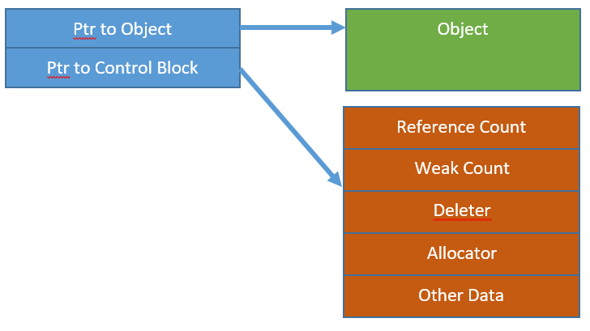

# 智能指针

# unique_ptr

## 自定义释放

```cpp
#include <memory>
#include <iostream>
int main(int argc, char const *argv[])
{
    // 自定义的释放函数
    auto fcn = [](int * ptr){
        printf("delete int\n");
        if (ptr != nullptr)
        {
            delete ptr;
        }
    };

    // 导入自定义的释放函数
    std::unique_ptr<int, decltype(fcn)> pNum(new int(12), fcn);
    return 0;
}
```

## 内存计算

```cpp
void fcn(int * ptr)
{
    delete ptr;
} 

int main(int argc, char const *argv[])
{
    auto fcnLambd = [](int * ptr){
        delete ptr;
    };

    // lambd 表达式
    std::unique_ptr<int, decltype(fcnLambd)> pNum1(new int(12), fcnLambd);
    printf("%d\n",sizeof(pNum1));

    // 普通函数
    std::unique_ptr<int, void(*)(int *)> pNum2(new int(12), fcn);
    printf("%d\n",sizeof(pNum2));
    return 0;
}
```
```term
triangle@LEARN:~$ ./a.out
8
16
```
**普通函数作为释放函数**：
- 肯定有一个 `int` 类型的指针，占 `8` 字节；
- 还有一个释放函数的指针，占 `8` 字节

**Lambda 表达式作为释放函数**：
- `int` 类型的指针，占 `8` 字节；
- Lambda 表达式会被转化为一个 `class lambda [](int *ptr)->void` ，可以视为一个类，字节大小就为 `1`，**但是编译器又会对「无成员变量的类」进行优化，一个字节也不给，即 Empty Base Optimization (EBO)**，因此最终的字节大小为 `0`

# shared_ptr

## 内存结构

<p style="text-align:center;"></p>

shared_ptr 的内存大小就是两个指针
- **对象指针**：指向对象
- **控制块指针**：指向控制块

## 控制块

**会创建控制块的情况**：
- 调用 `std::make_shared` 创建一个 shared_ptr 对象
- 调用 shared_ptr 的裸指针构造函数
- 将 unique_ptr 移动给 shared_ptr

```cpp
int main(int argc, char const *argv[])
{
    // 调用 `std::make_shared` 创建一个 shared_ptr 对象
    std::shared_ptr<int> p1 = std::make_shared<int>(10);

    // 调用 shared_ptr 的裸指针构造函数
    std::shared_ptr<int> p2(new int(15));    

    // 将 unique_ptr 移动给 shared_ptr
    std::unique_ptr<int> u1(new int(20));
    std::shared_ptr<int> p3(std::move(u1));
    return 0;
}

```

**控制块结构：**
- Reference Count : 引用计数，变为 0 就释放对象
- Deleter：存放自定义释放函数 

## 防止重释放

```cpp
int main(int argc, char const *argv[])
{
    int * n = new int(250);
    std::shared_ptr<int> p1(n);
    std::shared_ptr<int> p2(n);
    return 0;
}
```
```term
triangle@LEARN:~$ ./a.out
free(): double free detected in tcache 2
Aborted (core dumped)
```

`p1`与`p2`会各自创建一个控制块，两个控制块的引用计数为 0 就会释放 shared_ptr 的对象指针，然而`p1`与`p2`的对象指针都是指向同一对象，因此就会导致重复释放。


```cpp
class Student
{
public:
    void AppendToVec(std::vector<std::shared_ptr<Student>> & vec)
    {
        // 会根据 this 创建一个 shared_ptr<int>
        vec.emplace_back(this); // 1
    }
};

int main(int argc, char const *argv[])
{
    std::vector<std::shared_ptr<Student>> students;

    // 创建一个 shared_ptr 的 Student 对象
    std::shared_ptr<Student> pSt = std::make_shared<Student>(); // 2

    // 把当前指针放到 students 容器中
    pSt->AppendToVec(students);
    return 0;
}
```
在上述案例中，位置 1 与 2 处均对同一个对象生成了各自的控制块，因此会导致重复释放。为解决这种问题又引入了 `std::enable_shared_from_this` 类，该类中的成员函数 `shared_from_this()` 可以返回当前对象的 `std::shared_ptr<Student>` ，这就保证在 1 位置不会产生新的控制块，而是继续使用 2 位置创建的控制块。

```cpp
class Student : public std::enable_shared_from_this<Student>
{
public:
    void AppendToVec(std::vector<std::shared_ptr<Student>> & vec)
    {
        // shared_from_this 会生成一个 std::shared_ptr<Student> ，因此当前就不会产生新的block
        vec.emplace_back(shared_from_this()); // 1
    }
};

int main(int argc, char const *argv[])
{
    std::vector<std::shared_ptr<Student>> students;

    // 创建一个 shared_ptr 的 Student 对象
    std::shared_ptr<Student> pSt = std::make_shared<Student>(); // 2

    // 把当前指针放到 students 容器中
    pSt->AppendToVec(students);
    return 0;
}
```

但是，上述方案又TMD存在问题，那就是必须保证 Student 对象被创建成立 `shared_ptr<Student>` (在位置 2)。若没有提前创建，那么 `shared_from_this()` 就会报错，因为没有 `shared_ptr<Student>`，shared_from_this 就没法创建一个新的。

```cpp
class Student : public std::enable_shared_from_this<Student>
{
public:
    void AppendToVec(std::vector<std::shared_ptr<Student>> & vec)
    {
        vec.emplace_back(shared_from_this()); // 1
    }
};

int main(int argc, char const *argv[])
{
    std::vector<std::shared_ptr<Student>> students;

    // 没有创建 shared_ptr<Student> 对象
    Student* pSt = new Student(); // 2

    // 把当前指针放到 students 容器中
    pSt->AppendToVec(students);
    return 0;
}
```

```term
triangle@LEARN:~$ 
terminate called after throwing an instance of 'std::bad_weak_ptr'
  what():  bad_weak_ptr
Aborted (core dumped)
```

解决办法就是保证类自己创建 `shared_ptr`，并且禁止用户来构造。

```cpp
class Student : public std::enable_shared_from_this<Student>
{
public:
    void AppendToVec(std::vector<std::shared_ptr<Student>> & vec)
    {
        // shared_from_this 会生成一个 std::shared_ptr<Student> ，因此当前就不会产生新的block
        vec.emplace_back(shared_from_this());
    }

    // 静态创建对象的函数
    static std::shared_ptr<Student> GetInstance()
    {
        return std::shared_ptr<Student>(new Student);
    }

private:
    Student(){}
};

int main(int argc, char const *argv[])
{
    std::vector<std::shared_ptr<Student>> students;

    // 创建一个 shared_ptr 的 Student 对象
    std::shared_ptr<Student> pSt = Student::GetInstance(); 

    // 把当前指针放到 students 容器中
    pSt->AppendToVec(students);
    return 0;
}
```
## CRTP

CRTP (curious recurring template pattern)：能够在继承父类时，将子类通过模板的形式放入父类中，实现「父类模板成员函数」中调用子类的内容。`std::enable_shared_from_this` 就是通过这种机制实现的。**这样干的目的是使得父类模板的通用性更强。**

```cpp
template<class Son>
class Father
{
public:
    void InitSon()
    {
        // 子类继承父类，子类就能拿到父类中的东西，那么当前的 this 其实就是子类
        m_son = static_cast<Son*>(this);
    }

    void Run()
    {
        // 运行子类中的成员函数
        m_son->name();
    }
private:
    // 必须得用指针
    Son * m_son;
};

class Son1 : public Father<Son1>
{
public: 
    void name()
    {
        printf("son1\n");
    }
};

class Son2 : public Father<Son2>
{
public: 
    void name()
    {
        printf("son2\n");
    }
};

int main(int argc, char const *argv[])
{
    Son1 * s1 = new Son1();
    Son2 * s2 = new Son2();

    s1->InitSon();
    s1->Run();

    s2->InitSon();
    s2->Run();
    
    return 0;
}
```

# make_xxx

## 函数传参未定义行为

```cpp
#include <iostream>
using namespace std;

void Fcn(int a, int b, int c)
{
    printf("a : %d, b: %d, c: %d\n",a,b,c);
}

int add(int & num)
{
    num += 5;
    return num;
}

int main(int argc, char const *argv[])
{
    int num = 0;
    Fcn(add(num),num += 10,add(num));
    return 0;
} 
```

```term
triangle@LEARN:~$ ./main.exe // msvc 编译器
a : 20, b: 20, c: 15
triangle@LEARN:~$ ./a.out // g++ 编译器
a : 20, b: 15, c: 5
```
> [!note]
> 直接利用表达式返回值进行函数传参，这种行为是未定义行为。c++标准并没有规定执行顺序，这就导致对于同一段代码在不同编译器的可能运行结果完全不同。 **因此就不要用表达式作为函数参数，而是使用确切的值。**

```cpp
int main()
{
    // new Object()，shared_ptr()，fcn1()，fcn2() 执行都是未定义行为
    // new 之后，接着运行 fcn1()，但是 fcn1() 抛出异常
    // 此时 new 的对象并没有被智能指针管理，就会导致内存泄漏
    Fcn(std::shared_ptr(new Object()), fcn1(), fcn2());

    // make_xxx 保证了对象的 new 与智能指针的生成是一起的
    Fcn(std::make_shared<Object>(), fcn1(), fcn2());
    return 1;
}
```

## make_shared 与构造函数区别

- **控制块与对象的生成**
    ```cpp
    //  shared_ptr的控制块与对象分别执行两次 new
    std::shared_ptr(new Object());

    //  shared_ptr的控制块与对象只执行一次 new
    std::make_shared<Object>();
    ```
- make_xxx 不能指定自定义释放函数


## shared_ptr 控制块释放

```cpp
int main()
{
    std::weak_ptr<Object> wp;
    {
        std::shared_ptr<Object> sp = std::make_shared<Object>();
        wp = sp;
    } // 1
}// 2
```

当 1 作用域结束时，`sp` 内部的控制块和对象并不会马上释放，因为还存在 `wp` 。对于 `weak_ptr` 计数也是放到控制块中，因此得等到 2 作用域结束时，才会真正释放控制块与对象（在这里控制块与对象会一起释放，是因为 `make_shared` 创建 `shared_ptr` 时，控制块与对象只执行一次 new，被放到了同一片内存中）。

```cpp
int main()
{
    std::weak_ptr<Object> wp;
    {
        std::shared_ptr<Object> sp(new Object());
        wp = sp;
    } // 1
}// 2
```

采用裸指针构造器创建`shared_ptr`时，对象与控制块时分开创建的，因此在 1 作用域结束时会释放对象；2 作用域结束时，会释放控制块。