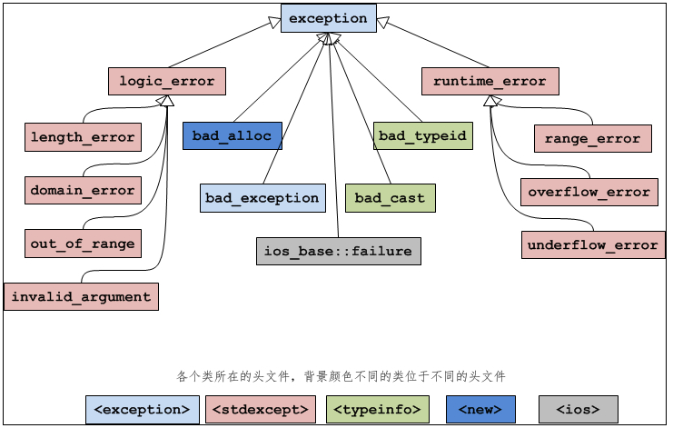
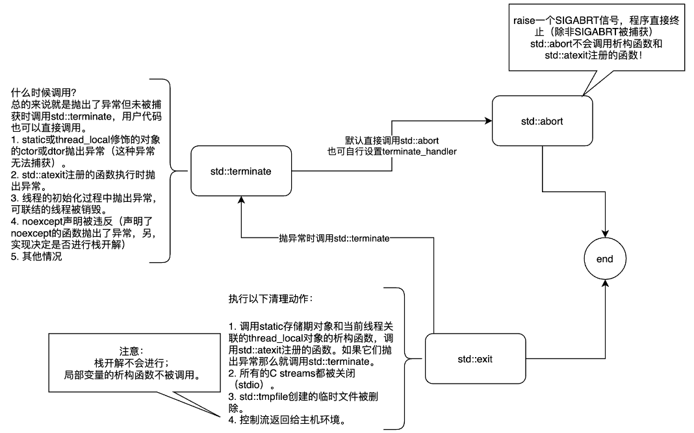

# 异常

# 异常介绍

## 异常机制注意事项

- 性能问题
- 指针和动态分配导致的内存回收问题：动态内存不会自动回收
- 函数的异常抛出列表：如果没有写 `noexcept`，意味着你可以抛出任何异常

## 基本语法

异常捕获
```cpp
try
{
}
catch( ExceptionName e1 )
{
}
catch( ExceptionName e2 )
{
}
// 捕获所有异常
catch( ... )
{

}
```

抛出异常
```cpp
throw "异常";
```

# 异常捕获

```cpp
try{
    // 可能抛出异常的语句
}
// exceptionType：当前 catch 可以处理什么类型的异常。
// variable：捕获到的异常变量
catch(exceptionType variable){
    // 处理异常的语句
}

/**
* 不获取异常数据
*/
try{
    // 可能抛出异常的语句
}
catch(exceptionType){
    // 处理异常的语句
}
```

**catch 进行异常捕获的特点**：
- 异常是在运行阶段产生的，没法提前预测，只能等到程序运行后，真的抛出异常了，再将异常类型和 catch 能处理的类型进行匹配，匹配成功的话就调用当前的 catch，否则就忽略当前的 catch。
- 在多级 catch 中，异常会从上到下按照顺序匹配，且最多只会进入一个 catch
- 异常变量会进行类型转换
  - 算数转换：例如 int 转换为 float，char 转换为 int，double 转换为 int 等
  - 向上转型：也就是派生类向基类的转换
  - const 转换：例如将 char * 转换为 const char *
  - 数组或函数指针转换

# 抛出异常

> [!note]
> 异常必须显式地抛出，即`throw 异常`。如果没有显式的抛出，即使有异常也检测不到。

```cpp
throw 异常数据;
```
异常数据的类型可以是：int、float、bool 等基本类型，也可以是指针、数组、字符串、结构体、类等聚合类型。正规一点就使用`exception`类

> [!note]
> 可以限定函数可以抛出哪些类型的异常，**但是不要使用**。
> ```cpp
> double func (char param) throw (int, char, exception);
> ```

# exception 类

## 定义



C++语言本身或者标准库抛出的异常都是 exception 的子类
```cpp
#include <exception>

class exception{
public:
    exception () throw();  //构造函数
    exception (const exception&) throw();  //拷贝构造函数
    exception& operator= (const exception&) throw();  //运算符重载
    virtual ~exception() throw();  //虚析构函数
    virtual const char* what() const throw();  //虚函数
}
```
可以通过该类捕获所有 `exception` 的子类

```cpp
try{
    //可能抛出异常的语句
}catch(exception &e){
    //处理异常的语句
}
```

## 标准异常

**异常类型**:

| 异常名称          | 含义                                                                                                                                                                                              |
| ----------------- | ------------------------------------------------------------------------------------------------------------------------------------------------------------------------------------------------- |
| logic_error       | 逻辑错误。                                                                                                                                                                                        |
| runtime_error     | 运行时错误。                                                                                                                                                                                      |
| bad_alloc         | 使用 new 或 new[ ] 分配内存失败时抛出的异常。                                                                                                                                                     |
| bad_typeid        | 使用 typeid 操作一个 NULL 指针，而且该指针是带有虚函数的类，这时抛出 bad_typeid 异常。                                                                                                            |
| bad_cast          | 使用 dynamic_cast 转换失败时抛出的异常。                                                                                                                                                          |
| ios_base::failure | io 过程中出现的异常。                                                                                                                                                                             |
| bad_exception     | 这是个特殊的异常，如果函数的异常列表里声明了bad_exception 异常，当函数内部抛出了异常列表中没有的异常时，如果调用的 unexpected() 函数中抛出了异常，不论什么类型，都会被替换为 bad_exception 类型。 |

**逻辑错误异常**：

<div style="margin: 0 auto;padding:1rem;width: 48rem;">

| 异常名称         | 含义                                                                                                      |
| ---------------- | --------------------------------------------------------------------------------------------------------- |
| length_error     | 试图生成一个超出该类型最大长度的对象时抛出该异常，例如 vector 的 resize 操作。                            |
| domain_error     | 参数的值域错误，主要用在数学函数中，例如使用一个负值调用只能操作非负数的函数。                            |
| out_of_range     | 超出有效范围。                                                                                            |
| invalid_argument | 参数不合适。在标准库中，当利用string对象构造 bitset 时，而 string 中的字符不是 0 或1 的时候，抛出该异常。 |
   

</div>


**运行时异常**:

<div style="margin: 0 auto;padding:1rem;width: 32rem;">

| 异常名称        | 含义                             |
| --------------- | -------------------------------- |
| range_error     | 计算结果超出了有意义的值域范围。 |
| overflow_error  | 算术计算上溢。                   |
| underflow_error | 算术计算下溢。                   |
   

</div>


# 构造函数异常

构造函数中抛出异常的特点
- 构造函数抛出异常之后，对象将不被创建
- 对象没有被创建，显然也不会调用析构函数
- 已经创建的成员变量（非`new`、`malloc`创建的）会被部分逆序析构
- 为了防止泄漏，已经完成动态内存分配的需要在`catch`中手动释放

```cpp
class Student
{
public:
    Student()
    {
        a = nullptr;
        try
        {
            a = new int[10]();  
            throw "test";
        }
        catch(...)
        {
            if (a != nullptr)
            {
                delete [] a;
                a = nullptr;
            }
            // 释放完毕后，再抛出异常
            throw "test";
        }
    }
private:
    // 非动态申请的变量，会自动释放
    Teacher tch;

    // 动态创建的需要手动处理一下
    int *a;
}
```

> [!tip]
> `std::nothrow` 只能屏蔽系统分配内存时产生的 `std::bad_alloc` 异常，其他异常还是要 `try catch`

# 函数 try 块

函数直接处理异常，不用在函数外部进行捕获

```cpp
int Fcn(int a)try
{
   throw 1;
   return 10;
}
catch(int e)
{
    std::cout << e << std::endl;
    // 可以进行值返回
    return 11;
}
```

# 退出方式




- **std::exit：** 用于正常流程退出，由用户显式调用。main 函数返回，也是调用这个
- **std::abort：** 终止进程
- **std::terminate：** 异常退出，由内部的库函数调用

> [!note]
> exit 与 abort 不管在哪里被调用，都会直接终止「程序」。


# 异常处理 (MSVC)

## 异常处理机制

在 `MSVC` 编译器中有三种异常处理方式：
- [C++ exception handing](https://learn.microsoft.com/en-us/cpp/cpp/errors-and-exception-handling-modern-cpp?view=msvc-170) : 标准的 `C++` 异常处理机制

- [Structured exception handing](https://learn.microsoft.com/en-us/cpp/cpp/structured-exception-handling-c-cpp?view=msvc-170) : 微软定义的异常处理机制，即 `SEH` ，**推荐在 `C` 程序中使用**

- MFC exception : 上古产物

## C++ exception handing

```cpp
#include <stdexcept>
#include <limits>
#include <iostream>

using namespace std;

void MyFunc(int c)
{
    if (c > numeric_limits< char> ::max())
        throw invalid_argument("MyFunc argument too large.");
    //...
}

int main()
{
    try
    {
        MyFunc(256); //cause an exception to throw
    }

    catch (invalid_argument& e)
    {
        cerr << e.what() << endl;
        return -1;
    }
    //...
    return 0;
}
```

## Structured exception handing

### 基本语法

[SEH](https://learn.microsoft.com/en-us/windows/win32/debug/structured-exception-handling) 的基本语法规则为 `try-except` 和 `try-finally`，是为 `C` 程序设计的。`try-except` 和 `try-finally` 也被称之为 `Frame-based Exception Handler`

```cpp
// __except 过滤 __try 中的异常
__try {
    // guarded code
}
__except ( /* filter expression */ ) {
    // termination code
}

// 在 __try 异常或正常退出后，__finally 都会执行
__try {
    // guarded code
}
__finally {
    // termination code
}
```
`try-except` 的 filter 表达式用法和`try-catch` 不同

```cpp
#include <Windows.h>

// filter expression 的返回值
// EXCEPTION_EXECUTE_HANDLER      1 : 异常可识别。 通过执行 __except
// EXCEPTION_CONTINUE_SEARCH      0 : 异常不被识别
// EXCEPTION_CONTINUE_EXECUTION (-1) : 异常可识别，但被关闭。 从出现异常的点继续执行。
int filter(LPEXCEPTION_POINTERS pInfo, DWORD nCode){

    // filter 表达式的返回值
    int nRes = EXCEPTION_CONTINUE_SEARCH;

    // 除 0 异常
    if(pInfo->ExceptionRecord->ExceptionCode == EXCEPTION_INT_DIVIDE_BY_ZERO){
        nRes = EXCEPTION_EXECUTE_HANDLER;
    }

    return nRes;
}

int main(int argc, char const *argv[])
{
    /* 
        typedef struct _EXCEPTION_POINTERS {
            PEXCEPTION_RECORD ExceptionRecord;
            PCONTEXT          ContextRecord;
        } EXCEPTION_POINTERS, *PEXCEPTION_POINTERS;
    */
    LPEXCEPTION_POINTERS pInfo;

    __try{
        // 抛出异常
        RaiseException(EXCEPTION_INT_DIVIDE_BY_ZERO,0,0,NULL);
    }

    // NOTE - 这两个宏只能在 __except 中使用
    // GetExceptionInformation() ：异常信息
    // GetExceptionCode() ： 异常编号，同 LPEXCEPTION_POINTERS::ExceptionRecord::ExceptionCode
    __except(pInfo = GetExceptionInformation(),filter(pInfo, GetExceptionCode())){
        printf("EXCEPTION_INT_DIVIDE_BY_ZERO\n");

        // 可以直接通过 LPEXCEPTION_POINTERS::ContextRecord 修改进程状态，来修复程序
        pInfo.ContextRecord;
    }

    return 0;
}
```

通过 `UnhandledExceptionFilter` 与 `SetUnhandledExceptionFilter` 能对没有人接收的异常进行最后一次过滤

```cpp
// NOTE - 只能在 filter expression 使用
// 有 debuger 时，倾向于将 unhandled exceptions 递交给 debuger
// 有 debuger : 返回 EXCEPTION_CONTINUE_SEARCH
// 无 debuger : 返回 EXCEPTION_EXECUTE_HANDLER
LONG UnhandledExceptionFilter(
  [in] _EXCEPTION_POINTERS *ExceptionInfo
);


// 为每一个线程设置一个 top-level exception handler。当进程没有被 debug 时，UnhandledExceptionFilter 得到控制处理权，就会调用 lpTopLevelExceptionFilter 来过滤异常
LPTOP_LEVEL_EXCEPTION_FILTER SetUnhandledExceptionFilter(
  [in] LPTOP_LEVEL_EXCEPTION_FILTER lpTopLevelExceptionFilter
);

typedef LONG (WINAPI *PTOP_LEVEL_EXCEPTION_FILTER)(
    _In_ struct _EXCEPTION_POINTERS *ExceptionInfo
);

typedef PTOP_LEVEL_EXCEPTION_FILTER LPTOP_LEVEL_EXCEPTION_FILTER;
```

<details>
<summary><span class="details-title">调用顺序测试</span></summary>
<div class="details-content"> 

```cpp
#include <stdio.h>

#include <Windows.h>

int filter(LPEXCEPTION_POINTERS pInfo, DWORD nCode){

    int nRes = EXCEPTION_CONTINUE_SEARCH;

    printf("1\n");
    UnhandledExceptionFilter(pInfo);
    printf("2\n");

    if(pInfo->ExceptionRecord->ExceptionCode == EXCEPTION_INT_DIVIDE_BY_ZERO){
        nRes = EXCEPTION_EXECUTE_HANDLER;
    }

    return nRes;
}

LONG testFilter(_In_ struct _EXCEPTION_POINTERS* ExceptionInfo){
    printf("3\n");
    return 1;
}

int main(int argc, char const *argv[])
{
    SetUnhandledExceptionFilter(testFilter);

    __try{
        // 抛出异常
        RaiseException(EXCEPTION_INT_DIVIDE_BY_ZERO,0,0,NULL);
    }

    __except(filter(GetExceptionInformation(), GetExceptionCode())){
        printf("4\n");
    }


    return 0;
}
```

```term
triangle@LEARN:~$ main.exe
1
3
2
4
```

</div>
</details>


### 异常类型

SEH 能处理的异常有：
- 硬件异常: 由 CPU 发起，某些指令出错，例如除0、内存访问异常
- 软件异常: 由应用程序或者操作系统发起，程序逻辑出错，例如无效参数。
  - 应用程序：代码逻辑里面主动调用 `RaiseException` 产生异常
  - 操作系统：当操作系统检测到软件异常时，会由当前线程调用 `RaiseException` 产生异常

通过 `GetExceptionInformation` 能获取`CONTEXT` 存储线程堆栈信息与`EXCEPTION_RECORD` 存储异常信息。在默认情况下 `Floating-Point Exceptions` 是关闭的，因此运算结果只返回 `NAN` 或者 `INFINITY`


### 异常处理


`handler` 的查询过程又分为用户态与内核态：

- **用户态**
  1. 通知 debuger 接收
  2. debuger 未找到或不处理。搜索 `frame-based exception handler`，优先搜索产异常线程的栈，然后是其他的
  3. frame-based exception handler 未找到或不处理，二次通知 debuger
  4. debuger 未找到或不处理，则调用系统的默认 handler， 一般是 `ExitProcess`

- **内核态**：在内核的栈帧中查找相关的 handler ，没有找到就调用 `ExitWindows`


### Debugger Exception Handling

用户态程序接入 debuger 后，操作系统在检测到程序发生异常后会生成一个 `debug event`，且 debuger 通过 `WaitForDebugEvent` 接收该事件，并通过 `DEBUG_EVENT` 获取线程号和异常信息 `EXCEPTION_DEBUG_INFO`。

debuger 也有两次处理异常的机会
- `first-chance notification` : 用于 debuger 处理断点与单步调试异常。用户可以修改程序环境，在 handler 执行之前
- `last-chance notification` : frame-based exception handler 没有被找到，让 debuger 兜底

调用 `ContinueDebugEvent` 向操作系统报告异常处理情况并将控制权返还给操作系统。在返回之前，debuger 就能处理异常或者修改线程状态


### Vectored Exception Handling

VEH (Vectored Exception Handling) 是 SEH 的拓展。VEH 不是 `Frame-based Exception Handler`，在 VEH 中注册的 handler 会在 `a first chance notification` 被调用。

- vectored continue handler: `AddVectoredContinueHandler` 与 ` RemoveVectoredContinueHandler` 实现添加与删除
- vectored exception handler: `AddVectoredExceptionHandler` 与 `RemoveVectoredExceptionHandler` 实现添加与删除

## SHE与标准异常机制

`structured exception handling` 与 `C++ exception handling` 的主要区别是
- 异常类型的定义不同。C 的异常类型是一个 `unsigned int`，C++ 则是一个对象
- SEH 是异步的；C++ 标准异常则是同步

> [!note]
> 通过 `/EHa /EHsc /EHs`配置， `SEH` 能在 `C++` 中进行使用，但是在某些情况局部变量的析构函数不会被调用，因此微软推荐`C++`使用 `try-catch`。

- `/EHsc /EHs` : `try-catch` 不会捕获 SHE 的异常

- `/EHa` : `try-catch` 能捕获 SHE 的异常

上述问题最好的解决方案就是[在 C++ 中混用 SHE](https://learn.microsoft.com/en-us/cpp/cpp/exception-handling-differences?view=msvc-170) ：C++ 的异常处理就是标准，C 的异常处理就用 SHE


```cpp
// exceptions_Exception_Handling_Differences.cpp
// compile with: /EHa
#include <iostream>

using namespace std;
void SEHFunc( void );

int main() {
   try {
      SEHFunc();
   }
   catch( ... ) {
      cout << "Caught a C exception."<< endl;
   }
}

void SEHFunc() {
   __try {
      int x, y = 0;
      x = 5 / y;
   }
   __finally {
      cout << "In finally." << endl;
   }
}
```

上面的处理方式 `try-catch` 只能捕捉到 SHE 出现了异常，但是并不能识别出异常类型，这就需要对 SHE 的异常进行封装。

```cpp
// exceptions_Exception_Handling_Differences3.cpp
// compile with: /EHa
#include <stdio.h>
#include <eh.h>
#include <windows.h>

class SE_Exception {
private:
   SE_Exception() {}
   unsigned int nSE;
public:
   SE_Exception( SE_Exception& e) : nSE(e.nSE) {}
   SE_Exception(unsigned int n) : nSE(n) {}
   ~SE_Exception() {}
   unsigned int getSeNumber() { return nSE; }
};

void SEFunc() {
    __try {
        int x, y = 0;
        x = 5 / y;
    }
    __finally {
        printf_s( "In finally\n" );
    }
}

void trans_func( unsigned int u, _EXCEPTION_POINTERS* pExp ) {
    printf_s( "In trans_func.\n" );

    // 抛出 C++ 标准类型的异常
    throw SE_Exception( u );
}

int main() {
    // 注册 SHE 中转处理函数
    _set_se_translator( trans_func );

    try {
        SEFunc();
    }
    catch( SE_Exception e ) {
        printf_s( "Caught a __try exception with SE_Exception.\n" );
        printf_s( "nSE = 0x%x\n", e.getSeNumber() );
    }
}
```


# 附加


## 逻辑检测


> [!note]
> 检测代码逻辑错误，应当使用 `assert`，而非 `exception`

- 不要在 `assert` 中写业务逻辑，只能写检测逻辑

release 与 debug 版本中， `assert` 的执行逻辑不一样。通过宏 `NDEBUG` 进行切换

```cpp
#include <assert.h>

// 在 release 中 ASSERT 不会执行
// 在 debug 中 ASSERT 会执行
assert(nM++ > 0); // Don't do this!
```

- [crtdbg.h](https://learn.microsoft.com/en-us/visualstudio/debugger/c-cpp-assertions?view=vs-2022) 微软提供的带弹窗的断言

release 与 debug 版本中，通过宏 `_DEBUG` 进行切换，且运行时库得使用 debug 版，即 `/MTd，/MDd`

```cpp
#ifndef _ASSERT_EXPR
    #define _ASSERT_EXPR(expr, msg) \
        (void)(                                                                                     \
            (!!(expr)) ||                                                                           \
            (1 != _CrtDbgReportW(_CRT_ASSERT, _CRT_WIDE(__FILE__), __LINE__, NULL, L"%ls", msg)) || \
            (_CrtDbgBreak(), 0)                                                                     \
        )
#endif

// 不会打印判断条件
#ifndef _ASSERT
    #define _ASSERT(expr) _ASSERT_EXPR((expr), NULL)
#endif

// 会打印判断条件
#ifndef _ASSERTE
    #define _ASSERTE(expr) _ASSERT_EXPR((expr), _CRT_WIDE(#expr))
#endif
```

