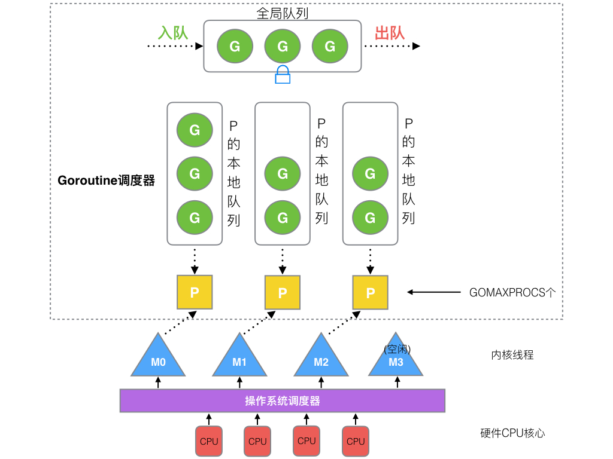
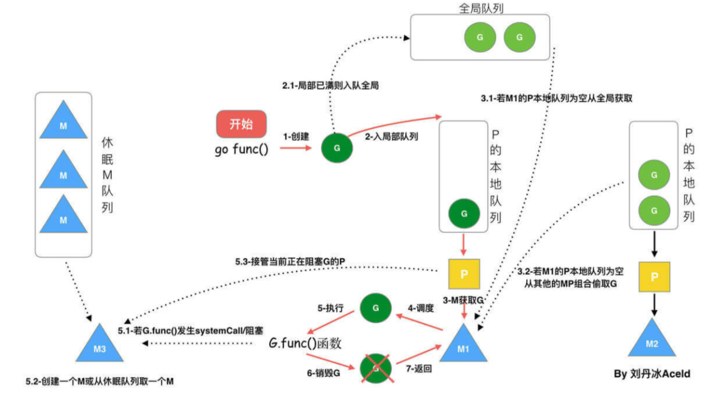

# 并发


# GMP 模型

## 并发模型


在 go 的并发模型中，线程被放入了内核态。用户想要实现并发，就得首先创建协程，然后将协程放入调度器中，调度器再将协程放到内核中的线程进行执行。线程级别的上下文切换都发生在内核空间，且对用户不可见，实现了线程与协程逻辑上的解耦。协程间切换都是在用户态实现，避免了线程的上下文切换的开销，因此并发性能更好。此外，协程间的调度模式不再是线程的抢占式，而是协作式。

## GM 调度器


go 早期的调度器类似一个简单的线程池：协程 G 都被放入了一个全局任务队列中，线程 M 则从全局队列中获取协程 G 进行运行。**这实现方式会产生很严重的线程间竞争，执行性能较差。**

## GMP 调度器

为了解决早期调度器性能差的问题，重新设计了新的调度器，即 `GMP` 模型
- **G**：`Goroutine`，代表一个协程
- **M**: `Machine`，处于内核空间，真正运行在cpu上的线程
- **P**: `Processor`，协程调度器，将 G 加载到 P 上运行



GMP 模型会创建了多个调度器，每个调度器维护一个本地队列，调度器会被绑定到线程上。**线程会优先消费自己调度器的本地队列中的 G；执行 G 时产生的新 G，也优先放入本地队列中；只有当本地队列放满了，才会将本地队列中的G 放入全局队列；同样本地队列中的 G 消费完后，才会从全局队列获取 G 放入本地队列。**

## 设计策略



- **Work Stealing** `图 3.1`

线程的本地队列没有 G，全局队列也没有 G，则会去其他线程的本地队列中获取 G

- **Hand Off** `图 5.1 - 5.3`

线程发现发现 G 要进入阻塞时，会创建或唤醒空闲线程，并将自己的调度器给其他的线程，然后自己进入阻塞等待，之后线程执行完当前 G 就会睡眠或销毁

- **利用并行** 

可以通过 `GOMAXPROCS` 限制 P 的实际个数，只要数量低于CPU核数，就能在同一时间空闲CPU干其他事

- **抢占** 

内核态的线程是时间片轮询的，只有一个 CPU 时，可以让多个 P 分时复用执行 G。


# goroutine

```go
package main

import (
	"fmt"
	"time"
)

func fcn(mark string){
	i := 0
	for{
		i++
		fmt.Println(mark, ":", i)
		time.Sleep(time.Second)
	}	
}

func main()  {
	// 根据函数创建协程
	go fcn("a")

    // 根据匿名函数创建协程
	go func(){
		fcn("c")
	}()

	go func(){
		fmt.Println("1")
        func(){
			// 退出当前协程
			runtime.Goexit()
        }()

        // 不会被打印
        fmt.Println("2")
    }()

	fcn("b")
}
```

