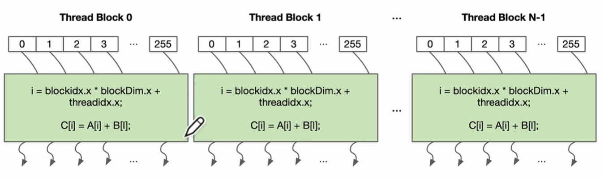

# IO 设备

# IO 设备模型

**IO 设备：** 一个能与 CPU 交换数据的接口/控制器。对于 CPU 而言就是几组约定好功能接口线，因此 CPU 操作 IO 设备，就是读写 IO 设备的寄存器，IO 设备内部的微型处理器就会去处理这些信息。


# IO 设备

## 总线

**总线：** 用于CPU寻址。CPU 与 IO 设备之间的交互是靠CPU访问 IO 设备的寄存器，访问寄存器就是寻址。总线的工作就是帮助 CPU 进行地址查找，且 CPU 只要连接总线就行。总线下面又可以进行细分
    - pci 总线
    - usb 总线

```term
triangle@LEARN:~$ lspci -tv // 查看 pci 总线
triangle@LEARN:~$ lspusb -tv // 查看 usb 总线
```

## 中断控制器

**中断控制器：** ，PIC (programmable interrupt controller)， 用于控制中断信号的硬件
- `local APIC`: 中断向量表，IPI (处理器间的中断)，时钟中断
- `IO APIC`：控制 IO 设备产生的中断


## DMA

**DMA:** 内存数据到磁盘数据的拷贝，CPU 就将往磁盘写数据外包出去，让 CPU 空闲出来干其他事。


# IO 驱动

## 概念

- **目的：** 每一个 IO 设备各式各样，设计思路也各有千秋，这就导致应用程序去访问设备十分困难，而且代码也十分定制（每访问一个设备，就要单独写一套代码）。为了简化操作，便于应用程序使用，就将 IO 设备的公共逻辑进行抽象，这些公共API的实现就是 「IO 驱动」。

- **IO 驱动：** 实现操作系统规定的API接口，将 IO 设备的具体操作封装在驱动内部。抽象就有接口
  - read
  - write
  - ioctl : 额外处理全部都是这个接口，就导致这个接口很臃肿

> [!note]
>  Linux驱动属于内核部分

IO设备根据IO寄存器的操作方式又划分为
- **char device:** 够像字节流（类似文件）一样被访问的设备，由字符设备驱动程序来实现这种特性，例如键盘、鼠标
- **block device:** 以「字节数组」的形式进行数据读写的设备，比较典型的如磁盘设备、光盘或者优盘

```term
triangle@LEARN:~$ ll /dev/
# b 是块设备
brw-rw----  1 root disk      8,   0 Sep 17 11:53 sda
brw-rw----  1 root disk      8,  16 Sep 17 11:53 sdb
brw-rw----  1 root disk      8,  32 Sep 17 11:53 sdc
# c 是字节设备
crw-------  1 root root    247,   0 Sep 17 11:53 vport0p0
crw-------  1 root root    247,   1 Sep 17 11:53 vport0p1
crw-rw-rw-  1 root root     10, 126 Sep 17 11:53 vsock
crw-rw-rw-  1 root root      1,   5 Sep 17 11:53 zero
```

- **虚拟设备：** 既然设备驱动是现实操作系统与硬件交互的代码，那么就能只提供一些驱动，来模拟出一些不存在的设备
  - /dev/pts/[n] : 终端
  - /dev/zero : 零设备
  - /dev/null : 空设备
  - /dev/urandom, /dev/random : 随机数设备

## 驱动程序

### 自定义驱动

> [!warning]
> 不建议自己编译玩，看看就行

1. 下载 Linux 源码，需要提前编译一下内核

```term
triangle@LEARN:~$ uname -r // 查看版本
5.15.90.1-microsoft-standard-WSL2
triangle@LEARN:~$ sudo apt-cache search linux-source // 查看 linux 内核
triangle@LEARN:~$  sudo apt-cache search linux-source
linux-source - Linux kernel source with Ubuntu patches
linux-source-5.4.0 - Linux kernel source for version 5.4.0 with Ubuntu patches
。。。
triangle@LEARN:~$ sudo apt-get install linux-source-5.4.0 // 下载源码，位置 /usr/src
```

2. 自定义驱动

```cpp
 #include <linux/module.h>
#include <linux/kernel.h>
#include <linux/init.h>
#include <linux/cdev.h>
#include <linux/device.h>
#include <linux/fs.h>
#include <linux/uaccess.h>

#define MAX_DEV 2

static int dev_major = 0;
static struct class *lx_class = NULL;
static struct cdev cdev;

static ssize_t lx_read(struct file *, char __user *, size_t, loff_t *);
static ssize_t lx_write(struct file *, const char __user *, size_t, loff_t *);

// 注册接口
static struct file_operations fops = {
  .owner = THIS_MODULE,
  .read = lx_read, // 读接口
  .write = lx_write, // 写接口
};

static struct nuke {
  struct cdev cdev;
} devs[MAX_DEV];

// 注册驱动
static int __init lx_init(void) {
  dev_t dev;
  int i;

  // allocate device range
  alloc_chrdev_region(&dev, 0, 1, "nuke");

  // create device major number
  dev_major = MAJOR(dev);

  // create class
  lx_class = class_create(THIS_MODULE, "nuke");

  for (i = 0; i < MAX_DEV; i++) {
    // register device
    cdev_init(&devs[i].cdev, &fops);
    cdev.owner = THIS_MODULE;
    cdev_add(&devs[i].cdev, MKDEV(dev_major, i), 1);

    // 创建设备 nuke0 与 nuke1
    device_create(lx_class, NULL, MKDEV(dev_major, i), NULL, "nuke%d", i);
  }
  return 0;    
}

// 卸载驱动
static void __exit lx_exit(void) {
  device_destroy(lx_class, MKDEV(dev_major, 0));
  class_unregister(lx_class);
  class_destroy(lx_class);
  unregister_chrdev_region(MKDEV(dev_major, 0), MINORMASK);
}

static ssize_t lx_read(struct file *file, char __user *buf, size_t count, loff_t *offset) {
  if (*offset != 0) {
    return 0;
  } else {
    uint8_t *data = "This is dangerous!\n";
    size_t datalen = strlen(data);
    if (count > datalen) {
      count = datalen;
    }
    if (copy_to_user(buf, data, count)) {
      return -EFAULT;
    }
    *offset += count;
    return count;
  }
}

static ssize_t lx_write(struct file *file, const char __user *buf, size_t count, loff_t *offset) {
  char databuf[4] = "\0\0\0\0";
  if (count > 4) {
    count = 4;
  }

  copy_from_user(databuf, buf, count);
  if (strncmp(buf, "\x01\x14\x05\x14", 4) == 0) {
    const char *EXPLODE[] = {
      "    ⠀⠀⠀⠀⠀⠀⠀⠀⣀⣠⣀⣀⠀⠀⣀⣤⣤⣄⡀⠀⠀⠀⠀⠀⠀⠀⠀⠀⠀⠀",
      "    ⠀⠀⠀⣀⣠⣤⣤⣾⣿⣿⣿⣿⣷⣾⣿⣿⣿⣿⣿⣶⣿⣿⣿⣶⣤⡀⠀⠀⠀⠀",
      "    ⠀⢠⣾⣿⣿⣿⣿⣿⣿⣿⣿⣿⣿⣿⣿⣿⣿⣿⣿⣿⣿⣿⣿⣿⣿⣷⠀⠀⠀⠀",
      "    ⠀⢸⣿⣿⣿⣿⣿⣿⣿⣿⣿⣿⣿⣿⣿⣿⣿⣿⣿⣿⣿⣿⣿⣿⣿⣿⣿⣶⡀⠀",
      "    ⠀⢀⣿⣿⣿⣿⣿⣿⣿⣿⣿⣿⣿⣿⣿⣿⣿⣿⣿⣿⣿⣿⣿⣿⣿⣿⣿⣿⡇⠀",
      "    ⠀⢸⣿⣿⣿⣿⣿⣿⣿⣿⣿⣿⣿⣿⡿⢿⣿⣿⣿⣿⣿⣿⣿⣿⣿⣿⠿⠟⠁⠀",
      "    ⠀⠀⠻⢿⡿⢿⣿⣿⣿⣿⠟⠛⠛⠋⣀⣀⠙⠻⠿⠿⠋⠻⢿⣿⣿⠟⠀⠀⠀⠀",
      "    ⠀⠀⠀⠀⠀⠀⠈⠉⣉⣠⣴⣷⣶⣿⣿⣿⣿⣶⣶⣶⣾⣶⠀⠀⠀⠀⠀⠀⠀⠀",
      "    ⠀⠀⠀⠀⠀⠀⠀⠀⠉⠛⠋⠈⠛⠿⠟⠉⠻⠿⠋⠉⠛⠁⠀⠀⠀⠀⠀⠀⠀⠀",
      "    ⠀⠀⠀⠀⠀⠀⠀⠀⠀⠀⠀⠀⠀⠀⣶⣷⡆⠀⠀⠀⠀⠀⠀⠀⠀⠀⠀⠀⠀⠀",
      "    ⠀⠀⠀⠀⠀⠀⢀⣀⣠⣤⣤⣤⣤⣶⣿⣿⣷⣦⣤⣤⣤⣤⣀⣀⠀⠀⠀⠀⠀⠀",
      "    ⠀⠀⠀⠀⢰⣿⠛⠉⠉⠁⠀⠀⠀⢸⣿⣿⣧⠀⠀⠀⠀⠉⠉⠙⢻⣷⠀⠀⠀⠀",
      "    ⠀⠀⠀⠀⠀⠙⠻⠷⠶⣶⣤⣤⣤⣿⣿⣿⣿⣦⣤⣤⣴⡶⠶⠟⠛⠁⠀⠀⠀⠀",
      "    ⠀⠀⠀⠀⠀⠀⠀⠀⠀⠀⢀⣴⣿⣿⣿⣿⣿⣿⣷⣄⠀⠀⠀⠀⠀⠀⠀⠀⠀⠀",
      "    ⠀⠀⠀⠀⠀⠀⠀⠀⠀⠒⠛⠛⠛⠛⠛⠛⠛⠛⠛⠛⠓⠀⠀⠀⠀⠀⠀⠀⠀⠀",
    };
    int i;

    for (i = 0; i < sizeof(EXPLODE) / sizeof(EXPLODE[0]); i++) {
      printk("\033[01;31m%s\033[0m\n", EXPLODE[i]);
    }
  } else {
    printk("nuke: incorrect secret, cannot lanuch.\n");
  }
  return count;
}

// 模块的开始和结束
module_init(lx_init);
module_exit(lx_exit);

MODULE_LICENSE("GPL");
MODULE_AUTHOR("jyy");
```

3. 编译驱动

> [!warning]
> 再次提醒，不建议自己编译玩，看看就行

```makefile
# 驱动名称
obj-m := module.o 

# 内核源码，在该路径下，有内核的 makefile 文件
KDIR := [kernel path]

# 模块项目路径 
SRC_PATH := [module path]

all:
	$(MAKE) -C $(KDIR) M=$(SRC_PATH)
```

编译之后会生成一个 `module.ko` ，这个就是驱动文件

4. 注册驱动

```term
triangle@LEARN:~$ insmod  module.ko // 安装驱动 .ko 文件，只完成了注册
triangle@LEARN:~$ lsmod // 查看安装的驱动
triangle@LEARN:~$ mknod /dev/[name] c 237 0// 创建设备文件，name: device_create 函数给定的
```

5. 使用设备

```term
triangle@LEARN:~$ cat /dev/[name] // 对设备进行读操作
triangle@LEARN:~$ echo hello > /dev/[name] // 对设备进行写
triangle@LEARN:~$ dmesg // 查看内核 msg 信息 printk 函数打印的
```

### 驱动接口

```cpp
struct file_operations {
  struct module *owner;
  loff_t (*llseek) (struct file *, loff_t, int);
  ssize_t (*read) (struct file *, char __user *, size_t, loff_t *);
  ssize_t (*write) (struct file *, const char __user *, size_t, loff_t *);
  int (*mmap) (struct file *, struct vm_area_struct *);
  unsigned long mmap_supported_flags;
  int (*open) (struct inode *, struct file *);
  int (*release) (struct inode *, struct file *);
  int (*flush) (struct file *, fl_owner_t id);
  int (*fsync) (struct file *, loff_t, loff_t, int datasync);
  int (*lock) (struct file *, int, struct file_lock *);
  ssize_t (*sendpage) (struct file *, struct page *, int, size_t, loff_t *, int);
  long (*unlocked_ioctl) (struct file *, unsigned int, unsigned long);
  long (*compat_ioctl) (struct file *, unsigned int, unsigned long);
  int (*flock) (struct file *, int, struct file_lock *);
  ...
```

- `unlocked_ioctl` 与 `ioctl`: 之前的 Linux 内核中有一个 BKL (Big Kernel Lock) 锁，为了性能，在 `2.6.11` 中设计了一个无锁的 ioctl 接口。但是在 `2.6.36` 版本对 BKL 进行了优化，然后就删除了带锁的 `ioctl` ，保留了无锁的 `unlocked_ioctl`
- `compat_ioctl`：在 x64 的机器上，兼容 x32 的程序

# GPU

## GPU 架构

- **SIMD (Single Instruction Multiple Data):** 对多个数据进行同样的计算操作，且在同一线程完成。

**案例：** 将 A 向量与 B 向量对应元素相乘，计算得到向量 C。向量 A 与 B 的元素不同，但是计算操作完全一样的。


**实现：** 增加 ALU 计算单元数量，每个 ALU 都拥有独立的 Reg 来记录不同数据，并且这些 ALU 的 PC 都是同一个，即保证都是同一个操作。


- **SIMT (Single Instruction Multiple Threads):** 运行同一份程序，但是不同线程同时运行

**案例：** 将 A 向量与 B 向量对应元素相乘，计算得到向量 C。为每一对相乘元素分配一个线程，通过该线程完成乘法操作，所有线程并发执行完后，得到计算结果向量 C。


**实现：** 每个 `SIMT Core Cluster` 就是一个 SIMT 系统，每个 SIMT 系统中的 `SIMT Core` 都共用一个 PC 寄存器、指令 Cache 与 译码器，即`SIMT Core`中的线程同时只运行一份代码。


- **GPU架构：** SIMT 本质上是实现了一套线程并发的管理系统，具体计算还是靠单线程执行，既然是单线程，那么又可以 把 SIMD 给引入进来。整合 SIMT 与 SIMD 就得到了 GPU 的设计思路


## CUDA

- Block

一个 Block 就是一个任务，执行相同的代码（kernel 代码），每个线程都有一个自己的索引号 (threadldx.x) 用于内存寻址与控制决策。

**案例：** 计算向量 A 与向量 B 相加，就可以把 A 与 B 相加任务看作是一个计算任务，即Block，且每一对元素放到一个线程执行，并通过线程索引号访问内存地址


- Warp

通过定义可知，一个 Block 中的线程肯定是通过 SIMT 进行执行的， 因此 Block 会被拆分成多个 Warp 基本单元。一个 Warp 包含 32 个并行 thread，这 32 个 thread 执行于SIMT模式。


- Grid

多个 Block 的集合，就构建成了 Grid 




# Block I/O Layer

为了实现块设备的快速读写，块设备上的数据不支持随机读写，都是以 Block (一组字节) 为基本单位。这处理的结果是读写变快了，但是应用程序对其进行控制又变得麻烦，然后为了使得块设备易于访问，操作系统又为块设备实现了一个 Block I/O Layer。**以 Block I/O Layer 为基础，就能实现文件系统。**

