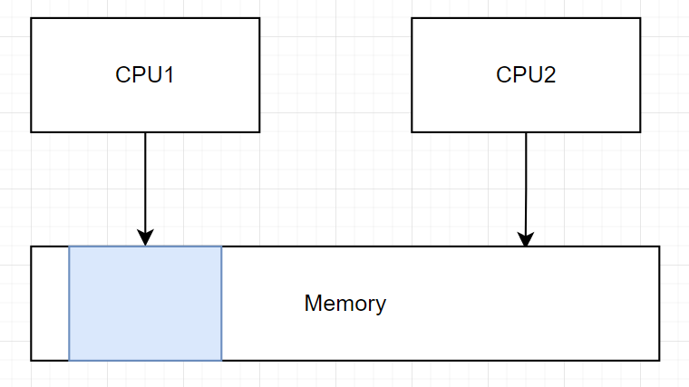
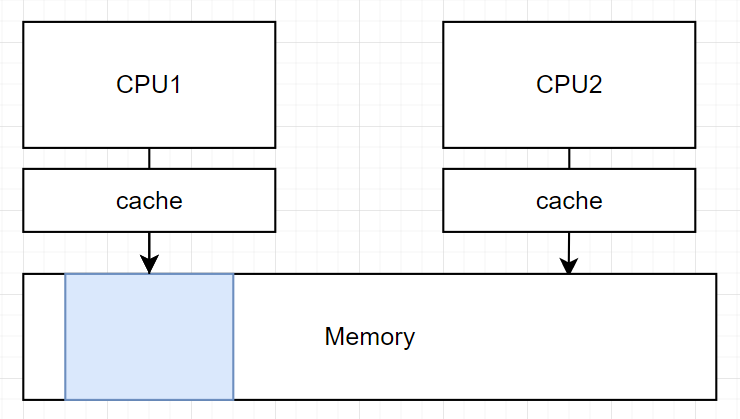
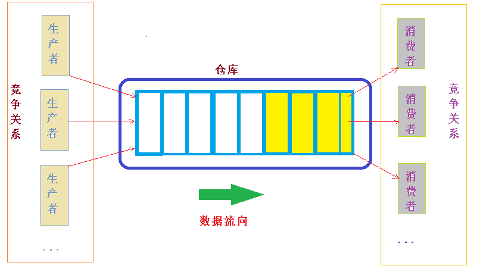
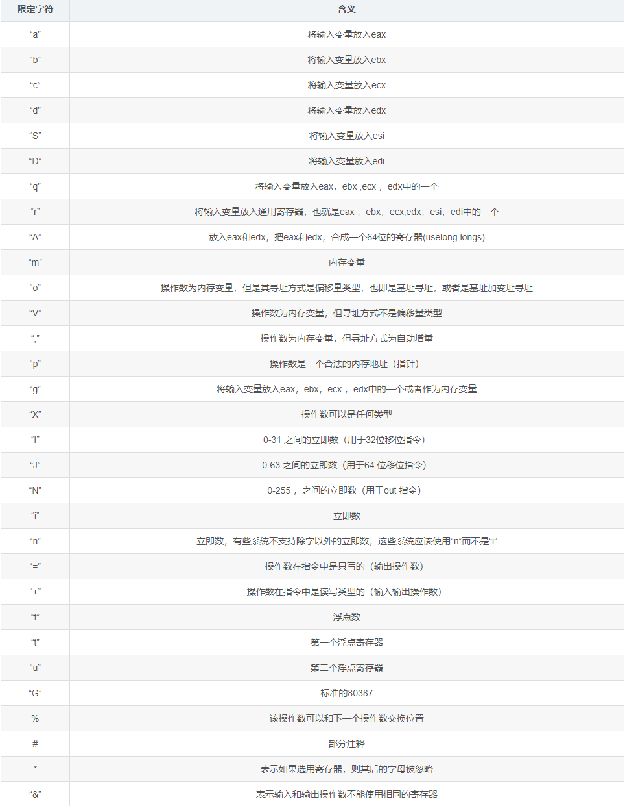

# 并发

# 多线程

## 状态机

- 状态：
  - 全局变量、堆区：所有线程共享
  - 栈帧：每个线程独自维护自己的栈帧链
  - 线程局部变量：每个线程自己的全局变量
    ```cpp
    // GCC 关键字
    // 只适用于整型指针的标量，不带自定义的构造、拷贝、赋值、析构的类型；
    // 不能修饰函数的局部变量或者class的普通成员变量
    __thread int n;

    // c11 标准，比上面那个好用
    thread_local int n;
    ```
- 多线程状态转移：不同栈帧链间并行执行，同一条栈帧链串行执行，且栈帧链之间互不影响
  - **线程的创建：** 就是在状态机中，新增加一条栈帧链表
  - **线程 Join：** 在主栈帧链中，循环等待被 Join 的栈帧链执行完毕

## 原子性

**原子性**：多个线程可以随意修改共享的内存资源

## 顺序性

**顺序性**：编译器编译程序，会将所有的代码视作单线程编译汇编语句，这样就会对代码进行乱七八糟的优化。优化后的代码在单线程上没问题，但是在多线程中，就会出现各种奇奇怪怪的问题

- **循环的优化**

[thread.h](http://jyywiki.cn/pages/OS/2022/demos/thread.h)

```cpp
#include "thread.h"

// 累加循环数
#define N (100000)
// 累加和
long sum = 0;

void Sum()
{
    for (size_t i = 0; i < N; i++)
    {
        ++sum; 
    }
}

int main(int argc, char const *argv[])
{
    create(Sum);
    create(Sum);
    join();
    printf("sum is %ld\n", sum);
    return 0;
}
```

```term
triangle@LEARN:~$ gcc -c sum.c -O1 && objdump -d sum.o
...
000000000000001a <Sum>:
  1a:   f3 0f 1e fa             endbr64
  # 保留 N 次的循环 
  1e:   48 8b 15 00 00 00 00    mov    0x0(%rip),%rdx        # 25 <Sum+0xb>
  25:   b8 a0 86 01 00          mov    $0x186a0,%eax
  2a:   48 83 e8 01             sub    $0x1,%rax
  2e:   75 fa                   jne    2a <Sum+0x10>
  # 合并所有的加 Sum = Sum + N
  30:   48 8d 82 a0 86 01 00    lea    0x186a0(%rdx),%rax
  37:   48 89 05 00 00 00 00    mov    %rax,0x0(%rip)        # 3e <Sum+0x24>
  3e:   c3                      retq   
...
```

```term
triangle@LEARN:~$ gcc -c sum.c -O2 && objdump -d sum.o
...
0000000000000020 <Sum>:
  20:   f3 0f 1e fa             endbr64 
  # 将 Sum 函数的循环直接干掉，变成：sum = sum + N
  24:   48 81 05 00 00 00 00    addq   $0x186a0,0x0(%rip)        # 2f <Sum+0xf>
  2b:   a0 86 01 00 
  2f:   c3                      retq   
...
```

- **循环条件的优化**

```cpp
extern int flag = 0;

void Wait()
{
    while (!flag){}
} 
```

```term
triangle@LEARN:~$ gcc -c -O2 wait.c && objdump -d wait.o
0000000000000000 <Wait>:
   0:   f3 0f 1e fa             endbr64 
   # 从内存中，读取一次 flag 的值
   4:   8b 05 00 00 00 00       mov    0x0(%rip),%eax        # a <Wait+0xa>
   # 先进行判断 if (!flag)
   a:   85 c0                   test   %eax,%eax
   c:   75 02                   jne    10 <Wait+0x10>
   # 当判断不通过，则进入死循环 while(1)
   e:   eb fe                   jmp    e <Wait+0xe>
  10:   c3                      retq   
```

经过编译器优化后，只在函数开始时，读取了一次 `flag` 值，这在单线程中完全没问题，但在多线程中，逻辑就完全错了：`wait()` 线程是要一直循环判断 `flag` 的值是否满足退出条件，但是编译器按照单线程逻辑进行优化，就只判断了一次 `flag` 的状态。防止编译器乱排序，可以使用 「内存屏障」或者利用原子变量的「内存顺」进行控制

```cpp
extern int flag = 0;

void Wait()
{
    while (!flag){
        // 内存中的值已经改变，之前对内存的缓存（缓存到寄存器）都需要抛弃，之后需要重新读取内存
        asm volatile("":::"memory");
    }
} 
```

```term
triangle@LEARN:~$ gcc -c -O2 wait.c && objdump -d wait.o
0000000000000000 <Wait>:
   0:   f3 0f 1e fa             endbr64 
   4:   eb 0a                   jmp    10 <Wait+0x10>
   6:   66 2e 0f 1f 84 00 00    nopw   %cs:0x0(%rax,%rax,1)
   d:   00 00 00 
  # 从内存中读取 flag
  10:   8b 05 00 00 00 00       mov    0x0(%rip),%eax        # 16 <Wait+0x16>
  # 比较 if(!flag)
  16:   85 c0                   test   %eax,%eax
  # 跳转到 10 继续运行
  18:   74 f6                   je     10 <Wait+0x10>
  1a:   c3                      retq  
```

## 可见性

**可见性**：汇编指令在处理器层面，会被进一步优化（全部当作是单线程程序），这就导致汇编指令的运行顺序也和定义的不一样


```cpp
// 全局变量
int x = 0, y = 0;

// __attribute__：只适用于 GNU C 
// __attribute__((noinline)) ：函数不能内联
// __attribute__((always_inline)) ：函数必须内联
__attribute__((noinline)) void write_x_read_y()
{
    x = 1;
    asm volatile("":::"memory");
    printf("%d ", y);
}

__attribute__((noinline)) void write_y_read_x()
{
    y = 1;
    asm volatile("":::"memory");
    printf("%d ", x);
}
```
虽然添加了内存屏障，用两个线程分别跑上面的两个程序，输出结果也是违反直觉的

```term
triangle@LEARN:~$ ./a.out | head -n 100000 | sort | uniq -c
  58541 0 0 
  30689 0 1 
  10766 1 0 
      4 1 1 
```


<details>
<summary><span class="details-title">案例代码</span></summary>
<div class="details-content"> 

```cpp
#include "thread.h"

/* =================== 同步 ==================== */
// 原子变量标记
atomic_int flag;
// 读取标记
#define FLAG atomic_load(&flag)
// 0 ^ 0 = 0
// 1 ^ 1 = 0
// 0 ^ 1 = 1
// 1 ^ 0 = 1
#define FLAG_XOR(val) atomic_fetch_xor(&flag, val)
// 等待
#define WAIT_FOR(cond) \
  while (!(cond));
/* =================== 同步 ==================== */

// 全局变量
int x = 0, y = 0;

// __attribute__：只适用于 GNU C 
// __attribute__((noinline)) ：函数不能内联
// __attribute__((always_inline)) ：函数必须内联
__attribute__((noinline)) void write_x_read_y()
{
  // x = 1;
  // asm volatile("":::"memory");
  // printf("%d ", y);

  int y_val;
  asm volatile(
      "movl $1, %0;" // x = 1
      "movl %2, %1;" // y_val = y
      : "=m"(x), "=r"(y_val)
      : "m"(y));
  printf("%d ", y_val);
}

__attribute__((noinline)) void write_y_read_x()
{
  // y = 1;
  // asm volatile("":::"memory");
  // printf("%d ", x);

  int x_val;
  asm volatile(
      "movl $1, %0;" // y = 1
      "movl %2, %1;" // x_val = x
      : "=m"(y), "=r"(x_val)
      : "m"(x));
  printf("%d ", x_val);
}

void T1(int id)
{
  while (1)
  {
    // 等待 flag 状态，第一位变成 1
    // while( (flag & 0b01) != true )  
    WAIT_FOR((FLAG & 1)); 

    write_x_read_y();

    // 将 flag 的第一位变成 0
    FLAG_XOR(1);
  }
}

void T2()
{
  while (1)
  {
    // 等待 flag 状态，第二位变成 1
    // while( (flag & 0b10) != true )  
    WAIT_FOR((FLAG & 2));

    write_y_read_x();

    // 将 flag 的二位变成 0
    FLAG_XOR(2);
  }
}

void Tsync()
{
  while (1)
  {
    // 初始化
    x = y = 0;
    __sync_synchronize(); // full barrier
    usleep(1);            // + delay
    assert(FLAG == 0);

    // flag = 0b11，停止 T1()，T2() 的等待
    FLAG_XOR(3);

    // 等待 T1()，T2() 运行完
    WAIT_FOR(FLAG == 0);

    printf("\n");
    fflush(stdout);
  }
}

int main()
{
  create(T1);
  create(T2);
  create(Tsync);
}

```

</div>
</details>

这是因为，CPU 还会将汇编指令拆解成能在电路上运行的 $\mu op$ 语句，$\mu op$ 具有四个阶段：
- Fetch：从汇编指令获取 $\mu op$
- Issue：向处理器的运行池子中补充 $\mu op$
- Execute：处理器正式运行 $\mu op$
- Commit

在处理器内部，$\mu op$ 池子中，$\mu op$ 根据数据依赖关系与 $\mu op$ 的补充顺序形成一个有向无环图，处理器根据这个有向无环图执行 $\mu op$ 。根据这样的设计，这些 $\mu op$ 便可以在处理器中并发执行，因此就导致汇编指令在处理器中也会被优化得乱七八糟运行。

```cpp
movl $1, %0; // y = 1
movl %2, %1; // x_val = x
```

当上面两条汇编指令同时被加载到处理器的缓存中，就会同时获取两条指令的 $\mu op$，但这两天指令间并没有数据依赖关系，这就导致 $\mu op$ 会被随意排序，进而导致运行结果会产生 `0 0 ` 的结果。为了防止处理器对汇编顺序的优化，可以使用 `mfence`

```cpp
movl $1, %0; // y = 1
mfence; // 保证上面的汇编指令真正的被执行完毕，才开始执行下面的汇编指令
movl %2, %1; // x_val = x
```

# 互斥

## 互斥问题

导致互斥不能很好实现的根本原因是：**不能同时进行读、写共享内存**
- load/read：看一眼共享内存，但是看到的内容马上过时，不能防止别人写
- store/write：往共享内存中写入内容，但是共享内存中有啥东西完全不知道


## Peterson

```cpp
// 两个线程的标记
#define T1 (1)
#define T2 (2)

// 标记，这里来必须使用 volatile 保证全局变量能被写入到内存
volatile int flagT1 = 0; // T1 想要进入
volatile int flagT2 = 0; // T2 想要进入
volatile int turn = T1;  // 实际让那个线程进入

// 临界区资源
atomic_int count;

void FcnT1()
{
    while (1)
    {
        // 当前线程想进入
        flagT1 = 1;
        // 让 T2 先进
        turn = T2;
        // 等待 T2 运行完毕
        while (flagT2 && turn == T2);

        /* ==================== */
        atomic_fetch_add(&count , 1);
        int temp = atomic_load(&count);
        if ( temp > 1 )
        {
            printf("T1 count is %d\n", temp);
        }
        atomic_store(&count, 0);
        /* ==================== */

        // T1 退出
        flagT1 = 0; 
    }
}

void FcnT2()
{
    while (1)
    {
        // 当前线程想进入
        flagT2 = 1;
        // 让 T1 先进
        turn = T1;
        // 等待 T1 运行完毕
        while (flagT1 && turn == T1);

        /* ==================== */
        atomic_fetch_add(&count , 1);
        int temp = atomic_load(&count);
        if ( temp > 1 )
        {
            printf("T2 count is %d\n", temp);
        }
        atomic_store(&count, 0);
        /* ==================== */

        // T2 退出
        flagT2 = 0; 
    }
}
```

```term
triangle@LEARN:~$ gcc -O2  peterson.c -lpthread  && ./a.out
T2 count is 2
T1 count is 2
```

Peterson 算法通过共享内存的方式（`flagT1、flagT2、turn`就是用来实现互斥的全局变量）实现了线程间的互斥。在理论上该算法是正确的，但是由于处理器运行的不可见性，还是会出现问题。

## 自旋锁 

### 原理

解决互斥问题，改变前提：**让硬件提供支持同时 load/store 的指令**，即同一时间只有一个线程能读取并修改共享内存，其他线程不能干涉

```cpp
int xchg(volatile int *addr, int newval) {
    int result;
    // lock : 保证修饰的汇编语句是原子操作
    // xchg : 读写操作，放入新值，返回旧值
    asm volatile ("lock xchg %0, %1"
      : "+m"(*addr), "=a"(result) 
      : "1"(newval));
    return result;
}

/* 自旋锁实现 */
int table = YES;

void lock() {
  while (xchg(&table, NOPE) == NOPE);
  assert(got == YES);
}

void unlock() {
  xchg(&table, YES)
}
```

### lock 指令



对于上述的 `lock` 指令，在简单的内存模型上，可以通过硬件实现：CPU1 与 CPU2 直接访问内存，无缓存；CPU1 要实现对蓝色区域内存的原子操作，就直接在物理上给这片内存区域上一个锁；在 CPU1 访问这片内存期间，CPU2 无法访问蓝色区域内存，直到 CPU1 解除锁定。



但是这种设计在现代内存模型上，就不太合理。现代内存模型，CPU 与内存之间还存在 cache ，CPU 会经过 cache 来访问内存，cache 会拷贝内存上的内容。通过物理封锁内存实现 CPU1 对蓝色区域内存的原子操作，这种方法就行不通了，万一 CPU1 与 CPU2 的 cache 刚好都是蓝色区域的副本，这样程序又乱套了。想要彻底锁着蓝色区域的内存，就需要 CPU1 锁住蓝色区域内存的同时，还要清空掉 CPU2 的 cache ，代价就太大了。观察常见的几种原子操作

```cpp
/* test and set */
void TestAndSet(Type & x, Type newVal)
{ 
    reg = load(x);        // 读取
    if(IsCondition(reg))  // 检测状态
    {
        store(x, newVal); // 写入
    }
}

/* xchg */
void xchg(Type & x, Type newVal)
{ 
    reg = load(x);    // 读取
    store(x, newVal); // 写入
}

/* compute */
void compute(Type & x)
{
    reg = load(x); // 读取
    operate(reg);  // 运算
    store(x, reg); // 写入
}
```

上面三种原子操作的步骤都可以总结为：
1. load : 读取内存
2. operate : 各种乱七八糟的计算操作
3. store : 将修改的内容更新到内存

**确保原子操作能正常运行，就只要保证 `load` 与 `store` 正常就行，`operate` 无所谓，可以随时复现**。RISC-V 提供了另外一种原子操作的设计思路 **Load-Reserved/Store-Conditional(LR/SC)**
- LR : 原子操作读取内存时，会对被访问的内存添加标记。中断、其他处理器写入内容到标记内存中，都会导致标记清除 
   ```cpp
    lr.w  rd, (rs1);
    {
        rd = M[rs1];    // 读取内存内容
        reserve M[rs1]; // 标记当前内存
    } 
   ```
- SC : 若标记没被清除，就将更新内存
   ```cpp
    sc.w  rd, rs2, (rs1);
    {
        // 标志是否还存在
        if (IsReserve(rs1) == true)
        {
            M[rs1] = rs2; // 将新值写入 M[rs1]
            rd = 0;       // 清空当前缓存
        }
        else
        {
            rd = nonzero;
        }
    }
   ```

**实战案例**：通过 LR 与 SC 实现 CAS (compare and swap) 原子操作

```nasm
cas:
    lr.w    oldVal, (add)           # 从内存中读取值
    bne     oldVal, expVal, fail    # 与期望值比较，一样就继续，不一样就返回
    sc.w    oldval, newVal, (add)   # 往内存中写入新值
    bnez    oldVal, cas             # oldVal 不为 0 就继续尝试写入
    li      oldVal, 0               # 操作成功
    jr      ra
fail:
    li      oldVal, 1               # 操作失败
    jr      ra
```

### 自旋的使用

**缺陷**
1. 自旋 (共享变量) 会触发处理器间的缓存同步，
2. 除了进入临界区的线程，其他处理器上的线程都在空转
3. 操作系统不知道拿到锁的线程在干啥，万一这个线程跑去 sleep ，那么所有资源就 100% 浪费

**使用要求：**
1. 临界区的访问基本不会发生冲突
2. 持有自选锁的线程要一直能工作，不会被打断，例如中断、堵塞、时间片切换出去等

> [!note]
> 自旋锁的真正使用场景就只剩操作系统内核的并发数据结构 (短临界区)


## 睡眠锁

发生共享资源竞争的是用户态下的线程，在用户态下的程序不能很好的实现锁的管理，那就把这些破事扔给权限更高的操作系统来管理。**操作系统底层利用自旋锁实现提供给用户程序的锁是原子的，然后用户程序拿着这些原子锁就能解决自己的互斥问题了，这些操作系统提供给用户的锁就是「睡眠锁」**。

```cpp
// 系统调用获取一把锁 lk，若获取失败，就把当前线程给睡了
syscall(SYSCALL_lock, &lk);

// 释放 lk 锁，并唤醒一个正在等待锁的线程
syscall(SYSCALL_unlock, &lk);
```

## Futex

**自旋锁**：
- fast path : 一条原子指令就能拿到锁，并进入临界区
- slow path : CPU 忙等，浪费性能

**睡眠锁**：
- fast path : 系统调用去拿锁，浪费性能
- slow path : 上锁失败后，系统调用阻塞等待，让出 CPU

**Futex**: 对上面两种锁进行优化，也是现代操作系统「互斥锁」的实现
- fast path : 一条原子指令就能拿到锁，不会产生系统调用
- slow path : 上锁失败后，就阻塞等待，让出 CPU

```python
# 锁和等待队列
locked, waits = '', ''

# 原子操作，获取锁
def atomic_tryacquire():
    if not locked:
        # Test-and-set (cmpxchg)
        # Same effect, but more efficient than xchg
        locked = '🔒'
        return ''
    else:
        return '🔒'

# 系统调用唤醒其他等待锁的线程
def release():
    if waits:
       waits = waits[1:]
    else:
        self.locked = ''

@thread
def Run():
    while True:
        if atomic_tryacquire() == '🔒':     # User
            # 拿锁失败，系统调用去内核态睡觉
            # NOTE - 实际上并没有这个 while 循环，只是示意一下睡眠等待
            waits = waits + '1'             # Kernel
            while '1' in waits:             # Kernel
                pass
        do_something()                      # User
        release()                           # Kernel
```

# 同步

## 生产者-消费者模型

> [!note]
线程同步：在某个时间点共同达到互相已知的状态。而利用生产者-消费者模型，就能解决 99% 的线程同步问题。



生产者-消费者模型：
- 有一个临界区存放资源
- 临界区有空闲，生产者才能放入资源
- 临界区有资源，消费者才能取出资源


## 互斥锁

> [!tip]
> 多线程生成 `()` ，生成的括号满足左右括号匹配关系，且限制括号的最大嵌套层次

```cpp
int assetMax = 3;   // 最大括号深度
int assetCount = 0; // 资源个数，临界区仓库
pthread_mutex_t mutex = PTHREAD_MUTEX_INITIALIZER;

// 生产
void Product()
{
    int count = 100;
    while (--count)
    {
        pthread_mutex_lock(&mutex);
        while (assetCount >= assetMax )
        {
            // 释放锁，让消费者抢到锁进行消费
            pthread_mutex_unlock(&mutex);

            // 加锁，查看是否能生产资源
            pthread_mutex_lock(&mutex);
        }

        // 生产
        printf("(");

        // 更新仓库
        ++assetCount;

        pthread_mutex_unlock(&mutex);
    }
}

// 消费 
void Consume()
{
    int count = 100;
    while (--count)
    {
        pthread_mutex_lock(&mutex);
        while (assetCount <= 0)
        {
            // 释放锁，让生产者抢到锁进行生产
            pthread_mutex_unlock(&mutex);

            // 加锁，查看有没有资源
            pthread_mutex_lock(&mutex);
        }

        // 消费
        printf(")");

        // 更新仓库
        --assetCount;

        pthread_mutex_unlock(&mutex);
    }
}
```

利用互斥锁实现的生产者消费者模型，消费者线程与生产者线程均是通过 `while()` 循环忙等来实现线程间的同步，这样就十分浪费CPU资源，不合理。

## 条件量

```cpp

int assetMax = 3;   // 最大资源数
int assetCount = 0; // 资源个数

pthread_mutex_t mutex = PTHREAD_MUTEX_INITIALIZER;

pthread_cond_t condProduct = PTHREAD_COND_INITIALIZER; // 可以生产的条件
pthread_cond_t condConsume = PTHREAD_COND_INITIALIZER; // 可以消费的条件

// 生产
void Product()
{
    int count = 100;
    while (--count)
    {
        pthread_mutex_lock(&mutex);
        if (assetCount >= assetMax )
        {
            // 释放锁，让消费者抢到锁进行消费
            pthread_cond_wait(&condProduct, &mutex);
        }

        printf("(");
        ++assetCount;

        pthread_cond_signal(&condConsume); 
        pthread_mutex_unlock(&mutex);
    }
}

// 消费 
void Consume()
{
    int count = 100;
    while (--count)
    {
        pthread_mutex_lock(&mutex);
        if (assetCount <= 0)
        {
            // 释放锁，让生产者抢到锁进行生产
            pthread_cond_wait(&condConsume, &mutex);
        }

        printf(")");
        --assetCount;

        pthread_cond_signal(&condProduct); 
        pthread_mutex_unlock(&mutex);
    }
}
```

引入条件量，替换互斥锁中的忙等。当条件不满足时，条件量就会将当前线程睡眠，等待条件满足后被唤醒。

```cpp
while (assetCount >= assetMax )
{
    // 释放锁，让消费者抢到锁进行消费
    pthread_mutex_unlock(&mutex);

    // 加锁，查看是否能生产资源
    pthread_mutex_lock(&mutex);
}

/* ================================== */

if (assetCount >= assetMax )
{
    // 释放锁，让消费者抢到锁进行消费
    pthread_cond_wait(&condProduct, &mutex);
}
```

上面用两个条件量来实现生产者与消费者的同步，就会增加程序的复杂性。为了代码编写简洁，可以套用模版

```cpp
/* ================== 等待条件 =================== */
pthread_mutex_lock(&mutex);
while ( /* 判断条件 */ )
{
    // 释放锁，让消费者抢到锁进行消费
    pthread_cond_wait(&cond, &mutex);
}

/* 处理逻辑 */

pthread_mutex_unlock(&mutex);

/* ================== 通知条件成立 ================= */
pthread_cond_broadcast(&cond); 
```

改写上面的生产者消费者模型

```cpp
int assetMax = 3;   // 最大资源数
int assetCount = 0; // 资源个数
pthread_mutex_t mutex = PTHREAD_MUTEX_INITIALIZER;

pthread_cond_t cond = PTHREAD_COND_INITIALIZER;

// 生产
void Product()
{
    int count = 100;
    while (--count)
    {
        pthread_mutex_lock(&mutex);
        while (assetCount >= assetMax )
        {
            // 释放锁，让消费者抢到锁进行消费
            pthread_cond_wait(&cond, &mutex);
        }

        printf("(");
        ++assetCount;

        pthread_mutex_unlock(&mutex);
        pthread_cond_broadcast(&cond); 
    }
}

// 消费 
void Consume()
{
    int count = 100;
    while (--count)
    {
        pthread_mutex_lock(&mutex);
        while (assetCount <= 0)
        {
            // 释放锁，让生产者抢到锁进行生产
            pthread_cond_wait(&cond, &mutex);
        }

        printf(")");
        --assetCount;

        pthread_mutex_unlock(&mutex);
        pthread_cond_broadcast(&cond); 
    }
}
```

## 信号量

- [基本概念](https://spite-triangle.github.io/computer_theory/#/./OS/chapter/mutex_synchronous_withNum?id=_3-%e4%bf%a1%e5%8f%b7%e9%87%8f)

```cpp
#include <semaphore.h>

sem_t asset;
sem_t empty;

// 生产
void Product()
{
    int count = 100;
    while (--count)
    {
        // 等待有空位
        sem_wait(&empty);

        printf("(");
        
        // 生产了一个资源
        sem_post(&asset);
    }
}

// 消费 
void Consume()
{
    int count = 100;
    while (--count)
    {
        // 等待有资源
        sem_wait(&asset);

        printf(")");
        
        // 消费了一个资源
        sem_post(&empty);
    }
}
```

## 哲学家问题

安全稳妥的解决方案：
- 通过第三方对象来管理资源
- 条件变量模版

> [!note]
> 对于复杂的多线程问题，越简单的方案，越稳妥，少用花里胡哨的技巧；且优先实现功能，再谈性能。

```cpp
// 人数
#define NUM (10)

// 筷子
#define IDLE (0)
#define USED (1)
int chopsticks[NUM] = {IDLE};

pthread_mutex_t mutex = PTHREAD_MUTEX_INITIALIZER;
pthread_cond_t cond = PTHREAD_COND_INITIALIZER;

void Philosopher(int id)
{
    // 左手筷子
    int lChopstick = (id - 1) % NUM;
    // 右手筷子
    int rchopstick = id % NUM;

    while(1)
    {
        /* 获取资源 */
        pthread_mutex_lock(&mutex);
        // 等待筷子
        while( chopsticks[lChopstick] == USED || 
               chopsticks[rchopstick] == USED)
        {
            pthread_cond_wait(&cond, &mutex);
        }

        // 拿筷子
        chopsticks[lChopstick] = USED;
        chopsticks[rchopstick] = USED;
        pthread_mutex_unlock(&mutex);

        /* 处理 */
        // 使用筷子
        printf("thread %d get %d %d\n", id, lChopstick ,rchopstick);

        /* 归还资源 */
        pthread_mutex_lock(&mutex);
        // 归还筷子
        chopsticks[lChopstick] = IDLE;
        chopsticks[rchopstick] = IDLE;
        pthread_cond_broadcast(&cond);
        pthread_mutex_unlock(&mutex);
    }
}
```

# BUG

## 防御性编程
1. 明确把自己的想法告诉编译器
   ```cpp
    /* 程序运行结果与期望进行对比 */
    assert(condition());
   ```
2. 检测变量的合法性

## 死锁

### 问题

AA - Deadlock ：在操作系统中，一个线程导致的死锁
```cpp
void os_run()
{
    spin_lock(&lock);
    ....
    // 由于乱起八糟操作，把中断打开了
    recover_interrupt();
    ....
    spin_unlock(&lock);
}

void interrupt()
{
    // os_run 持有 lock 的时候，中断介入获取 lock ，就导致 AA - Deadlock
    spin_lock(&lock);
    ....
    spin_unlock(&lock);
}

```

ABBA - Deadlock ：多把锁，但是线程获取锁的顺序有问题，导致死锁。

```cpp
void Run(int i, int j) {
    spin_lock(&lock[i]);
    spin_lock(&lock[j]);
    ...
    spin_unlock(&lock[j]);
    spin_unlock(&lock[i]);
}

// 下面两个线程抢锁
Run(1,2);
Run(2,1);
```

### lockdep

为了防止出现 ABBA 死锁，解决方案就是规定一个全局的获取锁的顺序规则，获取锁都根据这个规则来。但是当程序规模太庞大时，就不能确保锁的获取真的根据这个顺序进行，例如多个人组团开发。为了检测出问题，就可以使用 lockdep 方法
- 每一类锁，给一个唯一标识（注意不是锁实例化的时候，而是锁在程序中被定义的时候），这个标志可以是锁初始化时，程序所在的文件行号
- 上锁和解锁的时候，打印锁标识，形成日志文件 
- 将日志文件中的上锁顺序绘制成图，查找是否存在循环边，就能知道是否违法了上锁顺序。

> [!tip]
> 上面通过程序运行过程中打印日志，再检测日志的程序检测手段，称之为「动态程序分析」

## 数据竞争

> [!tip]
> 两个及其以上的线程，同时访问同一内存，至少一个线程执行写操作。

**利用「互斥锁」保护好数据，就能避免一切数据竞争。**


## 检测工具

- asan (AddressSanitizer) ：内存检测
- tsan (threadSanitizer) : 数据竞争检测
- msan (memorySanitizer) : 未初始化的读取
- ubsan (UBSanitizer) : 未定义行为

```term
triangle@LEARN:~$ gcc main.c -fsanitize=address // 检测内存
triangle@LEARN:~$ gcc main.c -fsanitize=thread // 数据竞争
```

## cannary

在分配的堆内存前后添加缓冲区，用来标记当前堆内存是否发生了越界。

```cpp
#define MAGIC (0x55558888)
#define NUM (0x4096)

struct Memory
{
    // 开始保护区
    int32_t headBlock = MAGIC;
    // 内存使用区域
    char usageBlock[NUM];
    // 结束保护区
    int32_t tailBlock = MAGIC;
}

// 前后保护区出问题，那就说明这片内存出问题了
bool cannary_check(Memory * mem)
{
    if(mem->headBlock != MAGIC)
    {
        return false;
    }
    if(mem->tailBlock != MAGIC)
    {
        return false; 
    } 
    return true;
}

```

# 附录

## python 装饰器

**闭包：** 在函数中再嵌套一个函数，并且引用外部函数的变量，这就是一个闭包了

```python
def outer(x):
    # 内部函数
    def inner(y):
        return x + y

    # 返回内部函数
    return inner

print(outer(6)(5))
```

**装饰器：** 对上述的闭包操作进行简化

```python
def Test(fcn):
    print("fuck you")
    return fcn

@Test
def Run():
    print("fuck you too")

# 首先调用 Test()，然后再调用 Run()
# Test 是 Run 的装饰器
Run()

""" ============ 闭包形式 ============= """
def Test():
    print("fuck you")
    def Run():
        print("fuck you too")
    return Run

Test()()
```
带参数的装饰器

```python
def logging(level):
    def outwrapper(func):
        def wrapper(*args, **kwargs):
            print("[{0}]: enter {1}()".format(level, func.__name__))
            return func(*args, **kwargs)
        return wrapper 
    return outwrapper

@logging(level="INFO")
def hello(a, b, c):
    print(a, b, c)

# logging 接收装饰器参数；然后调用 outwrapper 接收函数；wrapper 接收函数参数然后调用函数
hello("hello,","good","morning")
```

##  python 生成器

`yield`：遇到 yield 就返回结果并结束；下次再调用时，从上次 yield 离开的地方进入。

```python
def Test():
    n = 0
    while(1):
        yield n
        n = n + 1 

# 创建一个生成器
obj = Test()
print(obj)

# 逐步调用生成器
print(obj.__next__())
print(obj.__next__())
print(obj.__next__())
```

```term
triangle@LEARN:~$ python test.py
<generator object Test at 0x7f02b2e87820>
0
1
2
```

## eval

可以利用 `eval` 运行字符串表达式

```python
def Display(str):
    print(str)

eval("Display('fuck you')")
```

## 内联汇编

```cpp
// 只支持 GCC 编译器，MSVC 不能这么玩
asm volatile( 
        assembler template               /* 汇编语句 */
        : output operands                /* 输出操作数 */
        : input operands                 /* 输入操作数 */
        : list of clobbered registers    /* 寄存器 */
);
```

GCC 汇编使用的是 AT&T/UNIX 汇编语法，命令形式为

```cpp
// src : 源操作数
// dst : 目标操作数
OP-code src dst;

// $ : 立即数
// % : 寄存器
// l, b, w : 决定操作数的内存长度
movl $250, %al;
```

在内联汇编中，只允许同时存在`10`个操作数（输出操作数与输入操作数的总和），在 assembler template 语句中用 `%0, %1, %2, %3 ... %9` 表示，其中 `0 - 9` 数字表示操作数定义的先后顺序。由于 `%` 用来表示操作数了，因此 assembler template 中利用 `%%` 区分寄存器。


```cpp
#include <stdio.h>

int main()
{
    int a = 10;
    int b = 20;
    int c;
    int d;

    asm("movl %3, %%eax \n"
        "movl %%eax, %1 \n"
        :"=b"(c),"=c"(d) // c 操作数编号 0；d 操作数编号 1
        :"d"(a),"S"(b) // a 操作数编号 2；b 操作数编号 3
        :"%eax"
        );

    printf("d = %d\n", d);
}
```

```term
triangle@LEARN:~$ ./a.out
d = 20
```

操作数中符号的具体含义




